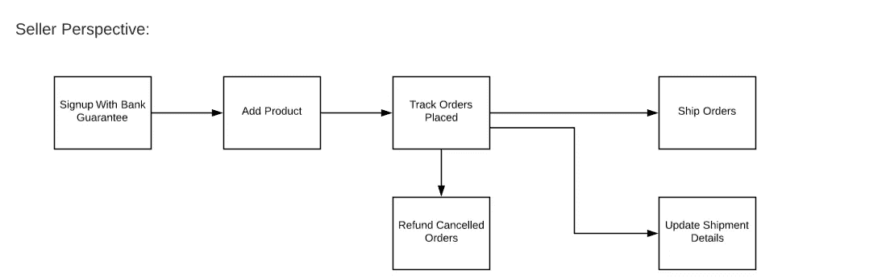
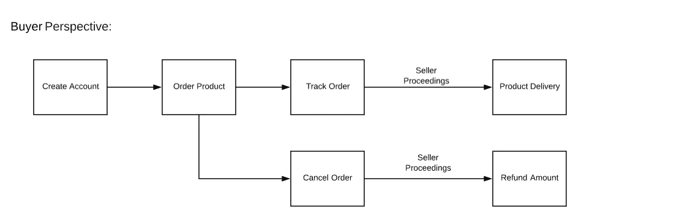
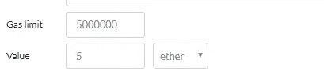
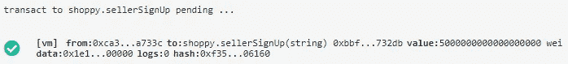
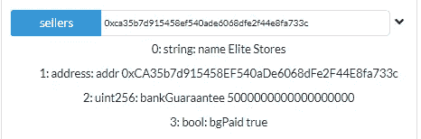
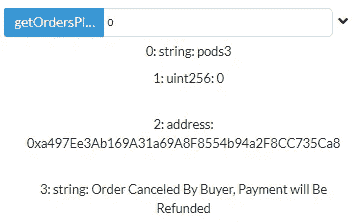
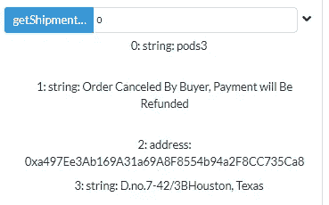
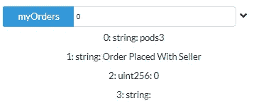
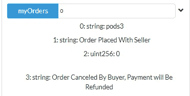
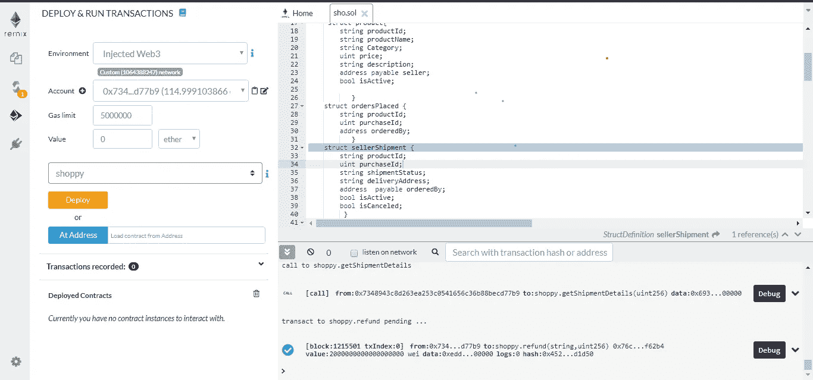

# 以太坊购物智能合约开发演练

> 原文：<https://medium.datadriveninvestor.com/creating-shopping-smartcontract-f7f80add48c4?source=collection_archive---------0----------------------->


A Photo by [Artem Beliaikin](https://www.pexels.com/@belart84) at Pexels.com

在 2019 年上半年，发生了很多有利于加密信徒的事情。当比特币突破 11000 美元大关，整个加密市场突破 3000 亿美元时，脸书推出了自己的加密货币 libra 和以太坊，价格飙升至 350 美元大关。各大金融公司、银行都在采用区块链技术。对于所有密码信徒和区块链爱好者来说，这似乎是充满希望的未来。

坚持以太坊，即使以太坊有优秀的用例，目前，DApps 面临着可扩展性问题。但创始人 Vitalik Buterin 表示，他即将解决可扩展性问题。

以太坊的一个有前途的用例是托管管理(电子商务)。在本文中，我将带您了解如何为电子商务创建 Smarcontract。

**这篇文章是写给谁的？**

这篇文章是写给任何想要构建 Smartcontracts 和 DApps 的人的。理解这些概念需要以太坊生态系统和固体语言的基础知识。

我正在写这个分步指南，我希望这是解释什么是智能合同的最好方法。所以让我们开始吧。

电子商务涉及商品或服务的买卖。所以主要是有买家和卖家。

**卖家视角:**

*   在电子商务平台上销售商品之前，他必须注册为卖家，并为使用该平台支付一定金额。
*   在平台上列出他的产品以及所有需要的细节，如产品名称、价格、描述、保修等。
*   跟踪买家下的所有订单，将产品运送到买家的交货地址，并更新运输细节，以便他们可以跟踪状态。
*   退还取消的订单。



**买家视角:**

*   买家必须注册才能购买平台上的任何产品。
*   订购产品并支付金额。
*   如果对产品不满意，他可以取消订单。退款将由卖方办理。
*   跟踪订单状态
*   卖方通过快递媒介交付产品。



**智能合同件**

**卖家视角:**

1.  **注册为卖方并支付第五期固定银行保函**

```
pragma solidity ^0.5.4;contract shoppy {

   address payable public owner;

   constructor() public {
       owner=msg.sender;
          }
   struct seller {
     string name;
     address addr;
     uint bankGuaraantee;
     bool bgPaid;
     }
 mapping(address=> seller) public sellers;

  function sellerSignUp(string memory _name) public payable{
    require(!sellers[msg.sender].bgPaid);
        require(msg.value==5 ether);
        owner.transfer(msg.value);
        sellers[msg.sender].name= _name;
        sellers[msg.sender].addr= msg.sender;
        sellers[msg.sender].bankGuaraantee = msg.value;
        sellers[msg.sender].bgPaid=true;
    }
}
```

我是这样做的:

我创建了一个公共地址变量 **owner** ，并在构造函数中将部署者地址作为所有者。业主地址能够从卖方处收到乙醚。所以我让它**应付**

为了批量存储卖家的详细信息，我们将使用指向结构 **seller 的地址映射。**这里的**卖方**结构由卖方的所有必需细节组成

添加了一个函数 **sellerSignup** 和 require 语句。这是他们要做的，

a)。检查卖家是否已经注册。如果已注册，条件将为假，并恢复到初始状态

b)。检查函数的 msg.value 是否等于 5ETH。否则，它将恢复到初始状态

```
require(!sellers[msg.sender].bgPaid);
 require(msg.value==5 ether);
```



Selecting value of 5ETH



Transaction Succeeds if value is 5ETH

如果两个条件都为真， **sellerSignup** 函数将被执行，它在一个名为 **sellers** 的映射中用地址索引设置卖家的详细信息。由于**是公开的**，你可以通过粘贴卖家地址来查看卖家信息

```
mapping(address=> seller) public sellers;
```



**2。列出包含所有必需细节的产品**

注意:不用担心，我用粗体文本突出显示了需要在一个步骤中添加的代码。我们将讨论每个步骤中突出显示的代码。

```
pragma solidity ^0.5.4;contract shoppy {

   address payable public owner;

   constructor() public {
       owner=msg.sender;
          }
   struct seller {
     string name;
     address addr;
     uint bankGuaraantee;
     bool bgPaid;
     }
     **struct product{
        string productId;
        string productName;
        string Category;
        uint price;
        string description;
        address payable seller;
        bool isActive;
        }**
 mapping(address=> seller) public sellers;
 **mapping (string => product) products;
 product[] public allProducts;**

  function sellerSignUp(string memory _name) public payable{
        require(!sellers[msg.sender].bgPaid);
        require(msg.value==5 ether);
        owner.transfer(msg.value);
        sellers[msg.sender].name= _name;
        sellers[msg.sender].addr= msg.sender;
        sellers[msg.sender].bankGuaraantee = msg.value;
        sellers[msg.sender].bgPaid=true;
         }
 **function addProduct(string memory _productId, string memory _productName, string memory _category, uint _price, string memory _description) public {
      require(!products[_productId].isActive);
       require(sellers[msg.sender].bgPaid);

 product memory product = product(_productId, _productName, _category, _price, _description, msg.sender, true);  
       products[_productId].productId= _productId;
       products[_productId].productName= _productName;   
       products[_productId].Category= _category;   
       products[_productId].description= _description;   
       products[_productId].price= _price;   
       products[_productId].seller= msg.sender; 
       products[_productId].isActive = true;
       allProducts.push(product);

                     }** 
}
```

以下是我所做的

我添加了一个包含所有必需变量的 struct 产品，并将字符串映射到 struct。以便您可以更新或购买带有 **productId** 字符串的产品。我把卖家的地址做成可支付的，因为它直接从买家那里收到乙醚。

添加了一个 bool 参数 **isActive** 来检查产品是否已经激活。

添加了包含以下 require 语句的函数

a)。检查卖方是否支付了银行保函

b)。检查具有相同 productId 的产品是否已经激活

```
**require(!products[_productId].isActive);
require(sellers[msg.sender].bgPaid);**
```

如果两个条件都通过，它将执行 addProduct 函数，并将产品详细信息添加到 **allProducts[]** 数组和 **products** 映射中，以便我们可以通过使用数组循环或通过索引列出所有产品。

```
**function addProduct(string memory _productId, string memory _productName, string memory _category, uint _price, string memory _description) public {
      require(!products[_productId].isActive);
      require(sellers[msg.sender].bgPaid);

 product memory product = product(_productId, _productName, _category, _price, _description, msg.sender, true);  
       products[_productId].productId= _productId;
       products[_productId].productName= _productName;   
       products[_productId].Category= _category;   
       products[_productId].description= _description;   
       products[_productId].price= _price;   
       products[_productId].seller= msg.sender; 
       products[_productId].isActive = true;
       allProducts.push(product);**
```


**3。跟踪买家下的订单**

```
pragma solidity ^0.5.4;contract shoppy {

   address payable public owner;

   constructor() public {
       owner=msg.sender;
          }
   struct seller {
     string name;
     address addr;
     uint bankGuaraantee;
     bool bgPaid;
          }
     struct product{
        string productId;
        string productName;
        string Category;
        uint price;
        string description;
        address payable seller;
        bool isActive;

           }
   ** struct ordersPlaced {
        string productId;
        uint purchaseId;
        address orderedBy;
           }**
 mapping(address=> seller) public sellers;
 mapping (string => product) products;
 product[] public allProducts;
 **mapping (address=> ordersPlaced[]) sellerOrders;**

  function sellerSignUp(string memory _name) public payable{
    require(!sellers[msg.sender].bgPaid);
        require(msg.value==5 ether);
        owner.transfer(msg.value);
        sellers[msg.sender].name= _name;
        sellers[msg.sender].addr= msg.sender;
        sellers[msg.sender].bankGuaraantee = msg.value;
        sellers[msg.sender].bgPaid=true;
    }
 function addProduct(string memory _productId, string memory _productName, string memory _category, uint _price, string memory _description) public {
       require(!products[_productId].isActive);
       require(sellers[msg.sender].bgPaid);

       product memory product = product(_productId, _productName, _category, _price, _description, msg.sender, true);  
       products[_productId].productId= _productId;
       products[_productId].productName= _productName;   
       products[_productId].Category= _category;   
       products[_productId].description= _description;   
       products[_productId].price= _price;   
       products[_productId].seller= msg.sender; 
       products[_productId].isActive = true;
       allProducts.push(product);
             }**function getOrdersPlaced(uint _index) public view returns(string memory, uint, address, string memory) { return(sellerOrders[msg.sender][_index].productId, sellerOrders[msg.sender][_index].purchaseId, sellerOrders[msg.sender][_index].orderedBy, sellerShipments[msg.sender][sellerOrders[msg.sender][_index].purchaseId].shipmentStatus);****}** 
**function getShipmentDetails(uint _purchaseId) public view returns(string memory,string memory,address,string memory) {

return(sellerShipments[msg.sender][_purchaseId].productId, sellerShipments[msg.sender][_purchaseId].shipmentStatus, sellerShipments[msg.sender][_purchaseId].orderedBy,sellerShipments[msg.sender][_purchaseId].deliveryAddress);
    }**}
```

我是这样做的:

添加了一个结构**orders 替换**所需的跟踪细节变量和映射结构数组与卖方地址，以便每个卖方可以跟踪他的所有列出的产品订单由买方。

```
**mapping (address=> ordersPlaced[]) sellerOrders;**
```

当买家下订单时，订单详情将被推送到映射**卖家订单**。接下来，我们将从买家的角度来看一下。现在，我们可以用数组索引检索买家下的订单。

```
**function getOrdersPlaced(uint _index) public view returns(string memory, uint, address, string memory) {****return(sellerOrders[msg.sender][_index].productId, sellerOrders[msg.sender][_index].purchaseId, sellerOrders[msg.sender][_index].orderedBy, sellerShipments[msg.sender][sellerOrders[msg.sender][_index].purchaseId].shipmentStatus); 
          }**
```



我们还可以跟踪买家用 **purchaseId 下的订单。特定采购将分配给买方一个唯一的采购 Id。所以我们也可以用这个购买 Id 来追踪货物..**

```
**function getShipmentDetails(uint _purchaseId) public view returns(string memory,string memory,address,string memory) {

return(sellerShipments[msg.sender][_purchaseId].productId, sellerShipments[msg.sender][_purchaseId].shipmentStatus, sellerShipments[msg.sender][_purchaseId].orderedBy,sellerShipments[msg.sender][_purchaseId].deliveryAddress);
    }**
```



**4。装运产品和更新装运细节:**

```
pragma solidity ^0.5.4;contract shoppy {

   address payable public owner;

   constructor() public {
       owner=msg.sender;
          }
   struct seller {
     string name;
     address addr;
     uint bankGuaraantee;
     bool bgPaid;
     }
     struct product{
        string productId;
        string productName;
        string Category;
        uint price;
        string description;
        address payable seller;
        bool isActive;

           }
    struct ordersPlaced {
        string productId;
        uint purchaseId;
        address orderedBy;
           }
    **struct sellerShipment {
        string productId;
        uint purchaseId;
        string shipmentStatus;
        string deliveryAddress;
        address  payable orderedBy;
        bool isActive;
        bool isCanceled;**      }
 mapping(address=> seller) public sellers;
 mapping (string => product) products;
 product[] public allProducts;
 mapping (address=> ordersPlaced[]) sellerOrders;
 **mapping (address=> mapping(uint=>sellerShipment))sellerShipments;**

  function sellerSignUp(string memory _name) public payable{
    require(!sellers[msg.sender].bgPaid);
        require(msg.value==5 ether);
        owner.transfer(msg.value);
        sellers[msg.sender].name= _name;
        sellers[msg.sender].addr= msg.sender;
        sellers[msg.sender].bankGuaraantee = msg.value;
        sellers[msg.sender].bgPaid=true;
    }
function addProduct(string memory _productId, string memory _productName, string memory _category, uint _price, string memory _description) public {
       require(!products[_productId].isActive);
       require(sellers[msg.sender].bgPaid);

       product memory product = product(_productId, _productName, _category, _price, _description, msg.sender, true);  
       products[_productId].productId= _productId;
       products[_productId].productName= _productName;   
       products[_productId].Category= _category;   
       products[_productId].description= _description;   
       products[_productId].price= _price;   
       products[_productId].seller= msg.sender; 
       products[_productId].isActive = true;
       allProducts.push(product);

                     }**function updateShipment(uint _purchaseId, string memory  _shipmentDetails) public {
      require(sellerShipments[msg.sender][_purchaseId].isActive);

     sellerShipments[msg.sender][_purchaseId].shipmentStatus=    _shipmentDetails;

            }**
     }
```

我是这样做的:

创建了一个结构 **sellerShipment** 和所有必需的变量用于跟踪和更新细节，并将该结构映射到**地址**和嵌套的 **uint。**

```
mapping (address=> mapping(uint=>sellerShipment))sellerShipments;
```

因此，每个卖家都可以用唯一的 **purchaseId** 更新发货细节，并且他还可以像前面步骤中所说的那样用这个 Id 跟踪订单。

只有当买家下订单时，这些发货细节才会被推送到 mapping。一旦下了订单，我们可以单独使用功能**更新发货**和**购买 Id** 来更新发货细节。它在这里

```
**function updateShipment(uint _purchaseId, string memory  _shipmentDetails) public {
  require(sellerShipments[msg.sender][_purchaseId].isActive);

  sellerShipments[msg.sender][_purchaseId].shipmentStatus= _shipmentDetails;

            }**
```

上述函数将 purchaseId 作为参数，并检查特定 purchaseId 上的产品是否有效。如果激活，卖方将更新卖方的发货详情。

**5。取消订单退款**

```
pragma solidity ^0.5.4;contract shoppy {

   address payable public owner;

   constructor() public {
       owner=msg.sender;
          }
   struct seller {
     string name;
     address addr;
     uint bankGuaraantee;
     bool bgPaid;
     }
     struct product{
        string productId;
        string productName;
        string Category;
        uint price;
        string description;
        address payable seller;
        bool isActive;

           }
    struct ordersPlaced {
        string productId;
        uint purchaseId;
        address orderedBy;
           }
    struct sellerShipment {
        string productId;
        uint purchaseId;
        string shipmentStatus;
        string deliveryAddress;
        address  payable orderedBy;
        bool isActive;
        bool isCanceled;
         }
 mapping(address=> seller) public sellers;
 mapping (string => product) products;
 product[] public allProducts;
 mapping (address=> ordersPlaced[]) sellerOrders;
 mapping (address=> mapping(uint=>sellerShipment))sellerShipments;

  function sellerSignUp(string memory _name) public payable{
        require(!sellers[msg.sender].bgPaid);
        require(msg.value==5 ether);
        owner.transfer(msg.value);
        sellers[msg.sender].name= _name;
        sellers[msg.sender].addr= msg.sender;
        sellers[msg.sender].bankGuaraantee = msg.value;
        sellers[msg.sender].bgPaid=true;
           }
 function addProduct(string memory _productId, string memory _productName, string memory _category, uint _price, string memory _description) public {
      require(!products[_productId].isActive);
      require(sellers[msg.sender].bgPaid);

      product memory product = product(_productId, _productName, _category, _price, _description, msg.sender, true);  
       products[_productId].productId= _productId;
       products[_productId].productName= _productName;   
       products[_productId].Category= _category;   
       products[_productId].description= _description;   
       products[_productId].price= _price;   
       products[_productId].seller= msg.sender; 
       products[_productId].isActive = true;
       allProducts.push(product);

                     }function updateShipment(uint _purchaseId, string memory _shipmentDetails) public {
      require(sellerShipments[msg.sender][_purchaseId].isActive);

      sellerShipments[msg.sender][_purchaseId].shipmentStatus= _shipmentDetails;

                    }
 **function refund(string memory _productId, uint _purchaseId)public payable {
       require (!sellerShipments[products[_productId].seller][purchaseId].isActive);**
       **require (sellerShipments[msg.sender[_purchaseId].isCanceled); 
       require(msg.value==products[_productId].price);
       sellerShipments[msg.sender[_purchaseId].orderedBy.transfer(msg.value);
sellerShipments[products[_productId].seller][_purchaseId].shipmentStatus= "Order Canceled By Buyer, Payment Refunded";

                   }**
function getShipmentDetails(uint _purchaseId) public view  returns(string memory,string memory,address,string memory) {

 return(sellerShipments[msg.sender][_purchaseId].productId,   sellerShipments[msg.sender][_purchaseId].shipmentStatus, sellerShipments[msg.sender][_purchaseId].orderedBy,sellerShipments[msg.sender][_purchaseId].deliveryAddress);
    }

}
```

我是这样做的:

我用下面的 require 语句创建了一个函数**退款**。他们会的，

a)。检查具有特定采购 Id 的产品是否有效

b)。检查买方是否取消订单

如果两个条件都通过，它将检查

c)。如果卖方发放的金额等于产品价格

```
**require (!sellerShipments[products[_productId].seller[purchaseId].isActive);**
**require (sellerShipments[msg.sender[_purchaseId].isCanceled); 
require(msg.value==products[_productId].price);**
```

如果所有这些条件都通过，付款将直接退还到买方的地址，并将装运状态设置为“买方取消订单，付款已退还。”

```
**function refund(string memory _productId, uint _purchaseId)public payable {
       require (!sellerShipments[products[_productId].seller][purchaseId].isActive);**
       **require (sellerShipments[msg.sender[_purchaseId].isCanceled); 
       require(msg.value==products[_productId].price);
       sellerShipments[msg.sender[_purchaseId].orderedBy.transfer(msg.value);
sellerShipments[products[_productId].seller][_purchaseId].shipmentStatus= "Order Canceled By Buyer, Payment Refunded";**
```

**买家视角:**

1.  **创建账户:**

```
pragma solidity ^0.5.4;contract shoppy {

   address payable public owner;

   constructor() public {
       owner=msg.sender;
          }
   struct seller {
     string name;
     address addr;
     uint bankGuaraantee;
     bool bgPaid;
     }
     struct product{
        string productId;
        string productName;
        string Category;
        uint price;
        string description;
        address payable seller;
        bool isActive;

           }
    struct ordersPlaced {
        string productId;
        uint purchaseId;
        address orderedBy;
           }
    struct sellerShipment {
        string productId;
        uint purchaseId;
        string shipmentStatus;
        string deliveryAddress;
        address  payable orderedBy;
        bool isActive;
        bool isCanceled;
         }
    **struct user{
        string name;
        string email;
        string deliveryAddress;
        bool isCreated;
           }**
 mapping(address=> seller) public sellers;
 mapping (string => product) products;
 product[] public allProducts;
 mapping (address=> ordersPlaced[]) sellerOrders;
 mapping (address=> mapping(uint=>sellerShipment))sellerShipments;
 mapping (address=> user) users;
  function sellerSignUp(string memory _name) public payable{
        require(!sellers[msg.sender].bgPaid);
        require(msg.value==5 ether);
        owner.transfer(msg.value);
        sellers[msg.sender].name= _name;
        sellers[msg.sender].addr= msg.sender;
        sellers[msg.sender].bankGuaraantee = msg.value;
        sellers[msg.sender].bgPaid=true;
    }
**function createAccount(string memory _name, string memory _email, string memory _deliveryAddress) public {

        users[msg.sender].name= _name;
        users[msg.sender].email= _email;
        users[msg.sender].deliveryAddress= _deliveryAddress;
        users[msg.sender].isCreated= true;
                     }** function addProduct(string memory _productId, string memory _productName, string memory _category, uint _price, string memory _description) public {
       require(!products[_productId].isActive);
       require(sellers[msg.sender].bgPaid);

       product memory product = product(_productId, _productName, _category, _price, _description, msg.sender, true);  
       products[_productId].productId= _productId;
       products[_productId].productName= _productName;   
       products[_productId].Category= _category;   
       products[_productId].description= _description;   
       products[_productId].price= _price;   
       products[_productId].seller= msg.sender; 
       products[_productId].isActive = true;
       allProducts.push(product);

                     }function updateShipment(uint _purchaseId, string memory _shipmentDetails) public {
      require(sellerShipments[msg.sender][_purchaseId].isActive);

      sellerShipments[msg.sender][_purchaseId].shipmentStatus= _shipmentDetails;

                    }
function refund(string memory _productId, uint _purchaseId)public payable {
  require (sellerShipments[msg.sender[_purchaseId].isCanceled); 
  require (!sellerShipments[products[_productId].seller][purchaseId].isActive);
  require(msg.value==products[_productId].price);          
 sellerShipments[msg.sender][_purchaseId].orderedBy.transfer(msg.value);
 sellerShipments[products[_productId].seller][_purchaseId].shipmentStatus= "Order Canceled By Buyer, Payment Refunded";

                   }
function getShipmentDetails(uint _purchaseId) public view returns(string memory,string memory,address,string memory) {

return(sellerShipments[msg.sender][_purchaseId].productId, sellerShipments[msg.sender][_purchaseId].shipmentStatus, sellerShipments[msg.sender][_purchaseId].orderedBy,sellerShipments[msg.sender][_purchaseId].deliveryAddress);
    }

}
```

我是这样做的:

使用所需的用户详细信息创建了结构**用户**，并将其映射到地址。

```
mapping(address=>user) users;
```

添加了一个函数 **createAccount** 并将函数参数(用户详细信息)推送到**用户**映射

```
**function createAccount(string memory _name, string memory _email, string memory _deliveryAddress) public {

        users[msg.sender].name= _name;
        users[msg.sender].email= _email;
        users[msg.sender].deliveryAddress= _deliveryAddress;
        users[msg.sender].isCreated= true;
                     }**
```

bool 参数 **isCreated** 有助于检查用户在购买时是否注册。

2.**下订单并跟踪订单**

```
pragma solidity ^0.5.4;contract shoppy {

   address payable public owner;

   constructor() public {
       owner=msg.sender;
          }
     uint id;
     uint purchaseId;
   struct seller {
     string name;
     address addr;
     uint bankGuaraantee;
     bool bgPaid;
     }
     struct product{
        string productId;
        string productName;
        string Category;
        uint price;
        string description;
        address payable seller;
        bool isActive;

           }
    struct ordersPlaced {
        string productId;
        uint purchaseId;
        address orderedBy;
           }
    struct sellerShipment {
        string productId;
        uint purchaseId;
        string shipmentStatus;
        string deliveryAddress;
        address  payable orderedBy;
        bool isActive;
        bool isCanceled;
         }
    struct user{
        string name;
        string email;
        string deliveryAddress;
        bool isCreated;
           }
   ** struct orders{
        string productId;
        string orderStatus;
        uint purchaseId;
        string shipmentStatus;
            }**
 mapping(address=> seller) public sellers;
 mapping (string => product) products;
 product[] public allProducts;
 mapping (address=> ordersPlaced[]) sellerOrders;
 mapping (address=> mapping(uint=>sellerShipment))sellerShipments;
 mapping (address=> user) users;
 **mapping (address=>orders[]) userOrders;**
  function sellerSignUp(string memory _name) public payable{
        require(!sellers[msg.sender].bgPaid);
        require(msg.value==5 ether);
        owner.transfer(msg.value);
        sellers[msg.sender].name= _name;
        sellers[msg.sender].addr= msg.sender;
        sellers[msg.sender].bankGuaraantee = msg.value;
        sellers[msg.sender].bgPaid=true;
            }
function createAccount(string memory _name, string memory _email, string memory _deliveryAddress) public {

        users[msg.sender].name= _name;
        users[msg.sender].email= _email;
        users[msg.sender].deliveryAddress= _deliveryAddress;
        users[msg.sender].isCreated= true;
                     }
**function buyProduct(string memory _productId)  public payable {

        require( users[msg.sender].isCreated);
        require(msg.value == products[_productId].price);

        products[_productId].seller.transfer(msg.value);

        purchaseId = id++;
orders memory order = orders(_productId,  "Order Placed With Seller",purchaseId, sellerShipments[products[_productId].seller][purchaseId].shipmentStatus);
userOrders[msg.sender].push(order);
ordersPlaced memory ord = ordersPlaced(_productId, purchaseId, msg.sender);
sellerOrders[products[_productId].seller].push(ord);

 sellerShipments[products[_productId].seller][purchaseId].productId=_productId;
 sellerShipments[products[_productId].seller][purchaseId].orderedBy=   msg.sender;
 sellerShipments[products[_productId].seller][purchaseId].purchaseId= purchaseId;
 sellerShipments[products[_productId].seller][purchaseId].deliveryAddress = users[msg.sender].deliveryAddress;
sellerShipments[products[_productId].seller][purchaseId].isActive= true;
           }****function myOrders (uint _index) public view returns(string memory, string memory, uint, string memory) {                return(userOrders[msg.sender][_index].productId, userOrders[msg.sender][_index].orderStatus, userOrders[msg.sender][_index].purchaseId, sellerShipments[products[userOrders[msg.sender][_index].productId].seller][userOrders[msg.sender][_index].purchaseId].shipmentStatus);**                  }function addProduct(string memory _productId, string memory _productName, string memory _category, uint _price, string memory _description) public {
       require(!products[_productId].isActive);
       require(sellers[msg.sender].bgPaid);

       product memory product = product(_productId, _productName, _category, _price, _description, msg.sender, true);  
       products[_productId].productId= _productId;
       products[_productId].productName= _productName;   
       products[_productId].Category= _category;   
       products[_productId].description= _description;   
       products[_productId].price= _price;   
       products[_productId].seller= msg.sender; 
       products[_productId].isActive = true;
       allProducts.push(product);

                     }function updateShipment(uint _purchaseId, string memory _shipmentDetails) public {
      require(sellerShipments[msg.sender][_purchaseId].isActive);

      sellerShipments[msg.sender][_purchaseId].shipmentStatus= _shipmentDetails;

                    }
   function refund(string memory _productId, uint _purchaseId)public payable {
       require (sellerShipments[msg.sender][_purchaseId].isCanceled); 
require (!sellerShipments[products[_productId].seller][purchaseId].isActive);        require(msg.value==products[_productId].price);
        sellerShipments[msg.sender][_purchaseId].orderedBy.transfer(msg.value);
        sellerShipments[products[_productId].seller][_purchaseId].shipmentStatus= "Order Canceled By Buyer, Payment Refunded";

                   }
    function getShipmentDetails(uint _purchaseId) public view    returns(string memory,string memory,address,string memory) {

return(sellerShipments[msg.sender][_purchaseId].productId, sellerShipments[msg.sender][_purchaseId].shipmentStatus, sellerShipments[msg.sender][_purchaseId].orderedBy,sellerShipments[msg.sender][_purchaseId].deliveryAddress);
    }

}
```

我是这样做的:

我用订单细节变量创建了一个结构**订单**，并将结构映射到地址。以便每个用户可以方便地跟踪他们的订单。这里的问题是，如果我们公开地图，每个人都可以查看其他人的订单。所以这里的另一个选择是使它成为私有的，并从映射中调用变量(仅当前调用)。所以用户只能看到他的订单。

```
**mapping (address=>orders[]) userOrders;****function myOrders (uint _index) public view returns(string memory, string memory, uint, string memory) {                
return(userOrders[msg.sender][_index].productId, userOrders[msg.sender][_index].orderStatus, userOrders[msg.sender][_index].purchaseId, sellerShipments[products[userOrders[msg.sender][_index].productId].seller][userOrders[msg.sender][_index].purchaseId].shipmentStatus);  
      }**
```

添加了一个函数 **buyProduct** 和 **productId** 作为参数，需要检查以下语句，

a)。无论买方是否注册，

b)。**消息值**是否等于**产品价格**

如果这两个条件通过，金额将被转移到卖方，并将分配一个唯一的 **purchaseId** 用于购买。

```
**products[_productId].seller.transfer(msg.value);**purchaseId=Id++;
```

订单详情将被推送到**用户订单、卖方订单和卖方设备**地图，以便跟踪买方和卖方的订单，从而更新装运详情**。



User Orders

**3。取消订单**

```
pragma solidity ^0.5.4;
contract shoppy {

   address payable public owner;

   constructor() public {
       owner=msg.sender;
          }
     uint id;
     uint purchaseId;
   struct seller {
     string name;
     address addr;
     uint bankGuaraantee;
     bool bgPaid;
     }
     struct product{
        string productId;
        string productName;
        string Category;
        uint price;
        string description;
        address payable seller;
        bool isActive;

           }
    struct ordersPlaced {
        string productId;
        uint purchaseId;
        address orderedBy;
           }
    struct sellerShipment {
        string productId;
        uint purchaseId;
        string shipmentStatus;
        string deliveryAddress;
        address  payable orderedBy;
        bool isActive;
        bool isCanceled;
         }
    struct user{
        string name;
        string email;
        string deliveryAddress;
        bool isCreated;
           }
    struct orders{
        string productId;
        string orderStatus;
        uint purchaseId;
        string shipmentStatus;
            }
 mapping(address=> seller) public sellers;
 mapping (string => product) products;
 product[] public allProducts;
 mapping (address=> ordersPlaced[]) sellerOrders;
 mapping (address=> mapping(uint=>sellerShipment))sellerShipments;
 mapping (address=> user) users;
 mapping (address=>orders[]) userOrders;
function sellerSignUp(string memory _name) public payable{
        require(!sellers[msg.sender].bgPaid, "You are Already Registered");
        require(msg.value==5 ether, "Bank Guarantee of 5ETH Required");
        owner.transfer(msg.value);
        sellers[msg.sender].name= _name;
        sellers[msg.sender].addr= msg.sender;
        sellers[msg.sender].bankGuaraantee = msg.value;
        sellers[msg.sender].bgPaid=true;
             }
function createAccount(string memory _name, string memory _email, string memory _deliveryAddress) public {

        users[msg.sender].name= _name;
        users[msg.sender].email= _email;
        users[msg.sender].deliveryAddress= _deliveryAddress;
        users[msg.sender].isCreated= true;
             }
function buyProduct(string memory _productId)  public payable {

    require(msg.value == products[_productId].price, "Value Must be Equal to Price of Product");
    require( users[msg.sender].isCreated, "You Must Be Registered to Buy");

    products[_productId].seller.transfer(msg.value);

     purchaseId = id++;
     orders memory order = orders(_productId,  "Order Placed With Seller",purchaseId, sellerShipments[products[_productId].seller][purchaseId].shipmentStatus);
     userOrders[msg.sender].push(order);
     ordersPlaced memory ord = ordersPlaced(_productId, purchaseId,
msg.sender);
sellerOrders[products[_productId].seller].push(ord);

 sellerShipments[products[_productId].seller][purchaseId].productId=_productId;
 sellerShipments[products[_productId].seller][purchaseId].orderedBy=   msg.sender;
 sellerShipments[products[_productId].seller][purchaseId].purchaseId= purchaseId;
 sellerShipments[products[_productId].seller][purchaseId].deliveryAddress = users[msg.sender].deliveryAddress;
sellerShipments[products[_productId].seller][purchaseId].isActive= true;
     }
 function addProduct(string memory _productId, string memory _productName, string memory _category, uint _price, string memory _description) public {
     require(sellers[msg.sender].bgPaid,"You are not Registered as Seller");      
     require(!products[_productId].isActive, "Product With this Id is already Active. Use other UniqueId");

      product memory product = product(_productId, _productName, _category, _price, _description, msg.sender, true);  
       products[_productId].productId= _productId;
       products[_productId].productName= _productName;   
       products[_productId].Category= _category;   
       products[_productId].description= _description;   
       products[_productId].price= _price;   
       products[_productId].seller= msg.sender; 
       products[_productId].isActive = true;
       allProducts.push(product);

                     }
**function cancelOrder(string memory _productId, uint _purchaseId)  public payable {
     require(sellerShipments[products[_productId].seller][_purchaseId].orderedBy==msg.sender, "Aww Crap.. You are not Authorized to This Product PurchaseId");
     require (sellerShipments[products[_productId].seller][purchaseId].isActive, "Aww crap..You Already Canceled This order");** 

  **sellerShipments[products[_productId].seller][_purchaseId].shipmentStatus= "Order Canceled By Buyer, Payment will Be  Refunded";
 sellerShipments[products[_productId].seller][_purchaseId].isCanceled= true; 
    sellerShipments[products[_productId].seller][_purchaseId].isActive= false;
    }**
function updateShipment(uint _purchaseId, string memory _shipmentDetails) public {
      require(sellerShipments[msg.sender][_purchaseId].isActive, "Order is either inActive or cancelled");

sellerShipments[msg.sender][_purchaseId].shipmentStatus= _shipmentDetails;

                    }
function refund(string memory _productId, uint _purchaseId)public payable {
   require (sellerShipments[msg.sender][_purchaseId].isCanceled, "Order is not Yet Cancelled"); 
   require (!sellerShipments[products[_productId].seller][purchaseId].isActive,"Order is Active and not yet Cancelled");        
   require(msg.value==products[_productId].price,"Value Must be Equal to Product Price");
   sellerShipments[msg.sender][_purchaseId].orderedBy.transfer(msg.value);
   sellerShipments[products[_productId].seller][_purchaseId].shipmentStatus= "Order Canceled By Buyer, Payment Refunded";

                   }
function myOrders (uint _index) public view returns(string memory, string memory, uint, string memory) {                
return(userOrders[msg.sender][_index].productId, userOrders[msg.sender][_index].orderStatus, userOrders[msg.sender][_index].purchaseId, sellerShipments[products[userOrders[msg.sender][_index].productId].seller][userOrders[msg.sender][_index].purchaseId].shipmentStatus);                 
 }
function getOrdersPlaced(uint _index) public view returns(string memory, uint, address, string memory) {
       return(sellerOrders[msg.sender][_index].productId,       sellerOrders[msg.sender][_index].purchaseId, sellerOrders[msg.sender][_index].orderedBy, sellerShipments[msg.sender][sellerOrders[msg.sender][_index].purchaseId].shipmentStatus);
    } 
function getShipmentDetails(uint _purchaseId) public view returns(string memory,string memory,address,string memory) {

return(sellerShipments[msg.sender][_purchaseId].productId, sellerShipments[msg.sender][_purchaseId].shipmentStatus, sellerShipments[msg.sender][_purchaseId].orderedBy,sellerShipments[msg.sender][_purchaseId].deliveryAddress);
    }

}
```

我是这样做的:

增加了取消订单的功能。它将**采购 Id** 作为参数并检查

a)。如果当前呼叫者是否订购了具有特定购买 Id 的产品，

b)。具有特定采购 Id 的产品是否有效。

如果满足这些条件，这意味着产品是由当前呼叫者订购的，并且它现在是活动的。然后**取消订单**功能将被执行，并将**被取消**标志设置为**真，将活动**标志设置为**假**并将**发货状态**设置为“订单被买方取消，付款将被退还”，这将通知卖方退款。

```
**function cancelOrder(string memory _productId, uint _purchaseId)  public payable {
require(sellerShipments[products[_productId].seller][_purchaseId].orderedBy==msg.sender, "Aww Crap.. You are not Authorized to This Product PurchaseId");
require (sellerShipments[products[_productId].seller][purchaseId].isActive, "Aww crap..You Already Canceled This order"); 

 sellerShipments[products[_productId].seller][_purchaseId].shipmentStatus= "Order Canceled By Buyer, Payment will Be  Refunded";
 sellerShipments[products[_productId].seller][_purchaseId].isCanceled= true; 
 sellerShipments[products[_productId].seller][_purchaseId].isActive= false;
    }**
```



Order Cancel Status

完成了。你还和我在一起吗？在“以太坊购物智能合约演练”中，我们考察了[电子商务智能合约](https://github.com/Salmandabbakuti/Shop-Now/blob/master/logic.sol)背后的业务逻辑。由于我不想这篇文章太长，我正在完成它。

**最终智能合约**

使用 Remix IDE 手动测试此协定。这是编写、测试和部署合同的官方工具。前往[https://remix.ethereum.org](https://remix.ethereum.org)。粘贴合同代码，使用 Solidity 编译器编译合同，并部署在 Javascript Vm 上，看看它是如何工作的。我建议你使用新的界面，因为在不久的将来旧的用户界面将被删除。从现在开始试着用新的界面练习。



Interface Of Remix IDE

## 最后的话

在这里，智能合约做了所有的工作，以确保卖方和买方在交易中发挥作用。不需要中间人，也不用担心任何一方会带着钱或物品退出交易。

*   整个过程在区块链上运行，因此每笔交易都被透明地记录下来。不像一个典型的电子商务平台，运营商可能会关闭，或者金钱可能会丢失。区块链是分散的，由参与平台的每个“节点”维护。没人能关闭或入侵它。

## 收尾

你可以在我的 [github](https://gist.github.com/Salmandabbakuti/ec3d33b25cf1062268cac4d5f07d3d98) 中看到完整和更新的合同，或者你可以在最终的 Smartcontract 部分找到上面的内容。

我还在这里做了一个 DApp 关于电子商务的演示[。DApp 的完整源代码可以在](https://salmandabbakuti.github.io/Shop-Now/)这里找到


干杯…..❤