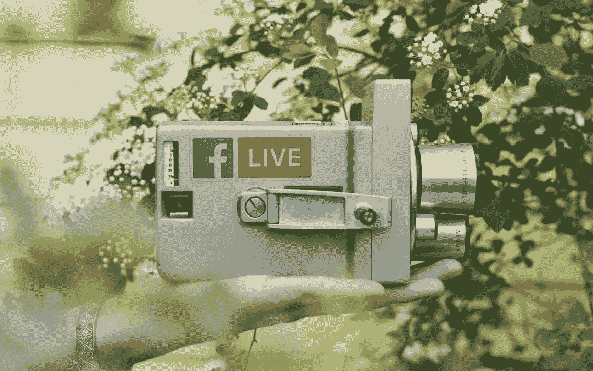

# 制作有针对性的销售视频第 2 部分:脸书现场演示

> 原文：<https://medium.datadriveninvestor.com/creating-targeted-video-that-sells-part-2-facebook-live-presentations-499e68b49c0e?source=collection_archive---------11----------------------->

30 多年来，我一直在使用视频来建立成功的品牌，虽然这些年来视频的交付机制发生了巨大的变化，但视频作为一种强大的直接营销工具的相关性在今天比以往任何时候都更加普遍。在我之前关于 [*创造销售目标视频(第一部分)*](https://rickcesari.com/creating-targeted-videos-that-sell-part-1-facebook-instagram-ads/) 的博客中，我谈到了视频广告帮助在两个流行的社交媒体平台上建立品牌的方式，因为视频以真实和即时的方式吸引人们——特别是在当今即时满足的文化中。在那篇博客中，我分享了最近与脸书广告公司 Produce Department 的创始人兼首席执行官 Kurt Bullock 的对话摘录，他谈到了如何在脸书和 Instagram 上定位视频广告，以将不同的受众从潜在客户转移到客户。

在第二部分中，我将分享今年早些时候我与苏珊·吉尔伯特的一段对话，目前我正与她合作推广我的新书 [*视频劝说*](https://www.amazon.com/Video-Persuasion-Everything-Effective-Testimonial/dp/0578500469) 。苏珊是在线推广成功公司的创始人，这是一家数字营销公司。15 年前，她也是社交媒体的先驱，当时它经常被用于搜索引擎优化的反向链接。她对众多社交媒体平台及其多年来的发展方式非常熟悉，这使得她的经验对我和我的客户来说非常宝贵，因为我们正在通过这些数字渠道探索新的方式来联系和激励我们的受众。

# 实时营销

这些年来，我通过直接向消费者营销来建立品牌，取得了相当大的成功。从 1989 年的 Juiceman 榨汁机开始，我使用直接响应电视将消费者带到我们举办关于新鲜水果和蔬菜好处的教育研讨会的地方。在这些实时会议上，观众可以直接与我们的发言人和我们的产品互动，这有助于在短短四年内将业务从零增长到 7500 万美元。

 [## 计划者让社交媒体保持正轨|数据驱动的投资者

### 如果想达到并保持最高效率，忙碌的人会坚持使用系统。这是 Tweepsmap 和…背后的前提

www.datadriveninvestor.com](https://www.datadriveninvestor.com/2019/03/11/schedulers-keep-social-media-on-track/) 

整个夏天，在苏珊的鼓励下，我开始使用新的脸书直播应用程序，感觉似曾相识！当我向观众演讲时，看到实时响应出现在我的桌面显示器上是令人兴奋的，它将我带回了 30 年前在大型研讨会观众面前体验到的那种即时性和联系的强烈感觉——成本和精力要低得多！

# 脸书直播的品牌建设

我一直在寻找新的有效的方法来建立成功的品牌。我喜欢脸书直播的一点是，由于该平台的互动性质，它能够通过真实、吸引人的直接面向消费者的信息，轻松触及你的目标市场。虽然许多早期采用者正在使用这些直播进行个人辅导，但我请苏珊分享了一些她通过将脸书直播作为数字营销战略的一部分来帮助客户建立品牌的其他方法。以下是她的一些建议:

*   关于新产品的玩笑。
*   关于贵公司正在发生的事情的新闻——主要的里程碑和/或其他值得庆祝的原因。
*   关于你已经非常了解的任务的指导性教程，比如食谱。
*   产品演示。
*   主持现场问答环节。

正如我最近体验的那样，*现场*体验真的很强大。在我为我的新书采访苏珊时，我们谈到了越来越多的视频社交媒体选项，她告诉我， ***脸书直播视频的观众评论的频率比他们在非直播*** 视频上评论的频率高 10 倍，因为他们在与主持人进行实时对话。今天，视频占所有互联网流量的 73%以上，预计到 2021 年将高达 82%。“底线是，”苏珊解释道，“视频应该以一种或另一种方式用于社交媒体营销。”

当然，也有其他社交媒体平台普遍使用视频，如 YouTube、脸书、Instagram、Twitter，甚至 LinkedIn，这是一个相对较新的视频平台建设平台。Susan 指导我在所有这些平台上利用视频，因为我知道环境会定期发生变化。考虑到这一点，以下是她与我分享的一些关于如何在其他平台上制作视频的技巧:

YouTube : DIY，自己动手，带有一个常见问题答案的教程视频。在这个平台上，视频长度可以长得多，因为观众想知道答案。观众也是带着观看视频的特定目的去 YouTube 的。他们已经为视频观看体验做好了准备，并且可能有时间观看。

脸书:保持视频短小精悍。脸书生活在 15 分钟或更少的时间里是伟大的；不过，如果你有一个强大的追随者，你可以走得更远。使用脸书(和 Instagram)的人通常都很忙。无论是在星巴克排队，还是在会议间隙，这个平台上的某个人都希望快速获得高水平的信息。使用脸书将流量发送到您在脸书开设的商店或您的网站。

**Instagram:** 这个平台发展很快。它比脸书更年轻，也更有个性。吸引人的标题是吸引观众的关键，他们可能只会停留几秒钟。在这里(以及在脸书),以最终目标为出发点是至关重要的。

**Instagram Live:** 32%的青少年认为 Instagram 是最重要的社交媒体网络。视频的好处类似于我之前提到的脸书现场直播的即时性和真实性。如果你的品牌定位于年轻群体，那么这里是发布视频的合适地点。

LinkedIn: 虽然它不是视频行业的四大巨头之一，但它是一个谈论你的企业背后的故事或快速解释你是如何开始创业的绝佳平台。这些不是有趣的派对视频，而是面向 LinkedIn 观众的个性视频。

# 你的目标市场是谁？

> “你的品牌目标是什么？你是想在 YouTube 上获得更多的浏览量，还是想在脸书上获得更高的知名度？这两者是不一样的。”~ *苏珊·吉尔伯特，在线推广成功公司创始人&首席执行官*

虽然所有这些平台都有品牌建设的价值，但 Susan 在我的书中详细讨论了每个平台的细微差别，以及在决定将视频放在哪里时牢记最终目标的重要性，以及如何确保内容长度、语气和风格适合你发布视频的平台。例如，在脸书和 Instagram 这样的平台上，用户通常都是忙碌的，你必须在最初的几秒钟内将你关于产品优势的信息发布出去。

无论你是为 15 秒钟的视频还是 30 分钟的产品演示创建内容，我们都会告诉你，正面解决问题的真实内容是非常宝贵的，它将胜过每次都制作过度和过于圆滑的视频，因为对于后者，你知道你正在观看一个广告。我觉得特别激动人心的是，这些规则与 30 年前推动我早期品牌销售的规则是一样的。自从我开始直接面向消费者进行营销以来，技术发生了难以想象的变化，但人们的行为还是一样。我们都在寻找方法来改善我们的生活方式，我们不断地为我们自己的日常问题寻找答案。在当今社会，随着对定制答案的需求不断增长，fast 我相信视频将继续成为您营销组合中最有效的工具，您正在寻找的帮助您制作销售优秀视频的答案就在您面前。

最初发表于[里克·塞萨里](https://rickcesari.com/facebook-live-presentations/)

Rick Cesari 自 1994 年以来一直从事直接回应和视频营销行业，自 1999 年以来一直从事咨询工作。他的热情是继续这项工作，并与组织分享这方面的知识。你可以在 RickCesari.com 的[上关注他的最新消息。](https://rickcesari.com/)