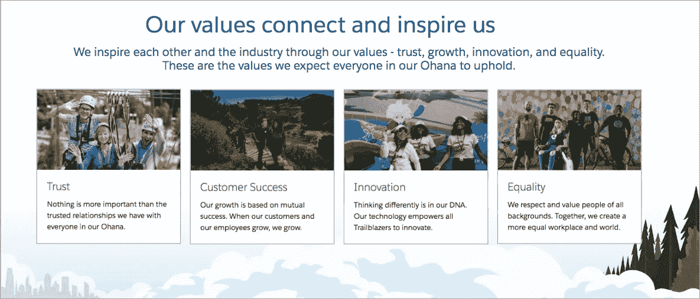
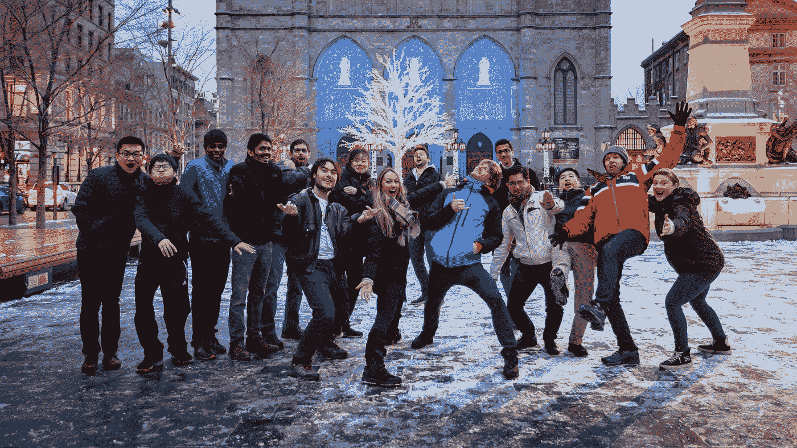
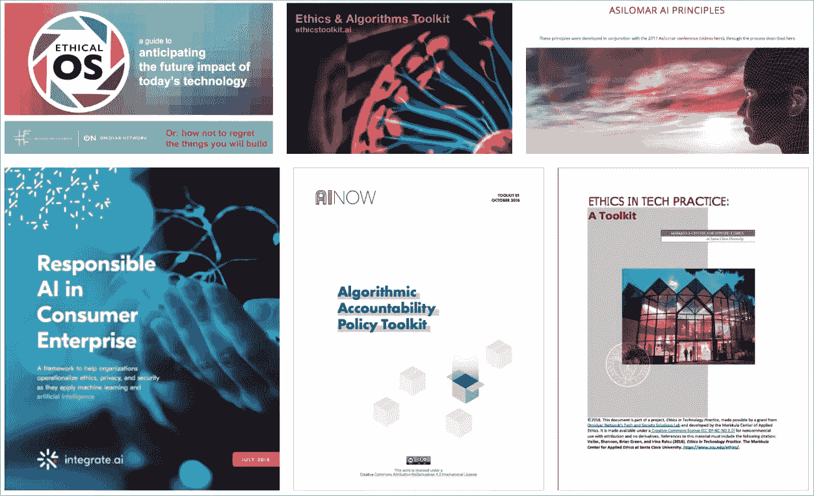
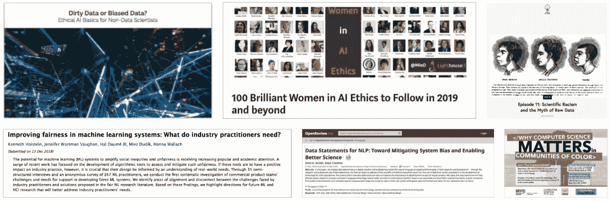

# 创造我们想要的世界

> 原文：<https://medium.datadriveninvestor.com/creating-the-world-we-want-7face86fad09?source=collection_archive---------11----------------------->

## 如何建立一个道德的人工智能实践

Source: [pixabay.com](https://pixabay.com/en/vintage-retro-istanbul-old-love-1872683/)

在这一点上，你可能已经读过至少一个关于人工智能(AI)系统如何导致冒犯的故事(例如，[谷歌 Duplex 欺骗人类，让他们认为他们正在与另一个人说话](https://www.theverge.com/2018/5/9/17334658/google-ai-phone-call-assistant-duplex-ethical-social-implications))或实际伤害，而意图可能是善意的(例如，[刑事判决建议](https://www.propublica.org/article/machine-bias-risk-assessments-in-criminal-sentencing)和[利率](https://www.whitecase.com/publications/insight/algorithms-and-bias-what-lenders-need-know)中的种族偏见)。

这些系统中的开发人员并没有打算冒犯或伤害任何人，也没有预料到负面的结果，但他们应该预料到。如果你正在创建或实现一个人工智能系统，你需要确保你的人工智能系统不会延续社会偏见或伤害你的客户。创造支持我们想要生活的世界，而不是我们现在看到的有偏见的世界的人工智能需要努力。你可能是你的公司中第一个关注创造或实现道德人工智能的人。如果是这样，我想分享一些经验教训，对你的工作有所帮助。这些最初是在 2018 年 12 月的人工智能伦理峰会上分享的。

道德是我长期以来的个人激情，在我作为道德人工智能实践架构师的新角色中，我能够通过帮助 Salesforce 和我们的客户和合作伙伴生态系统开发构建道德和公平人工智能的最佳实践，将这种激情付诸行动。对于 Salesforce 来说，这是一个新的旅程，在我工作的头几个月里，我学到了很多东西，随着公司继续努力实现人工智能驱动的更美好的明天，我将带着这些东西。

## **利用你公司的价值观**

几乎每个组织都公布了他们的价值观、使命宣言和/或原则。当谈论广泛的技术伦理或特定的人工智能伦理时，要在你组织的价值观背景下进行。你的建议如何支持这些价值观并使组织受益？

[Salesforce 的文化和价值观](https://www.salesforce.com/company/careers/culture/)推动着我们所做的一切。当我谈到在我们的爱因斯坦人工智能服务中建立道德规范时，我指的是我们的信任、客户成功、创新和平等价值观。每个人都能够立即看到，帮助客户识别其培训数据中的潜在偏见或建立包容性和多元化的团队如何直接符合我们的价值观。

> “现在，在 Salesforce，我们已经决定，这种技术的道德和人道使用，特别是在第四次工业革命的背景下，必须得到明确的解决，不仅是我们，而是我们整个行业。”— Marc Benioff，联合首席执行官&sales force 联合创始人

## **在你的组织中寻找盟友**

你不可能参加每个团队或每个会议。你需要盟友来引导你的话语，帮助你打好这场仗。在每个部门采取基层、自下而上以及自上而下的方法。

Salesforce Research team taking a snow break at NeurIPS 2018

由于我最初在服务云中工作，并作为更大的用户体验团队的一部分，这两个团队很快成为“大使”，宣传道德人工智能的样子。令人惊奇的是，我没有要求他们成为大使；它是有机发生的！这是之前合作的结果，也是随着时间的推移建立信任的结果。我听到小道消息说，特定的个人在会议中“引导”我，因为他们坚信在我们的流程和服务中建立道德的重要性。从那里，我被邀请向更多的团体展示，为更多的项目提供咨询，扩大了我的认知和影响范围。鉴于 Salesforce 追求平等、包容和多样性的热情文化，找到志同道合的人来传播好消息并不困难！

也许我最大的盟友是 Salesforce 的首席科学家 [Richard Socher](https://www.linkedin.com/in/richard-socher-19363b18/) 。他联系了我们的联合创始人兼联合首席执行官马克·贝尼奥夫(Marc Benioff)，创建了一个致力于道德人工智能实践的全职职位。他从一开始就把在爱因斯坦身上建立道德规范列为优先事项，并赋予其高管层面的可见性。

## **利用现有流程**

不要从创建全新的团队、产品或流程开始。使用已经存在的。这节省了时间、资源和精力。例如，在 Salesforce，我们遵循[敏捷开发方法](https://developer.salesforce.com/blogs/engineering/2014/08/agile-methodology-salesforce-inside-look.html) (ADM)。该方法包括一个准备就绪的[定义](https://www.agilealliance.org/glossary/definition-of-ready) (DOR)来评估你是否在 sprint(构建周期)的开始就为成功做好了准备，以及[完成的定义](https://www.agilealliance.org/glossary/definition-of-done/) (DOD)来评估你是否真正完成了你计划在 sprint 中完成的所有事情。一组跨云的工程师已经更新了我们的 DOR 和 DOD，将道德使用问题纳入到流程中。

你也可以利用现有的关于人工智能或机器学习的培训，包括关于意外后果、代表性培训数据和他们工作的社会影响的讨论。许多组织都有报告治理问题或违反公司行为准则的机制。看看您是否可以添加一个选项来报告道德创造和使用问题。

## 站在巨人的肩膀上

当开始新的努力时，有从零开始创造工艺或材料的倾向；然而，许多组织已经创建了[道德框架、工具包、清单、誓言、原则、白皮书等。](https://sites.google.com/view/chi19-ethical-tools-workshop/tools?authuser=0)基于多年的研究和领域专业知识。从别人的经验中学习，如果可能的话，在你的组织中重复使用。例如，清单(例如， [Deon](http://deon.drivendata.org/) ， [O'Reilly](https://www.oreilly.com/ideas/of-oaths-and-checklists) )是整合到大多数软件开发过程中的轻量级工具。不要把有限的时间浪费在再造轮子上。

Ethical tools

## 分享，分享，分享

人工智能社区的一个美妙之处是，学术界和工业界的研究人员在会议和开源图书馆(如 arxiv.org)上发布他们的进展。你也应该这样做。与社区的其他成员分享您的见解和经验教训。当我们一起工作时，我们比分开时更强大！

## **网络**

与上一个主题相关，加入人工智能伦理社区。有太多的机会去结识他人，向他们学习，并回馈社会——包括会议、世界经济论坛(WEF)第四次工业革命中心、人工智能合作伙伴关系、当地聚会和行业活动。这有助于找到你可以向其学习的人，获得反馈，并感受到志同道合者的支持。

**会议**

*   [人工智能、伦理和社会](http://www.aies-conference.com/)
*   [ACM FAT*](http://www.aies-conference.com/) (公平、问责和透明)

**湾区聚会**

*   东湾人工智能和新兴技术会议
*   [旧金山 AI Meetup](https://www.meetup.com/San-Francisco-AI-Meetup/)
*   [旧金山人工智能和新兴技术会议](https://www.meetup.com/San-Francisco-AI-Summit-Meetup/)
*   [机器学习 UX SF Meetup](https://www.mluxsf.com/)

**组织**

*   [WEF 第四次工业革命中心事件](https://www.weforum.org/events)
*   [人工智能合作伙伴](https://www.partnershiponai.org/)

## **准备好颠簸的旅程吧！**

如果你是你的组织中第一个关注技术道德的人，这可能会比在一个已经确立的角色中工作花费更多的时间和精力。没有一个讲道理的人会对你的努力报以“伦理？！我们不需要什么臭道德！”相反，你可能会得到很多点头，说你的提议听起来很棒，然后……无线电静默。每个组织都面临资源限制，虽然你的同事或高管可能不认为你关于在组织流程中建立道德规范的建议*不重要*，但你可能会发现很难获得实际的资源承诺。寻找盟友，确定你可以利用的现有流程，一点一点地进步，这些都需要时间和努力。你需要长期从事这项工作，但如果你热爱这项工作，它会让你感觉不像是工作，而更像是你的使命。

## **TLDR**

在公司里扮演一个全新的角色可能会让人害怕和困难，但好消息是，你并不孤单！我的主要收获:

*   **不要试图重新发明轮子:**利用你公司的价值观、流程和专家已经创造的道德工具
*   与人交往:在你的组织中寻找盟友，在社区中与志同道合的人交往，并与他人分享你所学到的东西。

*感谢*[*Tiffany Testo*](https://www.linkedin.com/in/tiffany-testo/)*，*[*Ryan Van wagon er*](https://www.linkedin.com/in/ryanvanwagoner/)*和*[*Sean Alpert*](https://www.linkedin.com/in/seanaalpert/)*对本文的所有反馈和支持！*