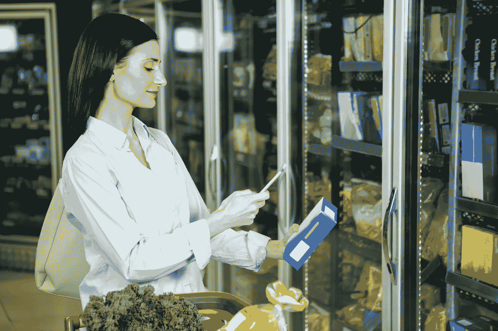

# 创造性智力和数据收集

> 原文：<https://medium.datadriveninvestor.com/creative-intelligence-and-data-collection-8502c9afc7ea?source=collection_archive---------10----------------------->

在我最近的播客中，我采访了 Native 的首席执行官兼联合创始人马特麦克纳布(Matt McNabb)，这是一个为全球顶级品牌提供服务的数据收集平台。它标榜“随时随地收集的本地见解”，其基本前提是，它协调全球各地数据收集者的工作，在合适的时间向企业提供他们想要的数据，然后分析这些数据以提供有意义的结果。

本土市场本身的基础上收获的数据，只能是明智和有效地收集在当地一级。马特指出，他的公司不处理人们想象的从手机或电脑使用或 cookies 中收集的数据；他解释说，土著人的工作范围包括:

向也门当地社区提供援助，并了解这种援助，即拯救生命的援助，是否到达了他们需要的人手中，或者可口可乐公司想要了解产品在拉丁美洲 5000 个市场上的表现。

 [## 人工智能与创意:作为创意引擎的 BigGAN |数据驱动的投资者

### 的确，2018 年可以被视为人工智能创造的创造力全盛时期的开始。当然可以…

www.datadriveninvestor.com](https://www.datadriveninvestor.com/2019/02/13/ai-creativity-biggan-as-a-creative-engine/) 

这种实地的、最新的信息非常重要，因为它可以解开发展中市场的成功秘密。马特告诉我，在美国等发达市场，大部分收入来自大型、高价零售商品，而在新兴市场的欠发达国家，收入来自“传统贸易”或小型“夫妻店”。要针对这种情况开展有效的活动，你需要具体的、小规模的、详细的信息，包括语言和文化问题，而这正是 Native 试图占据的市场空间。

Matt 谈到了一家大型消费品公司在拉丁美洲开展的一项活动，该公司推出了一系列新口味，并希望评估这些产品在文化上与美国不同的市场上的接受程度。因此，通过原生应用程序，目标市场的数据收集人员能够下载单个广告的多个不同版本，在受众身上进行测试，并将结果反馈给原生应用程序进行分析，然后提交给委托客户，为其决策提供信息。

Native 的目标是成为“随需应变”的数据收集平台。Matt 提到了优步作为一个可比较的商业模式，因为有需求的客户会去一家伞式公司，然后该公司会监督针对该需求的解决方案的实际实施，无论是提供出租车还是收集大量的消费者数据。

人工智能和机器学习正日益成为本地人工作的核心。虽然人工观察是该公司迄今为止成功的基石，但很明显，自动化的任务越多，Native 提供的服务就越好。它的品牌还依赖于准确性和可靠性，因此它需要能够随着时间的推移和环境的变化而学习的自动化。

马特还谈到了发达经济体和新兴经济体之间的结构性差异。从后者的发展方式来看，人们拥有几个小职业为一个经济整体做出贡献是极其常见的，而发达市场的传统模式是工人拥有一份全职工作。然而，随着西方“零工经济”的增长，这两者正在趋同，但非洲和亚洲的新兴市场可能实际上比工业化国家更有优势和领先优势。现代计件工作的理念已经在发展中经济体根深蒂固，因此一旦他们吸收了通过 Native 的应用程序等技术应用谋生的概念，他们可能会发现自己更适合所需的工作。

我们还触及了数据收集的伦理问题。我想知道，监视是否与 Native 的工作密不可分，以及该公司在扩大数据收集时是如何考虑隐私要求的。马特否认这是一个主要的或日益增长的困难。他认为，Native 并没有真正将监控扩展到生活或社会的新领域，只是扩大了已经发生的事情的规模:“我们没有跟踪更多的行为，我们只是在更大的规模上这样做。”

然而，就伦理考虑而言，Matt 确实承认在自动化技术系统中存在一个重大的人类偏见问题。无论机器是如何自主运行的，它们都是以人类工程师编程和预测的方式运行的。他解释说，这是一个变化非常迅速的领域:

我认为这将变得非常、非常、非常令人兴奋和有趣，至少在我生活的世界里，在我们生活的世界里，你将越来越多地看到撒哈拉以南非洲和高增长新兴市场的直接输入和反馈回路，因为它们变得更加在线，更加数字化。

最后，我问马特希望听众从我们的对话中获得什么简单的信息。他指出，发展中国家正在从创新技术的接受者转变为生产者。Native 目前主要在西方发达经济体工作，但它越是进入新兴市场，就越发现新的工具和方法正在被发明，他预计这种越来越快的发展速度将继续下去。

最后，这是另一个有趣的演讲，它与我最近访问南非的经历非常契合，我在那里亲眼目睹和听说了这些事情。能像那样把理论和实践结合起来真是太好了，我希望能很快重新上路，进一步开阔视野。

收听播客片段本博客的灵感来自[https://www . creative intelligence . FM/local-insights-and-data-collection/](https://www.creativeintelligence.fm/local-insights-and-data-collection/)