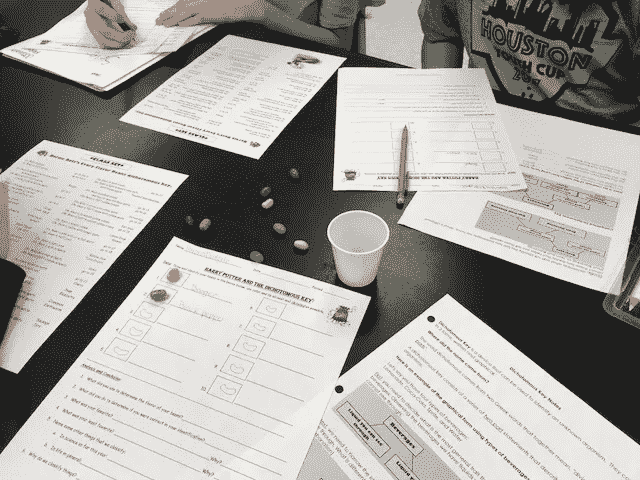

# 创造力与宇宙相连

> 原文：<https://medium.datadriveninvestor.com/creativity-connects-to-the-universe-40a510957eb6?source=collection_archive---------0----------------------->

## 接受平凡，让它与众不同，独一无二

富有创造力的人让他们的思想自由遨游，看看会出现什么。这就像类固醇上的意识流——但没有药物的辅助。

作为一名科学教师和天才教育家，[梅丽莎·乔纳德](https://twitter.com/ChouinardJahant)为创造力带来了独特的视角。她称自己是一个“凶猛的读者，科学和一切书呆子和极客的爱好者。”

她还在 [iteacher imother](https://iteacherimother.blogspot.com/) 上写博客，写关于“教学、为人母以及两者之间的平衡”在业余时间，Chouinard 主持了两个 Twitter 聊天:#stucentclass 和# teachmindful。

“创造力是一种与宇宙的联系，是一种如何将所有东西组合在一起的感觉，是一种如何操纵和修补想法的设计和结构的愿景，并利用这种天赋来表达你看到大局的内心声音，”Chouinard 说。

 [## “你内心绝对有一本书”

### 你有故事要讲，你的故事很重要

medium.com](https://medium.com/datadriveninvestor/you-absolutely-have-a-book-inside-you-bac99427b303) 

在她看来，她的生活是曲折的。

“对我来说，创造力就是让平凡变得与众不同、独一无二，”Chouinard 说。“这需要耐心和乐观，但只要有一点自信和专注，和谐与旋律、色彩和光线就能打造出一个个性化且有益的视角。”

尽管其优势显而易见，但领导者仍然会扼杀想象力。威权领导人是反创造力的。对他们来说，只有一条路可走:崇拜现状，为了考试而教，惩罚那些放弃既定计划的人。

# **扼杀风险**

“僵化和从众窒息了冒险，”Chouinard 说。“当我们觉得盖子很紧的时候，我们经常会放弃打开它。一个由封闭的头脑提出的盒子，将自由的精神和最终的创新与进步困在里面。

“当创造力遇到支持型领导风格时，头脑就会不受阻碍，”她说。“当我们的思想向可能性敞开，并渴望摆脱传统思维的束缚时，变化是不可避免的，增长是指数级的。”

无论是在学校还是任何其他组织，鼓励创造力，给出广泛的指导方针，然后退一步。让想象力填补空白，创造新的问题来讨论。

“三个词:倾听、支持、促进，”Chouinard 说。“做学生和员工的啦啦队长。鼓励自发性和古怪，欢迎独特的想法。为实现这些目标提供必要条件。”

 [## 每个人都想被听到

### 双向对话有助于沟通和建立友谊

medium.com](https://medium.com/datadriveninvestor/everyone-just-wants-to-be-heard-a1c82c56dc4c) 

她强调倾听。

“我知道，对我来说，有人真正地、有意识地倾听我的想法，并通过提出深思熟虑的、发人深省的问题来帮助我表达出来，这是关键，”Chouinard 说。“当我大声说出想法并获得反馈时，我最有可能向前迈出一大步。”

创造力可以改变学校文化。它可以把一个课堂上无动于衷、昏昏欲睡的学生转变成一个积极参与的群体，渴望翻开新的一页，看看等待他们的是什么。

# F **柔性和流动性**

“灵活性和流动性的创造力允许对紧缩的认可和对有意识的替代方案的发现，”Chouinard 说。“这有助于产生积极变化所需的凝聚力。它照亮了隐藏议程曾经繁荣的阴影。”

她解释了这是如何给每个人喘息的空间来施展他们的魔法。

“当一个社区被允许融合、延伸和流动时，它就会繁荣——就像一盏熔岩灯，”Chouinard 说。“创造力是温暖蜡的光。开放的思想和动机缓解了熔岩的每一次分离，这导致了另一次聚集的出现。”

 [## 信心驱动领导者和教师

### 如何前进和面对挑战

medium.com](https://medium.com/datadriveninvestor/confidence-drives-leaders-and-teachers-6cbb16b3b88e) 

许多老师在与家长和学生建立关系时都很有创意，Chouinard 也不例外，建议咖啡屋之夜。

“有一天晚上有一个开放的房子，”她说。“把它布置得像一个咖啡屋，和父母一起参观。认真倾听，了解他们。他们会欣赏这种姿态，也会因此而爱你。”

创造力在教室的四面墙之外传播。

“让父母陪同实地考察，”Chouinard 说。“本周，我有机会在轻松有趣的环境中与 12 位家长交谈，从而真正了解了他们。与父母建立积极、信任的关系至关重要。”

这就是她所说的创造性差异。

**关于作者**

吉姆·卡扎曼是[拉戈金融服务公司](http://largofinancialservices.com)的经理，曾在空军和联邦政府的公共事务部门工作。你可以在[推特](https://twitter.com/JKatzaman)、[脸书](https://www.facebook.com/jim.katzaman)和 [LinkedIn](https://www.linkedin.com/in/jim-katzaman-33641b21/) 上和他联系。