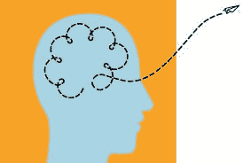

# 数据科学中的创造力

> 原文：<https://medium.datadriveninvestor.com/creativity-in-data-science-7aa4d1f07964?source=collection_archive---------4----------------------->

数据科学领域的大多数人可能会发现很难说他们所做的事情是创造性的:编写 SQL 查询、构建模型、设计 A/B 测试和创建仪表板。这听起来很有技术含量——创造力从何而来？我也在想同样的事情，直到我花时间去研究创造力并理解它是什么。

事实证明，我们最大的错误是混淆了创造力和艺术(也就是说，只有画家、作家、音乐家或演员才能有创造力)。或者，我们认为只有最聪明的头脑才是真正有创造力的——那些获得诺贝尔奖或在其领域取得突破的人。嗯，我在这里告诉你这是错误的…

世界各地的企业都依靠各个领域的创新人才来推动业务发展，不断创新，赢得竞争。那么，什么是创造力呢？

用肯·罗宾逊的话说，“创造力是拥有有价值的原创想法的过程”。所以，归结为三件事:

1.  首先，这是一个过程。它不是时间中的一个瞬间，而是随着时间的推移而发生的事情。正如约翰·杜尔登所说“想法很容易。执行力就是一切。这需要一个团队来赢得比赛”。提出想法只是过程的一部分——正确执行想法需要时间。
2.  其次，这个想法需要是原创的。原创的想法不需要对整个世界都是新的，它们只需要对你或你的社区是新的。以亨利·福特为例:当他看到用于加工肉类的拆卸线时，他对汽车装配线的灵感就来了！不是一个新的想法，但对他的行业来说是新的！
3.  最后，它必须是有价值的东西。这值得吗？判断这些想法是否有用。

说到创造力，有一个主要的先决条件。这是领域知识的需要。例如，如果你对钢琴不熟悉，你就不能在钢琴上有创造力。当然，你可以想办法弹一些键，但不会像你弹了几年一样。同样的事情也适用于其他领域，比如数学——想象一下，如果你不理解数学基础，你可以创造性地解决问题。因此，领域知识是关键。

现在，什么是数据科学中的创造力？我们说它很重要，并寻找有创造力的候选人…但是我们如何定义它，并在我们自己和我们的团队中培养它呢？在说什么是数据科学中的创造力之前，让我们先谈谈它不是什么…

这并不是将你最喜欢的算法强加到一个数据集上。

这种方法会让你错过很多对该领域至关重要的东西(无论是脚本编写、游戏、金融等等。).您可能会在建模时忽略了一个重要的特性，或者限制您的分析，导致只发现显而易见的东西。当你花时间去理解领域的细微差别，并对你的数据提出困难的问题时，新的和创造性的想法就会出现。

这就引出了我们对数据科学中创造力的定义:统计知识与领域知识的结合以及一点点的走神。

这涉及到两个领域(分析和行业)的重要性，但也强调了允许你的思想漫游的想法。这意味着在体验或学习新事物时保持开放的心态，想象你如何使用这些新知识，并将其应用于你试图解决的问题。

更具体地说，数据科学中的创造力可以是任何东西，从建模的创新功能、新工具的开发、可视化数据的新方法，甚至是用于分析的数据类型。数据有趣的地方在于，每个人做事情的方式都会不一样，这取决于他们对问题的看法。从这个角度来说，如果我们稍微跳出框框思考，我们在数据科学领域做的几乎所有事情都可以是创造性的…

我能想到的描述候选人或方法的创造力的最佳方式是当他们给你“哇，我从来没有这样想过”的时候理想情况下，作为一个公司或团队，你希望最大限度地增加这样的时刻——保持好的想法流动，区分优先级，并执行。

你今天是如何在工作中发挥创造力的？