# 创造力可能只是生成艺术算法的复杂组合

> 原文：<https://medium.datadriveninvestor.com/creativity-is-probably-just-a-complex-mix-of-generative-art-algorithms-6d37a0087e86?source=collection_archive---------3----------------------->

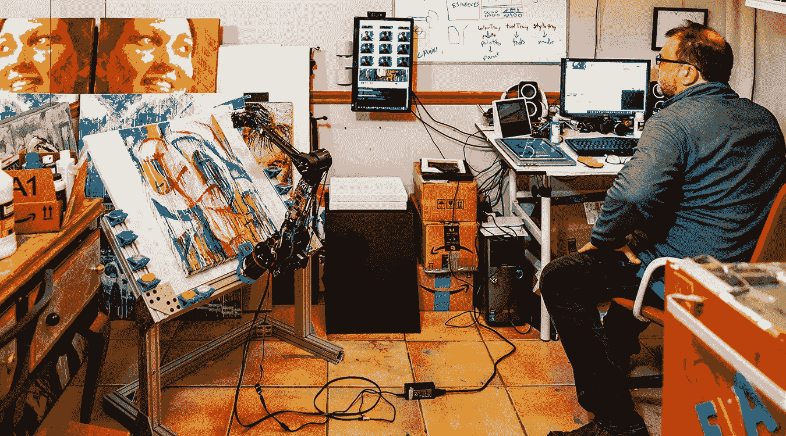

虽然它仍然是一个理论，马文·明斯基的“思想社会”的概念在人工创造领域有明显的意义。麻省理工学院人工智能实验室的联合创始人明斯基(Minsky)提出，我们的大脑不是单一的超级智能，而是一些更小的智能的集合，这些智能根据需要浮出水面，并相互竞争来解决问题。

和其他问题一样，用我的机器人创作艺术画也是一个问题，事实证明，明斯基的方法非常有效地解决了这个问题。事实上，我用这种方法创作的画越多，我就越开始意识到艺术创造力只不过是竞争性生成艺术算法的复杂混合。

虽然一些人工智能艺术家编写越来越复杂的算法，但我发现数量胜于质量。以下延时拍摄的这幅画创作于 2018 年 6 月 2 日至 6 日，使用了超过 26 种不同的生成算法。

在微观层面上，它展示了 13，396 种单独的笔触，每一种都是由低级的审美决定做出的。但是机器人也在整个过程中做了许多中层决策，有数百个。此外，它做出了超过四个高层次的美学决定，这些决定有时会完全改变艺术品的方向。

为了明确并避免对我的机器人在绘制这幅作品时的自主程度产生任何混淆，我想强调的是，虽然它们可以完全自主地绘制，而且经常如此，但我担任了这幅画的艺术总监。虽然机器人的算法独立地做出了所有的美学决定，但我确实策划了其中一小部分决定，甚至在我觉得机器人需要一点艺术帮助时，为它编写了一些新的算法。此外，我还担任助手，清理溢出物，混合颜料，并在我的各种绘画机器人之间移动画布。我知道这是我的机器人带头的合作，下面是我们一起创作这件艺术品时，在他们的“思想社会”中发生的事情的一步一步的描述。

在开始这个描述时，重要的是要说明这个作品是由一些通用指南定义的 GumGum 的委托。首先提供的是一个由 GumGum 公司颜色组成的通用调色板。我还获得了五位艺术家作为参考，并被问及我的机器人是否可以用他们作为灵感，创作一幅 18 英寸 x24 英寸的彩色油画。以下是每位艺术家的作品图片，他们是(按顺序排列)李·克拉斯纳、威廉·德·库宁、伊莱恩·德·库宁、乔治亚·奥基夫和迈克尔·韦斯特。

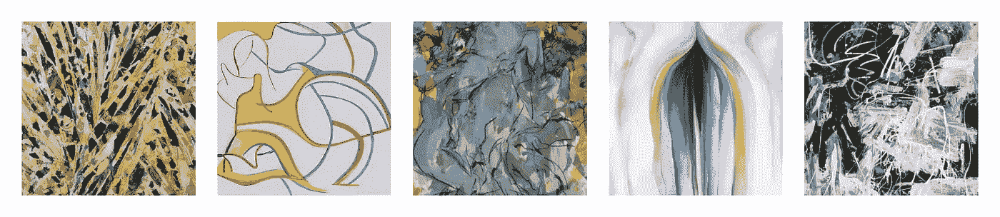

我不知道从这些图像开始，所以我只是开始运行算法，我的机器人已经知道如何执行。首先是创建一个**风格转换网格**来混合和匹配参考画的各种颜色、纹理和风格。经过几个小时的深度学习数字运算，我看到了下面的表格。

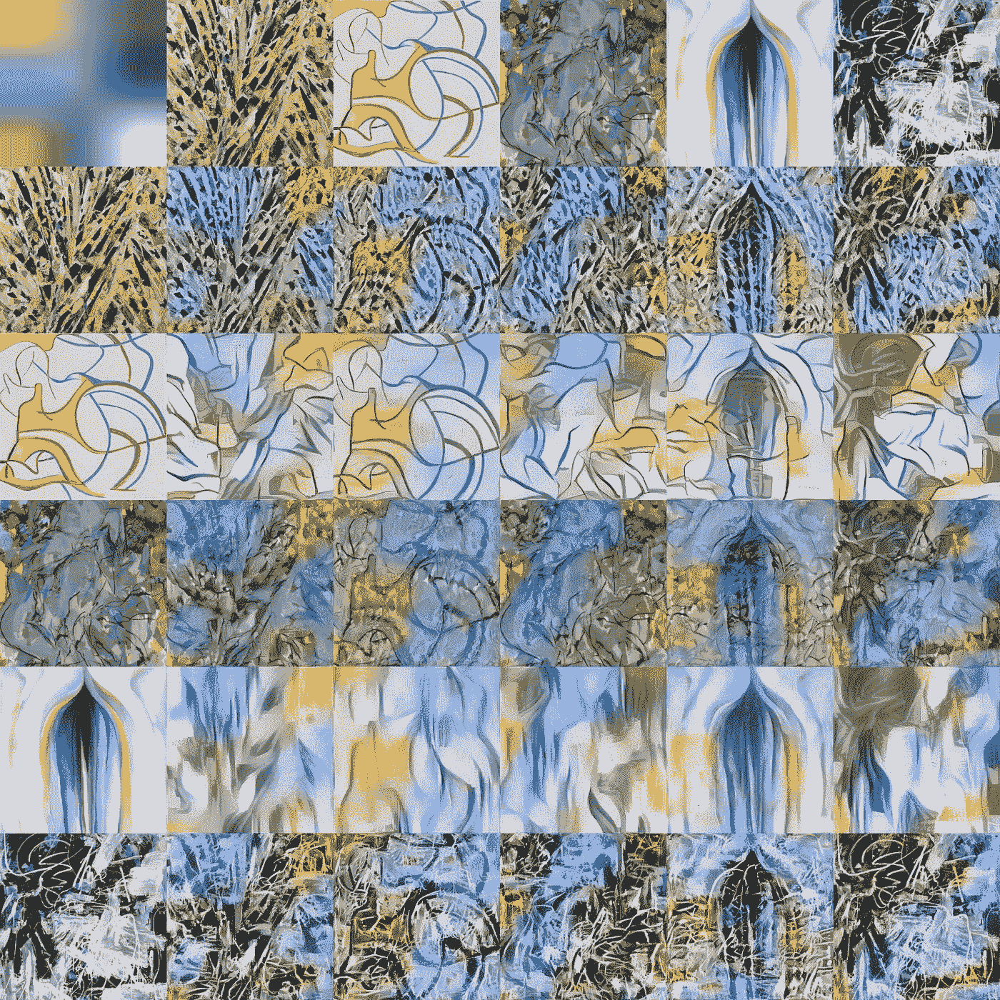

左上角代表 GumGum 提供的调色板，列和行是以彼此的风格呈现的五个艺术品(与调色板相呼应)。

我还不知道该怎么做，但我确实注意到一些风格转换在匹配调色板方面比其他的更好。这只是我的艺术直觉，但我想知道我是否可以编写一个模仿我个人品味的算法。所以我写了一个快速的(实验性的)新算法来测量每个源图像与调色板的匹配程度。它从一个 K-means 聚类算法开始，我做了九个桶，将每个图像中的像素按照它们的 R、G、B、X 和 Y 值分组。然后，我在调色板和源图像上运行该算法，并比较每个桶的颜色值。经过一些调整后，算法发现最符合调色板的两幅画是威廉·德·库宁和乔治亚·奥基夫。正如我所说的，我确实需要调整颜色匹配来得到我直觉的相同结果，但这就是为什么我认为这是一个实验性的算法。只有进一步的测试才能揭示它是否真的是一个有效的人工创造性算法，或者我是否过度适应了这个小例子。但是在这一点上，我有一个新的算法添加到我的武器库中，我将称之为 **K-Means 聚类颜色匹配。**这没什么稀奇的，但它确实做出了程序性的美学决定，即以下两幅源图像是 GumGum 提供的调色板的最佳匹配。这些信息我的机器人会储存起来以备后用。

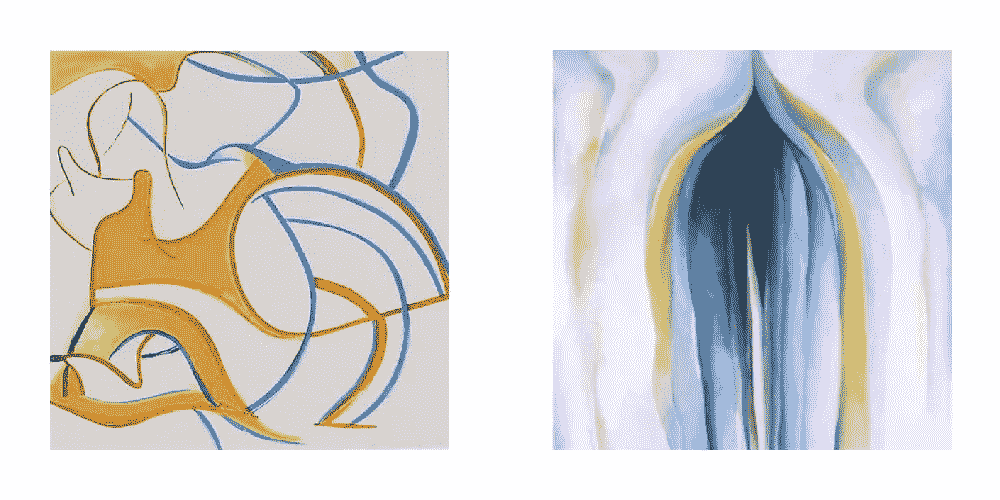

到目前为止，只考虑了款式和颜色。内容连看都没看。有很多方法可以获得原创内容，但最简单的方法是做我的机器人多年来一直在做的事情，拍一张照片。

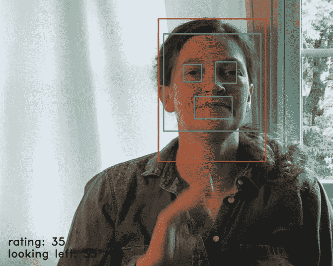

拍了几十张照片，我的机器人使用 Viola-Jones 面部检测算法来锁定一张脸。一旦它找到一张脸，它就采用一种**肖像评级**算法，该算法考虑了清晰度、对比度、构图和总体审美平衡，从中挑选出几个最喜欢的。也许我最喜欢的评级机构之一是由我的儿子设计的，他意识到眼睛**对称**的照片通常最有吸引力。虽然这不是唯一的衡量标准，但对称的眼睛大大增加了评分，这可以在每张照片的左下角看到。机器人运行的另一个简单算法是**肖像裁剪**算法，该算法试图根据眼睛和嘴巴的位置提供均匀平衡的构图。

然而，这都是模糊逻辑，艺术始于草图。因此，为了决定开始画什么，我的机器人随机选择了一张评价很高的照片和一幅参考画。然后，它将一切与另一种风格转换结合起来，以决定它的第一批**跟踪图像**。

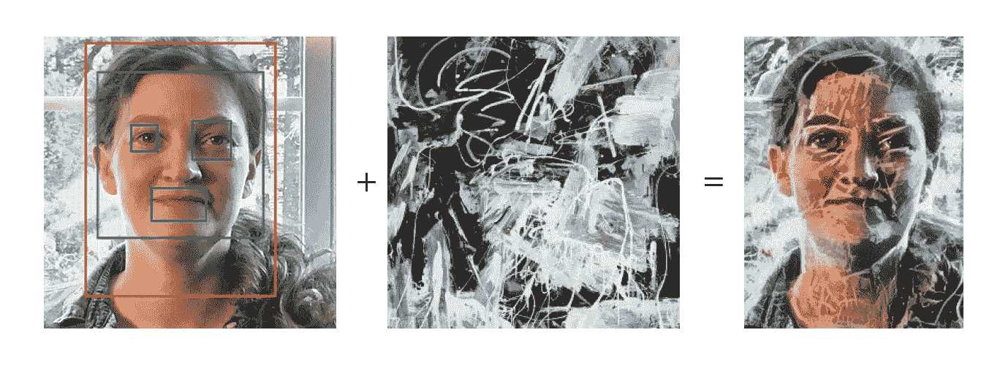

轨迹图像是机器人在记忆中试图描绘的东西。如果这是一台打印机，它将是一个光栅化的图像，带有一组如何用像素渲染光栅的指令。然而，这不是打印机，这是我最喜欢的算法发挥作用的地方，**反馈循环**和我称之为**差异图**。

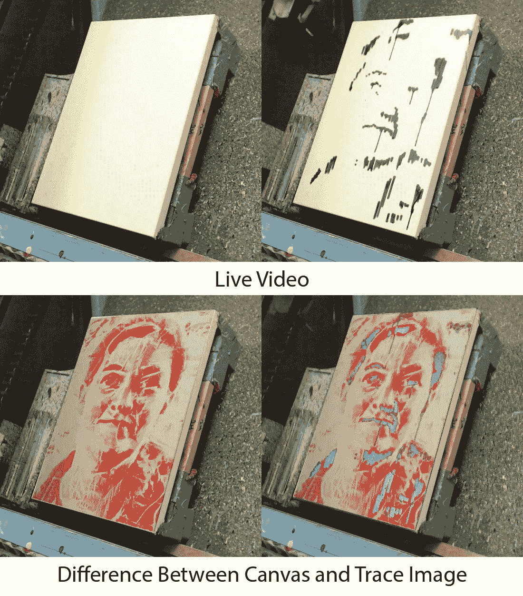

在绘画之前，机器人开始拍摄画布的照片，这当然是一大片白色区域。然后，它创建一个差异图，这是一个热图，通过画布与跟踪图像的差异来计算。红色是需要变暗的区域，蓝色是需要变亮的区域。然后，机器人决定使用哪种颜色，以及在哪里应用颜色，以最大限度地减少热图中的差异。机器人如何看到热图的比较可以在左边的图像中看到，它已经完成了反馈循环的前 38 次迭代。开始时，只有一些区域需要变暗(红色)，但是在几百次描画后，一些区域变得太暗(浅蓝色)，现在需要变亮。

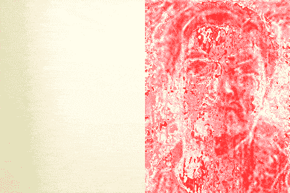

正如在这个动画中可以看到的，这个算法从每幅画的开始到结束运行了数千次，慢慢地优化画布，使它越来越接近每一个笔刷笔划的轨迹图像。这接近我决定画肖像时的艺术过程。就像我的机器人一样，我试图减少绘画和我试图描绘的主题之间的差异，直到达到相似。人类艺术家是这样工作的吗，至少部分是这样？

我的热图色差减少算法并不是决定在哪里以及如何应用下一个笔画的唯一因素。随着其他算法接管和控制画笔，它在绘画创作的整个过程中被打开和关闭。此外，它以不同复杂程度的几种不同模式运行。请记住，这整个操作是一个“思想的社会”，一大堆算法在争夺控制权，轮流解决美学任务。

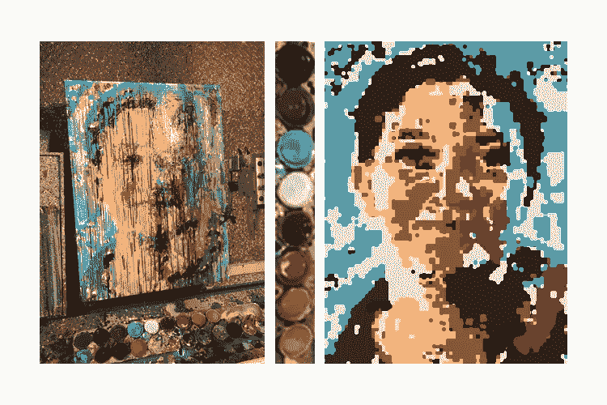

我称之为 **Paintmap** 的东西是偶尔出现的一种更简单的选择。这是人工智能算法所能达到的最愚蠢的程度，并且像打印机一样运行。它查看必须处理的颜色，并将跟踪图像的调色板减少到该颜色子集。然后它开始将调色板中的颜色应用到这些区域。艺术家有时做一个快速的打底或漫画来开始一件艺术作品。这是一个快速有效的方法来完成打底。在“心理社会”中，绘画地图在绘画的最开始有更高的机会被激活，并且随着图像的进展变得不那么活跃。

到目前为止，我已经谈论了机器人打算用它的轨迹和绘画地图图像来绘画什么，但是我还没有真正触及它如何决定应用画笔。这一个将更难解释，仅仅是因为有如此多的变化和复杂性从非常简单到令人困惑的复杂。

最简单的算法只是遵循一个简单的模式。他们看着绘画地图，执行我设计的十几个预编程路径中的一个。我给这些图案起了简单的描述性名字，比如**跳棋**、**雨**、**条形码**、**条纹**。他们所做的就是沿着图案直线拖动画笔。以条形码为例，画笔只能在完全垂直的线上拖动。我之前展示的 paintmap 示例看起来至少在部分执行中使用了条纹。

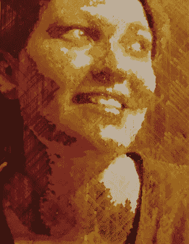

在我的第三个机器人十年前创作的另一幅画中，你可以看到我最喜欢的图案，我称之为雨。在这种情况下，线条只能垂直或成 45 度角绘制。除了我写的这些算法之外，我有时会利用开源软件包中的其他路径规划程序，如 OpenCV 和 Processing。有太多的选择了。

如果一幅画完全是直线，它可能看起来很酷，但不会像那些笔画自动跟随画中形状轮廓的画那样令人印象深刻。这就是霍夫线有用的地方。

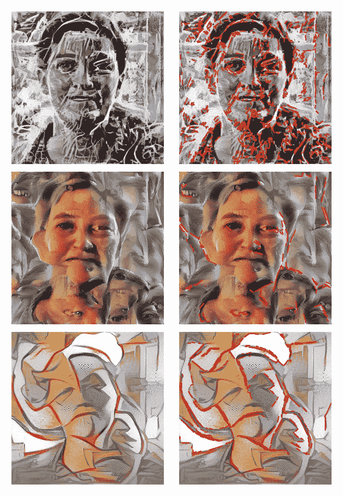

当机器人在轨迹图像上规划其行程的路径时，它经常做的事情之一是搜索并跟随图像中的线条。左边是一些霍夫线(红色)的例子，在绘画的不同阶段应用于跟踪图像。这些线条存储在机器人的内存中，当它决定在哪里应用颜色时，它会搜索最近的线条，并使用其几何形状来决定笔画的方向和长度。这产生了跟随被画图像的形状和轮廓的笔触。当使用霍夫线时，必须根据图像本身为每个图像调整许多动态设置。使用了几个子算法，例如测试不同设置并选择产生最多线条的一个的**霍夫线条调谐器**。另一种叫做**笔画组合器**的算法从所有较小的霍夫线中产生更长更复杂的笔画。

上述路径规划算法是完全自动化的。然而，还有其他算法使用人工智能来模仿人类的笔画。我有一个**笔画数据库**，里面有数百幅之前完成的画作的每一笔的完整记录。机器人可以参考这个数据库中的笔画，绘制它们的几何形状，并将其应用到新的绘画中。

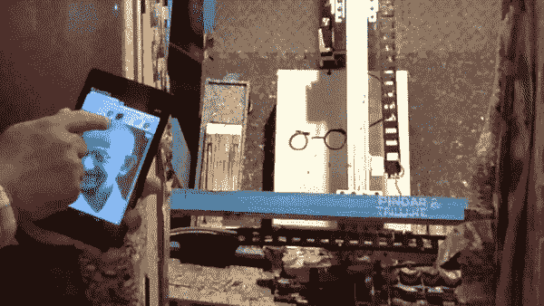

此外，机器人有一个**自动完成模式**。在自动完成模式下，任何数量的人类艺术家都可以与机器人一起使用触摸屏平板绘画。机器人将观察人类如何绘画，然后尝试模仿人类的笔画模式自动完成绘画的其余部分。在 GumGum 的这个任务中，我偶尔会接手用平板电脑画画，机器人的人工智能会学习并跟随我的领导。在任何一幅特定的画中，我尽量保持我的参与最少，不超过 100 笔。虽然这些笔画数量很少，但由于多种原因，它们是非常有效的笔画，是该过程的重要部分。它们最直接的用途是，它们是我通过绘画机器人快速修复错误的一种方式。第二，这是我教人工智能的一种方式，当它做得不像我希望的那样好时。这些笔画提供了有价值的标记真实数据，可以在以后的深度学习训练中使用。通过**在标记的人类笔画和自主笔画上训练深度学习神经网络**，机器人被教得更像艺术家，而不像机器。我给它的每一笔都是经过分析和内化的。这是一个高度实验性的算法，我仍在研究中。但是在解决这个问题之前，我需要收集数据。在有足够的数据之前，深度学习实际上不会起作用，收集数据是第一步。

到目前为止，已经描述了许多技术算法，但是很少有艺术算法。考虑到艺术是最神秘的人工创造性算法，每个人现在应该有的最大问题是这幅画是如何从照片变成成品的。就是说这个怎么变成这个了？

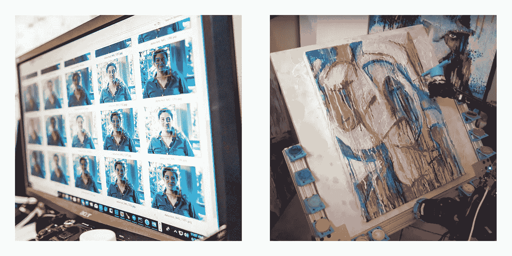

这是一个巨大的飞跃。老实说，我甚至对细节也很模糊，因为我只是勉强理解一些实现转换的算法。我写了它们，但像深度学习这样的东西并不意味着你知道它们是如何工作的。然而，从根本上来说，是反馈回路。像人类艺术家一样，机器人正在做标记，后退一步看看这些标记如何帮助它更接近目标，然后做更多的标记。然而，这种多样性的关键在于，与人类艺术家类似，机器人的目标也在不断变化。

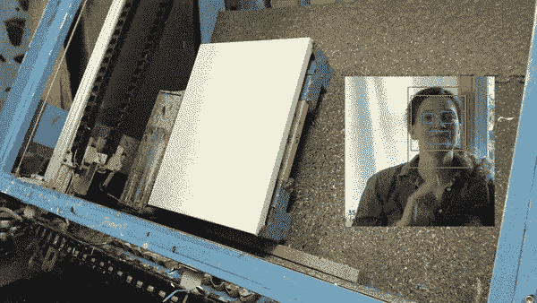

之前我提到过，它总是从一个跟踪图像开始工作，并试图减少画布和跟踪图像之间的差异。在整个绘画过程中，它就是这样做的。多样性来自于它所追逐的痕迹图像不断变化。在它试图描绘的痕迹图像的戏剧化旁边，重新观看先前的二十秒延时。请注意，即使图像不断变换成不同的构图，机器人也在尝试绘制图像。

我提到这是一个戏剧化，因为反馈循环通过成千上万的中间绘画地图，跟踪地图和差异地图。如果我记录下前 13，396 次划水过程中的每一张图片，数据会太多。上面定时拍摄的定期快照接近千兆字节。如果机器人在 13，396 次笔画的过程中记录每一次重新计算的绘画图、差异图和跟踪图像，每幅绘画都需要万亿字节的数据存储。虽然我没有每个机器人决策的记录，但我在数据库中保留了每一次中风的时间推移和详细的几何形状。

需要说明的是，下面的图片仅仅代表了机器人艺术目标的主要转变。更多的变化发生在不那么戏剧性的层面上，但它们要么没有出现，要么没有完全发展，因为机器人在完成它们之前改变了它的艺术目标。还要注意，下面描述的阶段并不像动画所暗示的那样严格。机器人的“思想社会”更加灵活，并在五天内逐渐完成了这幅画。

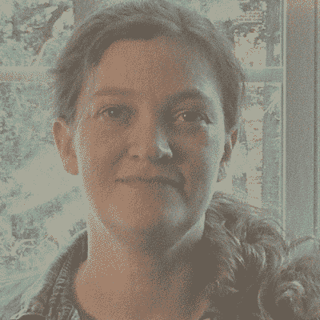

我已经向你们展示了它的第一个主要决定，那就是应用一种风格转换，这种风格转换来自摄影作品中评价最高的肖像之一。我总是觉得看到神经网络如何一步一步地重建图像很有趣，所以这里有一个超过 2000 次迭代的过程的简短动画。这样做的决定有些随意，但只是针对内容。机器人有两个内容列表。GumGum 提供的最高评级的照片之一和另一个源图像。它从每个列表中随机选择一个，并使用它们来应用深度学习风格转移并开始绘画。

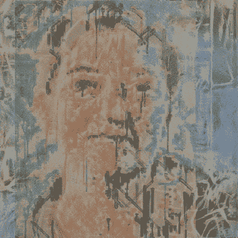

虽然第一个动画组合了两个来自精选列表的随机图像，但下一个阶段更有意义。这个阶段试图像一个艺术家那样操作，先画一点，然后后退一步看看进度，再画一点。在这一步中，应用了另一个样式转换，但是，它开始的内容图像决不是随机的。机器人正在对它已经在画布上完成绘制的图像应用样式转换。这是一个真正的反馈循环，机器人正在检查它在现实世界中的进展，并使用画布的图像作为其神经网络的输入。

正是在这一点上，我的机器人戏剧性地回复到我的第一个人工智能算法之一。几年前，我试图让我的机器人更有创造力，我发现实现这一目标的最简单的方法之一就是给它一种恐怖的感觉。如果有空的地方，用东西填满它。

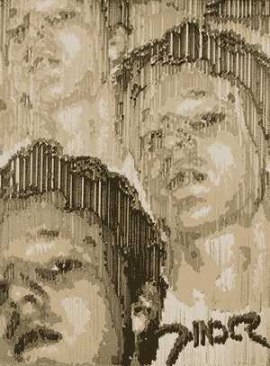

这些算法产生了绘画，比如我的第二个绘画机器人的早期作品。早期的规则很简单。在没有内容的地方随机添加内容。在我早期的绘画中，机器人甚至没有考虑背景。它只是一遍又一遍地在画布上印上图像，直到整个背景被填满。然后它开始画画。简单。

然而，对于我的新机器人，我希望它在如何处理事情上有更多的智能。我不想让它只是随意的构图创作。为了更有意义地创作独特的作品，我让我的机器人考虑并排列它们能理解的内容。在这幅画如何进展的情况下，我使用了一种我称之为**神经画像**的算法，我让神经网络在整个图像中寻找眼睛。然后我用眼睛作为定位点来创建一个扭曲的脸部马赛克。这里有一个图表，显示了算法如何做出这些决定，并排列图像的马赛克。这个图像是一个戏剧化的过程，因为机器人的人工智能多次执行这个步骤，通过许多解决方案工作，内容逐渐出现在画布上。

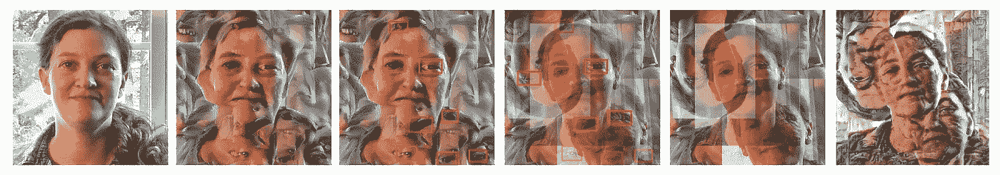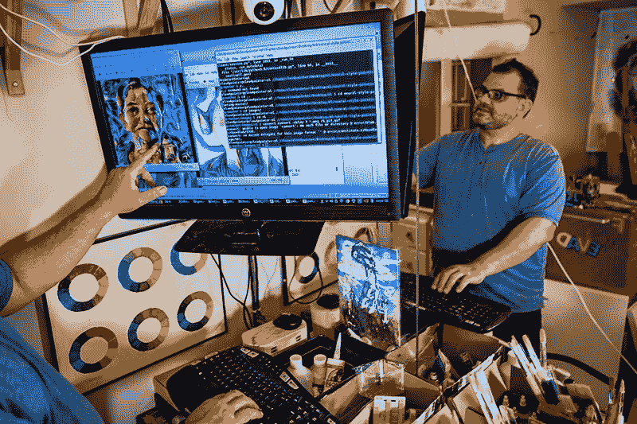

值得注意的是，这个过程的这一步是由我轻微策划的。当机器人独立地想出并处理多幅图像时，我会每隔一段时间检查一下，扔掉那些不起作用或太抽象的图像。我正在为这一步积极开发一个**自动固化**算法，但是它还不是很好，仍然是一个正在进行的工作。当我为这幅画进行调整时，这个算法确实变得好了一点，但它还不是完全自主的。希望很快，我能找到一种有效的方法来可靠地决定神经画像何时完成。

此时，这幅画经历了最后一次重大的艺术转变。最有趣的是，这一步不是我策划的。这幅画最后阶段的转变，虽然很戏剧性，但完全是由我的机器人和它们的神经网络完成的。这是用我自己版本的风格转换完成的，我称之为**风格混搭**，这基本上是一个带有一个内容图像和两个风格图像的风格转换，所以不要太在意。

如果你回顾这个过程的早期阶段，你会记得我运行了一个算法，选择了最像 GumGum 提供的调色板的源图像。还记得德库宁和奥基夫吗？

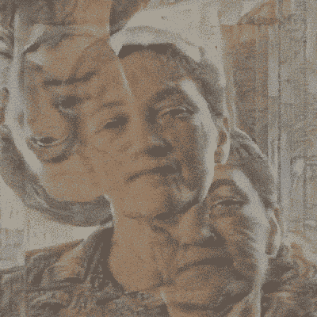

这是当我的深度学习风格混搭试图通过结合德库宁和奥基夫来重新想象这幅肖像的图像时的样子。

在这幅画的最后几天，我的机器人试图画出这两种风格的波动组合，让肖像慢慢浮现出来。

我的机器人怎么知道它们什么时候完成的？

这可能是任何艺术家做出的最重要的决定之一，也是最难编程的，因为它往往归结为一个品味问题。问题是我的机器人没有品味，所以它们必须依赖数学。他们结束比赛的决定实际上非常简单，我称之为**我已经尽了最大努力**。请记住，每一次描边都会在画布上拍摄一幅图像，并且会计算出一幅热图，该热图显示了画布和跟踪图像之间的差异。在绘画过程中，这张热图越来越亮，越来越接近最小误差。然而，在某种程度上，机器人不再能减少误差，无论它增加多少额外的笔触。总误差不再下降。在机器人已经画了一段时间并且注意到画没有变得更像跟踪图像之后，它断定它已经尽了最大努力并且停止了画。

了解到我的机器人已经尽了最大努力，接下来轮到我教它们如何变得更好。在完成他们的 13，396 次描边后，我接手并通过最后几十次润色来清理图像。这是通过在平板电脑上描绘最终的跟踪图像来完成的。我的一个机器人手臂会将这些笔画应用到画布上。

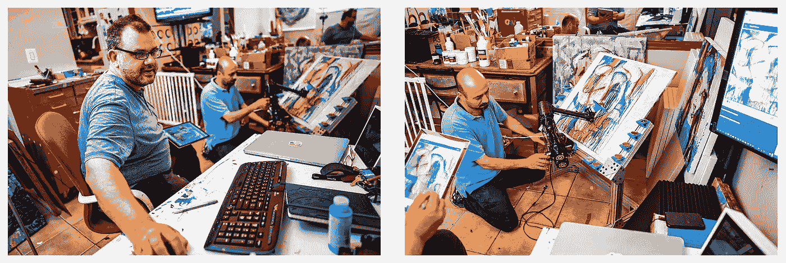

一些批评者担心我在艺术作品的不同点上介入，并帮助机器人解决问题，但我认为这种批评没有抓住利用人工智能创造艺术的要点。即使是艺术学校的学生，也有教授在背后看着，偶尔也会帮忙。这并没有使他们的艺术无效。通过我的策展和干预，我正在教机器人画得更像一个艺术家。

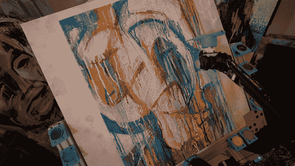

我之前简单地提到了这一点，但机器人会记录每一笔笔触，并使用它们来分析它如何自主绘画和我如何绘画之间的差异。比较这两种类型的笔触将有助于我的机器画得更像我，而不像一个机器人。

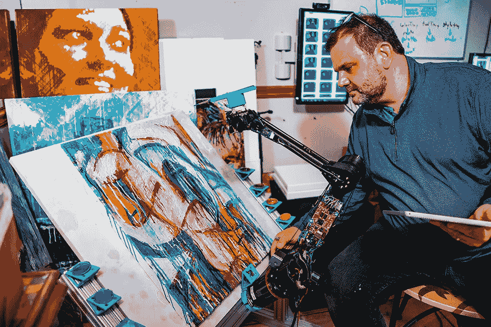

对我们的合作感到满意，我最终决定作品完成了。有趣的是，我发现这是创作一件艺术品时唯一真正重要的决定。

品达·范·阿尔曼
cloudpainter.com