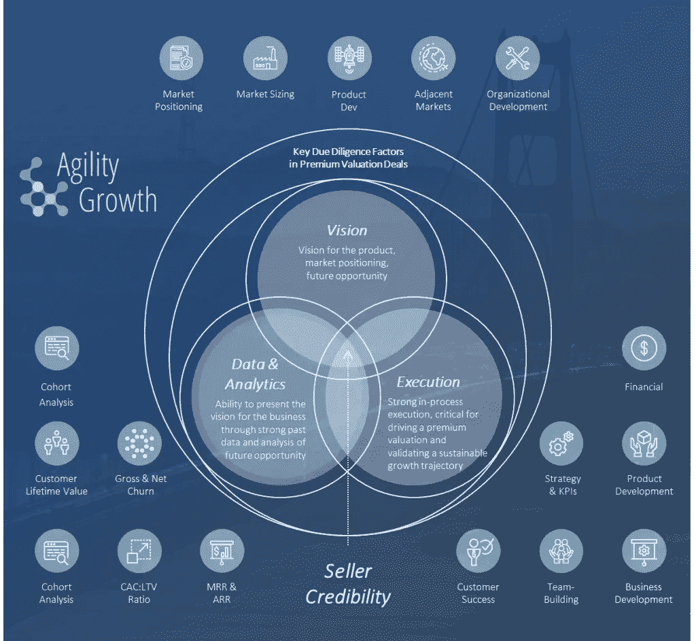
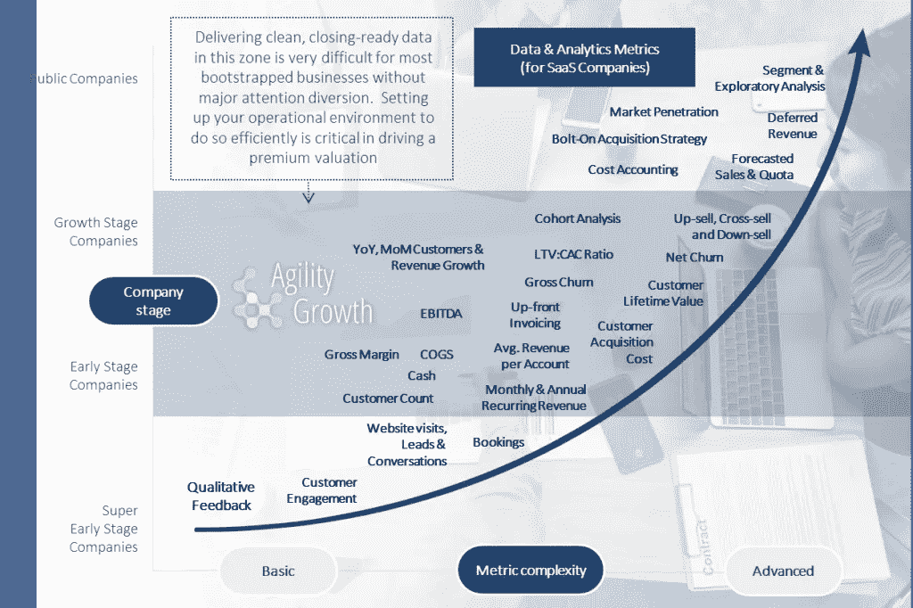

# 可信度和溢价估值 III，SaaS 数据和分析定义

> 原文：<https://medium.datadriveninvestor.com/credibility-and-premium-valuations-iii-saas-data-analytics-definitions-866c4090fb96?source=collection_archive---------9----------------------->

*图 1:并购交易中的卖方可信度(数据&分析突出显示)*

在我的上一篇文章中，我介绍了一些与[并购&和留存收益](http://agilitygrowth.com/earn-out-payments-and-retention-payments/)相关的概念。正如我在上一篇 [M & A 可信度帖子](http://agilitygrowth.com/credibility-and-premium-valuations-ii-saas-data-analytics/)中承诺的那样，今天我将展示 SaaS 指标的下一层细节，这些细节有助于向买家表明，一家企业已经做好了增长准备，值得溢价估值。

在我上一篇关于可信度的文章中，我们开始挖掘三个影响可信度的因素之一:数据和分析(在本文开头的维恩图中用浅蓝色突出显示)。在那篇文章中，我开始解释为什么这些指标在建立溢价估值竞标环境中如此重要，同时重点关注它们可以向买家发出什么信号，表明企业准备好迎接下一波增长。

 [## 金融科技初创公司正在扰乱世界各地的银行业-数据驱动的投资者

### 传统的实体银行从未真正从金融危机后遭受的重大挫折中恢复过来…

www.datadriveninvestor.com](https://www.datadriveninvestor.com/2018/10/20/fintech-startups-are-disrupting-the-banking-industry-around-the-world/) 

今天，我们将讨论“增长区域”中的许多指标，在下图中以蓝色突出显示，对它们进行高层次的定义，并包括一两条评论，说明这些指标可以告诉投资者或买家，交易后业务的增长准备(或未准备)如何。

*图 2:高倍数资本市场交易中的重要 SaaS 指标(突出显示)*

正如我在《M&A 可信度》上一篇文章中所提到的，上图提供了买家/投资者在公司生命周期的每个阶段寻找的重要指标，以证明高倍数、溢价 M&A(以及成长型收购和成长型投资)交易的合理性。虽然上述图表中的每个指标在向买方/投资者介绍业务方面都有细微差别，但累积的“证据”结合在一起，提供了一个被验证为增长就绪和未来强化的业务(即，如果指标优于其他市场参与者，则值得“溢价”价值)。下面介绍了证明增长就绪性的一些最重要和最基本的因素。我将在第二篇介绍性定义的文章中讨论其余更重要的指标。最后，我将在未来的几篇文章中更深入地探讨更复杂或更微妙的单个指标，这些指标对于推动一个具有溢价、高市盈率估值的强劲 M&A 市场至关重要。我还将在未来的一篇文章中讨论，对于普通的 SaaS 公司来说，衡量这些东西可能很困难(或者至少需要改变心态)。

**MRR**

大多数 SaaS 运营商都熟悉这个术语。MRR 是每月经常性收入的缩写，这是一个简单的衡量你每月经常性收入的方法。如果一家公司以现金基础提交其财务报表，并收取与其客户合同相关的大额预付款(即，根据公认会计原则[“GAAP”]，将有有意义的递延收入)，那么思考 MRR 并与之互动可能会变得更加复杂，但 MRR 作为一个概念是相当简单的。这是一个由公司根据 GAAP 每月产生的所有经常性收入组成的指标。当 MRR 被分解成它的组成部分时，它对潜在的 M&A 合伙人考虑企业的健康变得特别有用。MRR 总额的五个组成部分包括:

*   来自新客户的新 MRR-MRR
*   扩展 MRR —来自现有客户(最初成为客户时不存在)的新 MRR，通常来自支付提供商等合作伙伴的追加销售或不断增长的残值
*   重新激活 MRR-MRR 从以前的客户搅拌，然后回来
*   收缩 MRR —从保留的现有客户中失去 MRR(降级)
*   搅动的 MRR——因为离开顾客而失去了 MRR

就增长准备情况而言，MRR 显然比其他形式的非经常性收入对企业更有价值，因为它为未来增长提供了比一次性收入更多的杠杆作用和可预测性。

*更多关于 MRR 的信息将在以后的帖子中提供。

**ARR**

为了这篇文章，我们就说“看上面”，从“每月”转换成“每年”。

**客户获取成本(CAC)**

客户获取成本或“CAC”是与说服客户购买产品或服务相关的成本。这些成本包括固定成本，如销售和营销人员的工资和福利，以及销售和营销软件产品。它们还包括可变成本，如代销商支出、谷歌广告支出和销售佣金。CAC 是一项重要的 SaaS 业务指标，是净客户价值和获得新客户的投资回报(ROI)的组成部分。

因为它与增长准备状态有关，CAC 帮助一家公司决定花费多少资源来获得新客户是有利可图的，以及公司在销售和营销方面可以有多激进。为了使其成为一个可操作的或有洞察力的指标，客户获取成本通常被表示为一个比率——CAC 的总和除以企业因客户获取战略而获得的额外顾客数量(LTV:CAC 比率，我稍后将介绍)。

**客户终身价值(LTV)**

客户终身价值或“LTV”是对客户流失(取消)前产生的平均总收入的估计。作为考虑一家 SaaS 企业未来前景的一个极其重要的术语，人们对 LTV 的看法有着多层次的复杂性。然而，为了这个简短定义的目的，上述内容已经足够。LTV 的一个基本公式是每个客户的平均收入/客户流失率，它被广泛认为是估算 SaaS 客户 LTV 的有用基础。这就是说，因为这个公式没有正确地解释 MRR 扩张、MRR 收缩等情况，也没有解释流失不是线性发生的事实(以及其他细微差别)，所以它只是一个细微差别的重要讨论的粗略起点。由于它与增长准备度有关，LTV 可以与 CAC 结合，以帮助管理层决定通过 LTV: CAC 比率(我将在下面介绍)花费多少资源来获得新客户。LTV: CAC 比率没有解决的一个重要概念是时机，特别是现金流入和流出的时机。例如，如果一家公司的客户流失率为每年 5%，平均年收入为 500 美元，他们的总 LTV 为 10，000 美元。如果他们的 CAC 是 1，000 美元，他们仍然有 10:1 的 LTV: CAC 比率，但不要在第二年年底之前全额返还 CAC 支出。这被称为“CAC 回收期”,是 SaaS 一家自助公司在现金管理计划中的重要考虑因素。

*关于 CAC、LTV 和回收期的更多信息将在未来的博客文章中提供。

**LTV: CAC 比率**

因为我刚刚超过了自我规定的这篇文章 1000 字的限制，LTV: CAC 将是我今天最后一个介绍性的定义。我将在以后的文章中介绍群组分析、流失、净流失、追加销售/交叉销售、降价销售以及图 2(上图)中用蓝色突出显示的“增长区域”中的许多其他定义。由于我们在上面讨论了 LTV 和 CAC，LTV:CAC 比率应该很容易在这里介绍，虽然，像其他定义一样，它的细微差别和价值值得自己的博客帖子。简单地说，LTV:CAC 是一个比率，它比较了客户在其生命周期中的价值与获得客户的成本。如果一个公司的 LTV: CAC 比小于 1.0，就是在破坏价值；如果比率大于 1.0，公司可能正在创造价值，尽管需要更多的分析；一般来说，如果 CAC:LTV 比率大于 3.0，一家公司通常会被认为在盈利/有效获取客户方面“优秀”。然而，正如我上面所说的，这些指标是微妙的，所以即使是 3.0 的 CAC: LTV 比率也不能被认为是决定 SaaS 公司在客户获取方面是否成功的“亮线”。其中的一些原因包括:

*   边际贡献并不总是衡量经济效益的合适标准。这是因为许多公司有大量的固定成本，这些成本应该包括在客户获取效率的分析中。
*   随着目标市场的成熟、产品的增长、客户成功率的提高等，流失率/保留率通常会随着时间而变化。
*   随着品牌价值的增加/减少、新的或多或少有效的获取渠道的使用、竞争变得或多或少激烈等，客户获取成本也随着时间而变化。

如上所述，某些 LTV: CAC 比率(比如在 75% ARR 增长业务中的比率为 15:1)肯定会显示业务已做好增长准备，这是销售和营销效率+产品质量执行的不可否认的信号。

*更多关于 LTV: CAC 比率的信息将在以后的博客文章中提供。

注意:我喜欢与志同道合的金融人士、企业家和其他人交流。如果你愿意的话，可以随时在 [*LinkedIn*](https://www.linkedin.com/in/firmage/) *和/或*[*Twitter*](https://twitter.com/mfirmage)*上与我联系。*

*原载于*[*http://agilitygrowth.com*](http://agilitygrowth.com/credibility-and-premium-valuations-for-bootstrappers-iii-saas-data-analytics-definitions/)*。*