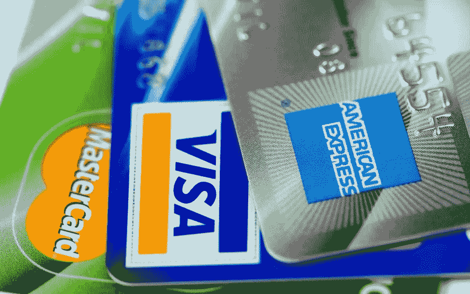

# 简化的信用卡建议

> 原文：<https://medium.datadriveninvestor.com/credit-card-advice-simplified-17a390b5ee96?source=collection_archive---------28----------------------->

所以，我的上一篇文章在财务建议方面很宽泛。这是第一条非常具体的理财建议。在上一篇文章中，我对此做了一些探讨，但这一篇将会更深入地探讨“是什么”和“为什么”。我从这篇文章中获得的大部分信息来自 Points Guy 博客，这是一个关于信用卡所有事情的很好的博客。如果你正在寻找更多与你的情况相似的信用卡建议，看看他的博客，了解更多信息和建议。

# 信用卡红利/费用

因此，在以后的章节中，我将更多地讨论信用卡的年费及其红利价值。年费是你为使用信用卡而支付的费用。似乎很简单。现在，你可以从卡的奖励和津贴中抵消这笔费用。我下面列出的奖金通常是免费的额外津贴，你必须使用才能得到。一些福利和津贴包括免费酒店住宿、行李、项目、活动和物品折扣等。而且，对一些人来说，它们没有意义，因为他们不会使用那些免费的额外津贴。所以，仅仅因为你从一张卡中获得一些额外的价值并不意味着你应该申请它。你应该试着看看这对你是否有意义。例如，一个很少登机的家伙不需要 TSA 预检或全球入境。但是，如果你是一个经常坐飞机或者一年至少一两次去度假的人，那么它会更有用。所以，在决定用哪张卡之前，仔细看看奖金，看看哪张信用卡能为你目前或未来的情况提供最好的奖金。

# 航空公司奖励卡

如果你每年至少乘坐一次航班，这张卡是必须的。另外，请购买年费为 99 美元的卡，因为这是唯一可以购买的卡(或者可能更高)。现在，如果你通常飞西南，不要打扰。我给出的建议并不适用于西南航空，如果你们中有人知道，你们会明白为什么。美国的三张卡是达美运通卡、联合里程积分卡或美国万事达卡中的一种。在美国，要达到的级别要么是白金级(99 美元)，要么是高管级(499 美元)。在美联航，买探险者(99 美元)或俱乐部(499 美元)。在达美航空，购买黄金(99 美元)、白金(195 美元)或备用(495 美元)。获得年费的原因是，如果你乘坐他们的航班，他们会免费为你和你的旅伴提供一个托运包，从而为你支付年费。如果你和另一个人去任何地方做一次往返旅行，那就节省了一百美元。更多的旅行意味着更多的节省。我对这三个选择中哪一个的建议是:选择离开你的机场的航班最多的一个。就像如果你住在亚特兰大，你显然需要乘坐德尔塔航空的航班。如果你住在达拉斯，买美国的。如果你住在休斯顿，就加入联航。如果你住在纽约或洛杉矶，什么都可以。另一个很好的观察方式是，哪一个人认为你的城市是一个中心。如果是的话，就选那个。

# 亚马逊 Prime Rewards Visa 签名卡

如果你在亚马逊上买了很多东西，我是说很多，这张卡可能适合你。我认为最好是专门用于亚马逊购买，但如果你做了很多，那么你应该没问题。亚马逊和全食超市购物有 5%的返现，如果你用这张卡，会有很多收获。没有其他商店的信用卡能提供这样的奖励，它甚至会增加你在亚马逊的消费。

# 酒店奖励信用卡

对我个人来说，这并不是什么大不了的事情，因为现在许多人都住在 Airbnbs，这可以使酒店奖励信用卡变得多余。(我也确实认为，在 Airbnb 时代，酒店需要做很多事情来适应)。但是，如果你因为这样或那样的原因仍然住在许多酒店，酒店奖励信用卡可能是一个不错的选择。现在，这通常归结于酒店的偏好，但如果你没有任何偏好，我会推荐美国运通的 **SPG 优选客户豪华卡。年费为 450 美元，但加上 300 美元的免费 SPG/万豪酒店消费和一个免费夜晚，这几乎等于年费。此外，还有其他折扣，如免费的美国运输安全管理局预检等。，存款中有足够的 900 美元，所以如果你充分利用它的潜力，你仍然可以在扣除费用后获得 450 美元。我不认为任何其他酒店奖励信用卡有这张好，但如果你看到其他情况，请随时评论。**

# 美国证券交易所(American Stock Exchangeˌ等于 AMEX)

有很多理由可以解释为什么有人应该拥有一张美国运通卡。美国运通的优惠是很棒的交易，每个月左右都应该看看，看看他们是否能在产品上获得一些很大的折扣。在定期返现方面，许多美国运通卡提供大量返现和积分卡。美国运通卡一直是评级最高的卡。目前世界上最受欢迎的奖励卡之一(积分专家称排名第二)是美国运通白金卡，年费为 550 美元，价值 1140 美元。因此，钱包里至少有一张美国运通卡是很有用的。Delta SkyMiles，前面提到的 SPG 卡，以及著名的 Blue Cash 卡都是美国运通卡。

# 追赶

人们钱包里应该放的另一张卡是大通卡。大通最近在奖励游戏中表现突出，提高了他们的游戏水平，在某些情况下，即使没有击败美国运通，也接近获得更好的奖励。我想到了 Chase Ink 名片和 Chase Sapphire Preferred/Reserve。这些卡具有一些最佳的奖励/费用比率，分别为 1680 美元/95 美元或 1080 美元/95 美元，并且是市场上一些最好的卡。如果可以的话，试着在 Chase 里得到上面提到的一张卡，因为它们非常有用(即使你没有在卡上花任何钱)。我在这里夸大其词，但这就是这些卡的用处。

# 花旗银行

花旗银行有丰富的卡，其中一些接近上面提到的大通卡的声望。在你的钱包里放一张花旗卡是一件很好的事情，例如音乐会、体育赛事、餐饮、戏剧等的独家早期门票。我最近的 Hasan Minhaj 门票有资格享受这一优惠。但是，如果你已经有一个大通卡在你的阵容中，你可以在他们的阵容中获得一个较低的卡，包括花旗私人通行证，允许早鸟特价。如果你想让花旗成为你的主要首选卡，试试花旗尚客优卡，根据积分专家的说法，这是第三张最好的卡，性价比很高。花旗银行也有双现金卡，有 2%的返现，所以如果你更喜欢，你可以去看看。

# 发现

探索卡对大学生来说是很好的入门卡。Discover it chrome Student 是我的第一张卡，它一直是我的日常驱动程序之一，有 2%的现金返还(很棒)，还有相当高的信用额度。我对 Discover 的唯一疑问是，一旦你达到某个水平，收益就没那么大了。但是，它们仍然应该留在你的钱包里，用于那些国际旅行，因为即使 Discover 没有提供很大的好处，它在国际上的许多地方通过他们的子公司 Diner's Club 被接受，特别是在欧洲。现在，这并不意味着你没有发现卡就不能在欧洲生存。这可能会让事情变得简单一点。

# 大写一

第一资本公司有大量的信用卡，这些信用卡更适合人们建立信用，因此，他们为那些正直的人制作了很好的信用卡。但是，我会推荐他们作为最后的手段，如果你得不到一张不在积分排行榜上的牌。如果你看的时候有一两张大写的一号卡，那就去争取，尤其是如果你正在建立信用或者信用评分很差的话。考虑这些伟大的卡建立信用几年前走向名单上的顶级卡。否则，你会有更好的选择。

# 其他银行

如果对你的情况有意义，我会推荐其他银行。积分专家有各种各样的情况，哪家银行适合每种情况。看看列表，看看是否有适合你的卡片。简而言之，美国银行制作了一些很棒的现金回馈卡。其他银行的积分卡也很不错，比如富国银行，所以每个银行都有自己的积分卡。

# 分享是关怀

现在，分享是有限制的，而且很难实施。但是，这就是为什么我认为这是有用的，如果不是必要的。让我们以航空公司或酒店的积分卡为例。现在，让我们假设你住在达拉斯，而你想与之分享的人在休斯顿，这是行不通的，因为一个人在美国航空公司的 AAdvantage 上，另一个人在联合航空公司的 MileagePlus 上。然而，让我们说，你的家人都住在一个地区，你经常去旅行。如果有一张旅行奖励卡，你们可以为了这个目的而分享，那就简单多了。此外，对于一些顶级卡，您可以限制消费，这样主卡持卡人就可以确保在使用前不会出现未经授权的使用。如果航空公司奖励卡的唯一用途是购买机票，并使用它免费行李和额外津贴，那么这就更有意义了。这也有助于将年费分摊给更多的人，甚至可能帮助你进入那张卡的下一层。如果你和你的家人使用它，你可以从更高的卡中获得更多的奖励，这比一两个人更有可能与家人在一起。

这是有警告的，这就是为什么人们通常不这样做。主卡持有者最终要为每个人在那张卡上的消费负责。现在，有一些方法可以限制授权用户的支出，因此，如果您将钱给家人或朋友，您可以将他们的支出限制在您预先定义的最大值，同时保持您的信用额度。

# 先出哪张牌？

你们中的许多人可能没有这张清单上的卡片。那么，你先要哪张卡。只是看你的情况和你针对的是哪张卡。如果你已经有了一张 Discover 学生卡，并且最近刚开始工作，那就等你的信用评分上升后再去申请一张卡。许多人可能会得到的第一张卡是亚马逊信用卡，因为它对亚马逊购物的高额返现。这对那些与亚马逊有独家协议的人来说非常有帮助。(我在看着你，海蒂·戴维森)。

如果你没有信用卡并且是学生，Discover 将是一个很好的选择。如果你在学生时代没有为信用卡烦恼，你应该试试自由追逐、美国银行现金奖励、发现、Capital One Quicksilver 等等。这些卡中的许多都是很好的开始卡，也在积分排行榜上。如果你已经有一张卡，等一会儿，直到你能从积分人博客的列表中得到一张卡。你有越多的申请和卡，你越有可能在下一次申请卡时被拒绝，所以最好不要申请信用卡，申请你想要的卡，也是顶级卡。看看你是否能进入信用卡阶梯，通过申请顶级卡，进入低级卡，然后证明你的方式达到你想要的顶级卡。我不确定是否有公司这样做，但问问也无妨。

此外，请注意，大通有一个非常特殊的规则，你不能在 24 个月内申请超过 5 张信用卡，也称为 5/24。所以，如果你想要一张大通信用卡，最好先申请，然后再申请其他信用卡。

# 有信用卡余额

我知道。人们一直告诉你要减少信用卡的数量，我刚刚告诉你至少要有四张，也许七张，也许更多。我不是提倡一个人一生有十张信用卡。这需要维护大量的账户，可能会令人头疼。但是，如果你一年至少能用一次这张卡，那这张卡你应该保留。如果你每年至少乘坐一次达美航班，你应该获得达美航空里程运通卡。但是，如果你真的有这么多卡片，请安装一个可以连接所有不同卡片的应用程序，并将它们保存在一个仪表板中，以便于查看。这又回到了我之前的文章，我在文章中对此进行了更详细的解释，但是如果您不能在一个地方方便地查看每张信用卡的余额，那么即使维护五个不同的信用卡帐户也是很困难的。

# 结论

总之，我已经提出了这么多关于信用卡的建议。我希望这些有所帮助。如果你想得到更多的建议，请去积分男博客了解更多信息。请注意，这不应被视为财务或法律建议，有些人就是以此为生的。感谢您抽出时间阅读本文。如果您有任何问题或意见，请随时联系我。再次感谢。