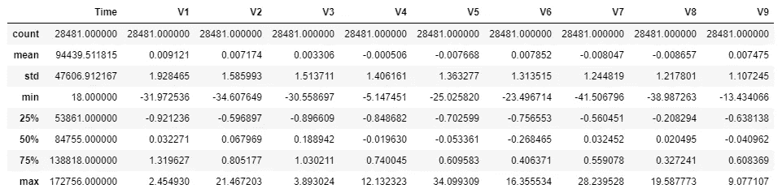
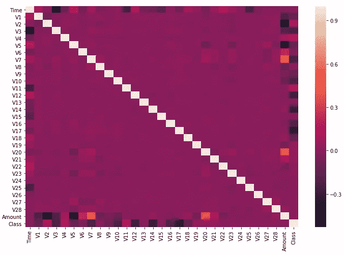
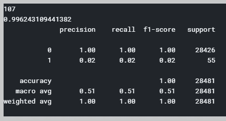

# 机器学习在信用卡欺诈检测中的应用

> 原文：<https://medium.datadriveninvestor.com/credit-card-fraud-detection-using-local-outlier-factor-and-isolation-forest-in-python-56edd0a44af5?source=collection_archive---------0----------------------->

## 基于局部异常因子和隔离森林算法的异常检测


这个机器学习项目是关于检测欺诈性信用卡交易。数据集“creditcard.csv”可从 [kaggle 信用卡欺诈检测](https://www.kaggle.com/mlg-ulb/creditcardfraud)下载。

导入必要的包。

```
**import numpy as np
import pandas as pd
import seaborn as sns
import matplotlib.pyplot as plt
from sklearn.metrics import classification_report, accuracy_score
from sklearn.ensemble import IsolationForest
from sklearn.neighbors import LocalOutlierFactor**
```

## **读取数据**

数据被加载到“df”数据帧中。

```
**df = pd.read_csv(‘creditcard.csv’)**
```

## **可视化和理解数据**

理解数据很重要，因为我们对数据有直观的感觉，这有助于确定必要的预处理步骤。

```
**df.shape** # Prints the shape of ‘df’
```

“df”数据帧的形状为(284807，31)，这意味着 284807 个事例和 31 列。

这是一个非常大的数据帧。这在计算上是昂贵的。因此，通过删除行，数据帧被下采样为先前大小的十分之一。**虽然用大数据样本训练模型给出了更好的结果，但这是以计算能力和时间为代价的**。

```
**df = df.sample(frac=0.1)** # Size of data frame is reduced
```

现在，数据帧“df”的形状为(24831，31)

```
**df.columns** # Prints columns of data frame ‘df’
```

列有['时间'，' V1 '，' V2 '，' V3 '，' V4 '，' V5 '，' V6 '，' V7 '，' V8 '，' V9 '，' V10 '，
，' V11 '，' V12 '，' V13 '，' V14 '，' V15 '，' V16 '，' V17 '，' V18 '，' V19 '，' V20 '，【T9]，' V21 '，' V22 '，' V23 '，' V24 '，' V25 '，' V26 '，' V27 '，' V28 '，'金额'，【

“时间”和“金额”分别表示交易的时间和金额。“类别”表示交易是否是欺诈性的。“V1”到“V28”是不能透露的交易细节的简化特征。

```
**df.nunique()** # Prints total number of unique elements in each column
```


All columns could not be displayed due to screen size constraint.

“class”列是一个分类变量，它有两个唯一的元素:- 0 和 1。0 表示非欺诈交易，1 表示欺诈交易。

```
**df.describe()** # Displays details of each column
```



All columns could not be displayed due to screen size constraint

每列的计数是 28481，这表明**没有丢失值**。

“类别”列的平均值为 0.00197，这表明“类别”= 0 的情况较多(非欺诈性交易)。

```
**df[df[‘Class’] == 1][‘Class’].count()** # Prints total number of fraudulent transactions
```

0.19%(28481 笔中的 56 笔)是欺诈交易，这表明**这是一个异常检测问题**。

“时间”和“金额”的最小值为正，这表明**在“时间”和“金额”中没有负值**。

```
**plt.figure(figsize=(12,8))**
**sns.heatmap(df.corr())** # Heatmap of correlation between columns of ‘df’.
```



“类别”与“金额”和“时间”的相关性较低，这表明很难从交易的“金额”和“时间”细节预测交易是否欺诈。

' Class '与' V3 '，' V7 '，' V10 '，' V12 '，' V14 '，' V17 '负相关，与' V2 '，' V4 '，' V11 '正相关。其他相关性相对较小。

简化的特征之间没有显著的相关性(“V1”到 V“28”)。因此**我们不删除任何列，因为它们彼此之间完全不相关**。

> 摘要:-因为没有丢失的值、没有要删除的列和不正确的数据，所以不需要预处理步骤，我们继续训练模型。

## **训练模型**

数据集已经过预处理，可以进行训练了。在两个模型之间进行比较:-线性离群因子和隔离森林。

局部异常因子是一种无监督的异常检测方法。它计算每个样本的异常分数。它测量给定样本相对于其相邻样本的密度的局部偏差。异常分数取决于样本相对于周围邻域的孤立程度。

隔离森林是一种用于异常检测的无监督算法，其工作原理是隔离异常。它没有尝试构建正常实例的模型，而是显式隔离数据集中的异常点。这是一个非常快速的算法，内存需求低。

要计算异常值部分。

```
**fraud = df[df[‘Class’] == 1]** # Number of fraudulent transactions
**valid = df[df[‘Class’] == 0]** # Number of valid transactions
**outlier_fraction = len(fraud)/float(len(valid))**
```

异常分数是 0.00197

**输入输出**

```
**X = df.drop(‘Class’,axis = 1)** # X is input
**y = df[‘Class’]** # y is output
```

**局部异常因素模型的表现**

```
**a = LocalOutlierFactor(n_neighbors = 20,contamination = outlier_fraction)**
**y_prediction1 = a.fit_predict(X)** # Fitting the model.
**y_prediction1[y_prediction1 == 1] = 0** # Valid transactions are labelled as 0.
**y_prediction1[y_prediction1 == -1] = 1** # Fraudulent transactions are labelled as 1.
**errors1 = (y_prediction1 != y).sum()** # Total number of errors is calculated.
**print(errors1)
print(accuracy_score(y_prediction1,y))
print(classification_report(y_prediction1,y))**
```



错误总数= 107。准确率= 99.62%。对于异常检测来说，准确性不是一个好的衡量标准。关注精确度、召回率和 f1 分数非常重要。准确率=0.02，召回率=0.02，f1-score=0.92 都很低。这表明有 2%的几率实际预测到欺诈性交易，并且有 2%的几率预测到的欺诈性交易实际上是真实的。

**隔离林性能**

```
**b = IsolationForest(max_samples = len(X),contamination = outlier_fraction).fit(X)** # Fitting the model.
**y_prediction2 = b.predict(X)** # Prediction using trained model.
**y_prediction2[y_prediction2 == 1] = 0** # Valid transactions are labelled as 0.
**y_prediction2[y_prediction2 == -1] = 1** # Fraudulent transactions are labelled as 1.
**errors2 = (y_prediction2 != y).sum()** # Total number of errors is calculated.
**print(errors2)
print(accuracy_score(y_prediction2,y))
print(classification_report(y_prediction2,y))**
```


错误总数= 77。准确率= 99.73%。精度= 0.3，召回率= 0.29，f1-score = 0.29，优于以前的局部离群因子模型。

对于给定的数据集，隔离森林是比局部离群因子更好的异常检测算法。

快乐阅读！