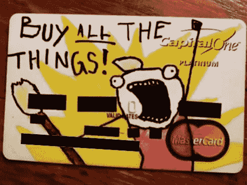
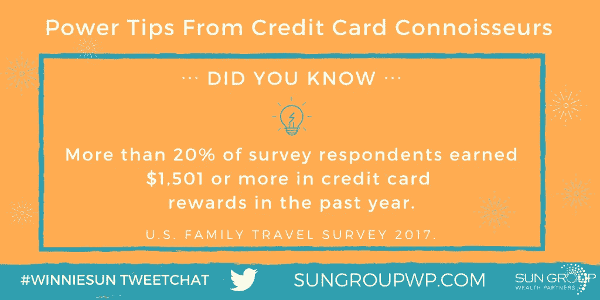
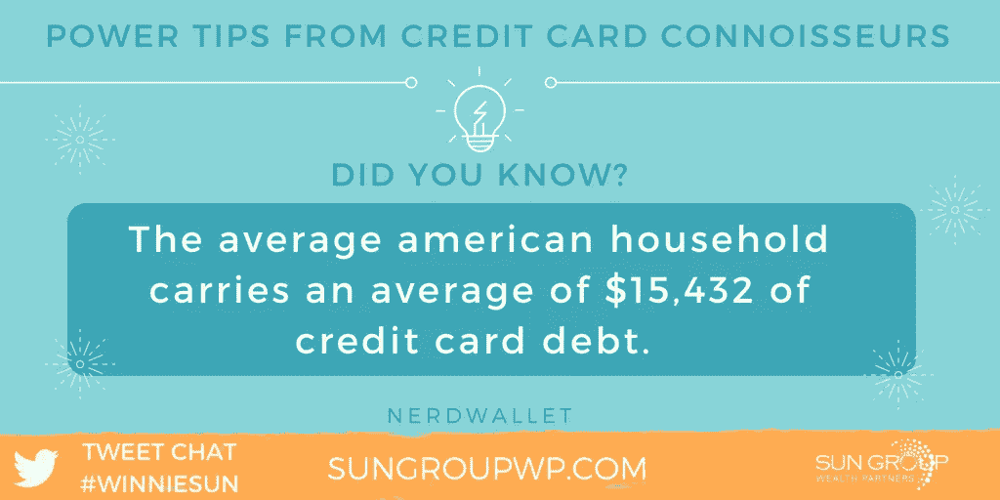
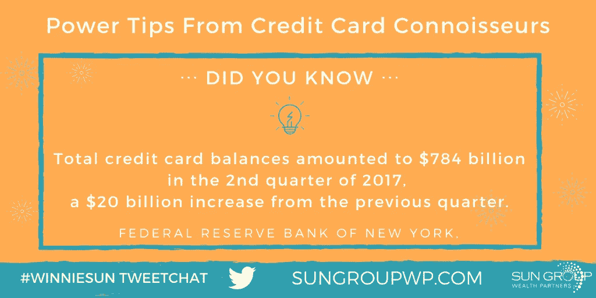
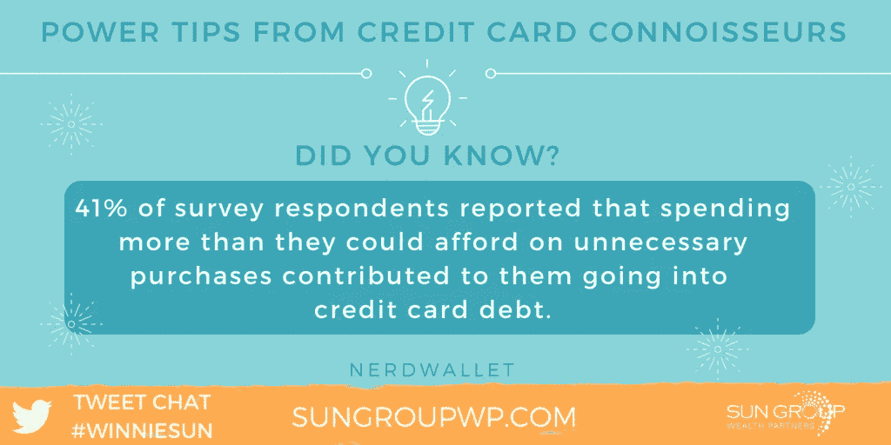
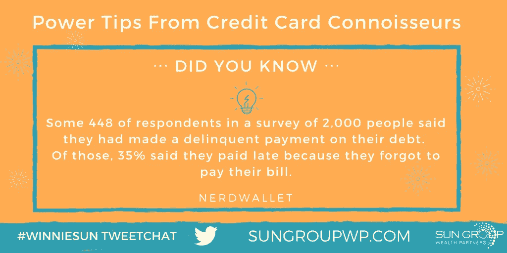
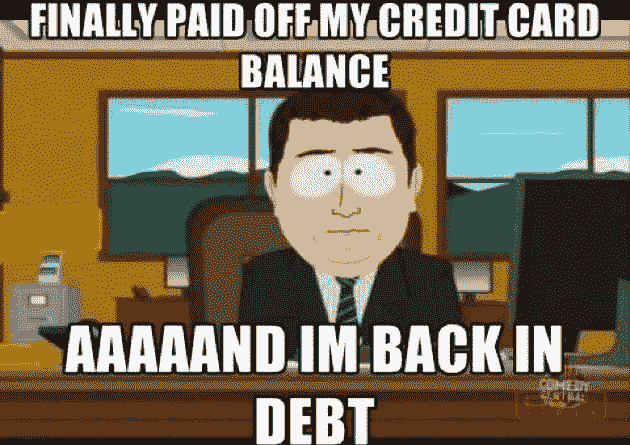

# 管理良好的信用卡可能是好东西

> 原文：<https://medium.datadriveninvestor.com/credit-cards-managed-well-can-be-good-things-654506b8daeb?source=collection_archive---------26----------------------->

## 了解现金和信用卡的优缺点

As funny as this credit card design is, it won’t be as funny when the bill comes.

超过 20%的被调查者在去年获得了 1500 美元或更多的信用卡奖励。

普通美国家庭平均背负超过 15000 美元的信用卡债务。

拥有循环信用卡债务的普通家庭每年要支付 900 多美元的利息。

这些是一些好的——也是大部分坏的——数字，与美国消费者对塑料支付的依赖有关，并且经常更深地陷入债务。

金融行业最受欢迎的专业人士之一，[温妮·孙](http://winniesun.com/about/)希望将消费智慧传承下去，她向阿朵的金融专家们请教:[贾森·斯蒂尔](https://twitter.com/realjasonsteele)和[金佰利·帕尔默](https://twitter.com/KimberlyPalmer)。

作为一名自由记者，斯蒂尔是一名信用卡和旅游奖励专家，也是 CardCon 博览会的制作人。

帕尔默为《华尔街日报》撰写关于信用卡和个人理财的文章。她写过三本关于钱的书:《聪明妈妈 [*、有钱妈妈*](https://www.amazon.com/Smart-Mom-Rich-Wealth-Raising/dp/0814436803) 、《 [*你的经济*](https://www.amazon.com/Economy-You-Discover-Entrepreneur-Recession-Proof-ebook/dp/B00F8GFMU4) 》和《 [*代赚*](https://www.amazon.com/Generation-Earn-Professionals-Spending-Investing-ebook/dp/B003E8AJ6K) 》

 [## 如何保护你的信用评分获得丰厚回报

### 给你的生活画上圆满的句号

medium.com](https://medium.com/financial-strategy/top-off-your-life-thanks-to-the-gift-of-great-credit-f4167a75cedd) 

用现金代替信用卡付款有优点也有缺点。

“如果你是预算的新手，使用现金是有好处的，因为你不能超出你没有的支出，”孙说。“作为一个企业主，我的信用卡是一个重要的工具。它们帮助我跟踪支出，让我的会计生活变得轻松一些。

“如果你在月底——每个月——100%付清信用卡，负责任地使用信用卡可以帮你赢得积分，”她说。"这些可以帮助补充你的假期预算."

# 余额抵消奖励

斯蒂尔附和说，完全支付是关键。

“信用卡奖励可能非常有价值，但只针对那些通过全额支付余额来避免利息的人，”他说。"如果你有余额，现金就胜过信用卡."

就连金融专家对信用卡的看法也会随着时间的推移而改变。

“当我还是个孩子的时候，我的妈妈就教我信用卡的责任，”孙说。“我每个月都会还清所有的债务。

“现在我把她教的东西带到了另一个层次，”她说。“我在如何收费、使用哪种卡以及如何使用我获得的积分方面真的很聪明。我家的大部分度假基金都是由信用卡积分资助的。”

 [## 今天的金钱课是一生的奖励

### 获得更好结果的简单财务最佳实践

medium.com](https://medium.com/financial-strategy/todays-money-lessons-are-a-lifetime-reward-31507c4c6179) 

斯蒂尔不会给出全面的建议。

“弗兰奇，随着时间的推移，我对积分和里程越来越感兴趣，”他说。“我也更加确信，不是每个人都适合用卡。”

了解你的信用评分可以改善你的整体财务健康状况。你的信用评分表明你有一个财务标准。它帮助你专注于良好的财务卫生，以清理你的行为。

“意识就是一切，”孙说。“对于我们中的许多人来说，我们太忙了，以至于忽略了了解自己信用评分的重要性。

“你应该每年和你的社会保障声明一起检查这个，以确保每件事都被正确地报告，”她说。“然后，到了买东西或借钱的时候，你就能确切地知道自己的财务状况了。”

从某种意义上说，声明可以像金丝雀警告氧气减少。

“你的信用评分是你需要在问题变得更糟之前解决问题的早期预警，”斯蒂尔说。

# 检查欺诈行为

帕尔默说，好的一面是，了解自己的信用评分“会给你提高信用评分的动力。”自然地，她喜欢 NerdWallet 的应用程序来检查她的信用并监控她的信用评分。

“每当贷款人检查我的信用时，我都会收到警报，这样我就可以确认这不是欺诈，”帕尔默说。

斯蒂尔偶尔会使用诸如 Capital One 和 Discover 等信用卡发行商提供的服务来检查自己的信用。

“我携带的许多信用卡都可以根据需要免费提供我的信用评分，”孙说。“比如美国运通就有这个。

“我喜欢信用卡应用程序内置这些信息，”她说。"它让我可以方便地定期查看信息."

余额转移最终只不过是账户流失。你转动你的轮子，但毫无进展，你的总债务保持不变。信用监测者会将客户流失视为一个不好的信号。

“一般来说，这是信用卡的关键，”孙说。“如果你打算在年利率达到之前转移并付清余额，那就没问题，”孙说。“如果你会忘记或不小心错过付款，你最好不要转移余额，直接付清。

“更好的是，不要花你没有的东西，”她说。“月底付清余款。太理想了。”

 [## 掌控你的财务生活

### 金钱不能定义你，但你需要它来储蓄和投资

medium.com](https://medium.com/datadriveninvestor/take-control-of-your-financial-life-f858fa54f500) 

斯蒂尔说，消费者需要看到正确的数字。

他说:“零年利率余额转移优惠可以成为偿还债务的一个很好的工具。"然而，我更关注低费用."

如果管理得当，使用信用卡可能是一种优势。

孙说:“我很少带现金，所以我可以随时知道我的预算是多少。”。“了解有多少资金进出很重要。然后你就可以规划你的未来了。

“我的家人很喜欢我对信用卡积分的理解，”她说。"我们的许多家庭度假都是由我们的日常开支来支付的。"

帕尔默主张亚马逊 Prime Rewards Visa 是“这位不断购买学习用品、家居用品等的妈妈的完美卡。我[每个月拿回现金](https://www.nerdwallet.com/blog/credit-cards/my-credit-card-strategy-cash-back-stretch-family-budget/)

专家们权衡了携带信用卡的合适数量。

"我必须经常出差，所以我有两张航空卡，分别是我经常乘坐的两家航空公司和其他航空公司的，"孙说。“每张卡都应该有一个用途，否则你就不应该拥有它。我总是带着太多的卡片。这是我仍在努力的事情。”

# 没有人是免疫的

帕默更喜欢三连胜:

*   返现的日常消费卡。
*   对于我花费最多的类别，该卡的奖励率更高。对我来说，那就是杂货。对其他人来说，这可能是旅行。
*   我购物最多的地方的商店名片:亚马逊。

 [## 光明的未来等待着金融自由的宣言

### 你现在可以采取的宣布财务自由的步骤

medium.com](https://medium.com/financial-strategy/bright-futures-await-declarations-of-financial-freedom-78c3d40e935b) 

即使是专家也有过惨痛的教训。

孙说:“我犯的最大的信用卡错误是在很久以前激活这张卡的时候。“我忘了设置自动转账，付款晚了。这导致我失去了宝贵的积分，并支付了不必要的费用。再也不会了。

“现在，当我拿到一张新卡时，我会激活它，同时设置自动转账，”她说。"然后，卡放进钱包."

斯蒂尔的错误没那么严重。

“我没有获得注册奖金，因为我没有达到最低消费，”他说。“我学会了仔细追踪这些东西。”

帕尔默同意自动转账是“[肯定要走的路](https://www.nerdwallet.com/blog/credit-cards/how-to-set-up-automatic-credit-card-payments/)

当减少信用卡债务时，先还清最小的欠款——唾手可得的果实。这就释放了资金，用于下一个最小的回报，以此类推。

“偿还信用卡债务的最好方法是不要让自己背上任何债务，”孙说。

“先解决最大的怪物——利率最高的那个，”她说。“迅速而积极地偿还这笔钱。然后切卡。这是不值得重复的历史。”

一定不要拖欠。

“无论你做什么，至少按时支付所有账户的最低还款额，”帕尔默说。"否则，这可能会损害你的信用评分，并[造成更大的问题](https://www.nerdwallet.com/blog/credit-card-data/consumer-credit-card-trends-study/)"

# 定制卡片

不是所有的信用卡都适合每个人。

“有很棒的网站详细介绍了什么样的卡片最适合你的情况，”孙说。“你是企业主吗？你单身吗？；你是一个人吗？你结婚了吗？你通常在哪里加油？需要什么福利？

“我坚信，在申请信用卡之前，你应该充分了解你的信用卡，”她说。“如果你能够在不看笔记的情况下向另一个人总结利弊，你就真正理解了这张卡片。”

信用卡最基本的规则:你必须还钱。它们不是免费的钱。这是学校或大学里没有教的一课。

 [## 当你掌握你的信用时，节省数千美元

### 你的信用评分提高可能只是一个公共事业法案了

medium.com](https://medium.com/financial-strategy/save-thousands-of-dollars-when-you-get-a-grip-on-your-credit-6ea09bcd1a89) 

孙给了她最重要的指导方针:

*   当你激活你的卡，设置自动转账每月支付。
*   把卡的好处写在贴纸上，贴在你的卡上，这样你就能记住了。
*   即使你花了 2 美元，把它记在你的信用卡上，这样你就可以记录你所有的花费。

“通过设置自动警报来保护自己免受信用卡欺诈，”孙说。“大多数信用卡公司，如大通、美国运通和花旗银行，每次收费时都会给你发一条短信。

“你想知道钱什么时候离开你的钱包吗？”她说。“我愿意。设置警报。”

如果你使用信用卡，确保你已经准备好每月还贷的钱。不要花费超过你所拥有或挣得的。信用卡是用来赚取积分和建立信用记录的。在使用它们之前，请记住所有这些。

"当我还小的时候，我妈妈给了我一张大学信用卡，只是为了紧急情况，"孙说。“我过去一直信奉这种哲学。

“现在，我明白携带信用卡是比携带现金更明智的财务决策，”她说。“我通过日常消费获得积分。我记录了我所有的开销，所以没有遗漏任何东西。我可以更好地规划我的财务未来。”

# 按需收费

同样，帕默让她的丈夫[从借记卡换成信用卡](https://www.nerdwallet.com/blog/credit-cards/credit-cards-vs-debit-cards-husband-is-persuaded/)。

信用卡奖励基于积分或返现。消费者的偏好取决于个人需求。

孙说:“如果你是那种很少旅行、喜欢自由花钱的人，现金可能对你更有意义。”。“对于热爱旅行的家人和我来说，我们都非常重视积分。”

 [## 旅行在即，现在就制定计划吧

### 向前看，以避免金融陷阱，并有一个良好的旅行

medium.com](https://medium.com/datadriveninvestor/with-travel-on-the-horizon-make-plans-now-83e97b0fb269) 

帕尔默和孙有信用卡创新的愿望。

孙说:“我很乐意看到信用卡公司以一种更加高效和有效的方式进行创新，而不必携带信用卡。”“我知道有一些像 Apple Pay 这样的好应用，但它不能保证你可以零信用卡或零现金旅行。

“我也想用信用卡更有效地付小费，”她说。"我很乐观，美国运通、维萨、万事达、Discover 和 Chase 会找到办法的."

恶作剧之后更方便的开关会有所帮助。

帕尔默说:“当原来的信用卡号码因欺诈而关闭时，我希望能更容易地将自动付款转移到新的信用卡号码上。”

**关于作者**

吉姆·卡扎曼是[拉戈金融服务公司](http://largofinancialservices.com)的经理，曾在空军和联邦政府的公共事务部门工作。你可以在[推特](https://twitter.com/JKatzaman)、[脸书](https://www.facebook.com/jim.katzaman)和 [LinkedIn](https://www.linkedin.com/in/jim-katzaman-33641b21/) 上和他联系。