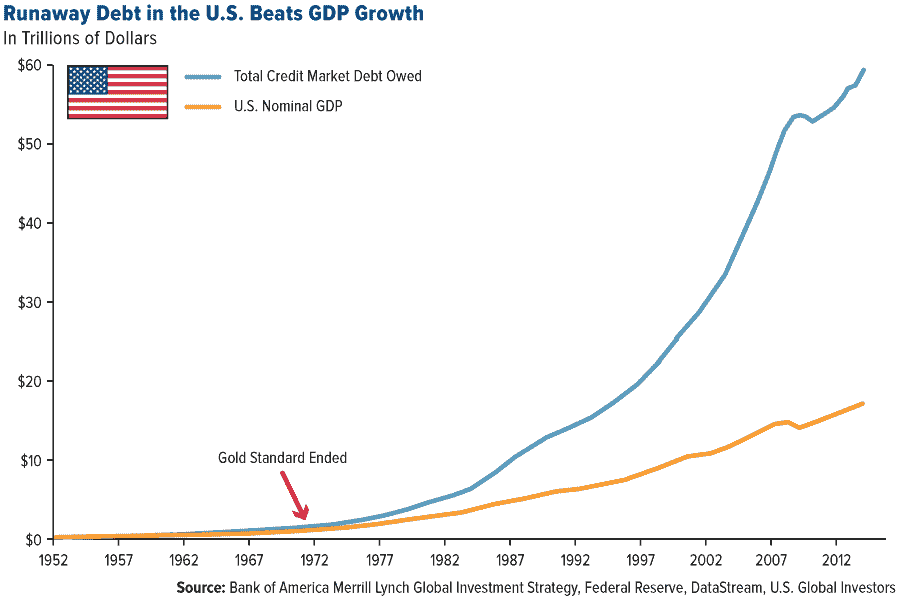

# 信用:我们都做错了。银行业的未来

> 原文：<https://medium.datadriveninvestor.com/credit-were-doing-it-all-wrong-the-future-of-banking-fae29bd5d9a8?source=collection_archive---------18----------------------->

长期以来，信用一直是我们生活的一部分。它也是经济增长的巨大推动力。一些人认为我们有太多的信贷，或者指责法定货币产生了道德风险，让我们可以不计后果地印刷钞票。就我个人而言，我觉得随着时间的推移，社会已经为我们找到了越来越好的方法来产生信用，并让人们随着时间的推移偿还。

随着时间的推移，我们逐渐创造了更多借钱的方式，并确保有还款的动机。没有信用评分？将 500 美元存入定期存单，我们会把钱“借给”你，直到你得到一分？

需要更多的信用卡额度？好了，现在我们已经看到你的表现，这里有一个 1000 美元的限制，随着时间的推移，我们会提高到$5k，$10k，等等！

想要辆车吗？当然，这是给你的费用，伙计。

想要房子？我们会深入调查你的财务状况，但你有着良好的历史，而且你已经做得很好，拿到了 10%的首付。这是 9x，所以你可以付给我们 30 年的利息。如果你不同意，我们就收回房子。

想买第二套房子？到目前为止你已经做得很好了，所以这是下一步的计划。

随着时间的推移，有多少产品被创造出来，这是令人惊讶的。老实说，我们只是触及了表面。用你的 401k 贷款？当然可以！针对你的股票卖出期权？当然可以！保证金交易？当然可以！用你的马蒂斯做抵押？当然可以！借你 1989 年圣诞大片的版税？当然可以！

随着世界发明更多的产品，我们可以借钱给更多的人，这样他们就可以做更多令人惊奇的事情。所以当你看信贷增长图表时，它看起来像一条随时间变化的指数曲线。

这不会是一篇关于经济或政治的论文，而是更多地着眼于我们之前看到的所有例子的机制。

# 这个系统一团糟

作为一个信贷消费者，这个体系令人沮丧，尤其是作为一个移民。我从一个我有很高信用的国家搬来。在我美国的新家，我去了我当地的分行开了一个账户。我试图获得一张信用卡，但被拒绝了。从我 11 岁起就知道我交易历史的银行认为我是一个未知数。

所以我不得不在另一家公司开了一张 CD 支持的信用卡。我通过制造商的融资部门获得了汽车贷款。我在一个经纪人那里开了一个保证金交易账户。我从第二家银行拿到了房贷(我的，拒绝了我！).

你可能没有意识到的是，一旦你获得信贷，往往会有一整个行业的公司在你不知情的情况下交易你的信贷。也许汽车融资部门把我的汽车贷款转卖给了一个投资者。也许我的抵押贷款被卖给了房地美，或者打包成了债券。当你置身幕后时，有许多因素会影响你的借贷能力:无风险利率、收益率需求、监管条件、银行间拆借利率等。复杂程度巨大！(这也是它保持趣味性的原因)。

然而，未来会怎样？如果我们重新设计世界，它会是什么样子？这让我有些晚上(或者说今晚)无法入睡。

# 想象一下，你可能会说我是个梦想家

因此，如果我从头开始，如果某个独裁者能够按照我的设想扭曲这个系统(并能够抵制绝对权力的干扰)，我想我会围绕消费者来设计它。

# 消费者

经过多年的磨砺，如果消费者用诡计穿越了激烈的竞争，他们就拥有了大量的财富来源。他们家中的股票、储蓄中的现金、经纪公司的一些股票、401k 等。现在消费者想贷款买车，最优惠利率是多少？嗯，实际上这取决于消费者的选择，而不是贷方。也许他们愿意用他们 10%的股权作为抵押.也许他们想用自己的 401k 来借款。也许他们只是想借钱，因为你相信他们会还你钱。这应该是可能的，但却不是。已经建立了几十年的流程，这使得它太难了。尽管许多人都在大力推动金融科技初创公司，但我认为没有一家公司真正处于它们需要的位置。

到目前为止，加密货币似乎没有任何进入信用世界的真实愿望。网上银行主要致力于给你一个好的存款利率，以此来换取你在真正想要见某人或与某人交谈时感到舒适的能力。许多其他初创公司专注于非常具体的方面，例如让上市前的股权更具流动性，或让出租房更具投资价值。

我们消费者需要什么？首先，我们需要一个地方来查看我们的累计净资产，包括资产和负债。第二，我们需要有能力将这些部分切掉，换成冰冷的现金。第三，我们需要一个交易所，在那里可以为你的信贷份额建立一个市场价格。(是的，我们需要很多结算/运营系统，但这是我们可以边喝咖啡边谈的无聊话题)。

# 第一，净资产

如果你用过 Intuit Mint，我们可以轻松解决这个问题。你把它和你的账户联系起来，它说你的价值是 20 万美元，如果你是一名刚毕业的医科学生，但是你刚刚决定你已经准备好追随你的梦想，成为一名流行音乐歌手。或者它说你价值 1400 亿美元，因为你是杰夫·贝索斯。(或许是一半？).

所以 Mint 是我想的那种模型。除此之外，他们还需要一个现金流模型。大部分时间。简单。

# 第二，切片和切块

你联系了你的出租物业，每月 500 美元。你有一个表现很好的 401k。你有一些现金储蓄，等等。我们需要的是一种能力，能够从你的净资产中分离出一些方面，并对它们进行检查。

> 就业收入:10 万美元。职业:精算师。任职时间:10 年。信用分:789。

或者…

> 出租房产:LTV: .70。净收入:500 美元/月。以美元计算的股权价值:5 万美元。

诸如此类。如果我们对其进行提炼，我们可以看到所有这些资产的如下分类:

这是我可以出售的资产吗？该资产持续盈利的可能性有多大？
该资产的预期价值是多少？

最后一个很难！

# 第三，让市场决定

信贷定价已经相当先进，而且 99.9%的资产都有很好的模型，而不是未来的销售[凯恩的白色 t 恤](https://www.okayplayer.com/news/style-kanye-west-apc-120-plain-white-hiphop-t-shirt-sells-out.html)。

所以现在想象一下，我们在 ***消费者层面*** 有一个流动性信贷市场。这就是我们今天所缺少的。作为消费者，我想用对我来说最高效的方式借钱。如果我们能够表达这些资产，并传递我们在市场上使用它们的意愿，那么我们就能为消费者带来最好的东西。

# 最终的结果是什么？

那么真正改变的是什么？嗯，一切。如果我们有上面的系统，当我们想要口袋里有一些 OPM 时，我们可以做一些神奇的事情，当然是暂时的。

现在，当我想在戴夫的未来利他主义，但很大程度上是一个独裁世界的汽车贷款，我有更多的选择。我的应用程序，我会叫它凯特，说:

> 凯特:你好戴夫
> 我:我需要 2 万美元买车

KITT 然后走开，搜索我的净值，欺骗市场报价，看看市场会以什么价格借给我，然后给我我的选择。

方案一:以房产 a 为抵押办理 HELOC，费用= X，利率= Y，有效借款利率:z。

选项 2:以我的工作收入为抵押借款(无抵押)。有效借款利率:Z 加 0.25%。

选项 3:用我的 401K 贷款。利率= X .放弃的资本增长= Y .有效借款利率:？

在这个新世界里，我们可以根据自己的喜好做出选择。你可以像我们一直做的那样选择无担保贷款，但也许你会选择选项 1，因为它允许你得到一辆特斯拉 Model X，而不是日产 Leaf。或者你选择第三个选项，因为你生活得很快，很散漫。

# 回到现实

由于担心自己永远不会成为独裁者，我不得不思考如何才能到达未来的世界。实际上，我认为我们注定要通过某种方式的市场力量实现这一目标。

在大金融危机之前，有信贷。但这都是由于道德风险。在这个世界上，我想象我们拥有比今天多得多的信贷，但这是负责任的信贷增长。这是市场主导的。最初，信贷增长将来自于减少我们获得信贷的摩擦，让低风险借款人获得更多信贷。也许他们出售自己的信誉给弗雷德使用，因为他们碰巧知道弗雷德将会赚大钱，这样他们就可以同时赚取差价。也许他们只是觉得买第二辆车或第二套房子更舒服。

在我看来，下一个演变将是更多形式的资产/抵押品进入市场。农作物的未来现金流。未来的现金流来自我屋顶产生的多余太阳能瓦数。如果我们将所有这些现金流视为一种信贷形式，并以此进行交易，这将释放出一个全新水平的借贷和经济增长！我相信，随着先前存在的信贷形式变得更容易交易，市场将会越来越大。奇怪的是，我也认为是一些现任者能让这一切发生。

# 给我举个未来的例子

许多银行为退休人员账户提供零售银行、零售股票经纪和投资管理服务。让我们称这样的银行为 TheBank。通过重新搭建平台，银行可以允许第三方接触信贷消费者，也就是我们！让我们从某个人的角度来看一个例子，这个人想让你邀功，也就是说，把你的钱花在他们的产品上！

当福特的核心业务是销售尽可能多的 F150s 时，它真的应该有一个庞大的融资部门吗？大概不会。他们需要去借大量的钱来对抗自己未来的现金流。当你走进去的时候，他们会让你对你未来的皮卡 800 磅的牵引力感到兴奋！通过能够在那里借钱给你，你可以带着钥匙走出去，而不是冒险跑到街上再也不回来。在那之后还没有结束。福特已经耗尽了他们借的一些现金，他们还想借更多。所以他们走上街头，试图把你的贷款卖给银行/投资者，这样他们就可以拿回更多的钱再次放贷。这是如此低效，并为每个人创造费用。如果任何一方出现现金流问题，也会产生流动性风险！

相反，银行可以说“嗨，亨利[福特]，问问你的客户是否有我们的账户，如果有，让他们在他们的应用程序上提交信贷请求”。客户对能够驾驶他们的新马感到兴奋，并同意了。银行给他们一个与风险状况相称的利率，每个人都很高兴！

如果你是一个聪明的饼干，你会说，但银行会垄断交易，并给出一个糟糕的利率。这就是为什么福特一开始就让自己陷入这种困境。是的。我同意。我已经想到了。银行逐渐成为信贷市场。银行会为你的信用计算它自己的价值，如果它不喜欢，它会在其交易所促进交易。也许你的信用评分是 400，银行根本不允许持有你的无担保信用风险。它可以向报出自己价格的投资者宣传交易。作为消费者，你可能会从次级投资者那里获得无担保贷款的利率，也可能从银行那里获得基于本地的利率。

不要误会我的意思，这需要很大的远见和毅力才能实现，但我认为它最终会以某种方式发生。对比一下 AdTech。一开始，这是一片荒凉的西部。但随着时间的推移，出现了图像大小的通用标准、消息传递的标准和少量的交换，但它很快就出现了，因为它没有受到过去的阻碍。

信用借贷将逐渐走向这个世界。你未来的卡车贷款将被公布在一个交易所，几毫秒内你将收到多种利率，你将能够选择最适合你的。

到现在为止，你要么已经接受了这个想法，要么认为它已经没用了。但下次你买洗碗机并获得无息贷款时，想想那笔贷款是如何产生的，在你获得贷款后，谁来承担你的风险。

下次你去买一把昂贵的吉他并获得融资时，请三思。为什么我们有这么多不同的系统和流程来处理基本上完全相同的事情，“现在要钱，以后要钱”？我觉得不会一直这样。