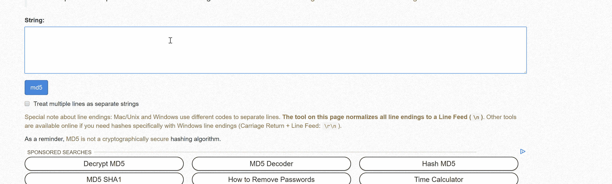

# 密码术、SQL 数据库和安全漏洞

> 原文：<https://medium.datadriveninvestor.com/criptography-sql-database-and-security-breaches-a1ad5f34191?source=collection_archive---------28----------------------->


“monitor showing C++” by [Dlanor S](https://unsplash.com/@dlanor_s?utm_source=medium&utm_medium=referral) on [Unsplash](https://unsplash.com?utm_source=medium&utm_medium=referral)

最近的脸书安全漏洞暴露了超过 5000 万用户敏感数据，但这只是大大小小的公司每天遭受的众多漏洞之一。

Adobe、Linkedin、Tumblr、Dailymotion 只是用户数据被曝光的几家大公司。这些数据库对于精通互联网并知道在哪里寻找的人来说并不难找到。当公司遭遇安全漏洞时，他们倾向于在公开这些消息之前等待。这暴露了许多用户的数据，此外，如果一个密码在不止一个网站中使用，则拥有这些数据的任何人都可以访问具有相同密码的所有其他网站。

每当我们注册一个网站，我们的数据被记录到一个数据库中，密码等敏感数据通常被加密，以避免在安全漏洞的情况下扩散。不仅是密码，还有地址、网站活动以及最终的信用卡数据。(我建议你在网上使用信用卡时使用 entropay，它会在每次与“paypal 风格”账户相关的交易中生成一个随机数，你可以从你的卡中充值……除了安全方面，自从我开始使用以来，我已经多年没有支付网飞了！)

有许多密码散列函数来摘要密码，最常见的有 MD5、SHA1、SHA2、SHA3。主要思想是所有这些函数都是不可逆的。使用这些函数之一，我们可以获得一个唯一的十六进制散列的“散列”。而且从同一个散列中，不可能反转算法并得到原始值。每个加密的字符串应该生成一个“足够唯一”的散列，它不应该被任何其他使用相同算法加密的字符串共享，但它可能会共享。这一点在 2005 年的 MD5 算法中得到了证明，尽管 MD5 算法已经被证明是最不安全的算法之一，但它仍然是最常用的算法之一。

你输入错误的密码并访问你的邮件的可能性是存在的。并且是 11579208923731619542357098500868790785326998465640564039457584007913129639936 中的 1 个，大约是可见宇宙中原子的 0.1%。因此，如果这发生在你身上，你应该玩彩票，或者每次你看到它时，你应该点击“你是第 1000000 个访问者”按钮！


两个街区:

```
d131dd02c5e6eec4693d9a0698aff95c 2fcab5̳8712467eab4004583eb8fb7f89 
55ad340609f4b30283e4888325̳71415a 085125e8f7cdc99fd91dbdf̳280373c5b 
d8823e3156348f5bae6dacd436c919c6 dd53e2̳b487da03fd02396306d248cda0 
e99f33420f577ee8ce54b67080̳a80d1e c69821bcb6a8839396f965̳2b6ff72a70
```

和

```
131dd02c5e6eec4693d9a0698aff95c 2fcab5̳0712467eab4004583eb8fb7f89 
55ad340609f4b30283e4888325̳f1415a 085125e8f7cdc99fd91dbd7280373c5b 
d8823e3156348f5bae6dacd436c919c6 dd53e2̳3487da03fd02396306d248cda0 
e99f33420f577ee8ce54b67080̳280d1e c69821bcb6a8839396f965̳ab6ff72a70
```

已经发现具有相同的输出:79054025255 fb1a 26 E4 BC 422 AEF 54 EB 4

所以如果你有 md5 系统，并且其中一个是你的密码，即使你输入了另一个也能登录！

有时使用所谓的“盐”对密码进行加密，以增加安全级别。salt 是添加到密码中的随机单词，用于从用作密码的所有相同字符串中生成不同的哈希。



如果 hash 是一个不可逆的函数，那么我们如何找到原始的字符串呢？嗯…找出密码的最好方法是…知道密码。

对字符串进行加密是一项绝对不消耗计算机能量的操作，因此黑客查找密码的方式是使用字典和规则，将这些文本字符串转换为哈希，并将其与哈希密码进行比较。如果匹配，该字符串就是密码。

最困难的事情之一是有一个好的密码字典，以避免重复和减少程序中的计算时间。

拥有高效的规则也很重要。大多数软件使用的基本规则基于最常见的密码模式。这些规则通常是:连接其他单词，在开头使用大写字母，在结尾使用数字和/或特殊字符，以及用特殊字符替换字母字符。

让我们以字符串为例:“密码”。

大写字母规则将创建另一个以大写字母开头的字符串。

密码

数字规则将在字符串末尾附加一个数字，例如:

密码 1

特殊字符将在末尾追加一个特殊字符，例如:

密码！

用特殊字符替换字母字符，例如:

p@ssw0rd

所有这些规则也可以一起应用。

在大多数解密哈希的软件中，也可以输入生成哈希的密码模式的建议。可以输入长度、数字位置和特殊字符。

但是，有一个好的字典可以节省大量的计算时间。前 10000 个密码被 98.8%的用户使用，并且每个人都可以访问。2017 年 11 月 4iq，一个扫描 darkweb 档案的网站发现了一个包含 14 亿密码的文件，这是真实数据库漏洞解密密码的最大档案，可以很容易地用作字典。

我目前正在参加一个面向 web 开发人员/软件工程师的训练营，在这一周里，我们听了关于如何通过查询在 sql 数据库中导航的讲座，以及关于 Ruby 字符串和数组的所有基本命令。对我来说，这似乎是一个很好的机会，可以用一种有趣的方式将这些观点结合起来。我用邮件和散列密码创建了自己的数据库，并用一个程序通过一些查询找到它们并“解密”。

```
require_relative '../config/environment'
require 'pry'
require 'digest/md5'def get_input
puts "What email are you looking for?"
gets.chomp
enddef search_hash_into_database(input)
Database.where(["mail = ?" , input])[0].hashed_password
enddef search_with_rules(hash)
    IO.foreach('file.txt') do |line|array=rule_for_a_word(line.split[0]).flattenarray.each do |x|
            if Digest::MD5.hexdigest(x) == hash
            puts "The password is #{x}"
            end
          end
    end
enddef rule_for_a_word(word)
  word_rules=[]
  word_rules << word
  word_rules << word.capitalize
  word_rules << word.upcase
  word_rules << [word].product(('!'..'@').to_a).map{|word,num_and_spec_char| "#{word}"+"#{num_and_spec_char}"}
  word_rules << word.gsub(/[aeoi]/, 'e' => "3", 'o' => '0', 'a'=> '@', "1"=>"!")
  word_rules
endinput=get_input
hash=search_hash_into_database(input)
search_with_rules(hash)
```

节目很丑！但是很管用！通过查询，它搜索用户键入的匹配邮件，读取该邮件的相应散列(散列密码)并存储它。该散列将与从 file.txt(我们的字典)转换成散列的每一行进行比较。前面描述的所有规则都适用于每一行(字符串)。如果有匹配，它将返回解密的密码并停止程序。

它基本上是这样做的:


我创建了另一个程序。它模拟密码中的模式建议。

```
require_relative '../config/environment'
require 'pry'
require 'digest/md5'def get_input
puts "Type the mail:"
gets.chomp
enddef search_hash_into_database(input)
Database.where(["mail = ?" , input])[0].hash
enddef introduction
puts "Type the hash suggestions using: \n"
puts "C for uppercase character, and c for downcase character, * for special character, n for number\n"
puts "For example: cCcncn*\n"
suggestion=gets.chomp
if suggestion.scan(/[cCn*]/).count !=suggestion.size
puts  "Invalid input\n"
puts "\n"
  introduction
end
suggestion
enddef parse_data(string)
  array=[]
  string.each_char do |x|
    if x=='c'
      array << ('a'..'z').to_a
    elsif x=='C'
      array << ('A'..'Z').to_a
    elsif x=='n'
      array << ('0'..'9').to_a
    elsif x=='*'
      array << ('!'..'@').to_a
    end
  end
  array
enddef vect_prod(array1,array2)
  array1.product(array2).map{|x,y| "#{x}"+"#{y}"}
enddef combination(array)
  x1=array.shift
  until array.size ==0 do
    x2=array.shift
    x1=vect_prod(x1,x2)
  end
  x1
enddef check_password(array,hash)
  array.each do |x|
    if Digest::MD5.hexdigest(x) == hash
    puts "The password is #{x}"
    end
  end
endmail=get_input
  hash=search_hash_into_database(mail)
  input=introduction
  array=parse_data(input)
  results=combination(array)
  check_password(array,hash)
```

也有可能采用另一种方法。给定一个字典(或一个包含最常用密码的文件)和它们的散列，创建一个程序来解密数据库中大多数匹配的散列。可能性是无限的。

我们的数据很容易遭到破坏，因此了解如何保护个人数据免受外部攻击非常重要。所以…是的，永远不要摘下你的锡纸帽子，对不同的网站使用强而不同的密码！


我在训练营的第一周，全班参加了一个集体活动，一个“破冰”练习，以更好地了解彼此。小组中的一个人应该说一些关于他自己的真实想法，无论是谁，只要有同样的想法，都要站出来。在某个时候，在练习过程中，一个学生说他秘密地梦想拥有超能力。房间里的每个人都立即站了起来。我觉得挺有意思的。

我们生活在一个超级大国确实存在的时代。当我们的生活与互联网紧密相连时，我们创造了超能力。我们大多数的日常行为/任务都直接或间接地使用互联网。如果我们认为超级大国是一个超级用户，能够获得对大多数人来说是不可能的东西，那么很明显他们是存在的。我们不断地将个人数据插入到我们正在创造的“人类集体意识”中。

我们可能无法读懂别人的思想，无法隐形，也无法绕着地球飞得如此之快，以至于让地球朝相反的方向旋转，并回到过去改变事件的进程。尽管如此，通过一个人的数据对他的了解还是有可能超过他对自己的了解。当一个人认为自己孤独的时候，通过他的设备观察他是可能的，改变人们对事件的看法是可能的，这对于实际改变事件的进程没有任何意义。

超能力是真实存在的，人们应该知道如何保护自己。谁拥有超能力，谁就应该知道“伟大的力量带来伟大的责任”。

要检查您的邮件是否被列入违规数据库，请访问[https://hacked-emails.com/](https://hacked-emails.com/)或[https://haveibeenpwned.com/](https://haveibeenpwned.com/)