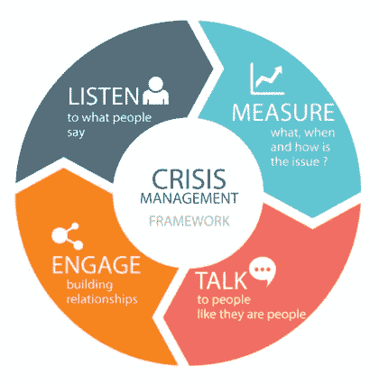
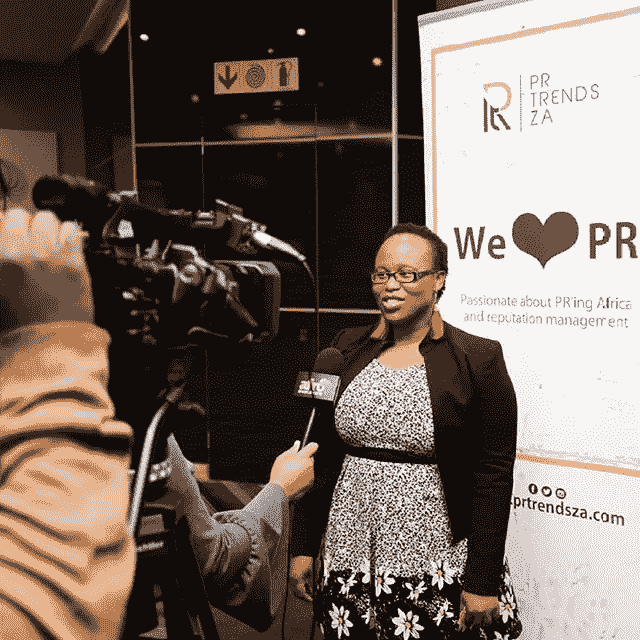
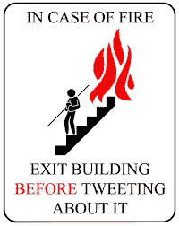

# 危机管理在“飞机”上飞行真相

> 原文：<https://medium.datadriveninvestor.com/crisis-management-flies-on-plane-truth-7bec6139921?source=collection_archive---------11----------------------->

## 公共关系和新闻业可以挽救声誉

当一架[埃塞俄比亚航空公司](https://twitter.com/flyethiopian) 737 Max 在起飞后不久坠毁，整个国家陷入危机。首相通过广播安抚处于困境中的人们。

在混乱中，[内丽莎·恩古拉娜](https://twitter.com/Neli_Ngqulana)如鱼得水。她热爱新闻，危机管理是她最喜欢的话题。这时，她就可以集中自己的公共关系和沟通经验。

她创办了一家“帮助客户理解公关和沟通的战略价值”的公司。这是他们品牌成长和建立良好声誉的关键。”

“就职业而言，我是一名公关和媒体从业者，在新闻和公关之间找到了一个舒适的位置，”Ngqulana 说。

她主持了《非洲交流周》的南非版，是摩羯座 FM 周五早餐秀、社交媒体新闻的定期撰稿人，也是 SABC 网络和 SAFM 的公关评论员。

 [## 从语音到对话的飞跃:人机交流的挑战

### 机器人无处不在，几乎无所不在。我们甚至已经开始与他们交谈，在这种情况下…

www.datadriveninvestor.com](https://www.datadriveninvestor.com/2018/08/02/making-the-leap-from-speech-to-dialogue-the-challenge-for-human-to-machine-communication/) 

Ngqulana 还接受了非洲推特网的采访，重点讲述了当灾难发生时，一个组织的危机历史如何影响公众的看法。

# 关系建立信任

“声誉很重要，”她说。“这决定了你的品牌会被如何看待。如果人们对你普遍持积极态度，你的记录会说明一切。与不同的公众建立关系可以帮助你度过危机。

Ngqulana 说:“你的公司文化、你的沟通能力和你的领导的正直也会让你在危机中处于有利地位。”

 [## 企业文化的未来就在现在

### 想窥探未来的工作吗？吉姆·奈特说没那么快。企业家应该认真看看哪里…

medium.com](https://medium.com/datadriveninvestor/corporate-cultures-future-is-now-2f7fd6bfcaa1) 

作为新的例子，她对比了人们对航空悲剧的反应。

“看看波音公司对埃塞俄比亚航空公司飞机失事的反应，”Ngqulana 说。“波音公司以前来过这里。他们的反应没有改变。他们不明确的回应是可以预见的，也没有帮助。

“埃塞俄比亚航空公司采取了不同的方法，”她说。“他们承认坠机事件。这定下了基调，他们的品牌成功地经受住了这场风暴。下次危机爆发时，我们更有可能站在他们一边。”

在信任方面，波音不知不觉地让竞争对手占了上风。

“当然，”Ngqulana 说。“在这种情况下，这场悲剧也教会了许多乘客理解航空公司和飞机制造商的责任范围之间的区别。这对航空公司来说是件好事。”

从某种意义上说，当一个品牌拥有极佳的口碑时，即使是在危机中，也会有粉丝在仇人面前作为支持。

“我们在名人身上看到很多这样的事情，”Ngqulana 说。“你知道如果你敢说他们最喜欢的东西的坏话，Beyhive 就会来找你。你什么时候听过碧昂斯回应关于她自己的负面戏谑了？”

# 诚实的交流

无论问题有多糟糕，双向沟通都是必不可少的。

Ngqulana 说:“在危机期间，对话是必要的。“考虑公众利益高于利润。因此，与你的公众进行真正的对话。

“当然，在危机期间，你不可能关注社交媒体上的每一条帖子，”她说。“然而，要明白你需要倾听和回应谁。积极应对危机。回答问题，继续前进。回避问题或者坚持自己是对的都无济于事。听着。回应。”

 [## 公司的成功取决于公关…不管他们是否知道这一点

### 企业家的生存依赖于公共关系，不管他们叫它什么名字。对许多企业主来说，公共关系是一个…

medium.com](https://medium.com/datadriveninvestor/companies-success-depends-on-pr-whether-they-know-it-or-not-bc160bb5eb3a) 

根据 Ngqulana 的说法，对话应该基于以下标准:

*   要及时——不要给谣言或虚假信息留下空间。
*   富有同情心——考虑受影响者的感受。
*   诚实——真相会让你自由。
*   信息丰富——用事实引导。
*   要互动。

Ngqulana 说:“你必须在危机中带路。”“拥有它，人们会跟随你的领导。不要回避它。否则，你的品牌声誉会受到打击。”

她并不热衷于利用营销人员或有影响力的人来宣传一个品牌以修复其形象的可能性。

“你可以尝试这种方法，但这意味着必须管理一群发布你信息的人，”Ngqulana 说。“我还是要说，领导并拥有你的故事。一旦危机平息，你可以利用你的数字营销人员和影响者来帮助你重建后危机时代。”

随着危机的加剧，公众希望看到一张自信的脸。

Ngqulana 说:“最佳代言人是由公司面临的危机的严重程度决定的。”“根据危机的类型，最资深的人——比如首席执行官——可能在一开始就需要。最重要的是，本组织的信息需要保持一致。”

她回到了航空公司的例子。

“让我们再来看看埃塞俄比亚航空公司的坠机事件，”Ngqulana 说。总理阿比·艾哈迈德是唯一的信息来源。它向你展示了这场危机有多严重，以及航空公司处理危机的认真程度。它的反应值得最高的办公室。

“在危机中通常的顺序是首先，反应，”她说。公关专家可以承认危机。然后，主题专家提供清晰度和技术细节。然后，你可以把首席执行官带出来，让他感同身受，让他放心。”

# 通过发言人测试

Ngqulana 建议[看一段视频](https://www.youtube.com/watch?v=q4dvYoZkUho)，看看首席执行官是否是危机期间最好的发言人。

“去年，南非保险品牌 Momentum 因拒绝一项人寿保险索赔而面临巨大的公众抗议，”Ngqulana 说。“虽然他们有明确的法律依据，但他们的首席执行官在接受媒体采访时缺乏同情心，弊大于利。他们最终付出了代价。”

她指出，当脸书面临《剑桥分析》丑闻时，马克·扎克伯格是如何维护自己的:

“我创办了脸书，我管理它，我对这里发生的一切负责，”他说。

 [## 沟通面临严峻形势

### 在危机期间，良好、清晰的沟通是必不可少的——尤其是当事件蔓延且看不到尽头时…

medium.com](https://medium.com/datadriveninvestor/communication-confronts-critical-condition-31a3fa17eea) 

《福布斯》的一篇文章提供了另一个危机管理的例子:“ [*脸书和星巴克*](https://www.forbes.com/sites/robertglazer/2018/04/26/lessons-in-crisis-management-from-facebook-and-starbucks/%22%20%5Cl%20%2244e356bf56c8) 的危机管理经验。”

Ngqulana 说:“让我们从埃塞俄比亚航空公司以及他们处理飞机失事悲剧的方式中吸取教训。”“他们的危机管理非常有效。该品牌一直保持强势。[旅行者和合作伙伴仍然和他们在一起](https://www.africanews.com/2019/03/20/travelers-and-partners-keep-faith-with-ethiopian-airlines/)。

她认为有必要教那些需要承担责任的人如何站出来。

“教学的一部分包括媒体培训，”Ngqulana 说。“当人们在摄像机前感到舒适时，他们可以专注于信息传递。在危机期间，这可能非常关键，因为情绪已经很高了。”

最好的危机应对始于计划。

“应对危机没有唯一正确的方法，”Ngqulana 说。“危机各不相同，发生危机的环境也各不相同。

“然而，当危机来袭时，最好的办法是承认危机的存在，”她说。“倾听并向人们保证你正在调查并努力解决这个问题。谦逊和诚实会拯救你。还记得去年美国国会前的马克·扎克伯格吗？”

# 当心罪恶

Ngqulana 还引用了《福布斯》的一篇关于如何不犯危机管理七宗罪的文章。

“在真正的危机到来之前，制定一个危机应对计划是很重要的，”她说，并列出了以下步骤:

*   定义危机对你的组织意味着什么。这些事情会影响销售和利润；声誉和运营。
*   选择一个响应团队。
*   制定你的应对策略。
*   向你的应急小组汇报。
*   准备好你的信息。

 [## 在 280 个字符或更少的字符中导航混乱

### 危机不可避免。你不知道它从哪里来，从什么方向来，但是聪明的企业家必须…

medium.com](https://medium.com/datadriveninvestor/navigating-turmoil-in-280-characters-or-less-1043c9207789) 

Ngqulana 承认，让埃塞俄比亚总理参与飞机失事应对是危机管理计划的一部分。

“是的，这很可能是他们计划的一部分，”她说。“那种悲剧需要最高的办公室。记住，这家航空公司是由埃塞俄比亚政府拥有的。最终，首相不得不带头。他的同情和真诚很有帮助。

“真相会让你自由，”Ngqulana 说。“被遗漏或故意误导的谎言会反过来咬你一口。你会为自己创造更多的工作。相反，要诚实。不知道就说不知道。说‘我会带着答案回来’没有错。"

企业主依赖于度量标准，这延伸到衡量他们的团队处理危机的能力。Ngqulana 说，这些因素将有助于衡量效率:

*   测量你的输出。你的信息发出去了吗？他们是如何被接受的？委托投票。打电话。
*   你的信息有什么影响？你左右了公众舆论吗？
*   从长远来看，这场危机有什么影响？它是否影响了股东价值、员工信心和员工流动率？

# 安然度过逆境

一项关键指标显示，埃塞俄比亚航空公司的[品牌在 T3 坠机事件后依然保持强势。](https://www.africanews.com/2019/03/13/ethiopian-airlines-brand-remains-strong-after-plane-crash-boeing-falters/)

Ngqulana 说:“让我们在该表扬的地方给予表扬。”“希望其他政府能从他们的领导中吸取经验。

“请交战。当然，”她说。“没有什么比谦逊和拥有更好的了。最简单的方法是承认存在问题，他们会调查此事，并向家属表示哀悼——特别是因为这不是第一次因类似故障而发生的事故。”

Ngqulana 用总理的例子说，一个组织的董事会主席可以成为危机时刻的发言人。

“没关系，”她说。"董事长能很好地传达他们的信息，公司必须对此感到满意。"

**关于作者**

吉姆·卡扎曼是拉戈金融服务公司的经理，曾在空军和联邦政府的公共事务部门工作。你可以在[推特](https://twitter.com/JKatzaman)、[脸书](https://www.facebook.com/jim.katzaman)和[领英](https://www.linkedin.com/in/jim-katzaman-33641b21/)上和他联系。

*原载于 2019 年 3 月 26 日*[*www.datadriveninvestor.com*](http://bit.ly/2uqLTJK)*。*