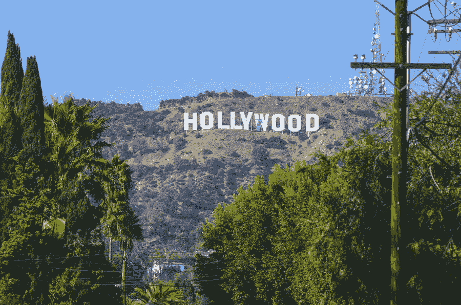
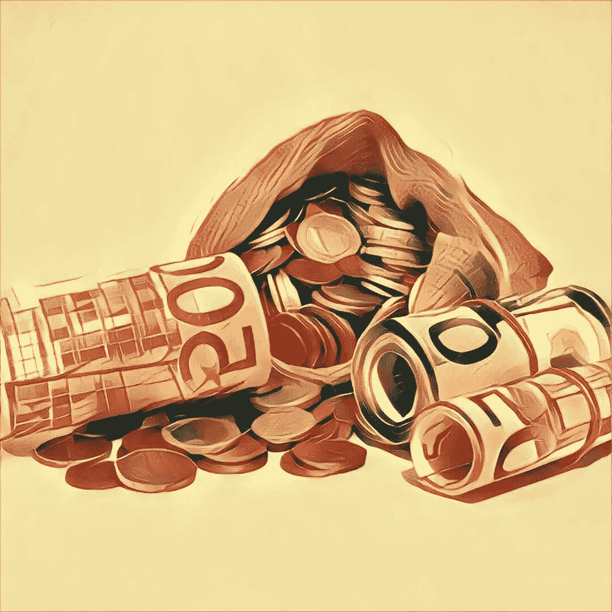

# 第二波 ICOs 危机

> 原文：<https://medium.datadriveninvestor.com/crisis-of-the-second-wave-of-icos-1f4fd1e94812?source=collection_archive---------3----------------------->

去年年底，分析师预测，由于大型机构参与者的参与，2018 年 ICO 市场将迎来前所未有的繁荣。事实也确实如此。

# 塔塔图的成功

2018 年前五个月，ICO 吸引了约 140 亿美元，大约两周前，塔塔图项目在私人代币预售中筹集了 5.75 亿美元，成为继 EOS 和 [Telegram](https://cryptocurrencyhub.io/will-the-ban-of-telegram-raise-the-price-of-ton-3668ff03f67d) 之后第三大成功的 ICO 项目。

值得注意的是，塔塔图，现在被认为是网飞的主要竞争对手，在 ICO 之前几乎没有投入任何精力和金钱做广告。该项目没有社交媒体账户，没有流行的加密货币资源广告，其在 ICO 追踪器上的评级低于平均水平。尽管如此，塔塔图还是成功吸引了大型投资者，其中包括卢森堡王位第二继承人费利克斯王子、来自百加得有限公司所有者家族的莫尼卡·百加得女士以及 BlockTower Capital。

TaTaTu 的巨大成功对加密货币社区来说是一个巨大的冲击，许多专家仍然认为该项目有风险。

在我看来，TaTaTu 可以被认为是加密货币市场正在发生的变化的一个强有力的指标。

1.  炒作的时代已经过去了，现在 ICO 项目的目标不是吸引大量的小投资者，而是让大型机构投资者参与进来。
2.  推出 ico 的项目看不到大规模营销活动的意义。相反，他们专注于演示和与投资者的个人会面。
3.  从专家和顾问开始，到资源和追踪器结束，加密货币社区的影响力正在下降。

> 我想谈谈第二点，因为我认为这是该行业的一个严重问题。

# 第二次浪潮的 ico 营销

如果早期的项目追求追踪器的增值，并试图吸引大量的流量到他们的资源，现在进行 ico 的方法已经改变了。创业公司并不急于推出他们的 ICO，因为如果没有至少一个大型投资者的参与，一个 [ICO](https://cryptocurrencyhub.io/icos-have-collected-7-4-billion-in-2018-dont-exult-9f182c801003) 很可能注定会失败。

TaTaTu 的例子表明，大投资者对营销战略或 ICOBench 评级不感兴趣，他们关注的是公司的商业计划和产品开发，以及最终它将在未来带来的利润。

成功的项目没有对社交媒体定位或营销策略投入足够的关注，这一事实实际上表明了加密货币社区的危机以及对行业权威日益增长的怀疑。这与其说与炒作已经不再是 ICO 成功的关键因素有关，甚至与疯狂的广告价格无关，不如说与这个领域没有真正的专家和权威有关。每个人都明白这一点。

2017 年的大肆宣传让我们习惯了这样的想法，即 ICO 领域充满了轻松的钱，与从头开始可以筹集的数百万美元相比，在 Cointelegraph 上发表一篇文章花费几千美元只是一件小事。“顾问”和“专家”是那些成功(甚至不成功)推出至少一个 ICO，并在不同加密货币论坛上扮演演讲者角色的人的头衔。

现在，花钱购买高 ICO 追踪器评级和加密货币频道的视频评论似乎是一个愚蠢的想法，因为实践表明，大型投资者不会认真对待此类广告。即使是参与一个“在加密货币界很知名”的人的项目，也完全不能保证一个 ICO 的成功。更重要的是花费资金和精力来创造一个高质量的 MVP(我不是只说 [FairWin](http://fairwin.io/) ，其他创业公司也这么做)。

*专业分析师和 ICO 专家的短缺是一个严重的问题，每当 FairWin 因缺乏顾问而受到批评时，我都会想到这个问题。*

# 跟着我们

推特:【https://twitter.com/FairwinGambling
T4:[https://www.facebook.com/fairwin.gambling/](https://www.facebook.com/fairwin.gambling/)
insta gram:[https://www.instagram.com/fairwin_team/](https://www.instagram.com/fairwin_team/)

# 与我们聊天:

不和:[https://discord.gg/Hbardp2](https://discord.gg/Hbardp2)Reddit:[https://www.reddit.com/user/fair-win](https://www.reddit.com/user/fair-win)电报:[https://t.me/fair_win](https://t.me/fair_win)