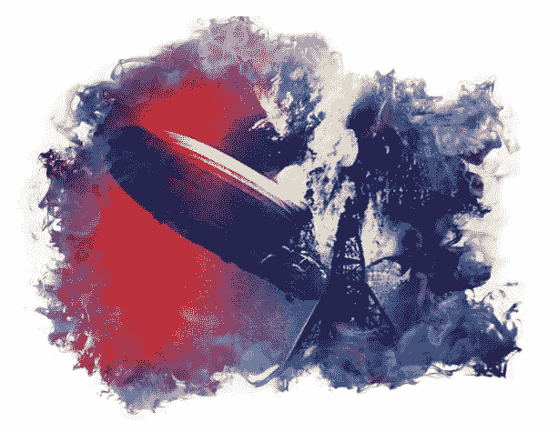
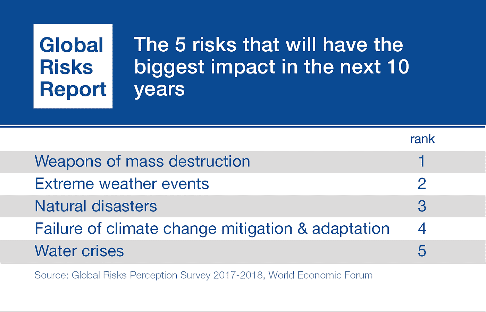
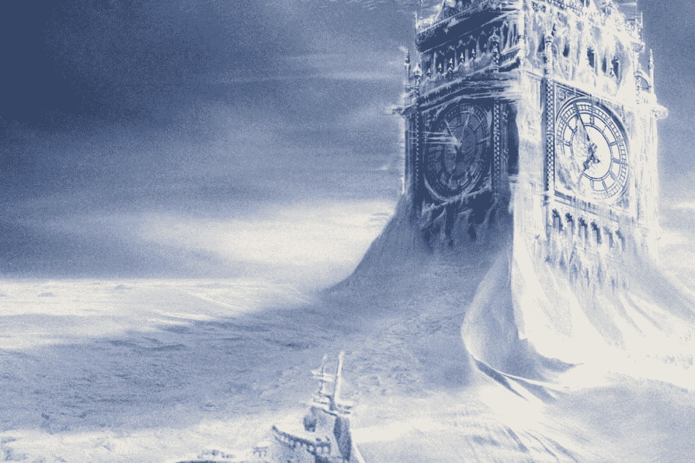

# 危机促进变革

> 原文：<https://medium.datadriveninvestor.com/crisis-precipitates-change-1df2a0483173?source=collection_archive---------33----------------------->

我 94 岁的祖母认出了飞艇的名字，尽管似乎时常忘记我是谁。有趣的是记忆是如何工作的，我最后一次清晰的记忆可能是一位高中体育老师在世贸大厦倒塌后说的话；“我们要开战了！”。兴登堡危机和 911 危机都是通过创造持久的根深蒂固的记忆来促成变革的。这种记忆在众所周知的宿醉消退后还会持续很久。

在这篇文章中，让我们看看一个公司的危机是如何带来好的改变，比如结束危险的氢飞船旅行，或者带来坏的改变，比如卷入一场打不赢的战争。

在思考人力资源的未来时，我会问自己，下一个改变人生的重大危机会是什么，未来的人力资源领导者会如何处理这场危机。

我们生活在非常动荡的时代。似乎每天都有媒体提醒我们新的威胁或新的危机。根据世界经济论坛，世界面临的最有可能产生改变生活的危机的风险首先是核武器，然后是气候变化。

可以说，突发的气候变化事件可能是未来人力资源专业人士需要适应的下一个改变人生的危机。根据忧思科学家联盟的说法，“2004 年有一份五角大楼的报告披露了一种情景，即人类引起的全球变暖导致海洋温盐环流的短期崩溃，这将温暖的表层水从热带带到北大西洋，使西欧部分地区变暖。作者提出了巨大的影响，包括欧洲的快速降温，许多重要的农业和城市中心的降雨量大幅减少，以及随之而来的食品供应和水供应的中断，这些都具有巨大的地缘政治和安全影响。”

未来的人力资源领导者将如何处理这种潜在的情况？我认为人力资源领导角色将变得更加重要，不仅对公司的生存如此，对员工的生存也是如此。在之前的一篇文章中，我提到亚马逊有 566，000 名员工。当成千上万的人没有食物和水的时候，亚马逊袖手旁观会吗，我希望不会。乐观地说，我希望人力资源部能说服高层管理人员认识到，如果不采取措施稳定员工的生活，将会出现混乱，而且没有利润可言。

第一个月会有多疯狂，首先，最脆弱的员工不打电话不露面，因为他或她有一个与喂养或向他们的家人提供水有关的危机。然后，50 名员工出现在你的门前，询问公司能帮上什么忙。然后办公室的水被切断了，你用卡车从仓库运水来作为临时的补救措施。我觉得这才是真正的 HR 领导者出现的点。扑灭员工的火是 HR 领导每天都要做的事情，但是这种类型的火需要一个特殊类型的 HR 领导。一个有创造力、勇气和决心的人。

尽管气候突变可能不会在未来十年或二十年内发生，但对于世界各地的人力资源领导者来说，制定某种计划来应对潜在的改变生活的危机将是一个很好的做法。我们不想被抓到依赖美国政府来拯救我们。看看在新奥尔良发生的事情，当时我们完全依靠政府来拯救卡特里娜飓风中最脆弱的人。

突发气候变化事件可能带来的长期积极变化可能是一种趋势，即企业在州政府和联邦政府失败的情况下大踏步前进。可能的长期负面变化可能是一种趋势，我们开始回到公司镇的时代。公司城是这样一个地方，几乎所有的商店和房屋都归一个公司所有，这个公司也是主要的雇主。

没有什么比在准备不充分的情况下参战更容易失败的了 —查尔斯·林德伯格