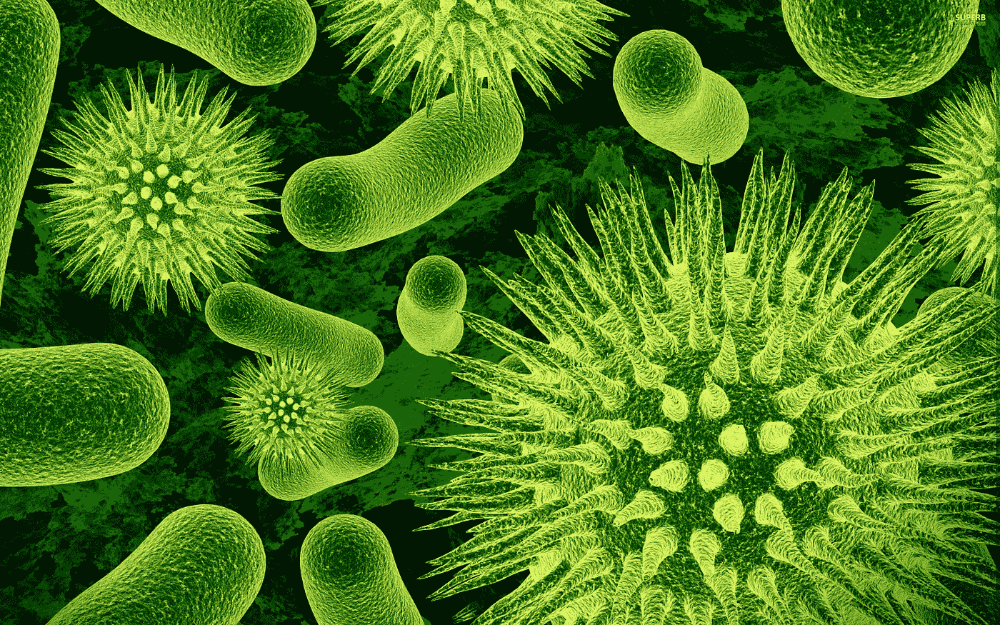
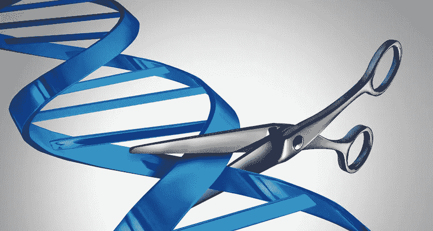
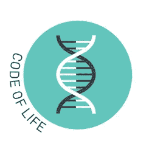

# 克里斯普:作品，问题，含义

> 原文：<https://medium.datadriveninvestor.com/crispr-the-works-the-problems-the-implications-2911d3b01ccd?source=collection_archive---------0----------------------->

> 这是对 CRISPR Cas9、其问题和含义的简要概述。

难道你不希望我们能从其他动物身上挑选一些品质，并把它们移植到我们身上吗？我是说，那该多酷啊？嘿，想成为尤塞恩·博尔特吗？没问题，这里有一些猎豹的 DNA，你很好。想要肌肉？取一些熊的 DNA。想飞吗？我抓到你了，这是一些鸟的 DNA。

我是说大自然已经做得很好了。既然已经为我们做好了，我们为什么还要进步和做跑腿的工作呢？这是一个很酷的概念。

不幸的是，在我们考虑移植其他动物的 DNA 之前，我们必须解决一个更严重的问题。

**遗传病。**

有些人有特殊的基因，使他们比普通人更容易患某些疾病。在某种程度上，这几乎是不公平的，因为无论你饮食或锻炼得多好，你的基因都会毁了你。

> 解决方案就在你眼前。细菌。

多年来，细菌一直受到病毒的攻击，这些病毒试图将它们的 DNA 植入细菌，并基本上感染宿主。在这一点上，细菌释放出它的一条防线，CRISPR 机制。

大自然又一次做了调查。我们只需要理解蓝图并拥有复制蓝图的技术。

CRISPR 基本上切断了病毒的 DNA，使其变得无用，有效地关闭了劫持者。

> 如果同样的过程可以用来剪掉“坏”基因并插入好的基因会怎么样？

**在我解释 CRISPR 如何工作之前，先介绍一点背景知识**

CRISPR

**C** 发光 **R** 均匀 **I** 输入 **s** 步距 **P** 同步 **R** epeats

这本质上意味着 CRISPR DNA 以一种重复的模式被写在一个由间隔区包围的回文序列中。

*回文*——从左到右和从右到左阅读相同的单词或序列。比如 ATAGAGATA 就是回文。

关于分隔 CRISPR 的 DNA 的间隔区，有趣的地方其实是过去攻击细菌的病毒的 DNA！

这就像他们自己的小备忘单，知道哪种病毒意味着危害。

一点小提示。

基因有组成 DNA 的碱基。某些碱基因为它们的键之间的吸引力而与其他碱基配对(它们就像小磁铁一样)。

## CRISPR Cas9 的 5 个简单步骤

就拿这个例子来说，假设我们把 CRISPR 放在 Bob 体内，他有癌细胞，我们试图摧毁它

1.  科学家们确定了他们希望在鲍勃体内替换的癌症基因，并建立了一个称为指导 RNA (gRNA)的互补基因序列，其中包含与癌细胞结合所需的碱基。如果操作得当，互补基因序列应该能够与肿瘤结合。
2.  这个基因工程 gRNA 与 CRISPR 细胞中的 Cas9 蛋白形成了一个蛋白质复合物(基本上在生物水平上形成了一个“团队”)。gRNA 的一端卡在创建的蛋白质复合物中，另一端伸出来与 DNA 相互作用，并被癌症基因“吸引”。
3.  当每一个碱基对与癌症匹配时，gRNA 激活 Cas9 蛋白，然后包裹基因，并伸出微生物钳子切割 DNA。

The gRNA acts like scissors cutting DNA.

4.这一步不适用于人类，但适用于细菌。这是细菌获取病毒 DNA 并将其插入间隔物以备下次记忆的地方。

5.现在，我们不能让 DNA 断裂。这是科学家修复人类 DNA 的地方。他们通过基因工程设计出正确的序列来代替目标的 DNA，并插入一个修复模板，该模板由我们刚刚取出的基因上下的基因组成。

请在下面评论，如果我让你感到困惑，我会尽我所能来消除任何困惑。我很抱歉。

## CRISPR Cas9 的问题

1.  我们 DNA 中微小的变化，也就是让我们与众不同的东西，可能会导致互补序列不匹配，或者更糟的是，会切割掉我们不想切割的东西。
2.  来自步骤 5 的正确 DNA 没有及时结合到目标的风险。当细胞注意到 DNA 受损时，它会试图修复它。细胞不知道基因是被插入还是被删除，所以它随机选择一个。这个过程被称为非同源末端连接(NHEJ)，而突变被称为 indel。
3.  我们并不完全了解基因组。取出甚至插入基因可能会导致细胞化学发生变化，或者发生其他不可想象的事情。每个化学代码产生不同的“化学物质”。ATA 不同于 ATG。替换它可能是致命的。

## CRISPR 的含义

1.  编辑作物，使其更有营养，并适应不同条件下的生长。这可能结束粮食不安全问题，因为我们可以设计植物在更热的条件下或更少的水下生长。
2.  灭绝物种的复活是可能的。巨型水獭，长毛猛犸象，恐龙。想想侏罗纪公园。
3.  身体的最终优化。根除遗传疾病，完善免疫系统，更好地改变大脑结构。

> 我们可以给生命编码。多酷啊。！

Programming life.

CRISPR 目前肯定有它的问题，但要解决这些问题还需要很长时间。

已经有人在谈论 CRISPR 的首次人体试验。

我们将回头看看像 Python 这样的编码语言，看看它们的效率有多低。当你可以编码你的大脑更快时，为什么要浪费时间优化一台计算机？

生命的密码。再加上 AI。再加上数以百万计的创新。

这真的很神奇。我们能改变世界多少…

如果你有任何困惑，请在下面评论。

联系我:anishphadnis.ca@gmail.com

在 Linkedin 上与我联系:[安尼施·帕德尼斯](https://www.linkedin.com/in/anish-phadnis-ab3149149/)