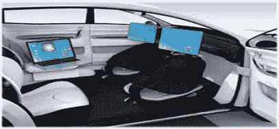

# 自动驾驶汽车的跨行业联盟

> 原文：<https://medium.datadriveninvestor.com/cross-industry-alliances-for-self-driving-cars-bba88ee62954?source=collection_archive---------25----------------------->

普华永道 2016 年的一项创新研究发现，汽车行业是 R&D 第三大支出行业，仅次于医疗保健、软件和电子产品。

这无疑是汽车行业技术进步速度背后的主要原因。随着大量资金的投入，像谷歌、特斯拉、优步和苹果这样的公司急于展示他们的竞争优势来增加销量，在竞争中领先推出新技术。现在，除了自动驾驶，用户还能期待他们未来的汽车有什么？

New Mobile Office

基于我们与在线网站和应用程序共享的数据量，将会有大量的个性化服务。如果他/她选择在全自动驾驶汽车中娱乐，他/她可以体验他/她最新的 Spotify 精选和其他社交媒体应用程序。对于商务旅行者来说，甚至不需要拿出笔记本电脑，因为新车将内置工作站，将用户连接到他们喜欢的网站。谷歌汽车甚至可以让乘客在驾驶时使用新兴人工智能功能(文本到语音响应)的语音交互，享受他们工作和项目的更新。这将为经理们提供即时回复工作信息的机会。

> DDI 编辑推荐——我们的最终发明:人工智能和人类时代的终结，作者詹姆斯·巴拉特

美国、英国和加拿大对自动驾驶汽车的测试给予了更多支持。这些车辆在我们的道路上行驶的现实很可能会早于 2025 年。目前，从 2016 年起的汽车都有辅助驾驶或自动驾驶功能。它帮助许多紧张的司机在开车时更加放松。在危险的情况下，比如暴风雪，摄像机可以比我们更准确地探测到另一辆车的接近。

Cross-industry alert

自动驾驶汽车的新时代将使用车对车通信。这将为我们的道路上发生的事情提供更多的记录镜头，以帮助政府和公司实时规划交通需求。GPS 已经可以用来计算到达目的地所需的时间，并提供实时交通信息。

自动驾驶汽车依赖于汽车制造商、电信提供商和技术制造商之间的跨行业联盟。这些公司从事的合资企业正在迅速增加。当最有技术能力的力量发生碰撞时，那些还没有获得合作的公司最终会失败。