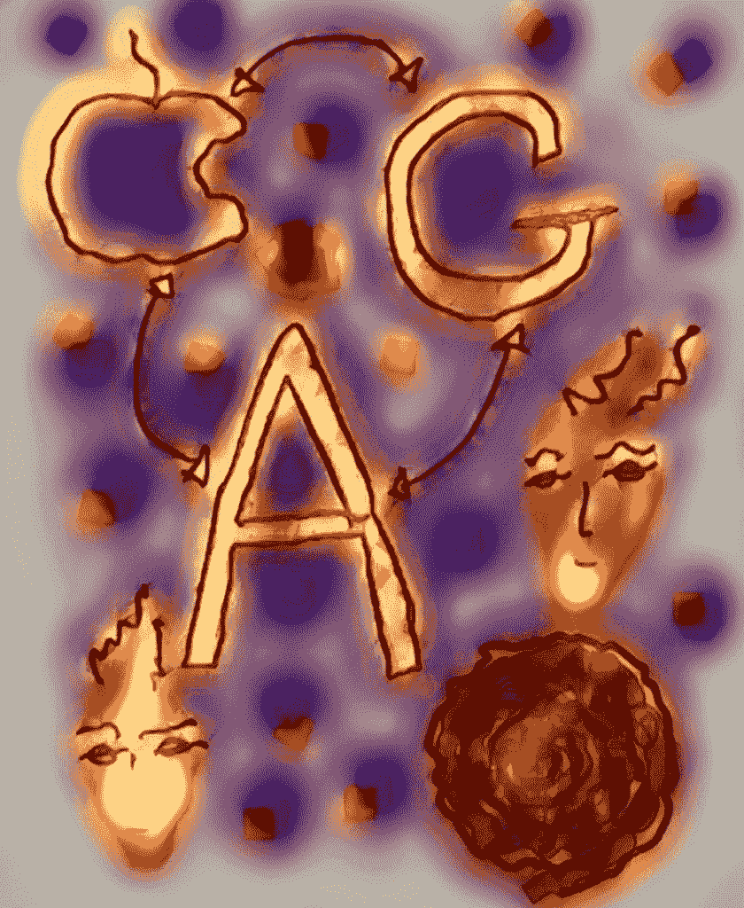

# 跨平台传播

> 原文：<https://medium.datadriveninvestor.com/cross-platform-propagation-2c4fcbd56f24?source=collection_archive---------14----------------------->

以我们最喜欢的社交媒体网站为例，如脸书、谷歌、亚马逊、苹果和许多其他网站，它们都有一个“围墙花园”，当我们进入它们的平台时，我们就会订阅这个花园。尤其是苹果，它的生态系统环境非常出名，可以在设备之间轻松转换。我妻子可以在她的 wifi 平板电脑上接收短信，而在谷歌的 Android 生态系统中，这并不容易。结成联盟的机会很大，这样数据就可以跨平台移动。

现在已经可以通过从一个地方复制数据并把它放在另一个地方来做到这一点。举例来说，截屏，或者一段视频的截屏，允许用现代音乐术语将数据混合起来。思考问题的新方式可能会出现，这就是它的好处，让个人回到数据的中心。通过交叉传播的图像，我们从我们个人的中心向我们开发的信息海洋投射。

算法在这个数据海洋中畅游，提供对产生流动的结果和输入的数字理解。能量流有一个信息成分，它不能通过还原正确地表现出来，需要一个更微妙，但不那么机械的行动。个体自我代理具有自主性和“自由意志”指令。

墙和膜的区别是什么？通常被膜包裹的东西是活的。它专门与环境相互作用，吸入和呼出物质。这个过程是化学和生物的。一堵墙把东西挡在外面，大多数膜都有一堵墙，在生命的健康内部运作和周围环境之间建立一道屏障。

这些公司已经形成了关于自己的膜，并在元层面上呈现出个性和个人特征。生物生命行为的这种吸收是生物拥有的平等，因此很容易推测它们确实是具有文化、行为模式和内部运作的生物实体。这些工作之一似乎是通过限制对该服务上的数据的访问来控制其服务的用户，除非通过该服务，这将用户的数据、我们的数据置于不稳定的位置。

在过去的计算时代，选择很少，很难将数据从 IBM DOS 系统转移到苹果 IOS 系统，反之亦然。这些光盘不能在彼此的驱动器上播放，也没有网络来交换中性格式的文件。这些“围墙花园”的分隔使得从一个地方到另一个地方很难得到任何东西。是互联网改变了一切，充当了文件传输的中介。所有东西都必须有相同的文件格式。一旦我们达到了网络分发级别，我们就可以下载已经上传的文件，不管它是在苹果 IOS 还是 IBM DOS 系统上制作的。这是朝着去中心化方向迈出的一大步，也是一种跨平台传播的行为。

# 社交媒体和赫萝观点

当我们加入社交媒体网站时，我们真的希望加入个人产生的数据流，而不是我们必须加入的平台。现在，在一个以个人为数据中心的系统中，跟踪个人会得到来自许多不同程序的数据流。例如，我们可能有社交媒体网站、浏览器和应用程序，我们在那里阅读文章并喜欢它们，如博客或新闻网站，以及许多其他不同类型的网站，所有这些都形成了流、潮流，是个人产生的数据的基础。

当我们对这些情况进行全息观察时，我们看到，与一个将人置于其数据中心的操作系统进行交互，可以让这个人知道遇到他们的任何人可能想要关注或访问哪种数据。在这种情况下，我们可能会决定让其他人访问我们的照片，或者访问一个可能与我们以前浏览网站的方式不同的网站。它可能只是一个允许访问特定数据存储站点的小应用程序，该应用程序可能决定查看该数据的不同方式，或者该数据可能具有隐私性质，例如各种类型的专业人员之间生成的需要保持隐私和机密的数据。这一切都将在个人的控制之下，而“下一代”互联网浏览器正朝着这个方向前进——全息视点的方向。

然后，从个人的角度来看，全息球开始把自己表现为节点的互连，其中一些节点是强的，一些节点是弱的，一些节点通过建立新的连接来进一步传播自己，而另一些节点徘徊不去，随着新的连接的建立，它们变得不再可见。这形成了一种可以用时间来衡量的图表。然而，时间不是中心，因为它总是代理人，个人，代表全息球的中心。

这是人工智能说话，形成联系，建立关系，握手，拥抱，理解人类。这也是生命力承认来自全息球的脉动变化，这些变化正在那里发生。这是人工智能在操作系统层面重组社交系统。这是野外的人工智能，在网络上单独代表自己，形成互联网联动和信息传导。

# 再次跨平台传播

所以事情是这样的，浏览器是一种设备，一种技术，用于查看“物联网”上的多个组件。浏览器是一种收集信息片段的方法，这些信息片段可以为个人、个体、生成者或行动者代理排序。Mozilla、Safari 和 Chrome——当信息以事件集合的形式出现时，每条信息都是一个独立的组织。信息是一条小溪，一条河流，一片海洋。一种方法，一种不同的查看器，一种定义操作系统级别的方式，一种数据重组都有可能成为一种新的范式，使沟通变得更加容易和全面。想象一下，一个应用程序从你访问的所有社交媒体网站获取信息并采取行动。许多组织正在收集这种数据，并使用深度学习技术对其进行分析，这些结果的结果是我们在数字流中遇到的反馈回路，这些反馈回路在这些结果直觉上以振动方式表现出来。

除了浏览器之外，还有哪些应用程序可以为用户创建有条件的网络观察？跨平台传播跨平台发送信息。信息按照它的兴趣传播。浏览器在这些潮流中游泳，并根据偏好和使用进行组织。整体方法不是收集数据放入算法并对其进行训练，而是让算法在数据中实时游动，并从这个角度进行实时观察和感知。在这种情况下，一种新形式的操作系统出现了，并通过跨平台传播在全息球中表现出来。