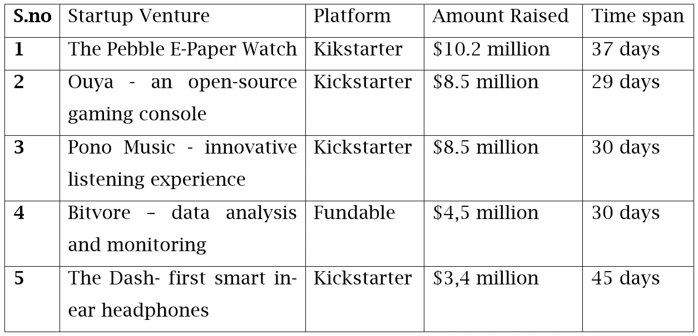
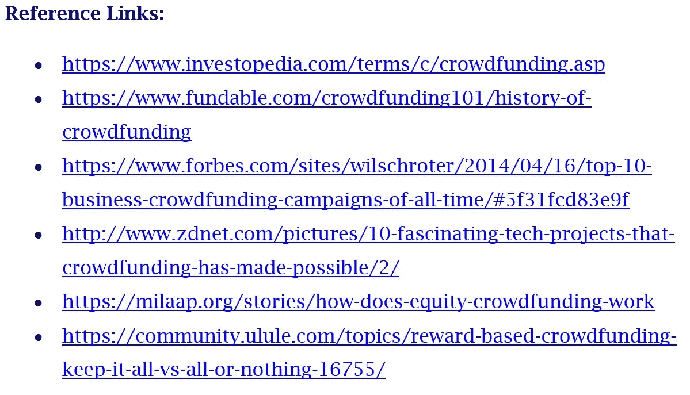

# 众筹的拥挤世界

> 原文：<https://medium.datadriveninvestor.com/crowded-world-of-crowd-funding-3ba22d2035?source=collection_archive---------2----------------------->

近年来，众筹已经成为全球范围内越来越受企业家和投资者欢迎的选择！。

从本质上说，众筹是一个术语，指的是从任何人或特定的一群人那里筹集资金，投资于新产品或服务创意的过程。

> 众筹的过程为企业家提供了一条通过获得启动资金来实现其创新想法的途径。

**定义**

深入到众筹命题，它只是一种从一组个人或大量个人那里聚集一小部分资本的方式，目的是为一个全新的创业旅程提供资金。

> 这一过程在新一代企业家中非常受欢迎，因为通过社交媒体和互联网这一现代传播媒介，这一过程很容易实现。

众筹的一些冠军是 Kickstarter 和 Indiegogo 这样的网站，它们通过从其捐助者群体中聚集资金来帮助崭露头角的企业家。截至 2018 年 1 月，他们已经累计筹集了 136 亿美元，这个数字还在增长。

> 众筹平台为投资者或创业者寻找新的风险基金或获得投资提供了便利。

**众筹简史**

从历史上看，美国的众筹可以追溯到 19 世纪。一个恰当的例子是，1885 年，当政府未能提供资金为自由女神像建造一个纪念性的基地时，一场由报纸牵头的运动吸引了 16 万名捐助者的小额捐款来资助它。

最近，直到 1997 年，才出现了第一个非常成功的众筹项目。它是由一个英国摇滚乐队发起的，他们通过在线媒体筹集他们团聚之旅所需的资金。他们的大部分粉丝都凑了进来，融资证明极其成功。然而，直到 2000 年，第一个名为 ArtistShare 的众筹网站才作为一个专门的平台出现，为现代领导者铺平了道路。

随着时间的推移，众筹慢慢成为个人验证其商业想法、获得曝光率并为其筹集资金的流行选择。众筹行业是一场无声的革命。就筹集资金而言，其增长在短短两年内几乎翻了三番，从 2009 年的 5.3 亿美元增长到 2011 年的 15 亿美元，此后一直保持增长。

而随着 2012 年第一个众筹平台“The Fundable”平台的推出，众筹方面出现了巨大的转变。它为企业家为他们的想法提供资金创造了一个全新的渠道。它还创造了股权众筹的新类型。这本身就是一个巨大的创新。Kickstarter 和 Indiegogo 的巨大成功证明了众筹的平台概念。

在印度，众筹这个词并不新鲜。例如，在喀拉拉邦的马拉巴尔，百年传统的 P*anampayatu*(众筹)以其最原始的形式盛行，作为一种流行的方法来筹集资金，用于创业、建造房屋、嫁女儿、送孩子出国找工作或甚至高等教育或其他迫切的财务需求。此外，在印度的许多地方，礼拜场所都是用大量的捐款建造的。

然而，网络众筹的概念对中国来说还是新鲜事物。

**网络众筹的种类**

有四种不同类型的在线众筹平台。每一种都满足不同的需求，并且都有自己的优点和缺点。这些大致分为:奖励、股权、借贷和捐赠

*   **基于奖励的众筹-** 这种类型是当今最常见的众筹形式。在这种方法中，在不同的执行级别设置奖励，处理有形产品并与客户保持面对面的联系。
*   **股权众筹-** 另一种流行的形式是股权众筹。它围绕着这样一个事实，即提供资金的个人可以期望获得通过这种筹资创建的组织的一部分所有权。因此，参与活动的公司向参与活动的人群成员出售一部分股权。
*   **基于捐赠的众筹** -基于捐赠或慈善的众筹形式是个人通过募集资金来帮助慈善事业的极端努力。在这种形式中，筹集资金的最常见原因是社会和环境。
*   **基于借贷的众筹-** 也称为基于债务的众筹，这围绕着这样一个事实，即找到一群个人，他们将在经过一定时间后根据还款合同出借资金。

**基于奖励的众筹:全有或全无(AoN)和全留(KiA)**

*全有或全无*是一种筹资形式，其中设定的目标是仅提取一笔金额，且仅当在给定时间框架内筹集或超过所需金额时。而*保留全部*是一种形式，其中所筹集的全部金额被保留，而不考虑设定的筹资目标。

一般来说，根据经验，遵循 *Keep It All* 形式的活动在实现目标方面要困难得多，因为潜在的资助者担心他们在部分资金筹集的情况下实现目标。然而，在*中，只有当设定的目标在有限的时间内提高时，筹款目标才集中在开始项目上，因为资助者认为他们更有可能实现他们的目标。*

**投资者和众筹！**

在数百个基于众筹发起的项目中，许多都是基于回报的，这意味着投资者自己有第一次机会使用这类初创公司的产品或服务。例如，一家无人机相机初创公司向每位投资者承诺提前向公众展示一个这样的设备，而不是 600 美元。

另一方面，基于股权的众筹随后取得了很大的进展，原因是它允许企业家通过他们的产品和服务产生收入，同时仍然在风险投资者的控制之下。由于这一方面为投资者提供了股权，基于股权的众筹被认为是一种更安全的融资形式，在美国受到证券交易委员会(SEC)的监管。

**股权众筹及其潜力**

**股权众筹:**为了让企业起步，或者为其提供真正成长所需的资本，企业家通常会求助于外部投资者。在这种情况下，他们将企业的部分股权出售给投资者，以换取资本。众筹这种融资方式有自己的版本:[股权众筹](https://www.thebalance.com/a-guide-what-is-crowdfunding-985100)。在这种模式下，投资者有时只需投资 500 美元就可以购买一家企业的一小部分股份。像 [AngelList](https://angel.co/) 、 [OurCrowd](https://wwwng.ourcrowd.com/) 、[seeders](https://www.seedrs.com/)等公司是这个领域的领导者。

股权众筹的一些好处是:

*   **金额更大**:与其他形式的众筹相比，股权众筹有可能筹集到更多的资金。虽然这种情况并不总是会发生，但投资者需要认购的金额要比基于奖励的众筹等其他形式的众筹交易大得多。
*   **一个客户/投资者**:投资者很快成为一群致力于使企业成功的人，企业家可以在早期阶段依靠他们的投资者群体获得反馈和想法。随着企业的发展，投资者更有可能投资未来的企业。
*   **点对点(P2P):** 基于贷款的众筹允许企业家以贷款的形式筹集资金，他们将在预定的时间内以固定的利率偿还贷款。

贷款活动往往会在大约五周的较短时间内进行，对于不想立即放弃初创企业股权的企业家来说，这种方式非常有效。

**5 大众筹商业活动**

Kickstarter 是领先的众筹平台。该基金于 2009 年在纽约成立，迄今已资助了超过 126，000 个项目，筹集了超过 30 亿美元的资金。它只通过捐赠提供众筹，有 13 个类别:电影、音乐、技术、时尚……它汇集了全球 1300 万金融家的社区。美国平台对项目收取 5%的佣金，2017 年初平均成功率为 35.8%。

**印度众筹**

众筹在印度是一个非常活跃的市场。众筹模式加快了速度，我们在这个领域看到了正式和专业的结构。数字逐年增加。一些年轻的印度企业家创建了成功的点对点(P2P)借贷平台和股权众筹平台。P2P 借贷模式贡献了超过 70%的总众筹资金量。在印度，P2P 贷款模式很有可能会导致银行业的混乱。看到贷款初创公司在印度的突然增长，印度储备银行(RBI)最近将 P2P 贷款机构作为非银行金融公司(NBFCs)进行监管。

source:google image

> 印度的一些顶级众筹平台是 Bitgiving、Catapooolt、Crowdera、DreamWallets、Faircent、FuelADream、FundDreamsIndia、Ignite Intent、Impact Guru、Ketto，这个名单正在一天天增加。

然而，印度的众筹在很大程度上仅限于捐赠和贷款，因为 SEBI(印度证券交易委员会)认为，大多数印度人缺乏适当投资模式的足够知识，他们需要关于创业公司股权众筹适当运作的专业知识。

## **结论**

因此，在一群个人适度贡献的背景下，为一个项目提供资金的整个金融方法，比从一两个投资者那里寻求一大笔资金要容易得多。这一点在印度也得到了证明，截至 2018 年 1 月，各种众筹平台上的总交易额已达到 800 万美元。预计在未来 5 年内，CAGR 将增长 28%。

用沃顿商学院教授 Ethan Mollick 的一句话来总结，非常真实地陈述了“ ***众筹的独特价值不是钱，是社群”。***

> *关于作者:*帕拉格·迪万博士是一位著名的“教育家”，他建立了一些最好的机构。目前，他经营着自己的咨询公司 www.paradigmconsultant.com，为机构、能源公司和企业家提供帮助。

