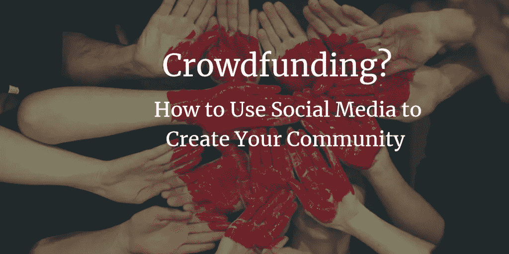

# 众筹？如何使用社交媒体来创建你的社区

> 原文：<https://medium.datadriveninvestor.com/crowdfunding-how-to-use-social-media-to-create-your-community-cf5b7aa80d33?source=collection_archive---------44----------------------->

为你的企业建立一个社区就像定期接触氧气一样重要。众筹不可能发生在真空中。

即使不是众筹，我也坚信，2018 年没有哪家企业可以光荣孤立地运营，无论它的主张多么巧妙。假设一个天使投资人来看你的公司。你的想法非常棒，你的推介材料非常翔实。但是你的公司在 Twitter 上没有粉丝，没有 T2 的 LinkedIn 的个人资料，没有脸书的个人资料，没有更新的 T4 的个人资料，也没有电子邮件简讯列表。你看起来像一座鬼城。这并不能激发信心。

Not taking care of your online presence? This is how it looks to your potential investors.

投资者可能会问，为什么没有人喜欢这家公司？为什么没有和任何人联系？为什么它没有朋友，没有支持者，没有拉拉队？为什么它不想告诉世界它在做什么？简而言之，这家公司出了什么问题？

也许这听起来不公平。这可能是不公平的。但这就是世界运转的方式，而且很可能已经如此。

无论我们对自己的判断有多自信，当别人同意我们的观点时，我们中的绝大多数人都会感到更加自信。这也是我们看亚马逊星级的原因。这就是我们关注猫途鹰的原因。这就是为什么我们在选择餐厅、预订酒店或出去喝杯咖啡之前，会查看网上反馈。

更一般地说，这就是像脸书这样的服务是如何工作的——它的算法将有相同想法的人聚集在一起。

你会从一个没有星级和没有反馈的亚马逊卖家那里买东西吗？没有吗？那你为什么要投资一家同样孤立存在的公司呢？

The vast majority of us feel significantly more self-assured when other people agree with us. Be it Amazon, TripAdvisor or a crowdfunding campaign

## 那么，你如何为你的企业建立一个社区呢？你应该在哪里做？

我们建议从不起眼的**电子邮件简讯**开始。电子邮件可能并不光鲜，但却非常方便。也许你 20%的联系人在 Instagram 上，60%在 LinkedIn 上。但是他们 100%或者接近 100%都有电子邮件地址，你可以通过这个地址联系到他们。

电子邮件简讯的另一个优势是它们非常容易制作。你可以利用 MailChimp 这样的简单工具来制作专业的邮件输出。或者你可以把你的联系人的电子邮件列表放在一起，这样就可以联系了。

> 坦率地说，没有理由不发简讯！

Sign up!

社交媒体也非常重要。潜在投资者不会知道你的电子邮件列表的大小，除非你认为适合告诉他们。但是他们可以很容易地看到你在 Twitter 上有多少关注者，或者在脸书有多少朋友。你的公司需要引人注目，而社交平台给了你一个简单的方法来做到这一点。

这可能看起来有点吓人。社交媒体平台的数量持续增长，与所有平台保持同步似乎是一项不可能完成的任务。

好消息是你不必这么做。事实上，这样做会适得其反。最好选择几个社交网络——最多三个——并专注于它们。哪一个取决于你的业务细节。

Choose 2–3 social networks best suited and keep them updated!

**看看你的竞争对手:**他们在哪里有社交媒体账号？那是你应该去的地方。每个社交媒体都有自己的属性——insta gram 是基于图片的，LinkedIn 是专业的——你应该小心这符合你公司的愿望。

一旦您为自己的企业开设了社交媒体账户，请保持更新。这似乎不是特别重要。

> 没有什么比一个被忽视的社交媒体账户的绝望网站更令人尖叫抛弃的了。

你的时事通讯也是如此。保持常规**。不要几个月过去了，还没有和你的联系人取得联系。你可能不认为你有什么特别新的事情要宣布，但是总有消息要告诉你:也许是一个新雇员，或者是一次有趣的交易会。告诉你的社区。**

**但是，建设社区不应该是单行道。当你的社区成员与你联系时，你应该倾听并回应他们。**

**鼓励辩论。问问别人的想法。让社区建设成为一种对话而不是讲座。通过这样做，你将与那些以后会购买你公司股票的人打交道。**

**上述所有这些步骤都是数字化的。但是社区建设也可以发生在**血肉之躯**的世界里。走出去，接触人们，介绍自己，帮助他们认识一个名字，这很重要。**

****

**Your community wants to hear from you and what you’ve been up to. Sometimes even face-to-face.**

**如果事情进展顺利，你甚至会考虑举办自己的非正式聚会。也许你可以邀请一些人来看看你在做什么，看看你的实验室，然后带他们出去喝杯咖啡？**

**现实也很重要。你的公司不是耐克。你甚至可能不面对消费者。所以你的社交媒体联系人会有数百人，如果幸运的话，可能会有数千人。但是没关系。**

> **100 个高度参与的联系人胜过 500 个不在乎你是谁的人。**

**通过建立一个社区，你也给了你的公司最好的成功机会。运气在商业中和在生活中一样重要。但是，在某种程度上，你可以通过与人交往和抓住机遇来创造自己的运气。**

**不会有什么结果。但如果你不尝试，你永远不会知道。**

**然后就是**众筹**。众筹并不是一种容易找到投资的方式。但在适当的情况下，它可以而且确实有效。建立一个社区是创造这些环境，从而使你的众筹活动取得成功的重要的第一步。**

**这听起来可能有点愤世嫉俗。但我们并不建议你建立一个社区只是为了从中赚钱，也不是说你应该利用你的关系来获取经济利益。**

**相反，众筹应该是你和你的社区的双赢。在任何情况下，这都不是一件容易的事情。但是没有社群，是不可能的。就像没有氧气的呼吸。**

***本文与* [*本·卡德威*](https://www.linkedin.com/in/ben-cardew-3695389/) *共同撰写。***

****照片作者:****

*   **[Rémi Jacquaint](https://unsplash.com/photos/CCIsZRL8X5U?utm_source=unsplash&utm_medium=referral&utm_content=creditCopyText) 打开 [Unsplash](https://unsplash.com/search/photos/amazon-rating?utm_source=unsplash&utm_medium=referral&utm_content=creditCopyText)**
*   **[Tim Gouw](https://unsplash.com/photos/bwki71ap-y8?utm_source=unsplash&utm_medium=referral&utm_content=creditCopyText)on[Unsplash](https://unsplash.com/search/photos/meet-greet-business?utm_source=unsplash&utm_medium=referral&utm_content=creditCopyText)**
*   **[蒂姆·马歇尔](https://unsplash.com/photos/cAtzHUz7Z8g?utm_source=unsplash&utm_medium=referral&utm_content=creditCopyText)上 [Unsplash](https://unsplash.com/search/photos/community?utm_source=unsplash&utm_medium=referral&utm_content=creditCopyText)**

****延伸阅读:****

**杰斯·贝利的一篇好文章:**

** [## 众筹:如何从零封邮件中筹集到 100 万英镑

### 诚实的回答，

medium.com](https://medium.com/@baileyjes91/crowdfunding-how-you-can-raise-1-million-from-an-email-list-of-zero-a29e036c362d)  [## 众筹的注意事项

### 这些年来，我有幸管理了一系列众筹活动，来筹集资金和获得支持…

www.uktech.news](https://www.uktech.news/guest-posts/funding/crowdfunding/the-dos-and-donts-of-crowdfunding-20181116)  [## 投资生物技术领域|资本细胞

### 成为既有潜在高回报又有社会影响的公司的投资者。多样化有助于减少你的…

capitalcell.co.uk](https://capitalcell.co.uk/investing-in-the-biotech-sector/)**