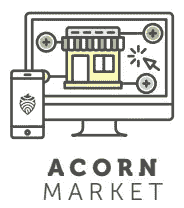
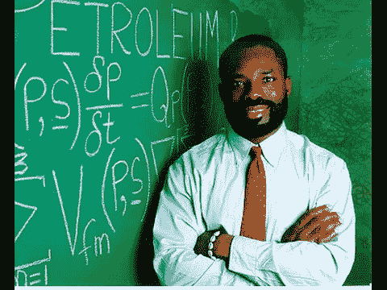
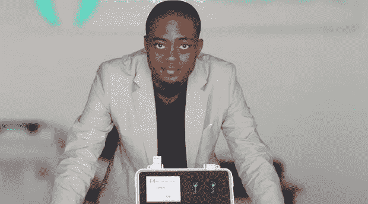
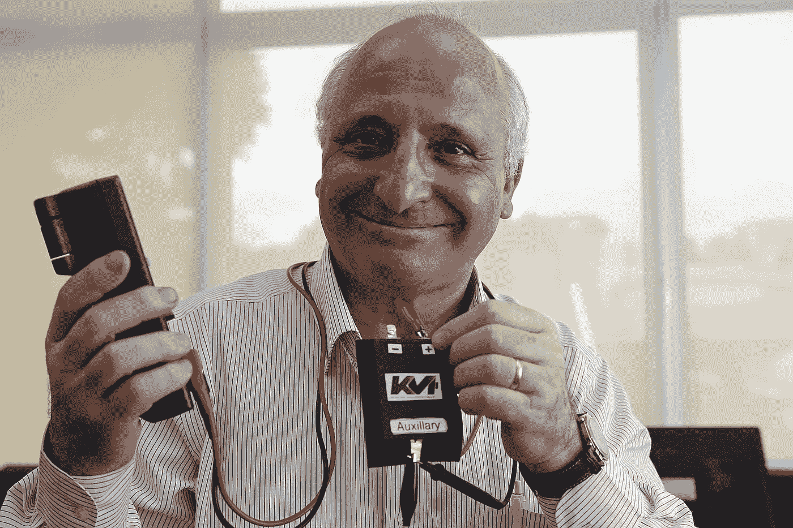
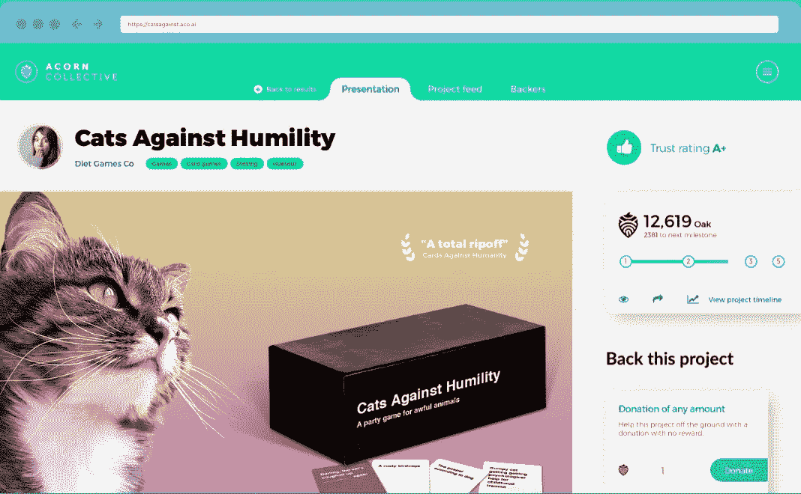

# 全球范围内的众筹创新

> 原文：<https://medium.datadriveninvestor.com/crowdfunding-innovation-on-a-global-scale-dd09dcc0b6b4?source=collection_archive---------7----------------------->

很快，那些不如我们幸运的人将能够参与众筹。

对于那些不知道的人来说，众筹是利用大量个人的小额资本来资助新的商业风险。它有可能通过扩大投资者群体来增加企业家精神，除了传统的所有者、亲戚和风险资本家之外，还可以从这些投资者那里筹集资金。

此前，没有一个众筹平台可以在世界所有国家使用。甚至像 Kickstarter 和 Indiegogo 这样的大玩家也没有全球影响力。

橡子集体正在向大众进行众筹，无论他们在哪里。他们将接受来自任何国家的任何合法和道德的项目，只要这些国家没有受到 OFAC 的全面制裁。人们只能想象，作为一个文明，迄今为止，我们错过了太多的潜在项目、想法和倡议。

作为一个分散的区块链平台，Acorn 能够在全球立足。

Acorn Collective 将提供一个市场，在这里，资助者可以向新客户或现有投资者和利益相关者推销和推广他们的项目。

让我们来看看一些发源于第三世界国家的发明。这些是被发现的幸运儿。展望未来，用不了多久，我们就能从以前没有平台的不幸者那里利用新的视角来解决问题、设计解决方案和改善生活方式。

出生于尼日利亚阿库雷； ***Philip Emeagwali 的*** 学校因尼日利亚内战于 1967 年停课。13 岁时，他在比夫拉军队服役。

经常被称为“非洲的比尔·盖茨”的 Emeagwali 成年后开始研究自然，特别是蜜蜂。蜂巢的构造启发他重新思考计算机处理。1989 年，他将这一想法付诸实践，使用 65，000 个过程发明了世界上第一台超级计算机——每秒能够进行 31 亿次计算。

***来自喀麦隆的亚瑟·臧*** 是 CardioPad 的发明者；触摸屏医用平板电脑，可远程进行心脏检查(类似于心电图)。结果通过无线传输给专家进行进一步分析。

***Rachid Yazami*** 是锂离子电池石墨阳极(负极)的发明者。作为一名摩洛哥科学家，Yazami 于 1980 年首次使用聚合物电解质在电化学电池中将锂可逆地嵌入石墨中。最终，他的发现导致了现在用于商业锂离子电池的锂石墨阳极。

所以总而言之，我们都将从世界各地的众筹中受益匪浅。毫无疑问，在这个新发现的市场中，投资者将会有新的机会。

Acorn Collective 几乎准备好了，在他们的[展示区](https://aco.ai/showcase/default.html)可以看到一个工作平台。

他们的代币销售很快就要结束了，我建议你进一步调查一下。

查看他们的[网站](https://aco.ai)或[电报集团](https://t.me/AcornCollective)了解更多信息。