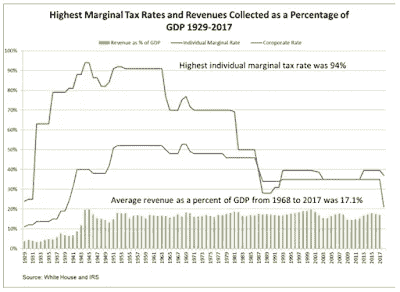
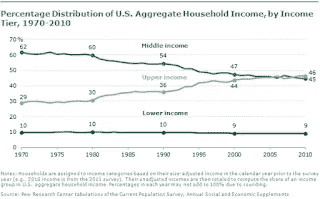
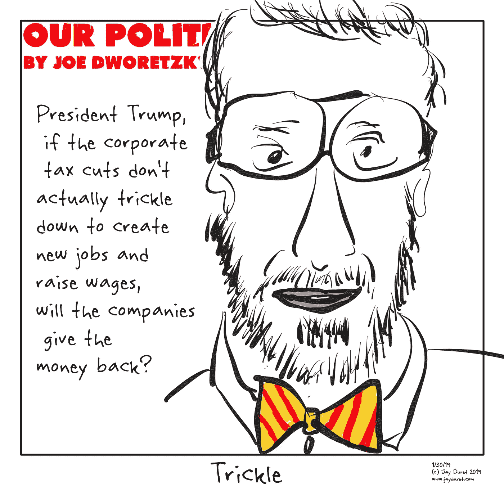

# 喊社会主义！让战争之犬溜走。

> 原文：<https://medium.datadriveninvestor.com/cry-socialism-and-let-slip-the-dogs-of-war-3a4b065f4cca?source=collection_archive---------15----------------------->

亚历山德拉·奥卡西奥·科尔特斯和伊丽莎白·沃伦最近的税收提案在激起保守派的愤怒方面做得很好。AOC 很快学会了如何激怒保守派，他建议对收入超过 1000 万美元的人群征收 70%的新边际税率。与此同时，沃伦采取了一种更新颖的方法，建议对超过 5000 万美元的资产征收 2%的“财富税”，对超过 10 亿美元的资产征收 3%的“财富税”。

福克斯新闻频道主持人马克·莱文(Mark Levin)是右翼的领军人物，他抨击 AOC 是美国马克思主义国家崛起的先兆。“我有一个问题要问贝托·奥多尔，”马克·莱文咆哮着，坚持骂人，这显然吸引了他的听众，但只会降低严肃政治话语的前景。*“我有一个问题要问亚历山大·奥卡西奥-奥卡西奥。我有一个问题要问伯尼·桑德斯。我对他们所有人都有一个问题。你寻求建立的‘美国民主社会主义共和国’将会如何——你如何向我们保证它不会变成委内瑞拉？”*

沃伦的提议没有 AOC 那么尖刻。这可能是因为攻击 AOC 已经迅速成为右翼的*事件，也可能是由于标签休克。70%毕竟是一个很高的数字。然而，沃伦的提议实际上更不寻常，因为尽管 20 世纪 70 年代的边际税率高达 70%，但联邦政府从未征收过财富税。*

值得注意的是,“财富税”在州一级早已存在，尽管我们并不这样称呼它们。我们称之为财产税，这是州和地方一级的主要税收。对绝大多数美国人来说，他们的财富绝大多数集中在他们的主要住宅上，财产税实际上是一种财富税(尽管它应该更准确地被称为“资产税”，因为房屋按其全部价值征税，而不考虑未偿还的抵押贷款)。“个人财产税”——征收方式与不动产税相同，但针对的是股票、债券和其他资产——在许多州的法律上可以追溯到 19 世纪。尽管许多政策已经被废除，但相对于收入而言，直接对个人财富征税的想法在我们的历史上并非闻所未闻。

经济学家反对这两项税收提案的一个主要理由是，它们忽视了避税的历史——当税收被视为没收时，人们倾向于采取非法和合法的措施来避税。虽然支持对富人征收新税的人倾向于用“公平”来形容，但公平最终取决于旁观者。不动产税在地方一级仍然存在，而个人财产税已被废除，这不是因为对财富征税的哲学厌恶，而是因为个人财产很容易转移到税收较低或没有税收的管辖区——其他州或离岸避税地。那些质疑 AOC 提议的实用性的人很快指出了联邦层面的边际所得税率的历史，这表明在实践中，更高的税率导致了更高水平的避税，而不是增加了总税收。如图所示，尽管在 20 世纪的大部分时间里，边际税率在 70-90%之间，但这些税率并没有转化为更高的联邦政府收入占 GDP 的百分比。

然而，AOC 和伊丽莎白·沃伦提出的建议从根本上讲并不是关于税收效率，而是为了回应一种普遍的情绪，即“该系统”不再为工人和中产阶级服务，正如这里的图表所反映的那样，该图表显示了自 1970 年以来美国中等收入家庭的收入份额稳步下降。2016 年，在扰乱和改变各自政党方面做得最多的两位总统竞选人——唐纳德·特朗普和伯尼·桑德斯——都传达了一个信息，即这个体系对普通美国人不起作用。支持美国经济体系未能为工人阶级和中产阶级家庭带来好处的数据在 2016 年大选期间被概括为经常被引用的[观察结果](http://www.pewresearch.org/fact-tank/2018/08/07/for-most-us-workers-real-wages-have-barely-budged-for-decades/)，即今天的实际工资中值仍低于 40 年前的水平。在亚当·图兹关于 2008 年金融崩溃的社会影响的书的[评论](https://nplusonemag.com/online-only/online-only/until-the-next-crash/?mbid=nl_hps_5c4b9ee8ba532c6650dedf59&CNDID=25837914)——[*崩溃:十年金融危机如何改变世界*](https://www.amazon.com/Crashed-Decade-Financial-Crises-Changed/dp/0670024937)*——*中，芝加哥大学经济史学家乔恩·利维将这一论点与收入不平等的平行问题联系起来， 指出从 1980 年到 2014 年的 35 年间，收入分配中下半部分家庭的实际收入没有变化，但在同一时期，收入最高的 10%家庭的收入增长了一倍多，收入最高的 1%家庭的收入增长了两倍多，收入最高的 0.001%家庭的收入增长了七倍多——也就是说，收入最高的大约一千户家庭的收入增长了七倍多。

在这一背景下，2008 年金融危机和随后的衰退对中产阶级家庭的财务安全造成了特别毁灭性的影响。根据 NYU 经济学家 Edward Wolff 汇编的数据，在 2008 年崩溃之前的几十年里，美国家庭财富的中位数增长了 50%，从 1983 年的 80，400 美元增长到 2007 年的 118，600 美元。到 2013 年，家庭财富中值已经崩溃，跌至 65800 美元，这表明很大一部分美国家庭三十多年的储蓄已经化为乌有。更糟糕的是，在同一时期，零储蓄的美国家庭比例从 15.5%上升到 21.8%。

在同一时期，三个中等收入五分之一人口中的 60%的美国家庭——收入占美国收入分配的 20%到 80%——债务增加，财务灵活性下降。从 1983 年到 2013 年，这些家庭的债务实际上翻了一番，债务与净值比率从 37.4%增长到 64.0%，债务与收入比率从 66.9%增长到 125.0%。家庭债务的增加是一个重要因素，因为对家庭来说，就像公司一样，在金融衰退的情况下，较高的债务比率会导致财务压力增加。2005 年对联邦银行法规的改革加剧了家庭债务增加带来的问题，使得家庭更难处理债务问题。最后，即使家庭看到他们的总净值在 30 年间恶化，与房屋净值或养老金账户相比，现金或其他流动形式的家庭财富份额从 21.4%下降到 8.1%，这意味着家庭在逆境中的应对能力下降。

马克·莱文可能是对的，T2 说“美国人不喜欢庞大、专制、集权的政府”，但他忽略了一点。茶党(Tea Party)和占领运动都是由对华尔街的不满和系统被操纵的观点激发的，这些不满是基于经济和政治系统让很大一部分美国人失望的真实证据。AOC 提出的 70%的税率可能被证明是微不足道的，甚至是适得其反的——无论是从创收的角度还是从解决日益严重的收入不平等的角度——但对许多工人和许多选民来说，重要的是她感受到了他们的痛苦。

当马克·莱文痛斥民主党忽视委内瑞拉的教训时，他或许应该考虑一下他在福克斯新闻频道的战友塔克·卡尔森在[的观察](https://www.mediaite.com/tv/tucker-carlson-warns-trump-era-similar-to-venezuela-when-voters-are-ignored-they-turn-to-populists/)。几个月来，卡尔森提出共和党未能与民众对现状的不满达成一致，这种不满已经远远超出了特朗普的基础，这引起了保守派的愤怒。*“看看委内瑞拉发生了什么。有一天，人们抬头看了看，他们说，‘等等，九个家族控制着整个经济，但我们仍然有投票权，为了惩罚他们，我们要选这个人，乌戈·查韦斯，然后是尼古拉斯·马杜罗。’”*

同样，在本周举行的世界经济论坛(World Economic Forum)上，人们普遍担心，民众的不满正导致发达民主国家对资本主义的全球承诺逐渐瓦解。巴伦周刊《T2》的编辑凯瑟琳·贝尔在达沃斯写道，面对左翼和右翼日益增长的民粹主义运动，政治、公民和商业领袖感到焦虑。她哀叹反贸易和反全球化情绪的兴起，而此时全球对资本主义的拥抱被广泛认为带来了全球生活质量的前所未有的改善，包括在过去三十年里使[10 亿人](https://qz.com/798481/over-a-billion-people-have-been-lifted-out-of-poverty-since-1990-but-the-next-billion-will-be-harder/)摆脱了极端贫困，将世界极端贫困人口的比例减少了近一半，并将中低收入国家的儿童死亡率降低了 40%。

贝尔提到，这个体系在全世界产生了巨大的成就，而这个体系在国内被打破的观点是这个体系的另一面。全球贫困的减少在很大程度上是冷战结束、全球接受美国倡导的世界经济秩序以及随后数亿工人进入相互联系的全球劳动力市场的产物。在过去半个世纪中，中国和印度的开放以及东南亚的转型支撑了全球化和工作外包，这反过来抑制了国内工人的收入并扰乱了他们的生活和生计。

给我们带来唐纳德·特朗普(Donald Trump)和伯尼·桑德斯(Donald Trump)以及如今 AOC 和伊丽莎白·沃伦(Donald Trump)的政治紧张关系，是一个正在努力平衡资本主义和民主的道德、政治和经济后果的世界所固有的紧张关系。马克·莱文和其他保守派——现在迈克尔·彭博和霍华德·舒尔茨也加入了——在他们继续走那条老路之前，应该深吸一口气，辱骂并高呼“社会主义！“每一个寻求缓解公众不满的提议。社会主义不是边际税率的产物，创造 70%的税率不会让美国在 2020 年成为社会主义国家，就像艾森豪威尔时期美国是社会主义国家一样，当时最高边际税率为 90%。相反，正如塔克·卡尔森恰当地指出的那样，社会主义在民意调查中不断上升的吸引力应该被视为一种制度的结果，这种制度可能在国外创造奇迹，但在国内却给很大一部分美国人带来了真正的金融不安全感和不稳定性。这些美国人投票，政治家和专家们更应该认真对待他们关心的问题，而不是喊口号和骂人。

*在 Twitter @dpaul 上关注大卫·保罗。他正在写一本书，书名是《联邦退出！为了拯救我们的民主，是时候让阿拉巴马成为阿拉巴马，让加州自由了。”*
*乔·德沃勒茨基的作品。在 www.jayduret.com*[*看看乔的政治漫画吧。*](http://www.jayduret.com.) *在 Twitter @jayduret 或 insta gram @ Joe faces 关注他。*

DAVID PAUL 于 2019 年 1 月 30 日星期三[发布](https://appalled.blogspot.com/2019/01/cry-socialism-and-unleash-dogs-of-war.html)

[EMAIL THIS](https://draft.blogger.com/share-post.g?blogID=11439010&postID=6112195835737678288&target=email)[blog THIS！](https://draft.blogger.com/share-post.g?blogID=11439010&postID=6112195835737678288&target=blog) [分享给 TWITT](https://draft.blogger.com/share-post.g?blogID=11439010&postID=6112195835737678288&target=twitter)