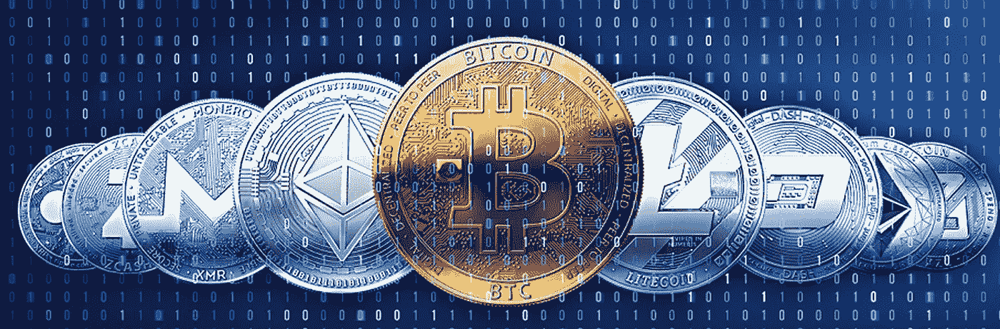

# 国际货币交易中的加密套利及其机会

> 原文：<https://medium.datadriveninvestor.com/crypto-arbitrage-and-its-opportunities-in-international-currency-exchange-1b094aa8c0ae?source=collection_archive---------1----------------------->

Cryptocurrency the digital coin.

我想你首先想到的是什么是套利？

在经济学和金融学中，套利是利用两个或更多市场之间的价格差异的做法:利用不平衡达成匹配交易的组合，利润是市场价格之间的差异。(维基百科)

> 简而言之，这是同时购买和出售资产，以从价格失衡中获利。利用市场价格差异来获利的策略。

*简单来说，套利就是:当某个特定的硬币在 X 交易所比在 Y 交易所便宜时，你在 X 交易所买入，在 Y 交易所卖出，将差价收入囊中。听起来很简单，对吧？但在这场游戏中，也有相当多的陷阱和风险。*

**新经济的曙光**

如今加密货币越来越受欢迎，正是因为它具有革命性的属性。比特币比其他任何一种被用户广泛接受的创造数字现金系统的尝试都更能激起人们的热情和兴趣。有时候更像是宗教而不是科技。

> 这是一种数字黄金，健全的货币，不受社会影响。承诺随时间保值增值的数字货币。加密货币也是一种在全球范围内快速、简便的支付手段。事实上，它是一种没有中央实体的数字现金系统。

事实是，我们中的许多人仍然不知道加密货币，也就是数字货币。我认为有必要对加密货币有更多的了解，以挖掘它在日常生活中的潜力和机会。

**比较:当前货币兑换和通过加密套利的货币兑换**

我们来和现在的货币兑换，以及通过加密套利的货币兑换做一个比较。

对于加密汇款，考虑来自比特币基地(英国)Koinex 交易所(Team Koinex)的以太坊(ETH) / LTC。以及通过西联(WU)和 TransferWise 从英镑到印度卢比的正常汇款。

如果您通过转账方式转账 1000 英镑，您将损失金额的 0.28%作为汇率和交易费。

*如果你通过西联汇款转账，你将损失 0.53%的交易费，尽管他们使用更好的兑换率进行交易。*

现在让我们考虑加密货币兑换。

*如果您从英国向印度转账 1000 英镑等值以太币(≈ 2.51ETH)，交易费为 17.45 英镑。贷记到印度的金额将相当于 1080 英镑(包括所有交易费和转换费)。这意味着 8%的利润。*

*另一个加密选项是从英国向印度转移 1000 英镑的莱特币(约 13.39 LTC)，交易费用为 17.45 英镑。贷记到印度的金额相当于 1090 英镑(包括所有交易费用和转换费用)。所以，现在你会得到 9%的利润。*

注:计算受市场变化影响

**值得做吗？**

加密货币套利是一个积极的过程。与投机和保证金交易不同，其他活动可以被视为与传统的货币交易市场相同。总的来说，加密货币套利是一个获得一些被动收入的机会，但同时也有风险。

你能获得的套利金额也取决于市场状况。在大多数套利交易中，价格的快速波动将起到至关重要的作用，例如像“刀砍人”这样的事件。但是无论如何都没有确定的利润。了解潜在的市场风险和业务的投机性质非常重要。

**加密货币的未来**

加密货币市场正迅速获得关注，因为它带来了一个承诺，主要是一个改变世界的大爆炸。在不久的将来，它将作为面向商业交易(微支付)主流的协议获得合法性，并将取代当前的货币交易成为全球商业的首选工具。

> 区块链技术通过去中心化交换、智能合约、无信任审计和彩色硬币提供了最大的好处。

加密货币将继续存在，并将改变交易世界。加密货币革命一步步改变世界。现在是通过加密接受您的付款以获得更好的汇率和无缝交易的好时机。

> 决定你是想站在旁边观察，还是想成为历史的一部分。

**最终想法**

加密货币将是许多新兴系统的发起者，这些系统将极大地改变我们的全球经济体系。

*加密货币的未来吸引力在于，与所有现有方法相比，它以更低的交易费用，通过安全的全球交易的快速媒介，扩展对您的资金的最终控制。*

随着强大的加密技术在分布式账本中的应用，加密货币吸引了公众的目光。随着世界变得越来越经济不安全，加密货币交易过程是防范欺诈活动和账户篡改的保障，也是消费者隐私的保证。

> 由于目前效率低下且不稳定，它还有很长的路要走。