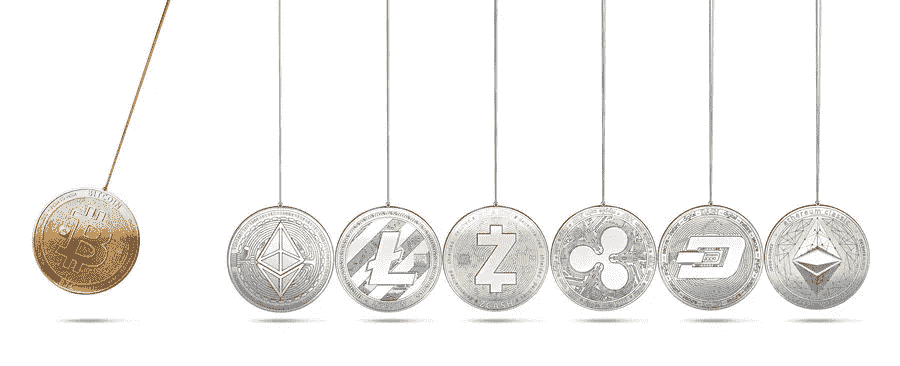
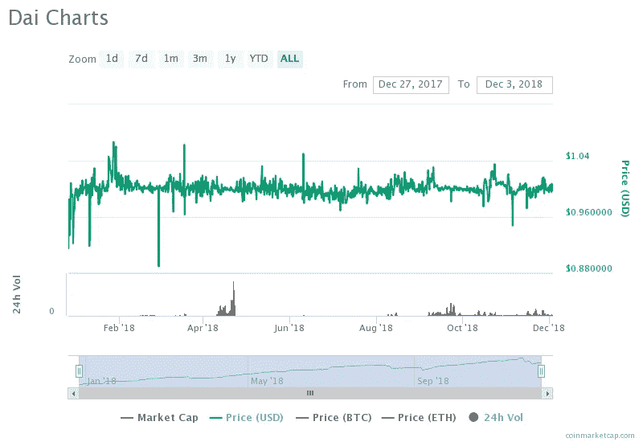
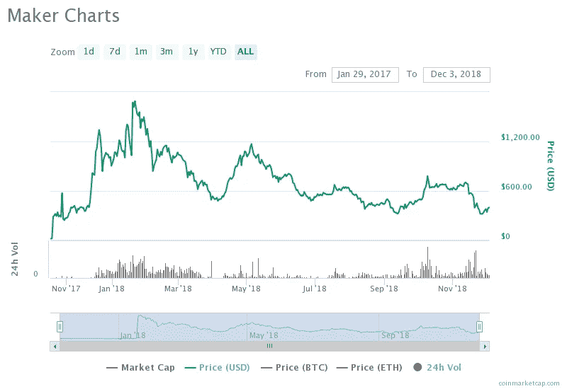
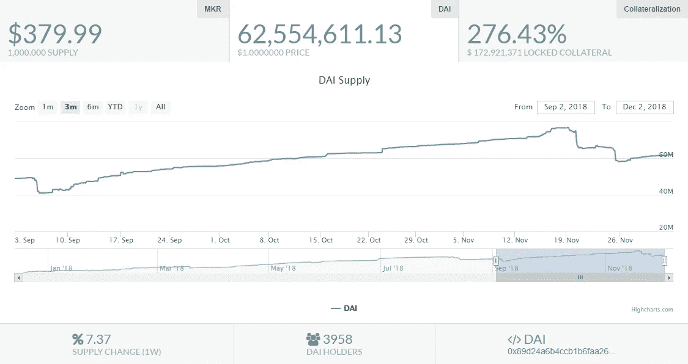

# 加密支持的加密:Stablecoins(第 3 部分)

> 原文：<https://medium.datadriveninvestor.com/crypto-backed-crypto-stablecoins-part-3-8e48fd6fd4cc?source=collection_archive---------20----------------------->

过去几周(甚至几个月)发生的加密货币市场萎缩证实了稳定的加密货币是一种必要的工具。从 9 月初到 11 月底这段时间，加密货币市场的总市值几乎减半，事实上，只有稳定的加密货币才能将其价格保持在预期/目标水平。在概述了菲亚特支持的(第 1 部分中的[)和商品支持的(第 2 部分](https://medium.com/datadriveninvestor/the-little-black-dress-of-crypto-stablecoins-part-1-cb8f10d29a8)中的[)stablecoin 之后，焦点可以从在很大程度上基于信任的集中式 stable coin 设计转移到分散式设计——不依赖于第三方审计和监管，完全在链上实现。](https://medium.com/datadriveninvestor/gold-on-a-block-stablecoins-part-2-7928598b282d)

Image retrieved from [Malwarebytes](https://blog.malwarebytes.com/101/2017/11/cryptocurrency-works-cybercriminals-love/)

在高度融合的市场中，比如加密货币市场，人们可能会问为什么一种加密货币会被用作稳定另一种加密货币价格的抵押品，因为很明显，每当比特币价格波动时，整个市场都会波动，几乎所有加密货币都在同一个方向波动。在简单化的方法中，类似于菲亚特和商品支持的 stablecoins 的设计，这种方法显然是没有意义的。然而，在某种程度上更复杂的设计中，有一些加密货币在其他加密货币的支持下保持低价格波动。

## 傣族

代币是一种加密货币支持的稳定币，在制造商道 T5 平台上发行。DAI 的价值与美元挂钩，1 DAI 的价值应始终等于 1 美元。DAI 的发行、价格稳定和供应控制是通过其他几种工具实现的，由 [DAO](https://en.wikipedia.org/wiki/Decentralized_autonomous_organization) 操作。

## 发布

DAI 的发行是通过根据 CDP 的清算比率(150%)将抵押品(集合 ETH)存入一个名为 CDP(抵押债务头寸)的智能合同，这意味着 ETH 抵押品的价值必须至少是已发行 DAI 价值的 150%。锁定担保品后，发行价值 1 美元的 DAI，持有人可以用它来交易、支付商品和服务。

## 物价稳定

DAI 价格的稳定性是由市场驱动的，并通过修改创造 DAI 的激励来实现——如果价格低于 1 美元的目标，创造新 DAI 的成本就会增加，而如果超过目标价格，创造 DAI 的成本就会降低。这些激励控制了戴的供应。

DAI trading information: [coinmarketcap.com](https://coinmarketcap.com/currencies/dai/)

正如 DAI 交易信息所示，到目前为止，这个概念相当成功-DAI 的最低价格是 2018 年 1 月 11 日-0.720637 美元，最高价格是 2018 年 3 月 18 日-1.11 美元。

## 担保物的释放

通过返还未偿债务，即通过将 DAI 存回平台，从 CDP 中释放锁定的抵押品。

## 管理

由于 DAI 及其抵押品“存在于”区块链上，因此没有第三方监管机构和审计员参与确保未偿 DAI 按照最低清算比率进行抵押。为此，Maker DAO 的作者创建了一个治理令牌 Maker (MKR)。然而不是稳定的货币，也不像戴那样有抵押。MKR 的持有者通过向平台的管理者收取费用来获得激励。当锁定抵押品的价值不足以满足清算比率时，他们通过清算未结 CDP 头寸来支持 DAI 的价格。被称为“保管人”的应用程序用于寻找高风险 CDP 头寸，即 DAI 与抵押品比率接近清算比率的头寸。

MKR trading information from: [coinmarketcap.com](https://coinmarketcap.com/currencies/maker/)

在本系列第一部分中提到的 stablecoins 设计的重要方面——与由菲亚特和商品支持的集中式 stablecoins 相比，加密货币支持的 stablecoins 的分散化和价格稳定性成本非常不同。显然，它们是去中心化的，在区块链上运行(在智能合约中)，没有人工干预或控制，因此相当接近加密货币领域所倡导的去中心化和不信任的价值观。

[Maker tools](https://mkr.tools/)

然而，实现价格稳定的成本比菲亚特和商品支持的稳定硬币要高得多。例如，对于流通中的每个 USDT 的美元限制，有 1 美元作为抵押品存放(或者我们应该这样认为)，每个 DAI 的最小锁定抵押品价值是 1.5 美元。由于抵押品价格的频繁和快速变化，DAI 的持有人倾向于存放相当高数额的抵押品。如上图(取自 Maker tools health monitor)所示，6250 万 DAI 的供应由价值 1.7292 亿美元的集合 ETH 担保，每个 DAI 有 2.76 美元的锁定担保。除了这一成本，DAI 的持有人每年还要支付 2.5%的治理费，在抵押品清算的情况下，还要支付 13%的费用——人们可能会说，这是去中心化和无信任的价格稳定的成本。

*本文表达的观点不是投资建议，也不是推荐。本文包含的事实不一定完整，本文的读者应该在投资前做好自己的尽职调查，包括寻求独立的财务建议。这篇文章不是一个要约，也不是要约邀请，购买或出售这里提到的任何资产。*

这篇文章的文本可以在[爆发区块链](https://www.burst-coin.org/download-wallet)上获得，并且可以使用 CLOUD-rev 8-R7KQ-PSWK-D9Q2V[CloudBurst ID](https://burstwiki.org/wiki/Burst_Software#CloudBurst)进行检索。