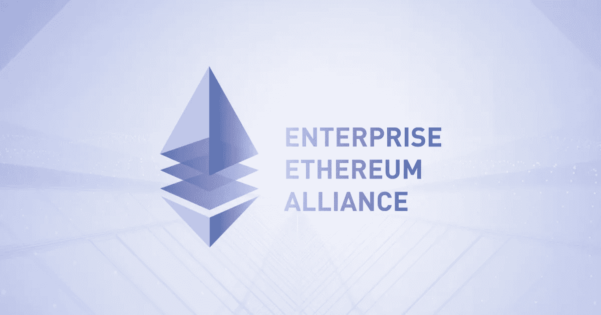
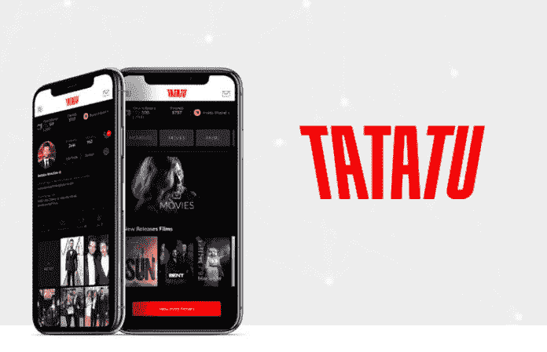
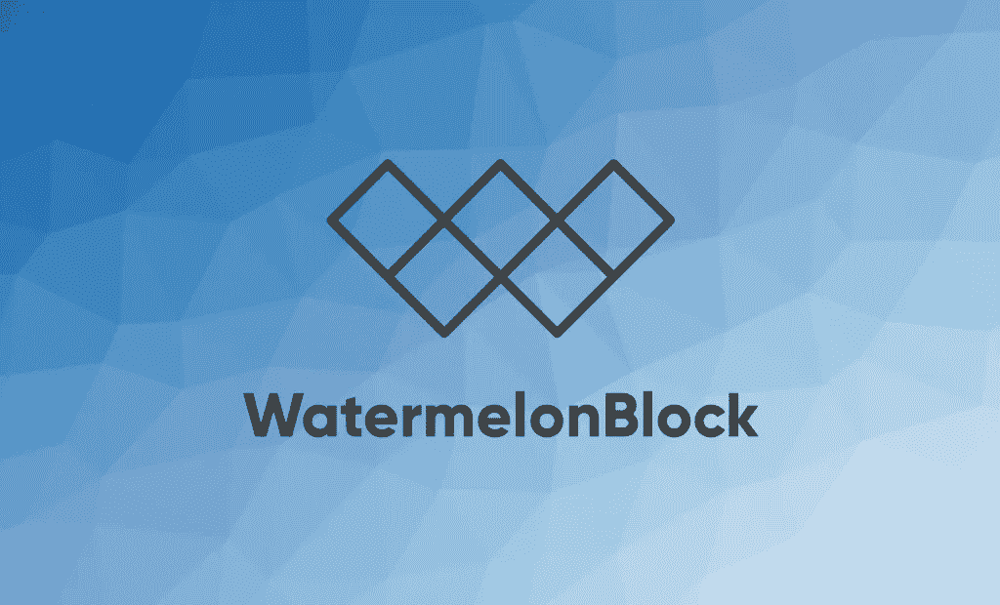

# 密码摘要:EOS 宪法危机解释，塔塔图是网飞黑仔？

> 原文：<https://medium.datadriveninvestor.com/crypto-digest-eos-constitutional-crisis-explained-is-tatatu-the-netflix-killer-65eb51c0a031?source=collection_archive---------3----------------------->

如果说 **曾经有过市场噪音，加密货币拿走了蛋糕。**过去几年一直关注区块链和加密货币领域的人会告诉你，变化是惊人的，尤其是在过去的 6 个月里。

曾经是疯狂理论家、小众爱好者和早期采用者的集合体，已经成为自称专家、reddit spruikers 和 Youtube shills 的跟风者。

**随着 Youtube 视频、reddit 帖子、Telegram 频道和不和谐团体的层出不穷，过滤市场噪音变得越来越困难。**

在这个系列中，我将简要介绍加密货币领域正在发生的事情。它不会像其他一些分析或文章那样专业或深入，但对于那些时间紧迫或只想过滤市场噪音的人来说，这将是一个了解最新情况的好地方。

言归正传，本周在神秘领域:

# 富士康、易贝、普华永道加入以太坊企业联盟

以太坊企业联盟(EEA)本周宣布加入 74 家新公司，包括中国制造商富士康、在线销售平台易贝和会计巨头普华永道。

对于那些不熟悉以太坊背后的治理的人来说，EEA 是一个非营利组织，旨在将财富 500 强公司和较小的初创公司与以太坊生态系统联系起来。这是以太坊网络获得广泛采用的关键之一，自 2017 年 3 月成立以来，它一直在稳步增长。目前的名单已经包括埃森哲、英国石油、瑞士瑞信银行、荷兰国际集团、摩根大通、英特尔、微软和瑞银集团等公司。

**与行业的合作是实现采用的关键一步，以太坊目前是这方面的领跑者。**

[参见](https://chainstate.org/eea-list/)的完整添加列表。

# Eli 5:EOS 宪法危机

在万众期待的 mainnet 发布几周后，EOS 平台已经被困难所困扰。EOS 首席技术官丹·拉里默(Dan Larimer)呼吁修改 EOS 章程，并在 EOS 电报频道上表达了自己的担忧。

> “我们已经看到，如果你给人们专断的权力来解决专断的争端，那么一切都会变成争端，所做的决定也是专断的。仲裁者的权力越大，争端就变得越恶毒、越琐碎，结果也越不可预测。”—丹·拉里默

这个问题产生于 EOS 对权力下放采取的方法。有趣的是，这是白皮书中强调的将 EOS 与其他平台(如以太坊、NEO 或 Cardano)区分开来的关键特性之一。

与其他更分散的平台不同，EOS 的 ***被设计成更少分散的*** ，以允许更好的可伸缩性和速度。他们的目标是一个尚未被其他平台覆盖的中间地带。

以太坊在 2017 年实质上拥有了去中心化的平台空间，每隔几天就有新的竞争对手冒出来；所以 EOS 瞄准了一个不同类型的市场。EOS 认为，并不是所有的区块链应用程序都需要最大程度的去中心化，许多人实际上更看重网络的速度而不是完全的去中心化。

**EOS 平台本质上会在去中心化水平上妥协，以优化速度和吞吐量。**

为了实现这种准分散化，EOS 治理模型利用了一个名为 EOS 核心仲裁论坛(ECAF)的仲裁员。ECAF 充当负责处理平台上任何争议的权威机构。这个概念是，ECAF 将是对网络上的黑客和巨魔的 EOS 保护。

6 月 22 日，ECAF 冻结了 27 个账户，并指示大宗商品生产商停止处理来自这些地址的交易。冻结的问题在于没有正当程序，也没有解释。砌块生产商只是被命令冻结 27 个地址，ECAF 表示将在晚些时候提供理由。

最近，一个主要的块生产者 EOS New York 已经决定忽略 ECAF 指令，基本上造成了一场宪法危机，因为网络上的主要参与者开始质疑已建立的权威。

从本质上讲，ECAF 是一个未经正当程序的中央集权政府。在受监管的市场中，这相当于美国证券交易委员会(SEC)等监管机构在没有正当理由的情况下冻结资产。

因此，ECAF 正在失去社区的支持。丹·拉里默(Dan Larimer)呼吁进行宪法公投，以修改现有宪法，使区块生产商无法修改或冻结按照最初法规规定运作的合同。修改宪法需要 15%的选票。

EOS 社区如何应对这场危机可能会成就或摧毁这个平台，因为 Cardano 和 Ethereum 等竞争对手正在蠢蠢欲动，并希望利用 EOS 的失败。

[阅读更多关于 Dan Larimer 对平台面临的困难的看法](https://medium.com/@bytemaster/the-intent-of-code-is-law-c0e0cd318032)。

# 塔塔图:这是网飞·黑仔吗？

Does the red text remind you of a particular streaming company?

aTaTu Token 已经筹集了 5.75 亿美元，成为仅次于 Telegram 和 EOS 的史上第三大 ICO。

对于那些熟悉 Steemit 的人来说，TaTaTu 正在采取类似的方法作为一个去中心化的媒体平台。用户通过流媒体电影和对他们喜欢的内容进行投票来获得 TTU 代币，本质上是作为内容的管理者，告诉平台他们想看更多的内容。内容创作者根据其电影的受欢迎程度和观看次数赚取代币。

虽然 TaTaTu 早期将专注于电影，但未来有机会将体育、游戏和音乐添加到平台中。看看 Youtube，网飞和斯坦。

# WatermelonBlock 与 IBM Watson 合作

6 月 27 日，atermelonBlock 宣布与 IBM 的沃森人工智能平台合作。

WatermelonBlock 将利用 IBM 的人工智能计算大数据，并为加密货币和 ico 生成市场情绪排名。在一个日新月异的快节奏加密货币市场中，WatermelonBlock 旨在为投资者提供更好的市场情绪快照。

一款 iOS 应用目前正处于开发的最后阶段，ICO 将于 2018 年第三季度推出。密切关注这一点，它可能成为加密货币投资者的一个伟大工具。

[看看他们。](http://watermelonblock.io)

# 脸书广告禁令逆转

acebook 正在慢慢撤销对加密货币广告的禁令，并宣布将允许一些经过批准的公司再次为他们的服务做广告。随着比特币热潮达到顶峰，脸书在 2018 年 1 月实施了对所有加密货币广告的初步禁令。

公司现在可以向脸书提交申请，要求在社交媒体平台上做广告获得预先批准。值得注意的是，ico 仍然被禁止做广告，因为脸书希望向在区块链提供服务的公司开放广告。

**这就是本周的 Crypto！下周和我一起快速更新市场动态和无噪音新闻。**