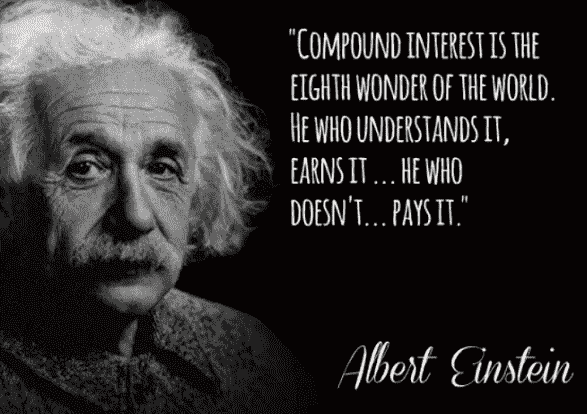

# 秘密红利——被动收入的未来

> 原文：<https://medium.datadriveninvestor.com/crypto-dividends-the-future-of-passive-income-6ce1c47197e6?source=collection_archive---------2----------------------->

## 成为你自己的银行&大大超过传统储蓄账户的年利率

Courtesy of [Nadi Whatisdelirium](https://unsplash.com/@whatisdelirium) via Unsplash

## 银行是利益证明(PoS)机制的发起者。但是他们微薄的报酬再也无法与 crypto 竞争。

## 知道如何下载软件并记下密码吗？恭喜你！你有资格下注 crypto 并赚取被动奖励。

## 这篇文章重点介绍了三个区块链项目，它们的股息率让你的储蓄账户大吃一惊——至少是目前最高银行利率的两倍。

## 我还会传递一个免费资源，让你可以自己找到这些令人兴奋的项目。

过去，仅仅为了在银行持有资金，储蓄账户就要支付超过 5%的年利率。

但现在不是了。这年头能拿到 2%以上就很幸运了。另一方面，加密赌注奖励可以为*提供高得多的*回报。

由于分布式团队为大多数区块链初创公司提供动力，他们的开销非常低——通常分散在一群在家工作的个人身上。

虽然银行将你的存款转化为 5 倍的收益——只给你很小一部分利润——但 PoS 加密项目更感谢你的支持。

你看，通过持有加密网络的本地加密货币，你有助于保持系统的安全。换句话说，您的投资是项目整体成功的“赌注”。

随着矿工的专用硬件竞相解决复杂的数学难题，比特币和其他工作证明(PoW)网络消耗了大量能源。【仍然】远不如全球银行业强大！]

相比之下，PoS 区块链只需要简单软件下载。在您的 PC/Mac、网络甚至智能手机上运行一个轻便的钱包。

> PoS 生态系统的加密钱包充当网络交易的验证器。

为了你的麻烦，请阅读:**无所事事！** —网络以其本地硬币或代币支付。

请记住，除非你的政府法令遭遇恶性通货膨胀，否则传统的“现金”波动性较小。

另一方面，随着加密技术的易变，潜在的巨大收益也随之而来。在 cryptoland，风险回报比有很大不同。

抱着多印一些来解决问题的心态，政府的钱通常除了下降没有别的去处。

通过下注，你不仅有机会看到大幅上涨(以及下跌！)，但对存款也有复合效应。

加密网络的支付率——以及风险——总是会变化的。记得对任何你认为有希望的项目做自己的研究。

好消息是，我已经为你做了一些功课，并发现了一些出于各种不同原因吸引我的项目。但是不要只相信我的话——或者你最喜欢的 YouTube 影响者的话！

今天的互联世界为知情研究提供了大量的机会——我将在下面留下所有三个项目的多个链接。

因为每个项目都有一个独特的操作方法，这并不意味着是一个“前三名”列表。我甚至不打算将这些项目按优先顺序排列——当你继续阅读时，你会明白为什么。

请记住，成为自己的银行意味着承担账户安全的所有责任。

> 使用加密钱包密码、种子短语和私钥时要格外小心！如果丢失，大多数是无法恢复的。丢掉你的钥匙，丢掉你的密码！
> 
> **此外，给自己准备一个 u 盘来存储钱包备份。**

现在，为了让*获得*里面提到的任何密码，你需要一些基本的交换技能。你没有吗？别担心！让你在这里得到保护:

 [## 如何将菲亚特换成加密，加密换加密，加密换菲亚特

### 掌握这些基础知识，你就会知道如何在大多数交易所交易加密货币

medium.com](https://medium.com/future-vision/how-to-trade-fiat-for-crypto-crypto-for-crypto-and-crypto-for-fiat-bc6fadc0e470) 

如果你知道怎么做，交易加密的过程就很简单——成功地将利润存入银行是另一回事。慢慢来，注意！

不过关于安全交易说够了，我们进入正题:**支付被动奖励的区块链项目**。“读书，骑自行车，”网飞冷静地说，“选择权在你。

不管是什么活动——即使你努力工作创造更多的收入——赌注加密激活一劳永逸的支付。

# v 系统—两位数 APR

虽然 V SYSTEMS[V SYSTEMSV SYSTEMS](https://v.systems/)是本文中最年轻的项目，但它的首席开发人员却是区块链业界的传奇人物。

事实上，Sunny King 发明了今天许多区块链项目使用的 PoS 共识机制。

 [## 超级节点的发明如何提升区块链的 PoS 共识

### 赌注奖励现在飙升得更高

hackernoon.com](https://hackernoon.com/how-the-invention-of-supernodes-upgrades-blockchains-pos-consensus-989f458dba8b) 

VSYS 正在构建一个简化的基于云的平台，开发者可以在这个平台上创建自己的区块链。

由于他们创新和平衡的超级节点机制(spo ),你的奖励来自**出租**硬币给超级节点。

另外，就像加密交易一样，如果你知道怎么做，租赁也很容易。VSYS 使这一过程变得非常简单，但是如果您在任何地方遇到困难，请查看该操作指南:

 [## 租赁密码可以提供 10 倍于传统储蓄账户的回报

### 了解如何以两位数的年息投资 VSYS 硬币

medium.com](https://medium.com/datadriveninvestor/leasing-crypto-can-offer-10x-returns-over-traditional-savings-accounts-7d43e1f49969) 

要开始租赁，只需选择您的 [**VSYS 钱包**](https://v.systems/wallet.html) 然后存款。选择一个超级节点，并向他们发送您的虚拟系统硬币。搞定了。

## 当前年利率:20%以上

## $VSYS 交易于 [KuCoin](https://www.kucoin.com/?rcode=7drude) & more

# 斗篷硬币——无法追踪的交易

比特币可能是加密货币中最古老、最受认可的名字，但它绝不是私有的。

随着老大哥的监控策略变得越来越具有侵略性——最近两个面部识别技术强加于公众的例子证明了这一点。

中国的 [**已经扫描了 50 万公民**](https://medium.com/the-new-york-times/one-month-500-000-face-scans-how-china-is-using-a-i-to-profile-a-minority-b49e93d5a9d3) 和 [**伦敦警方对任何敢于拒绝隐私被侵犯的人开出罚款**](https://www.standard.co.uk/news/london/moment-police-fine-pedestrian-after-he-covered-face-from-facial-recognition-camera-a4144156.html) 。

> “不是他们让我不要遮脸的。”~伦敦市民不愿接受霸王战术。

使用隐私币是让老大哥远离你的生意的最有效方法之一。隐私币保护你的金融交易免受网上窥探和嗅探器跟踪你花的每一分钱。

 [## 为什么使用隐私币可以保护我们作为全球公民的权利

### 世界上超过 70 亿的居民有权享有隐私权

medium.com](https://medium.com/swlh/why-using-a-privacy-coin-preserves-our-rights-as-global-citizens-9747d888556a) 

除了通过加密、不可追踪的交易来保护你的隐私， [**斗篷币**](https://www.cloakcoin.com/en/learn/alternative-bitcoin) 项目还奖励打开钱包。

要下注，下载 [**斗篷硬币钱包**](https://www.cloakcoin.com/en/wallets) 并让它在你的电脑上运行。只需要 1 枚斗篷硬币就可以开始，但是你钱包里的硬币越多意味着*更频繁的*支付。

## 当前年利率:6%

## ＄斗篷交易在 [EasyRabbit](https://easyrabbit.net/?ref_id=OmKwLs9i2) 上&更多

# 科莫多——多才多艺的龙

[**科莫多平台**](https://komodoplatform.com/) 为希望创建自己的区块链的企业提供一站式服务。

从隐私到 [**可扩展性**](https://medium.com/@blockchainauthor/watch-out-visa-nimble-blockchain-startups-are-here-to-steal-your-market-share-507de3981b59?source=friends_link&sk=d0703fcd9baff82da8bda4f1ddd10b48) 到区块链即服务到 [**抵御 51%攻击**](https://hackernoon.com/avoiding-blockchains-most-nefarious-crypto-hijackings-503a96ac2533) ，科莫多生态系统既全面又安全。

此外，KMD 硬币非常容易下注:

## 1)访问 Komodo 平台的网站并[下载钱包](https://komodoplatform.com/komodo-wallets/)。

## 2)在你的新钱包里存入至少 10 美元 KMD。

## 3)每月至少一次，登录您的钱包，点击绿色的大“认领”按钮。

Agama 钱包是最好的加密之一。它敏捷、安全，拥有一堆硬币——包括比特币和 ERC20 代币——甚至还配有技术支持。

此外，Agama 最大的特点之一是**无需打开钱包就能获得$KMD 奖励**。只需登录并收集。

## 当前年利率:5%

## $KMD 在币安交易[更多](https://www.binance.com/en?ref=22792198)

Courtesy of [Kevin Ku](https://unsplash.com/@ikukevk) via Unsplash

# 发现赌注奖励的免费资源

我们刚刚介绍了一些更简单的打桩项目。如果你希望获得收入，其他人可以得到非常技术性的东西。

还有一些，比如$DASH，需要大量的前期投资。按照今天的价格，押$DASH 要花掉你 154，000 美元。

> 无论你的技术水平或预算如何，[Stakingrewards.com](https://stakingrewards.com/)都允许你通过许多类别来筛选项目。

这个资源不仅帮助你选择要支持的项目，而且还教你如何获得战利品。

请记住，他们的“得分”和“风险”类别围绕着该网站的研究和意见，这些研究和意见来自他们对投资回报、网络稳定性、市值、流动性等的*独立分析*。

浏览一下 [**赌注奖励网站**](https://stakingrewards.com/) ，玩玩过滤器，找到与你的耐力和技能水平相匹配的参数组合，然后开始下注！

# 包扎

赌注奖励是赚取被动收入的简单方法。此外，特别是在 VSYS 的情况下，回报率很容易超过其他资产类别，包括股票和债券。

如果你考虑隐私特征——传统金融**从未提供的——就很容易明白为什么赌注的概念正在整个区块链行业获得动力。**

仅在几年前，仅仅把你的数字资金藏在一个 [**硬件钱包**](https://shop.ledger.com/?r=792f)**——加密安全无可争议的冠军 **—** 中就足够了。但在 2019 年，密码爱好者的需求更多。**

**随着更多的创业公司进入这个行业，投资者的注意力越来越稀缺。为了赢得这些投资者的支持，区块链的项目正不遗余力地发放奖励。**

**准备好要你的了吗？如果你知道去哪里找，他们已经成熟了！**

> *****免责声明*** *:这不是投资或理财建议。本文中的信息主要是推测性的观点，仅供娱乐。过去的表现不能保证未来的结果。***
> 
> ***如果您使用了文章中的某些服务，我可能会获得报酬，但不会对您产生额外费用。感谢你支持我创建免费内容的努力。***
> 
> **在参与任何项目之前，无论是在加密市场还是在加密市场之外，都要进行自己的研究。作者持有本文提到的所有项目的原生加密货币。**

## **无耻的插头**

**如果你喜欢这篇文章，请点击掌声。不会痛的，我保证。现在就开始尝试吧！您的支持有助于这篇文章在整个区块链世界传播。**

**如果你想帮助把你的加密信息传递给大众，我很乐意听听你的项目。**

**即使你只想聊聊加密或你最喜欢的区块链创新，你也可以在这里找到我:Gmail 的 blockchainauthor**

**而且你随时可以在[**Crypto Twitter**](https://twitter.com/CryptoBlastoff)**上伸手。****