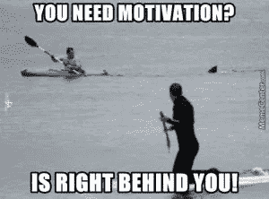
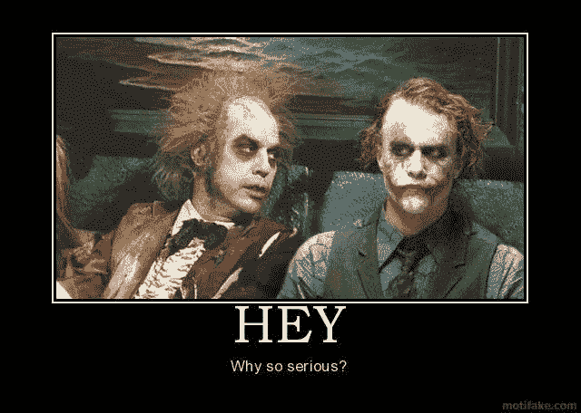

# Crypto 给了我动力

> 原文：<https://medium.datadriveninvestor.com/crypto-gave-me-motivation-b33977372853?source=collection_archive---------3----------------------->

subscribe-[iTunes](https://itunes.apple.com/us/podcast/bit-better-have-my-money/id1374764732)[Stitcher](http://www.stitcher.com/s?fid=183129&refid=stpr)[Google Play](https://playmusic.app.goo.gl/?ibi=com.google.PlayMusic&isi=691797987&ius=googleplaymusic&apn=com.google.android.music&link=https://play.google.com/music/m/Ikoddu7nd3g5ijjnhnedvdpgzo4?t%3DBit_Better_Have_My_Money!%26pcampaignid%3DMKT-na-all-co-pr-mu-pod-16)[iHeartRadio](https://www.iheart.com/podcast/269-Bit-Better-Have-My-29238100)

我今年 34 岁，有妻子和三个孩子。我醒来，开着我的联邦快递路线，回家，和孩子们一起玩，晚上 9 点他们上床睡觉，然后我看电影或玩电子游戏。

**我的日子就是这样，每天都是如此，没有多少变化。我开始厌倦了。**

我想我们很多人都有这种感觉。进入一个套路，厌倦了。开始找别的事情做，占用我们的时间。电子游戏已经失去了吸引力，电影也不再像以前那样吸引我。

**那你怎么办？**

我开始考虑用其他方式打发时间。更好地利用我的时间的方法。当我看到我玩《发薪日 2》已经超过 150 个小时时，我想**“我本可以用这些时间做一些更有成效的事情。”**

找些事情来打发时间是困难的部分。我想做一些能赚钱的事情。我想过写一本书，开一个电影播客，可能还有网上生意。没有什么能激起我的兴趣。

**然后我发现了 crypto。**

一开始我只知道可以买比特币，以太坊，莱特币。我厌倦了付费，找到了 Gdax。然后找到了 alt 币等兑换。我的世界打开了。

当我开始关注 alt 硬币时，我意识到这是可以赚钱的。我不得不研究硬币来寻找好的。然后看看图表，找到一个好的买入价格。买入后，我会观望，等待时机卖出。我的时间已经被占用了。

我花越多的时间研究加密，我就越意识到我还有很多东西要学。总是有新的事情发生。新硬币、新法律、价格变化等。这个行业总是在变化。**不可能掌握。**

Crypto 给了我做新事情的动力。我写这个博客，做一个 YouTube 视频和一个播客。我做过采访，这是我以前从未做过的事情。我很享受这一切。

我找到了一种有利可图的方式来打发时间。它让我不断学习，永不厌倦。Crypto 为我做了这一切。

稍微严肃一点……

