# #隐性影响

> 原文：<https://medium.datadriveninvestor.com/crypto-influence-b9f08cb72bcf?source=collection_archive---------15----------------------->

## 秘密世界中最有影响力的人物的宝库

> 从企业家，到开发商，到无政府主义者，到赛弗朋克。从政客到罪犯到银行家，再到投资者。未来的数字经济是一种不评判也不审查的经济。在这个世界上，行动和结果是过滤器，将那些属于和那些不属于。有些人会抓住机会，而有些人只是自然而然地陷入其中。如果有的话，谁是去中心化未来的代言人？

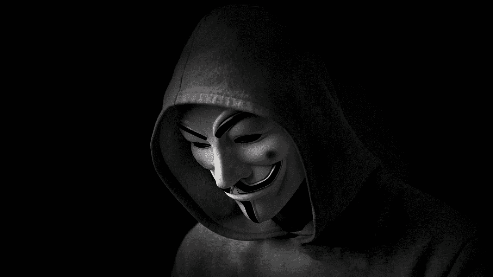

**🤷‍♂️🤷请告知‍♀** * *🤷‍♀️🤷‍♂️**

> 这个存储库没有特定的顺序。
> 
> 下面列出的人是加密货币领域的任何人都必须至少了解的人。
> 
> 这份名单最初将由 20 名个人组成，并定期修订，以保持其无限期的相关性。

虽然这听起来可能与直觉相反，但分散性质的东西会有等级结构；它实际上是一种广泛存在的社会语义误解。如今加密中的去中心化并没有消除对信任的需求，而是最小化了对信任的需求。因此，让我们明白，权力下放并不意味着消除社会阶级制度，而是削弱这些制度中的权力。

既然我们已经离开了…

🤓 ** 🤝让我们去见见这些家伙🤝 ** 🤓

**1。中本聪-** 负责创建和发布比特币公共账本的匿名实体。虽然中本聪的确切身份仍然是个谜，但有一些人可能会成为他:尼克·萨博、多里安·普伦蒂斯、哈尔·芬尼&克雷格·赖特(🤣).但是猜测不止于此，三星、中道、摩托罗拉&东芝被指控与这个虚无缥缈的实体合作。今天，我们所知道的是，这个假名数字已经超越了人类身份，并且变得更像是加密货币的*符号，代表着公民从政府手中解放出来。*

*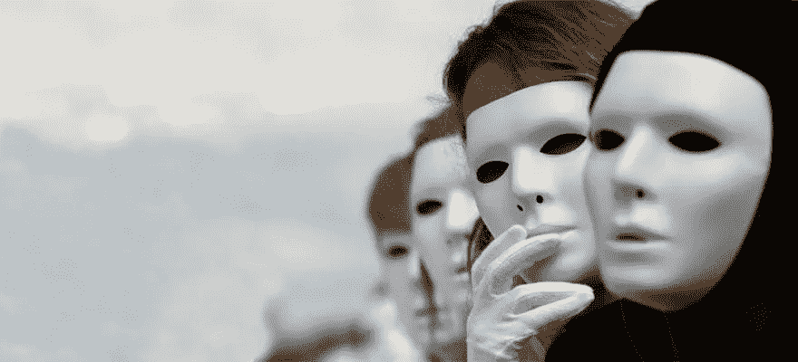*

***2。尼克·萨伯-** 计算机科学家、经济学家，比特币前身 BitGold 的创造者。此外，Nick 是 Smart Contracts [(出版于 1996 年:Smart Contracts，Digital Markets 的构建模块)](http://www.fon.hum.uva.nl/rob/Courses/InformationInSpeech/CDROM/Literature/LOTwinterschool2006/szabo.best.vwh.net/smart_contracts_2.html)的原创者，没错，他的创意可以被认为是为区块链 2.0 铺平了道路，虽然他不是一个家喻户晓的名字(媒体频道上没有提到)，但在加密社区中，他已经达到了传奇的行列。*

**

***3。哈尔芬尼-** 第二个收到比特币的人。作为最早的比特币先驱，芬尼是为数不多的与 Nakomoto 一起真正致力于最初的比特币架构的人之一。作为一个原始的密码学家和密码朋克，哈尔是无限著名的开源 PGP(相当好的隐私)公司的第二号人物。在他生命的最后几年，Hal 由于肌萎缩性脊髓侧索硬化症经历了全身瘫痪，只能使用一些面部肌肉。但这对哈尔来说已经足够了。哈尔用眼睛识别计算机系统武装自己，直到生命的最后一刻还在开发比特币客户端软件。哈尔于 2014 年 8 月 28 日离开了生命维持系统，他的身体立即被冷冻保存。*

**

***4。Gavin Andreeson -** 宣称，由 Satoshi 本人担任比特币客户端软件参考实现的主要开发者。Gavin 最初是一名 3D 图形软件开发人员，在 20 世纪 90 年代处理了许多革命性的技术工作(甚至为盲人创建了一个多人在线游戏)。大约在 2010 年，快进到一个充满探索和实验的职业生涯，来到一个僻静的网上聊天室，第一次听到这个词…比特币。安德烈森先生最后一次对比特币做出承诺是在 2016 年 2 月——自 2016 年 5 月起，安德烈森先生被解除了对比特币客户端的承诺。2016 年 11 月，加文承认克雷格·赖特是“真正的”聪，但他后来后悔并收回了这一声明。*

*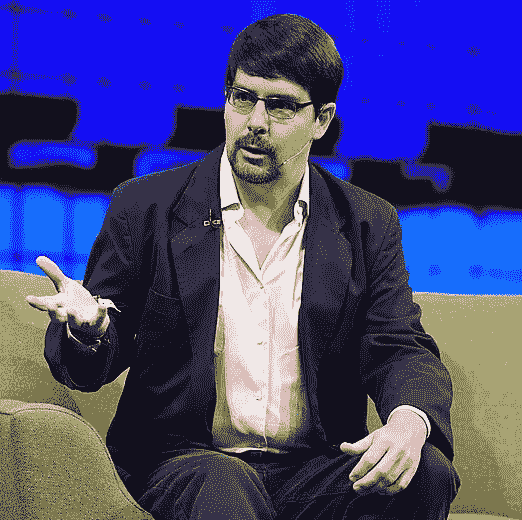*

***5。25 岁时，他是以太坊区块链和比特币杂志的联合创始人。被许多人视为加密货币的明星孩子，Vitaliks 在键盘上的美丽心灵和工艺允许实现代码，弥合传统经济和自主数字经济之间的差距。***

*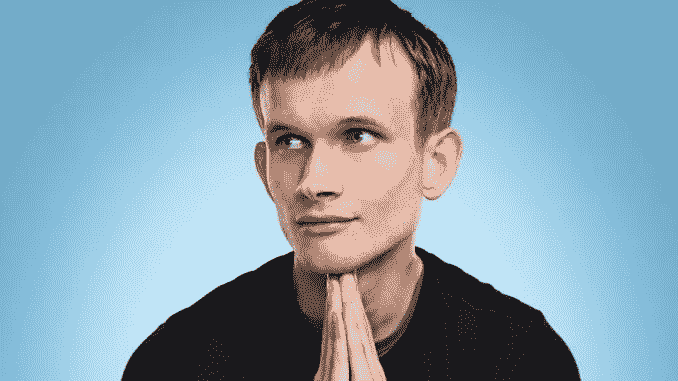*

***6。约翰·迈克菲-** 迈克菲安全系统的创立者和企业家。作为一个密码学家和瘾君子，约翰是一个更加公开古怪的密码最大化主义者。在加密货币领域，他以对权威的坚定态度而闻名，并承诺如果比特币在 2020 年前没有达到 100 万美元，他就会吃掉自己的硬币。 [(Psst，甚至有一个图表跟踪迈克菲预测的准确性](https://bircoin.top/))🤣*

**

***7。Andreas Antonopoulos -** 比特币和加密运动的直言不讳的倡导者。因其对经济学、计算机科学和心理学无与伦比的理解和知识而受到尊敬；安德烈亚斯还在许多不同的加密初创公司以及芝加哥商业交易所(关于其参与比特币氛围)的顾问委员会任职。更不用说他的作品已经多次成为畅销书。*

*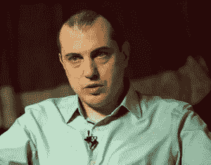*

***8。查理·李-** 莱特币的创造者和莱特币基金会的创始人。计算机科学家变成了密码预言家。2000 年初，查理在谷歌工作了十年，在那里他对软件和世界数字化发展方向有了敏锐的理解。2013 年，查理离开谷歌去 CoinBase 工作。在交易&投资社区中，Charlie 因公开声明他出售了除 1 莱特币之外的所有股票而闻名(当时每枚莱特币的价格在 400 美元左右浮动，而 Lee 的总销售额估计在峰值时超过 30 亿美元)…*

*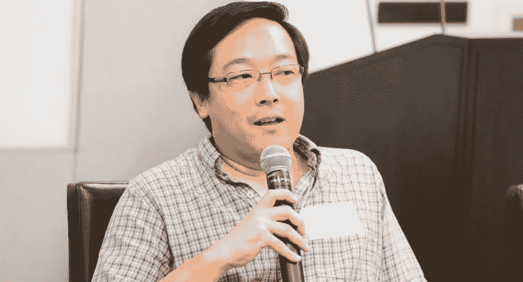*

***9。Roger Ver -** 之前被称为比特币耶稣，因为他在世界各地坚持不懈地倡导比特币，Roger 是比特币的早期投资者和挖掘者(大约在 2011 年)。作为比特币→比特币现金硬盘的负责人，Ver 受到了加密社区的强烈反对。现在他是 [BCHABC(长故事)](https://en.wikipedia.org/wiki/Bitcoin_Cash)的首席执行官和[*原谅我的法语，吉祥物*]……Ver 的历史预加密是一个不透明的。在 2000 年成为一名失败的美国外交官后，罗杰因无证在网上分发非法爆炸物而入狱 10 个月。获释后，罗杰离开美国，去了日本。++ *同样值得注意的是，罗杰是当今许多最成功的加密初创公司的传统投资者，包括 Ripple、Bitpay、北海巨妖、purple . io 和 Shapeshift(仅举几例)。**

**

***10。克雷格·赖特-** 自称是所谓的“Satoshi Nakomoto”和 BitcoinCash SV 的首席执行官🤣]).Craig 是一名澳大利亚计算机科学家和商业人士，他合著了多本关于计算机科学的书籍，并增强了澳大利亚证券交易所遗留巨兽系统的信息系统。*

*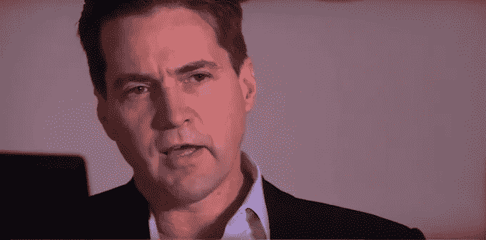*

***11。Joseph Lubin -** 以太坊& Consensus 的联合创始人，这是一个以以太坊为中心的研发技术中心，位于纽约布鲁克林。Lubin 先生的技术专长已经过现场测试，证明是一流的。作为一名研究科学家和软件工程师，Lubin 有机会成为高盛私人财富管理部门的技术副总裁。离开高盛后，约瑟夫成为铁匠技术公司纽约分部的主管。公司解散后，卢宾先生担任 SyNerG Music 的首席执行官，其余时间在区块链😉。*

*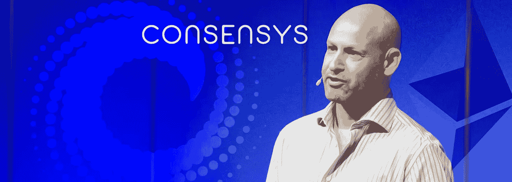*

***12。Erik Voorhies -** 比特币的早期采用者和加密货币领域的活跃企业家。埃里克以他的表达能力和他与彼得·希夫[(健全货币:比特币 VS 黄金)](https://www.youtube.com/watch?v=q8R71WGO3qU)的辩论而闻名。埃里克是一家美国初创公司的创始人和加密企业家。作为 BitInstant 的营销主管，埃里克遇到了查理。Coinapult 和 Satoshi Dice 的联合创始人。超级成功(对纽约人来说是非法的)匿名交易所 ShapeShift 的创始人兼首席执行官。几乎在比特币的整个存在过程中，Voorhees 都站在它一边，在密码世界中建立了一些深层网络。*

**

***13。土生土长的布鲁克林犹太小孩变成了幻想家和罪犯。查理于 2011 年涉足比特币，是比特币最早的采用者和创业者之一。比特币基金会的创始成员之一。Shrem 因参与 BitInstant 和法律系统的争议而闻名，被视为全球比特币采用和意识的先驱之一。在因与洗钱有关的罪行服刑 2.5 年后，查理直接进入了隐星人的上层，成为了名人。***

**

*14。Ross William Ulbricht - 被认为在比特币的推广和应用中发挥最大影响的人。罗斯能够识别比特币是什么样的工具；并立即投入使用。拥有并经营丝绸之路(臭名昭著的黑市)，罗斯创造了一个“以比特币为中心”的现实世界市场。虽然违反法律的程度不值得庆祝，(罗斯正在服无期徒刑+40 年，没有假释的机会…)但他的努力永远影响了我们所有人未来的财务生活。*

**

***15。布莱恩·阿姆斯特朗-**coin base 的联合创始人兼首席执行官。阿姆斯特朗可以被认为是一位对密码领域的发展有着惊人洞察力的科技企业家。Brian 在硅谷从事软件工程和创业，他不仅拥有强大的专业网络，还拥有强大的知识库。如今，阿姆斯特朗作为一名密码未来主义倡导者环游世界，并投资&收购初创企业。*

**

***16。韩吉·吴-** 现已广为人知的比特大陆公司背后的智囊。韩吉在加密生态系统中扮演着一个有争议的角色；虽然他在加密货币挖掘池和硬件方面的革命性工作不应被忽视，但值得注意的是，韩吉更喜欢比特币现金，而不是最初的比特币。此外，吴先生在加密生态系统(请)中不透明的做法令人质疑，这给他的名字带来了负面影响。*

*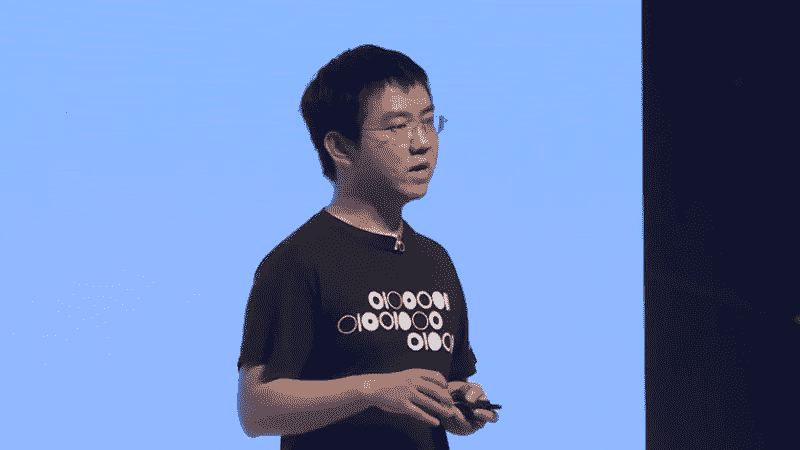*

***17。迈克尔·诺沃格拉茨-** 来自深深扎根于金融领域的职业历史，诺沃格拉茨通过创建银河数字控股公司(一家专注于加密的对冲基金)进入了加密领域。在我们的社交圈子里，迈克扮演着众多有影响力的角色；首先，他服务于 8 个实体的目录委员会(Acumen Fund、NYU·兰贡医疗中心、普林斯顿大学代表队俱乐部、纽约创新选择委员会、PAX、弦乐学校和美国爵士乐基金会)。) ***更不用说他在纽约美联储占有一席之地。****

*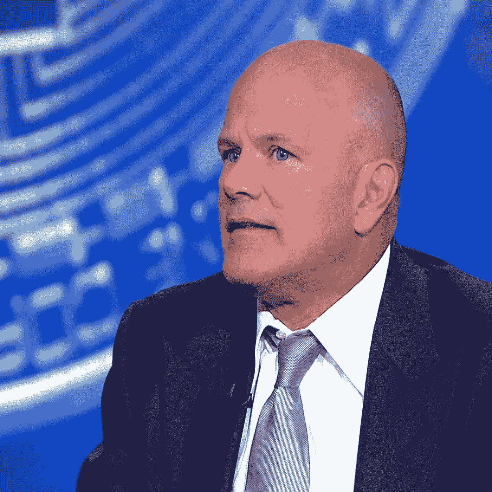*

*18。布洛克·皮尔斯-EOS 的共同创始人和主要活动家。虽然，布洛克可能不具备建造 EOS 的那些工程师的技术知识，但他的个人关系网影响深远。最初，布洛克通过与区块链 Capitol 的合作进入了加密游戏。后来，随着品牌重塑，布洛克成为了 Block-One 的顾问、联合创始人、少数股东和负责人。但是皮尔斯先生的社会地位并非来自他的秘密事业；他实际上是个电影明星。主演经典的《强大的鸭子》、《强大的鸭子 2》和《小巨人联盟》(仅举几例)给了布洛克一个合作的平台和声誉。*

**

***19。布拉德·加林豪斯-** 一个硅谷婴儿。一个科技企业家。一位著名的天使投资人。加林豪斯目前是 Ripple 的首席执行官。布拉德的专业领域建立在他对经济和商业的广博知识之上；他在堪萨斯大学获得经济学学士学位，在哈佛大学获得工商管理硕士学位。每当想到一个超常发挥者，布拉德很容易出现在脑海中。他有着首屈一指的职业犯罪记录；雅虎高级副总裁！AOL 的消费者应用程序总裁、Hightail 的董事长兼首席执行官、Dialpad communications 的首席执行官、SBS Communications 的少数股权持有人& Silver lake Partners、Ancestry.com 的董事会成员& Tonic health，这个名单还可以继续下去，所以如果你想了解更多信息→ [请查阅他的资料](https://en.wikipedia.org/wiki/Brad_Garlinghouse)*

*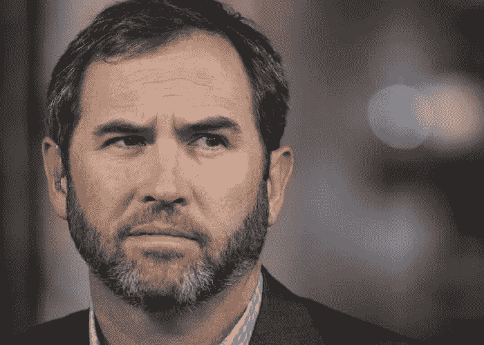*

***二十。赵昌鹏-** 又名 CZ。币安的创始人兼首席执行官。中国出生的加拿大软件开发商变成了企业家。CZ 之前担任中国交易所 OKEX 的首席技术官(CTO)和 blockchain.info 的早期开发者。CZ 将这个利基市场作为自己的职业并不令人惊讶；毕竟，他有量化分析师的血统。Changpeng 来自为金融机构开发高频交易算法。截至 2018 年 4 月，他成为世界上最活跃的交易所的首席执行官，甚至出现在福布斯富豪榜上。*

*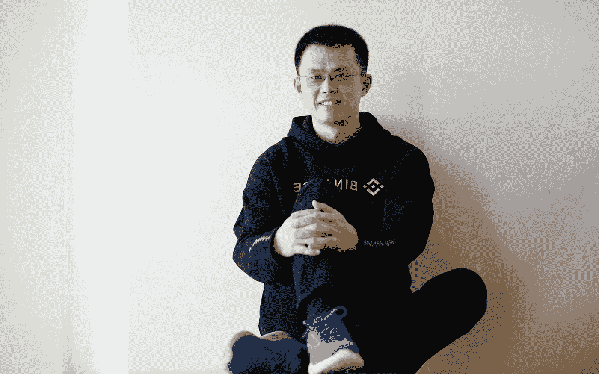*

*🥂我希望有一天能在这个名单上看到你的名字🥂*

*如果有人对你的秘密生活产生了持久的影响，请告诉我！*