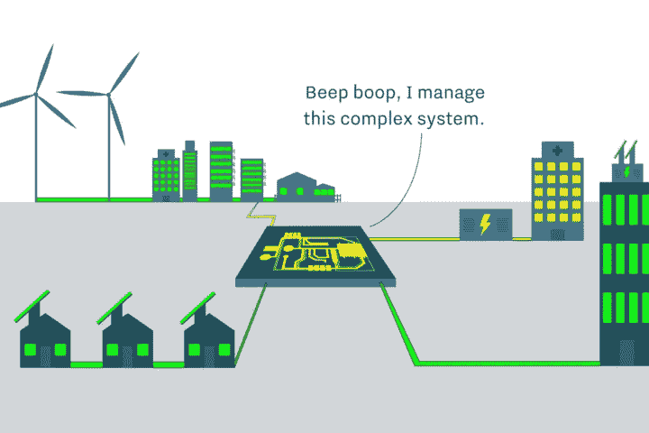

# 加密技术没有消亡，它在进化

> 原文：<https://medium.datadriveninvestor.com/crypto-isnt-dead-it-s-evolving-ae5eab3e7b?source=collection_archive---------27----------------------->

beep boop

在过去的一年里，我们看到加密货币市场从其历史高点暴跌至其一小部分。大多数评论家利用这个机会说“我早就告诉过你了…”。然而，我会说一些不同的东西。

区块链(加密货币的基础技术)一直在等待一个机会来展开翅膀，并将其与严格的支付协议区分开来。供应链、数字身份、P2P 健康记录、分散能源和住房市场已经被大量讨论，但是我们还没有看到在将产品推向市场方面有多大进展。我冒昧地说，这是因为已经发生的大部分开发都被分成了哪一个项目会成功。领跑者，以太坊，超级账本，永恒之塔，EOS，Neo 和我错过的其他人，都在争夺他们作为“未来区块链”的位置这种分散的注意力分散了项目大规模采用所需的时间。

去年，2017 年，是区块链一切疯狂的时候。作为一家区块链初创企业的创始人，我可以直接面对摆在我面前的金钱和机遇。我的公司决定放弃 ICO，走传统的冒险路线。从短期来看，这是一个具有挑战性的决定，因为我们放弃了数百万“无附加条件”的潜在资本，走上了更加艰难的股权融资之路。从长远来看，我认为我们做出了正确的决定，因为大多数 ICO 都非常看好市场，现在正在努力打造一款产品。

我想讨论几个明显的赢家，这些加密超级专注于一个特定的用例，小到足以让他们执行并开始赚取收入。Stellar & Ripple 为国际支付建立了支付轨道，交易速度非常快，费用非常低。Nexo 是一家加密银行，根据您在线钱包中的加密内容提供小额贷款。基本注意力标志是一种激励用户反馈营销材料的手段。

下一步是什么？

我认为，随着这些令牌发展用户群和开发者社区，下一步是建立平台，让这些令牌做他们最擅长的事情。在去年的大部分时间里，我一直专注于分散化市场。我的激情项目是探索分散的微型电网。奖励购买和使用可再生能源，用多余的能源为邻居的住宅供电，以换取支付令牌。

一个房子作为发电机，产生用代币量化的电子，用低费用和快速交易时间的代币为邻居的家提供能量。这些代币将在交易所出售，兑换成当地法定货币，并存入发电机的移动钱包(通过短信或应用程序)。在拥有大量太阳能的发展中经济体，这可能是一种自给自足的方式，同时也降低了可再生设备的成本。

我希望看到更多像这样的项目开始出现，因为尘埃落定，公司专注于技术的真实用例，而不是有一个大的 ICO。

我希望你喜欢我对加密货币/代币的未来的想法，如果你喜欢，请留下掌声/评论！