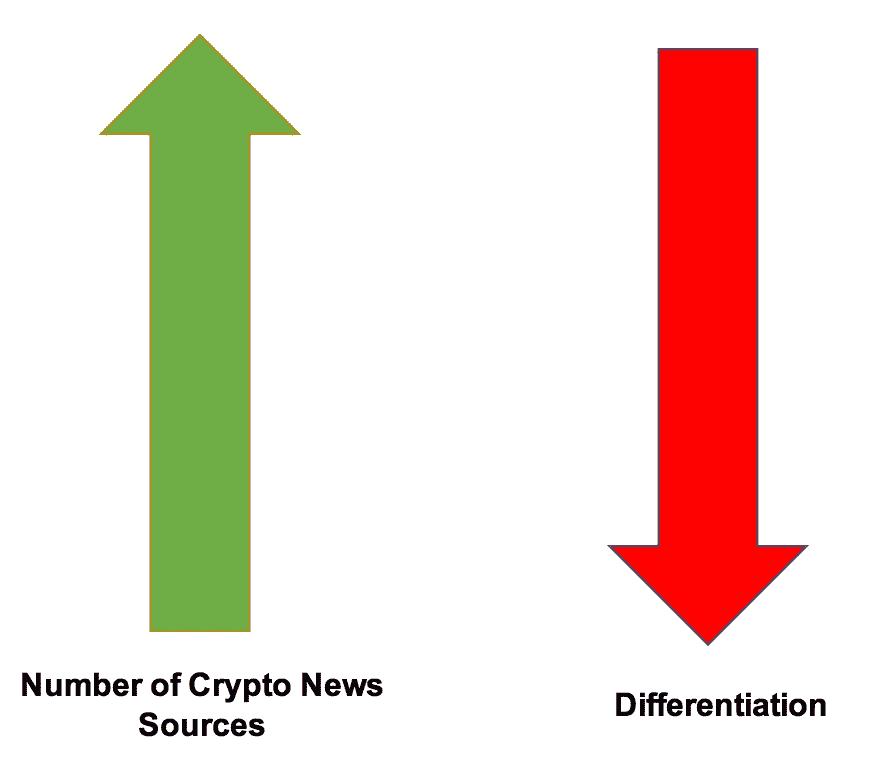
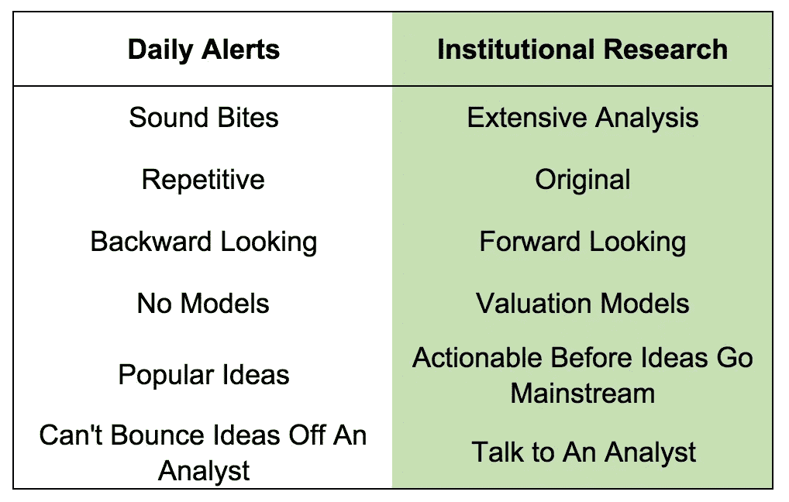
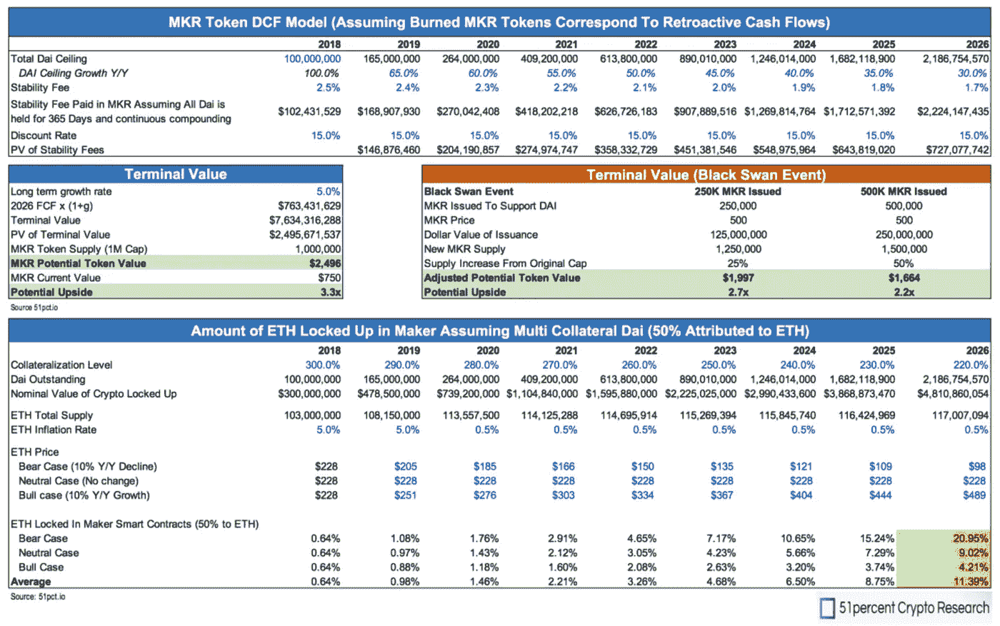

# 密码现在需要合法的研究

> 原文：<https://medium.datadriveninvestor.com/crypto-needs-legit-research-right-now-4c80a65ff299?source=collection_archive---------33----------------------->

在清理了收件箱里我订阅的过多每日加密提醒后，我终于有时间写这篇文章了。加密新闻渠道在让我们了解正在发生的事情方面发挥着重要作用，付费和免费提供者的数量已经激增。

Above is clearly a very scientific model

增加新闻来源的数量并没有错，这对于传播项目、事件和正在发生的事情的新闻很有好处。虽然生态系统中的专业人员需要下一个逻辑步骤；充满高质量展品、估值模型和原创思维的机构质量研究。

专业投资者、分析师和基金(传统的和加密的)需要可信的研究来与他们的同事和投资委员会分享，以做出投资决策。这些群体想要一个高质量的来源来策划研究主题，而不是漫无目的地浏览 Reddit/twitter 几个小时。

51%我们提供所有这些；广泛和原创的研究加上超越表面的估值模型。我们的目标不是取代新闻来源，而是提供下一步——许多 crypto 需要的广泛研究。

以下只是我们关于 [MakerDAO 的可操作报告中的众多证据之一。](https://51pct.io/makerdao-dai-deep-dive-a-stablecoin-without-the-tethered-centralized-party-2500-mkr-is-possible/)

Wait — You’re Doing Crypto Models

就在今天，我们与领先的加密基金 51%的客户 [Arca](https://ar.ca/) 的团队进行了一次颇有见地的对话。我们深入我们的 MakerDAO 报告，远远超越表面，深入系统如何工作，我们的模型和全面的讨论——我们对所有客户都这样做。

> *“Tom 提供了我们在传统资产管理中习惯的深度令牌分析和可靠服务的独特组合。物有所值。”*
> 
> [**杰夫·多尔曼**](https://twitter.com/jdorman81)—Arca 基金的 PM

到目前为止，51%已经发布了许多关于具体项目的可操作报告(MakerDAO、0x、Ripple/XRP)和关于空间本身的更高层次的想法(托管、ETF)，还会有更多。在我们发布报告的几个星期后，我们为一个项目构建了一个广泛的报告和模型，其增长超过了 100%。

我们的研究得到了领先的加密播客的支持，就在今天，我们很荣幸地邀请到了 Emin Gün Sirer，这是这个领域无与伦比的声音。

如果你对专业的密码研究感兴趣，请访问 51pct.io. [查看](https://51pct.io/)我们的完整 MakerDAO 报告。

## 51%的加密研究

51percent Crypto Research 为分析师、对冲基金、家族办公室、资产管理公司和投资者提供机构加密研究，涵盖关于特定项目的广泛报告，以及关于该行业的无偏见观点。该公司提供详细的估值模型，可操作的选择和行业领先的播客，介绍加密领域的顶级领导者。在 [51pct.io](http://www.51pct.io/) 了解更多信息。51%还提供行业领先的加密研究播客( [iTunes](https://itunes.apple.com/us/podcast/51percent-institutional-crypto-podcast/id1438148082?mt=2) 、 [Spotify](https://open.spotify.com/show/62PR1RigLG2YN5Pelq6UY9?si=SZvWtgS7TfiR-gFCYelhFA) 和 [Podbean](https://fiftyonepercent.podbean.com/) )。

**披露:**本研究仅供参考，并非投资建议。不要根据本研究买卖任何证券、代币或加密货币。这项研究严格反映了我们的观点，这可能是错误的。