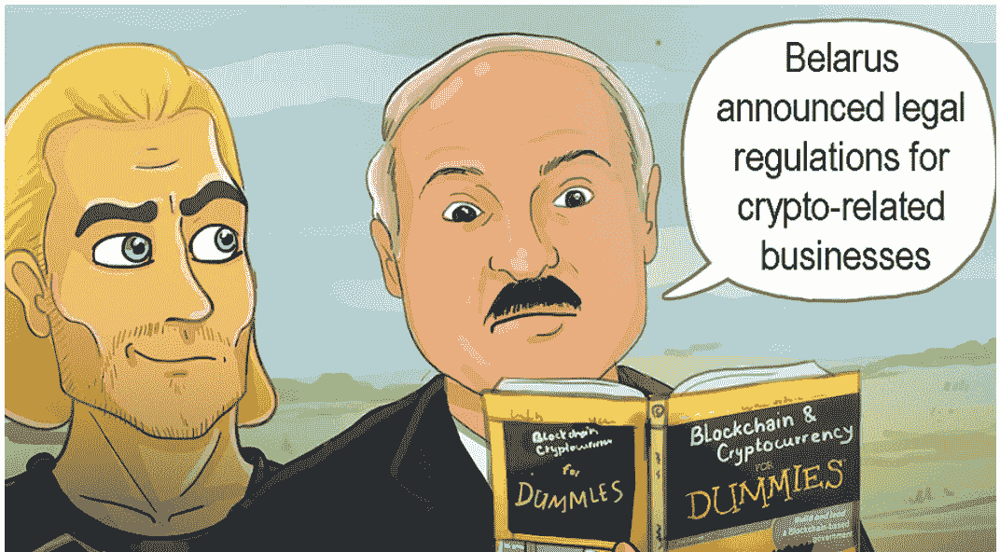

# 白俄罗斯的加密法规:设定权利和责任的文件

> 原文：<https://medium.datadriveninvestor.com/crypto-regulations-in-belarus-documents-set-rights-and-responsibilities-8e65921b0edd?source=collection_archive---------22----------------------->

在收获季节的最近一天，11 月 30 日，白俄罗斯报告了与密码有关的组织的合法方向。所有居住在白俄罗斯高科技园区的组织都得到了财务总监的帮助。

公园的组织，连同国家的国家银行，国家控制委员会，通用专家和不同的机构，已经标记了所有的相关记录，使数字货币得到合法维护。有八个中心问题将控制加密货币相关的行动。数字货币是合法的，但是，这些公司有待检查。

 [## Azbit 旨在连接传统金融和加密货币-数据驱动的投资者

### Azbit 是下一个提供交易平台的加密项目，该平台提供保证金和算法交易。一样多…

www.datadriveninvestor.com](https://www.datadriveninvestor.com/2019/03/20/azbit-aims-to-connect-traditional-finance-and-cryptocurrency/) 

**加密货币合法，但公司有待检查**

根据关于数字经济发展的第 8 号法令，所有加密货币交易、采矿管理员以及所有与采矿仪器相关的任务。精明的合同、代币、区块链等等目前都被合法化了。此外，在 2023 年 1 月 1 日之前，所有使用代币的任务都不征收增值税。

此外，该指示要求所有组织符合 FATF 的需要，有高度的业务措施，并实现一个框架，以打击非法避税和犯罪相关的秘密运动。所有这一切，连同工作人员的恶名、预算资源来源和网络安全，都将受到白俄罗斯高科技园区(HTP)的检查。

这些报告设定了高科技园区内每个加密组织应该遵循的先决条件和基准的范围。这些包括可识别的证据并检查一切是否平等，董事会估计的与打击非法避税和基于恐惧的压迫融资相关的风险，整合与犯罪活动相关人员资源的能力，反洗钱合规官的工作以及相关资质和培训。

该报告还为 HTP 组织设置了与货币相关的必需品，表明数字货币交易管理员、ICO 持有者、加密相关专业人员和员工以及信息安全的一致性重点。

监管可能会促进该国数字市场的发展

全球加密网络对这些控制措施表示欢迎，称它们是处理先进资源的特殊方式，可能有助于白俄罗斯的加密货币行业，并推动不同国家追求领先地位。

支持密码相关组织和动态基金会的合法理由可能会吸引世界范围的组织在该国开展活动。