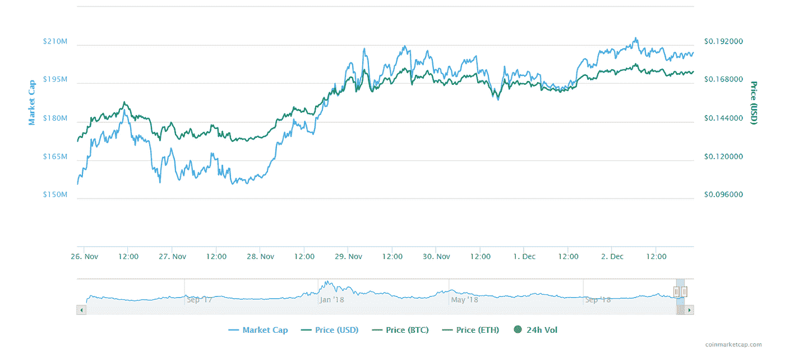
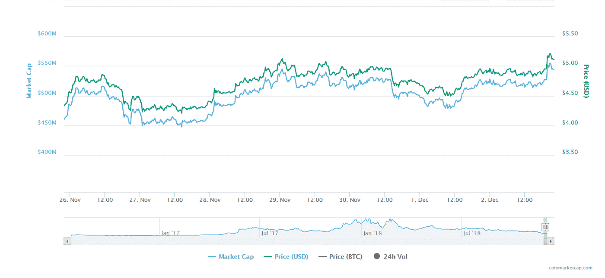
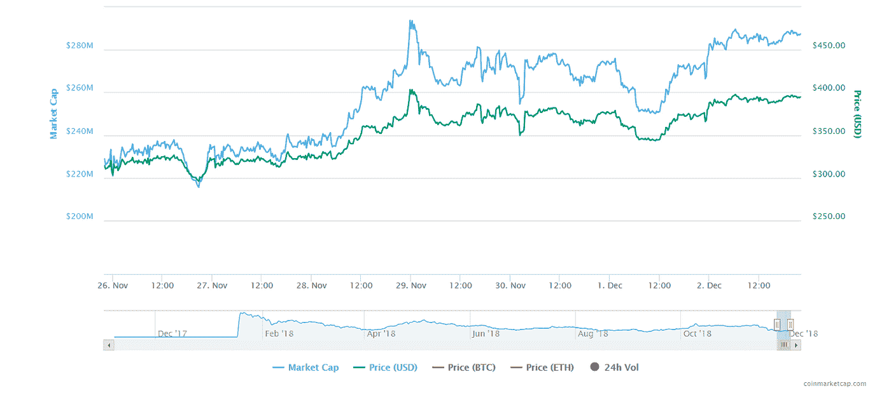

# 加密回顾:本周回顾

> 原文：<https://medium.datadriveninvestor.com/crypto-review-recap-of-the-week-d1d2109591d3?source=collection_archive---------44----------------------->

本周，许多加密货币的价格已经回升。与上周相比，我们可以看到价格和市值都有所上升。例如，比特币从 3771.22 美元(25。2018 年 11 月)至 4，149.58 美元(2。2018 年 12 月)。然而，比特币的价格和市值在本周高于周末。11 月 29 日，它的价格涨到了 4403.51 美元，Ripple (XRP)也是如此。但有些加密货币没有面临这个问题，有些遇到了但性能很高；

**基础注意力币**

先说基础注意力币(BAT)；一周前是 0.1317 美元。BAT 在这一周没有受到市场暴跌的影响，截至今天(2。2018 年 12 月)，它的定价为 0.1752 美元，这意味着它的价格上涨了约 33%。同样的事情也发生在蝙蝠的市值上(从 155，560，263 -> 207，111，798)

**恒星**

虽然本周恒星受到了市场的影响，但值得一提的是，恒星一如既往地强大。截至目前，Stellar 的市值排名第四。XLM 对美元的汇率从 0.138 美元升至 0.1605 美元。

**以太坊经典(ETC)**

以太坊经典(ETC)不同于以太坊(ETH)。虽然 ETH 本周没有显著的表现，但 ETC 却有。这是少数几个在一周内上涨的加密货币之一，现在它处于最高水平(从 11 月 25 日至今的价格来看)。本周初，ETC 的价格为 4.33 美元，而目前的挂牌价格为 5.21 美元，涨幅约为 22%。

**制造者(MKR)**

排在第 22 位的 Maker coin 本周表现优异。虽然受市场影响很小，但我们看到了 25%的增长。按照 MKR/美元的比率，它从 314.29 美元涨到 394.63 美元，按市值计算，它从 228，871，792 美元涨到 287，377，680 美元。

