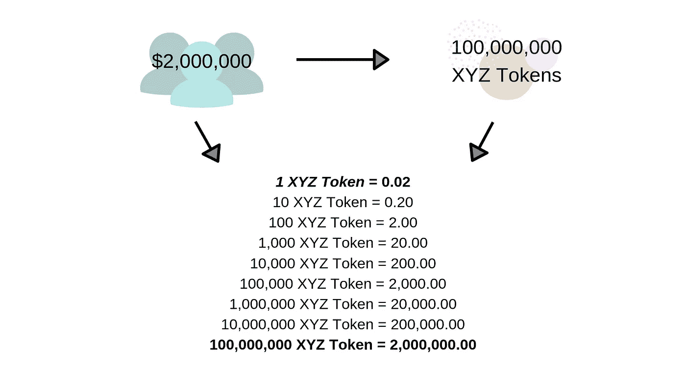
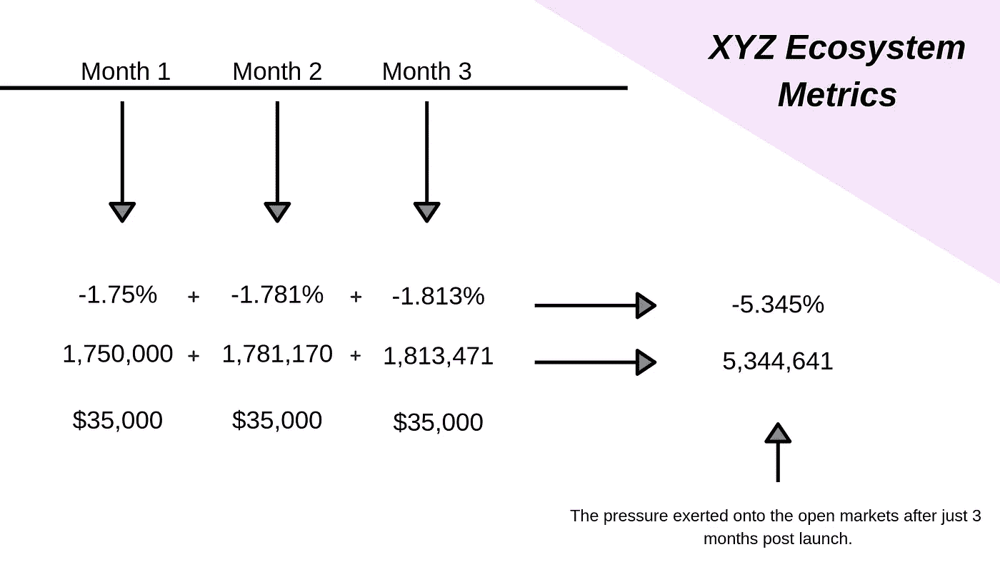

# 内部意外删除

> 原文：<https://medium.datadriveninvestor.com/crypto-theory-internal-unintended-expungment-ef0c0253897b?source=collection_archive---------28----------------------->

## 替代数字资产评估的加密理论

> 改还是不改，这是个问题…

当一个未经测试的数字经济学模型遭遇全球经济的残酷现实时，会发生什么？

你即将坐上一个加密项目的驾驶座，并开始感受到经济学在有关加密项目长期可行性的所有事情中所扮演的角色。在蓝宝系好安全带(由 XYZ 网络加密项目提供)，我们走吧。你正在通过自己的眼睛建设去中心化加密的未来，这就是方法:

> 我试图避开复杂的数学和技术细节:保持门外汉的身份

让我们用现实世界经济学和简单代数的一点混合来开始这个聚会。

你想利用 DLT /区块链技术的力量，创建一个可证明是公平的赌博平台。要做到这一点，你需要一个团队，让我们只是为了它说 7 人。然而，你没有自己的资金来使用和筹集资金。咿呀，恭喜你！；你成功筹集了 200 万美元。现在你开始比赛，发展，建立关系网，旅行，举办活动，雇佣新人，解雇老员工；更不用说你是在一个不受监管、无组织、仍极度不发达的市场中做这件事的。

👇👇 — — — — — — — 👇👇

> 如果我们开始将传统的供求经济因素和自然市场条件(订单等)纳入这幅图景，情况会变得非常糟糕——非常快。哦，是的，我们怎么能忘记已经普遍的熊市，这只会加剧倾盆大雨的严重性！让我们把那些“额外的不可预见的”网络、旅行和设备成本扔进去，然后，不知不觉地，仅仅一年……你的整个 ***项目的运营成本超过了它在相邻时间*** 所能创造的价值，基础令牌资产现在完全由市场决定。
> 
> 因此，我们将假设市场对该资产不看跌或看涨，并且该资产不受外部影响(供求、操纵等)；请注意，我们将不包括有关市场因素[订单、滑点等]或美元价值波动或全球经济购买力的指标。同样，我们也不会考虑旅行、饮食、网络、设备等成本的复合效应。

☝☝ — — — — — — — — — — ☝☝

在积累 200 万美元的过程中，你*创造了*一个相应的有价值的加密生态系统；为了好玩，就说 100，000，000 代币吧。这意味着:

这么说吧，每个团队成员都需要在这个项目上呆上 5 年。每个月他们必须得到 5000 美元的补偿。[5000 美元 x 12 个月= 60000 美元 x 5 年= 300000 美元。]现在，你的团队在加密之外生活，需要用法定货币来支持这种生活。虽然积累代币很棒，但这并不能维持他们现在的生活。因此，第一个月过去了，7 个人得到了 35，000 美元(或 1，750，000 XYZ 代币)。他们转身在市场上以*的价格*变现，以维持他们活跃的气氛。当全部代币供应量的 1.75%流入公开市场时，价格就会下降。{[我不会提出滑点、订单等突出的市场因素]}我们只是假设经济是平稳的。3.5 万美元刚好留下了一个 200 万美元的生态系统；使 XYZ 网络达到 1965000 美元(现在同样的令牌价值减少了 1.75%)。1 XYZ = 0.01965)

第二个月到来了:7 名团队成员需要再次获得 35，000 美元的工资；再一次，在 XYZ 的令牌中。现在，按照目前的代币价值，他们必须获得:1.781%的代币或 1，781，170.48 个代币。现在，1，781，170.48 枚代币被投入市场。再减去 35000 美元。正如您可能已经理解的那样，同样的 35，000 美元对网络的内在价值影响更大，网络的价值越低。

第三个月，又到了补偿员工的时候了，因为他们把你的愿景变成了现实。自上次抛售以来，XYZ 网络继续稳定在 193 万美元。你用 XYZ 本地代币向你的团队支付 35，000 美元。鉴于这种方法的复合性质，代币需求的原始数量增加到 1，813，471.50 代币或总供应量的 1.813%。

你开始画出这个球在哪里滚动了吗？

# 让投降开始吧！

快速回顾和重组思想:

市场再也不能忽视这种不断重复出现的模式，那些我们长期以来避免的因素开始悄然出现。普遍的理解是，这种资产本身就是被设计成在自身重量下崩溃的(只要这种代币不是突然被过度需求)。)我说的“市场”指的是经验丰富得多的社会成员，也就是专业人士&做市商。

> 在接受某件事之前，请 ***DYOR。***

今天，在秘密世界中，类似的经济“模型”是许多项目的基础……显然，一些项目正在证明它们的有效性，例如[币安(BNB)](https://coinmarketcap.com/currencies/binance-coin/)

其他的，可能就没那么多了。我们就拿 [FunFair(FUN)](https://coinmarketcap.com/currencies/funfair/) 做这种情况下的对应物吧。([趣味博览会绝不是一个失败——只是请 dyor](https://funfair.io/) ，然而，我只是在强调，市场喜欢把它当作一个失败)

*   我们会责怪那些选择将项目资产价值与资金筹集相关联的自我肯定的指标吗？
*   我们会因为接受这些标准而责怪自己吗？
*   我们会责怪项目没有向我们解释这一点吗？

现在指责已经太晚了。

我必须说，世界现在可以创造自己的经济模式，这一事实几乎是高尚的；同样令人失望的是，为了检验其生存能力，必须有人遭受痛苦。

***“并不是所有的项目都会受到这种意想不到的内部破坏力量的影响！”***

通过死亡阴谋论、金融投降和技术困难的无休止打击，一些替代数字资产(也称为替代硬币)已经平静地前往月球。以下是其中的几个例子:

*   [占卜者(代表)](https://coinmarketcap.com/currencies/augur/)
*   [链环(LINK)](https://coinmarketcap.com/currencies/chainlink/)
*   [波浪(WAVES)](https://coinmarketcap.com/currencies/waves/)
*   [齐利奎(ZIL)](https://coinmarketcap.com/currencies/zilliqa/)
*   [创(TRX)](https://coinmarketcap.com/currencies/tron/)

> 如果你觉得有点冒险，我恳求你冒险进入 coinmarketcap.com 或 T21 的秘密的兔子洞去做你自己的研究

2018 年隐秘的冬天/熊市的影响仍然挥之不去，那些；我们中参与隐密体的人开始注意到好像一些光已经开始闪耀。

雪会融化并滋养发芽的新种子。

🕋👘愿区块链与你同在👘 🕋

## 来自 DDI 的相关故事:

 [## 股票市场投资的机器学习

### 当你的一个朋友在脸书上传你的新海滩照，平台建议给你的脸加上标签，这是…

medium.com](https://medium.com/datadriveninvestor/machine-learning-for-stock-market-investing-f90ad3478b64)