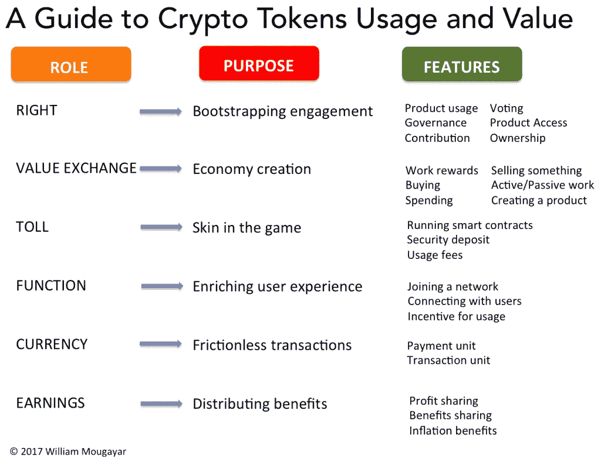
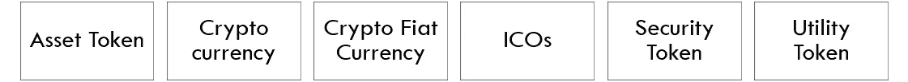
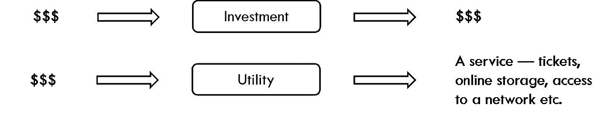
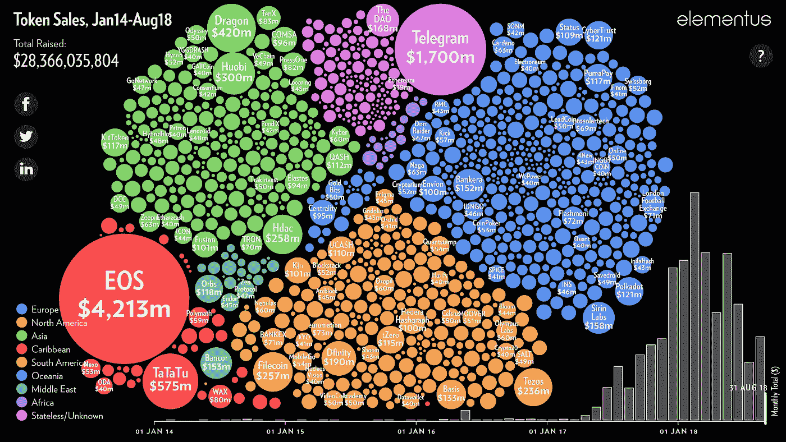
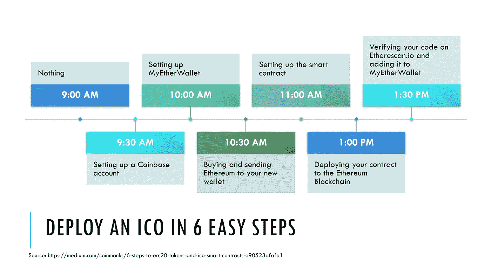
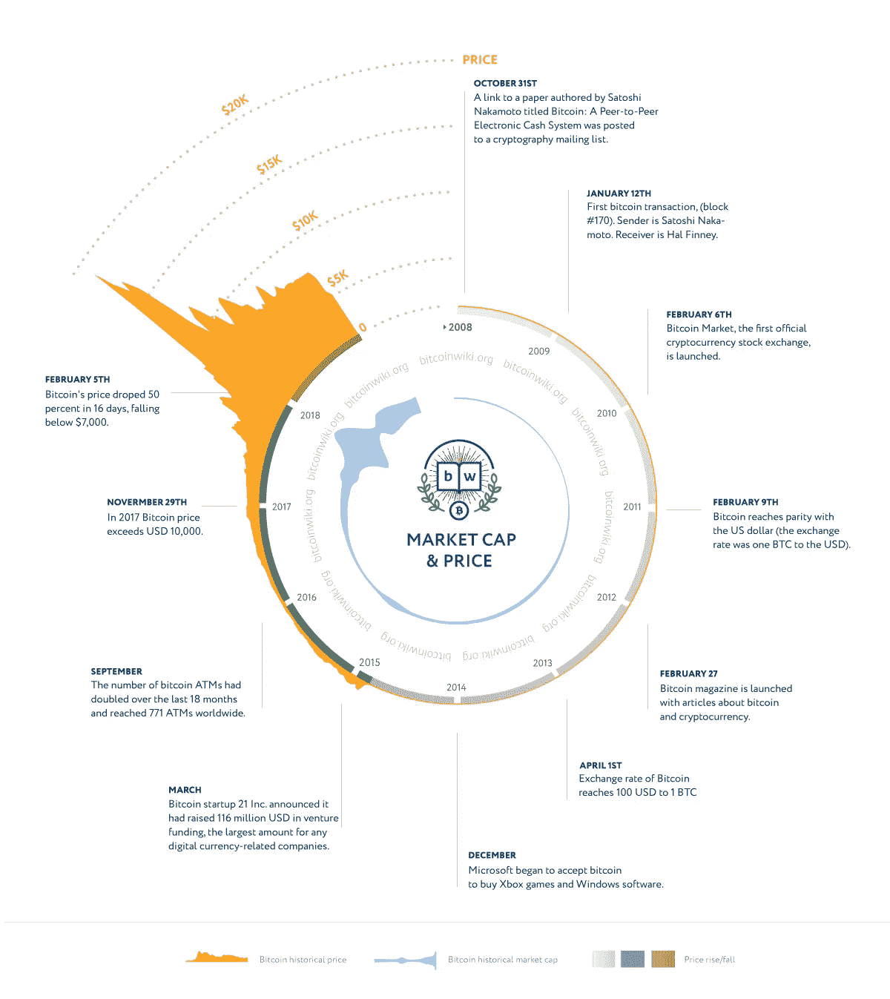

# 2018 年的加密崩溃——它加强了代币经济吗？

> 原文：<https://medium.datadriveninvestor.com/crypto-tokens-after-the-crypto-crash-4ce774150926?source=collection_archive---------1----------------------->

## 了解什么是加密令牌，为什么加密货币崩溃，为什么它对行业来说是一件好事，以及接下来可能会发生什么

[This Photo](https://geobrava.wordpress.com/2018/05/19/8-trends-shaping-the-future-of-blockchain/) by Unknown Author is licensed under [CC BY-SA](https://creativecommons.org/licenses/by-sa/3.0/)

网络泡沫最近才在本世纪头几年破裂。近 16 年后，我们正处于另一场壮观的崩溃之中——2018 年的加密崩溃。在不到一年的时间里，超过 80%的加密货币价值化为乌有——如果我们继续计分的话，这比互联网泡沫破裂期间 78%的价值损失还要糟糕。

尽管如此，许多人预测，事情应该从这里开始改善，这次崩溃为生态系统的重新校准铺平了道路，以便从总体上受益于加密令牌。加密资源和平台可能会从只关注货币和众筹应用转向将其投资组合扩展到更具实用性的项目，并在其他传统行业获得进一步的合法性。

> 加密崩溃加强了代币经济吗？

在我们试图回答之前，让我们回顾一下令牌经济的组成部分-从令牌的概念开始，然后是各种加密令牌，包括加密货币、ico、其他安全令牌，以及它们的应用、法律环境、最近的事件和 2018 年的加密崩溃。最后，让我们探索加密令牌和区块链技术是否总的来说将从崩溃中受益，并成为许多行业的下一代标准。以下章节包括—

*   代币——司空见惯
*   令牌可以是数字的，即加密令牌
*   加密令牌—实用程序
*   加密令牌的应用
*   加密令牌——优点、缺点和风险
*   加密令牌和规则
*   首次硬币发行(ico)
*   ERC 标准
*   2018 年市场事件和监管趋势
*   下一步是什么？

# 1.代币——司空见惯

多伦多(我们称之为 TTC)的交通系统和许多其他城市一样，使用代币。代币带有服务承诺——单程旅行或价值——单程票价。同样，在赌场，我们得到代表钱的代币。股票和债券也是代币，因为它们代表一定的价值和投票权或对一定金额或资产的权利。同样，可以认为纸币也是代币。连电影票都是代币。

> 代币是一种资产的表示，可以是产品、服务、权利或金钱。很简单。

单词“表示”是关键，因为没有任何标记具有任何内在价值。然而，它的价值来自于代表某种资产——产品、服务、权利、投资等等。因此，代币的价值之所以存在，是因为发行者承诺交付它所代表的资产。在大多数情况下，这也是有法律支持的。例如，我的地铁代币中没有任何东西能确保我支付 3 美元或单程票价——但只有 TTC 兑现代币的承诺，以及我对 TTC 信守承诺的信心，才使代币对我有价值和有用。如果 TTC 不兑现大量代币，也可能采取法律行动。

> 纸币是代币吗？是的，他们是。

同样，任何地方的任何纸币都没有内在价值——它是一张没有任何支撑的印刷纸张——除了国家法律，它承载着发行银行和政府的承诺，以及许多对这些实体有信心的用户。股票或债券是类似的，其价值是由投机和供求经济学得出的，这是由发行者的声誉和对他们兑现金额的期望引起的，这在许多国家是受法律约束的。

总而言之，任何纸币或代币——债券、股票、地铁代币等——都没有内在价值。，该值由几个因素得出—

*   对发行实体兑现承诺价值的期望——出于善意或避免名誉损失或法律诉讼
*   政府、法律和法规在大多数情况下保护这些权利，并确保在出现争议时进行补救
*   投机和供求经济学由于它们的效用

# 2.令牌可以是数字的，即加密令牌

现在，在一个数字时代，当每个数据都以数字形式存储时，如果我们将物理令牌(比如说我的 TTC 令牌)转换为数字令牌，会怎么样呢？如果这仅仅是通过拍摄物理令牌的照片并在手机上进行数字存储来实现的，TTC 会同意兑现这一价值吗？

不，当然不是。原因是一个众所周知的问题，叫做“双重花费问题”——因为这是一张数字照片，我可以复制和创建尽可能多的副本，这样我和其他所有我认识和不认识的人就可以永远免费乘坐多伦多地铁。

为了创造在线数字货币，隐私活动家和数学家们从 80 年代开始就致力于解决这个“双重花费问题”——使用加密技术，如哈希和数据链。然而，他们的许多想法——先进的加密技术——未能成为可用的产品——它们要么在某些方面存在缺陷，要么超越了时代。我的另一篇[文章](https://medium.com/datadriveninvestor/cypherpunks-to-satoshi-to-ibm-819ebcfdd674)更详细地介绍了这一旅程。

**第一个成功的数字在线货币产品恰好是比特币，于 2009 年 1 月推出。比特币的底层技术被称为区块链。**

如果你想更详细地了解区块链技术，请查看我的另一篇[文章](https://medium.com/techemerge/blockchain-is-the-future-of-business-and-the-future-is-here-f3ad0932d3e0)，这是一篇 30 分钟的快速阅读。

> 数字令牌是用解决“双重花费问题”的加密锁定机制构建的。

然而，我们仍然要记住，与物理代币完全类似，兑现价值仍然是发行者和生态系统的责任，通常，比特币或加密货币或 ico 或任何其他使用区块链或加密平台发行的代币都不包含内在价值。因此，除了确保正确的技术之外，在发布这些技术时，还必须遵循合法流程和支持的正确使用。

虽然我们以同样的观点讨论了它们，并认为它们在根本上非常相似，但代币和货币之间的一个关键区别是，货币在特定平台或生态系统之外保留价值，而代币则没有。例如，我的 TTC 代币在 TTC 之外不被接受，比如说在咖啡店或另一个城市，而纸币可以在另一个国家兑换成另一种货币——因此，仍然可以使用并具有其价值。

类似地，对于加密货币比特币和以太坊，它们在其平台之外进行交易并具有价值，而使用相同技术开发的许多其他数字令牌(如公用令牌)则不具有价值。

# 3.加密令牌—实用程序

作家兼区块链理论家，[威廉·穆加耶](https://medium.com/u/f826ec76344e?source=post_page-----4ce774150926--------------------------------)在他的 [2017 年文章](https://medium.com/@wmougayar/tokenomics-a-business-guide-to-token-usage-utility-and-value-b19242053416)中提出，数字令牌可以基于其效用的三个维度进行评估——角色、目的和功能。

[This Picture](https://cdn-images-1.medium.com/max/1200/0*bN61G7xjVHTKwMbq.png) is from this [Article](https://medium.com/@wmougayar/tokenomics-a-business-guide-to-token-usage-utility-and-value-b19242053416) by [William Mougayar](https://medium.com/u/f826ec76344e?source=post_page-----4ce774150926--------------------------------)

加密令牌的多功能性允许它们用于不同的角色和目的，以生成各种特征。

*   允许平台中的权限的令牌—这可以是访问、治理、投票—例如 Numerai、Tezos
*   网络内的价值交换，从而维持平台内的经济性，例如 Steemit、Kik
*   支付一定的费用以获得操作智能合同的权限，或者支付保证金或使用费——例如在 Gnosis 或 Augur 中
*   功能可以包括平台内的加入或联网，其中令牌为平台的使用提供激励，例如 Dfinity、Brave
*   货币或加密货币是数字代币最广为人知的应用。最好的例子是比特币、以太坊
*   最后，代币可以被构造成接收收入或利润或利益分享，所有这一切都可能是由于在区块链上运行的智能合约。

# 4.加密令牌的应用

根据所讨论的实用程序，可以看到这些令牌的应用程序可以采取各种形式。

在许多情况下，流程保持不变。但是，基础资产以及合同的各个方面都会发生变化。一些更常见的应用是—

*   资产令牌—代表自然资产，包括石油和黄金等贵金属
*   加密货币——代表数字货币——比特币、以太坊
*   加密法定货币——代表国家法定货币，最近的例子是委内瑞拉的石油
*   ico 或初始硬币发行——代表新创建的数字股票或硬币的首次发行，旨在像 IPO 一样筹集资金
*   sto 或证券令牌——代表基础投资(或证券)资产
*   公用事业代币——代表潜在的非投资资产

# 5.加密令牌——优点、缺点和风险

加密令牌与传统令牌相比有几个优点。由于整个执行流程都是数字化的，例如减少文书工作，使用区块链技术实现去中介化，例如减少中介，使用智能合同实现业务逻辑，例如提高自动化程度。

*   自动化—使用区块链和智能合同来实现业务逻辑，确保流程的自动化，从而简化和减轻执行负担
*   成本——区块链提供非中介化，因此减少了中间商和费用；数字化流程以及智能合同的使用确保降低复杂性，减少文书工作，再次简化流程，降低成本
*   规模—数字化，可以很容易地与互联网集成，并向全球受众销售
*   速度——区块链实现了去中介化，消除了许多中间人，从而加快了首次公开发行和后续交易的过程

一些缺点和风险是—

*   小型生态系统——因为密码仍然是一项相对较新的技术，只有一小部分开发者、机构和散户投资者使用
*   隐私风险——像任何众筹一样，这是一种非常公开和透明的融资方式，在保护包括 IP 地址和其他专有信息在内的隐私方面可能具有挑战性。聘请律师会有所帮助
*   履行——大多数代币销售和 ico 未能达到目标——会影响品牌和声誉

# 6.加密令牌和规则

脱媒不应该是规避法律。

我们看到数字令牌以不可复制的数字格式表示资产。因此，这些是资产，应当属于管辖资产的所有法律准则的范围。此外，代币的几个用例反映了传统证券，因此，这些用例应遵循所有证券法规/指导原则。

## 豪威测试——确定一项资产是否是证券

这一测试源于 1946 年最高法院的一个案例，旨在确定一项交易是否属于证券投资——如果是，则需要在美国证券交易委员会(SEC)注册。根据[豪威测试](https://consumer.findlaw.com/securities-law/what-is-the-howey-test.html)，交易成为一项投资，如果—

1.  这是金钱的投资
2.  人们期望从投资中获得利润
3.  钱的投资是在一个共同的企业
4.  任何利润都来自于推广者或第三方的努力

货币一词后来被扩展到包括除货币以外的资产。同样，根据具体情况，不同的术语(如普通企业)可以有不同的解释。最重要的是，如果利润不是来自投资者，而是来自发起人或第三方，那么交易很可能被归类为投资，从而被视为证券。因此，应遵守所有证券法规，包括 SEC 备案。

在 90 年代有一些其他的替代测试来确定这一点。最近一段时间，尤其是 2016 年的刀黑事件之后，的[文章](https://medium.com/@pullnews/understanding-the-dao-hack-for-journalists-2312dd43e993)是一个很好的阅读。在其他几次盗窃和加密货币价格大幅波动之后，美国证券交易委员会从 2017 年底开始变得更加警惕。

## 安全令牌与实用令牌

如果数字令牌被视为代表投资或安全资产(通过 Howey 和其他测试),则应遵循证券法规和程序，以保持合规性并避免处罚。一般来说，这些都是作为投资来交易的。

公用令牌在一个生态系统中工作——想想 TTC 令牌——并允许权限或服务等。仅在特定网络中。这些不是证券工具，因此不需要在 SEC 备案。

## 法规—针对安全令牌

根据辖区的不同，安全令牌可能会受到各种规则的约束。Anthony Pompliano 在他的第[篇文章](https://medium.com/@apompliano/the-official-guide-to-tokenized-securities-44e8342bb24f)中介绍了美国与安全令牌相关的法规。

**法规 D** —允许避免在美国证券交易委员会注册，要求在发行后以电子形式提交“表格 D”

**法规 A+** —要求向 SEC 注册，与其他选项相比需要更长时间

**法规 S** —如果在美国境外发行，无需向 SEC 备案，但仍需遵守发行地所在国家的法规

> 毫无疑问，安全令牌代表证券，因此，应遵守提供安全令牌的国家的所有法律法规要求

*免责声明—这些美国证券法的概述，包括法规 D、A+和 S，是我的个人观点。它们不应被用作法律或投资建议。人们应该向律师咨询法律和法规方面的问题。*

简而言之，除了少数实用程序之外，几乎所有加密令牌都可以被认为是安全的，因此都要遵守每个管辖区的安全法规。适用的规则已有近 70 至 80 年的历史，引用的先例来自 20 世纪 40 年代关于柑橘林的争端，当时没有任何与数字有丝毫关系的东西被公开使用，更不用说加密了。这些都是过时的政策、先例和法规，迫切需要新的努力和语言来定义和监管这个 21 世纪的行业，以帮助它蓬勃发展，发挥其潜力，并改造几乎所有其他行业。

# 7.首次硬币发行(ico)

比特币是第一个区块链公共平台，开发时考虑了一组特定的功能——一种货币和点对点数字现金应用，因此它允许开发人员进行非常少的定制或编程能力。

以太坊的发明者 Vitalik Buterin 看到了这一差距，并本着可编程的思想开发了以太坊平台。以太坊虚拟机是一个运行在以太坊网络上的独立软件，它正在走向完善——这意味着它可以用来运行任何软件程序——这使得创建多样化区块链应用程序的过程比以前更加容易，超越了货币和点对点支付。

## 前以太坊 ICOs

2013 年，Ripple Labs 创造并出售了 1000 亿枚 XRP 代币来资助 Ripple 平台的开发。

2013 年晚些时候，Mastercoin 在比特币交易的基础上建立了代币，并出售了近 100 万枚 Mastercoin 代币。

## 以太坊

到 2014 年年中，以太坊推出了，该基金会出售了近 6000 万枚代币，当时筹集了 1840 万美元——这使其成为有史以来最成功的众筹项目之一。

以太坊使智能合约能够在其平台上运行，这是以太坊如此成功的关键原因之一——开发人员可以创建各种应用程序和功能，允许为交易的发生专门构建规则和逻辑。与标准契约和执行机制不同，这些智能契约一旦构建和部署，就像业务逻辑的自动执行一样，没有任何例外。以太坊吸引了大量开发者的关注和行动，因为它允许开发者以最小的限制创建他们想要的任何东西。开发人员仅仅被他们的想象力所限制，开发了无数的应用程序，比以前在任何区块链平台上看到的都要多得多。

以太坊平台释放了分散系统的力量，允许智能合约构建加密令牌作为初始硬币产品。以太坊平台上的 ERC-20 成为使用加密令牌进行众筹的事实标准——最初的硬币发行或 ico 成为主流。

## 数据访问对象(Data Access Object)

2016 年，一家初创公司致力于建立一个去中心化的自治组织，被恰当地命名为“道”目标是创建一个没有任何人管理投资的自主风险投资公司——相当智能的代码将为这些行动提供逻辑和自动化。

这家初创公司在以太坊(Ethereum)网络上推出，经历了一次非常成功的代币销售，筹集了大约 1.5 亿美元。

发布后不久，利用智能代码中的缺陷，大约 5000 万美元被一个未知的攻击者吸走。以太坊平台是健全的，失败是在 DAO 开发人员的代码中，这使得它容易受到黑客攻击。然而，考虑到被盗资金的数量和情况的严重性，以太坊社区投票决定通过更改已发布软件中的代码，创建一个硬分叉，并将被盗以太转移到合法所有者手中来找回被盗资金。

虽然 hard fork 解决方案找回了被盗资金，因此在一定程度上恢复了对平台的信心，但篡改已编写代码和撤销交易的优先权违背了任何区块链解决方案的基本结构和价值主张，即安全性、不变性、防篡改架构和匿名性。

刀被黑后失效。

## 代币销售热潮始于 2016 年

DAO hack 制造了新闻，并且可以说，有助于传播 ico 的消息，吸引了更多的开发人员。

使用 ERC-20 在以太坊平台上构建令牌的便利性以及利用智能合约添加更多创新功能的灵活性绝对是吸引许多开发者和 ico 的杀手锏。

这一切都始于过去几年，以太坊平台上的 Etherscan.io [展示了](https://etherscan.io/tokens)超过 158，000 份令牌合约，这难道不令人惊讶吗？即使其中 90%以上都是单次计时和试玩，但兴趣和活跃度之高令人咋舌。

根据 [Max Galka](https://medium.com/u/2cdc2c01f16c?source=post_page-----4ce774150926--------------------------------) 的[文章](https://hackernoon.com/the-ico-market-is-not-collapsing-its-maturing-c11bfd4cdfe8)，Elementus.io 的代币销售已经筹集了大约 280 亿美元，在 2014 年或 2015 年几乎没有任何东西，然后从以太坊开始，然后在 2016 年开始，然后从 2017 年年中开始，直到 2018 年 8 月，数量和金额都出现了爆炸。你也应该看看优秀的[动画](https://hackernoon.com/the-ico-market-is-not-collapsing-its-maturing-c11bfd4cdfe8)。

A Visual History of Token Sales, source: [Elementus.IO](https://elementus.io/token-sales-history)

## 通过 6 个简单的步骤部署 ico

以太坊平台使得开发和部署 ico 变得非常容易。

遵循区块链开发者 Stephen Hall 的方法，如本文所示，任何人都可以按照简单的指令从零开始创建一个功能性的 ICO。也许只需几个小时，您就可以部署和验证您全新的 ICO。

[ICO6Steps1](https://flickr.com/photos/166102838@N03/45520269055) flickr photo by [sombando](https://flickr.com/people/166102838@N03) shared under a [Creative Commons (BY-SA) license](https://creativecommons.org/licenses/by-sa/2.0/)

一次 IPO 需要几个团队月复一月的工作。ICO 是首次公开募股的加密版本。我们看到，只需几个小时，坐在笔记本电脑上，用一部电话和一张信用卡，就可以定义一个功能产品的大致结构。这清楚地表明了这项技术的革命性。

但是，请注意，这里介绍的这些步骤更像是构建一个 ICO 的基本结构——作为比较，比方说，一个使用 HTML 的“Hello World”页面——与任何实际资产或价值无关。这里的重点不是提倡在几个小时内或没有任何开发人员的情况下构建 ico，而是以太坊平台使这个过程变得更加简单。

# 8.ERC 标准

ERC 20 代币现在可以在 Hyperledger 上[使用](https://www.techracers.com/blogs/erc20-tokens-hyperledger/)；然而，在本节中，我们将主要关注以太坊平台，讨论数字令牌的构造和部署。

第一个也是最广泛使用的标准 ERC-20 仍然是至高无上的，超过 90%的项目使用这个标准。第二代标准修复了它的一些缺陷，并增加了符合法规的功能。

## 什么是 ERC

ERC 代表 [**以太坊征求意见**](https://en.wikipedia.org/wiki/ERC-20) —这些是以太坊平台上创建数字令牌的标准。可以理解为仅仅是一个预构建的容器或结构，其中，可以填充某些细节，然后快速编译和启动令牌。

## [ERC-20](https://en.wikipedia.org/wiki/ERC-20)

以太坊平台上使用最多的数字令牌标准，到目前为止，超过 90%的数字令牌使用该标准，实际上有成千上万的令牌使用该标准构建。

它成功的关键在于它的简单性——只需要 6 个基本函数来创建令牌——

*   **allowance() —** 在添加到链之前确保交易的有效性
*   **approve() —** 是保持总令牌供应不变的功能
*   **balanceOf() —** 跟踪每个用户钱包中的令牌余额
*   **totalSupply() —** 确定要创建的代币总数
*   **transfer() —** 用于将代币初始转移到参与者的地址
*   **transferFrom() —** 代币持有者在初始转账后发送代币

然而，有一些设计缺陷，包括一个严重的问题，已经造成了大约 300 万美元的损失。该缺陷源于向智能合约发送令牌的过程与向普通钱包发送令牌的过程不同，并且在有人错误地使用其他错误的方法向智能合约发送令牌的情况下，令牌会永久丢失。

## [ERC-223](http://blockchainers.org/index.php/tag/erc-223/)

该标准弥补了 ERC-20 的设计缺陷，并向后兼容 ERC-20。同样，只使用一半的“气体”，这是以太坊网络内的交易费。

然而，到目前为止还没有受到开发者的欢迎。

## [ERC 721](http://erc721.org/)

允许创建不可替换的令牌(称为 NFT)，这实质上意味着并非所有令牌都是相同的，因此可用于对同一网络中的资产或不同价值进行令牌化。

这是很多[项目](http://erc721.org/)都支持的，包括 0x 协议，Toshi，OpenSea。

## [ERC-777](http://blockchainers.org/index.php/tag/erc-223/)

除了修复 ERC-20 中的关键设计缺陷并向后兼容 ERC-20，该标准还改进了令牌的发送方式——使用相同的函数发送 ETH，从而减少了与以太坊用户的摩擦。

根据这个标准，Everett Muzzy 写了一篇优秀的[文章](https://medium.com/coinmonks/an-introduction-to-ethereums-erc-777-standard-3cf2fb46b567)。此外，它允许创建单独的用户组，使系统更加可定制。

## [ERC-1404](https://medium.com/erc1404/erc-1404-simple-restricted-token-standard-f71290a48faa)

针对交易所之间的法规遵从性和互操作性而开发—该标准允许更轻松地与传统的银行和监管备案流程集成。

TokeSoft 的首席执行官 Mason 写了一篇精彩的[文章](https://medium.com/erc1404/erc-1404-simple-restricted-token-standard-f71290a48faa)介绍 ERC-1404:简单受限令牌标准，他写道

> " ERC-1404 是考虑到公司治理、银行和证券法而开发的一种象征性标准."

[Erc1404.org](https://erc1404.org/)列举了它的几个好处，包括—

*   设定投资者限额
*   实施投资者白名单，从而限制受制裁的实体
*   实施全球一致的单一监管标准
*   遵循法律顾问建议的工具
*   跨交易所的互操作性
*   符合国内/国际法规

# 9.2018 年市场事件和监管趋势

## [加密崩溃— 2018](https://en.wikipedia.org/wiki/2018_cryptocurrency_crash)

继 2017 年比特币价格出现前所未有的繁荣之后，大多数加密货币的抛售从 2018 年 1 月开始，到 2 月的第一周，比特币价格下跌了约 65%。随后，几乎所有其他加密货币都崩溃了。

2018 年第一季度，加密货币的市值损失了近 3420 亿美元。到 2018 年 9 月，加密货币比 2018 年 1 月的峰值下跌了 80%，这一崩溃与互联网泡沫的崩溃相当，但在数字上比互联网泡沫的崩溃差了几个百分点，互联网泡沫的价值损失了 78%。

Bitcoin price history from [Bitcoinwiki.org](https://en.bitcoinwiki.org/wiki/File:Bitcoin_history_price.jpg)

这些工具惊人的全球规模和影响力也使它们容易受到全球范围内抛售的影响，从而加剧了它们的波动性。价格稳定是现在恢复对这个行业和一般加密区块链技术的信心的关键因素。

导致事故的几个原因正在讨论中—

*   对新技术的大肆宣传制造了泡沫，这些泡沫最终会破裂(还记得网络公司吗)
*   怀疑与黑钱有关的负面情绪(想想毒贩)
*   匿名引发的负面情绪往往等同于非法
*   投机和操纵行为(泵和转储方案、系绳)
*   由于多个加密交换被黑，媒体报道不佳
*   担心政府不接受加密货币
*   缺乏监管透明度
*   比特币 ETF 延迟

## 数字资产市场协会(ADAM)—2018 年 11 月

[Newsbtc 报道](https://www.newsbtc.com/2018/11/28/ten-u-s-crypto-firms-set-to-draft-code-of-conduct-for-digital-asset-market/)上个月，活跃在加密货币领域的十家领先的金融服务和技术公司联手推出了 ADAM，目标是与金融监管机构密切合作，为这一新兴资产类别建立行为准则，从而赢得政策制定者的信任。

通过引入一些游戏规则来恢复信心，这是维持加密货币的必要步骤，也是朝着正确方向迈出的一步。

> “200 多年前，市场领袖聚集在一起起草规则，促成了纽约证券交易所的成立。数字资产的出现需要类似的努力；这将澄清现有的规则，给投资者和监管者必要的信心来维持这个市场。”
> 
> —纽约证券交易所前首席执行官兼 ADAM 顾问委员会成员邓肯·尼德奥尔(Duncan Niederauer)

## 有利的监管发展—2018 年 12 月

正如 [Altcoinbuzz 本周早些时候报道的那样，两位美国国会议员沃伦·戴维森和达伦·索托正在寻求通过引入一项名为“代币分类法案”的法案来澄清市场监管](https://altcoinbuzz.io/crypto-news/regulations/will-the-token-taxonomy-act-bring-regulatory-clarity-investors-hope-so/)

该法案旨在澄清比特币等加密货币与安全令牌或 ico 之间的差异，

*   加密货币将被视为不受证券法约束，因为它们是分散的
*   安全代币或 ico 将继续被视为证券，因为它们通常由一方或一个集中方发行。

因此，该法案旨在将加密货币从证券中除名，从而使用户能够在日常使用中自由使用，消除备案和一些税收要求。

# 10.下一步是什么？

与现代银行系统的演变或最近的互联网革命类似，在数字令牌成为标准之前，加密领域可能会经历更多的步骤和失误。

崩盘后的调整应该会改善合适的参与者实现变革的竞争环境。尽管发生了金融危机，数字和加密令牌的使用正在改变许多行业。监管环境正在演变。区块链是本世纪最具变革性的技术之一，人们应该满怀希望，在经历了最初的不安之后，这项技术应该成熟为更受价值驱动的应用，使其在我们的社会和企业中更加普遍。

首先，底层技术区块链是可靠的，并且正在被越来越多的大型全球企业所采用。

第二，市场力量炒作新兴技术，并导致泡沫破裂周期——例如，我们在互联网泡沫破裂后没有放弃互联网。这次崩盘可能会消除大部分首先导致泡沫的投机、操纵和黑暗资金的影响——让我们记住，没有多少人抱怨 2017 年加密货币价格的惊人上涨。

第三，从 ADAM 和分类学法案开始，该领域的一些监管明确性应该有助于建立基本规则，约束少数不良行为者的行为，并最终稳定市场。

最后，这一切都与这些平台的开发者有关——在任何行业中，最好的开发者通常会涌向最赚钱的项目。这次崩溃应该会促使开发者不再仅仅开发另一个快速赚钱的货币应用，而是将他们的开发组合扩展到区块链的其他合法用途，并改造传统行业。

对于区块链技术的 30 分钟快速概述，你可以在这里查看我的另一篇文章。

 [## 区块链是商业的未来，未来就在这里！

### 理解为什么区块链被预言将改变每一个行业和世界

medium.com](https://medium.com/techemerge/blockchain-is-the-future-of-business-and-the-future-is-here-f3ad0932d3e0) 

你觉得怎么样？你有什么建议我们加入讨论吗？如果您需要任何澄清或补充信息，请随时询问。你可以通过[邮箱](mailto:som.bando@outlook.com)、 [LinkedIn](https://www.linkedin.com/in/sombando/) 或 [Twitter](https://twitter.com/sombando) 联系我。感谢阅读。