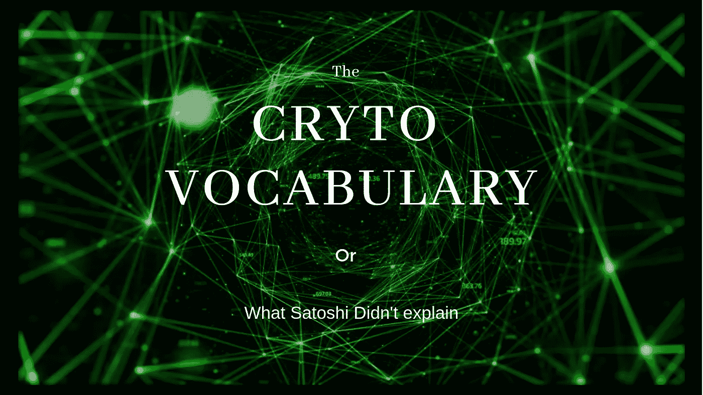

# #加密词汇—扩展

> 原文：<https://medium.datadriveninvestor.com/crypto-vocabulary-expanded-76131d26537b?source=collection_archive---------0----------------------->

## 加密领域中使用的所有术语的存储库(也称为术语表)

> *试图向全世界宣传加密货币；本帖将定期更新，作为澄清加密词汇的首选

如果你曾经研究过加密货币(除了谷歌搜索比特币这个词)，你可能会遇到大量让你上当的短语和表达。从*先进的技术发展*到*的拼写错误*到*的迷因*再到月球和月球的往返，密码诗真正地为语言的所有极端提供了自己。然而，随着日常生活中一些全新事物的发明和引入，语言的扩展也随之而来，这似乎是很自然的。但是，我们怎么能对第一个全球去中心化的基础设施有所期待呢？

🧐Lets 潜水 in:🧐

**51%攻击-** 对加密网络的暴力攻击。通过引导比网络当前使用的一半(%51)更多的计算能力来进行，目的是操纵共识机制(通常是为了通过双重支出来获得收益)。把这想象成一个民主的投票程序——多数总是赢得共识。

**地址-** 一个字母数字字符串，表示密码可以发送到的库/目的地

**隔空投送-** 一种分发加密货币的方法，在这种方法中，市场参与者不需要将其现有资产换成新的资产；而是基于一些先决条件来接收它(例如持有并行加密货币)

**空气间隙-** 将计算机与任何外部设备或信息源物理隔离。也被称为“闭路”设计，空气间隙的目的是最大限度地控制数据流。

**算法** **-** 由计算机执行来解决问题的编码指令或规则。

**alt coin****——**泛指所有不属于比特币的加密资产。 *Alt* 就是*的替代。*

**AML-**Anti—**M**oney—**L**aun under 的缩写。旨在颠覆金融犯罪活动的法律框架。

**API -** **A** 应用 **P** 程序 **I** 接口。一个基本上告诉其他软件应该如何相互交互的软件。

**套利** **-** 通过在多个不同市场之间交易一种资产来获取“无风险”暴利的行为。

**ASIC-**T6A**S**S**I**集成 **C** 电路。

**ASIC Miner** **-** 完全专用于采矿目的的采矿设备。*(想想在密码世界中不公平的权力垄断)*

**ATH-****A**ll**T**ime**H**igh。指资产达到的最高价格。

**ATL-****A**ll**T**ime**L**ow。指的是资产和价格的最低点。

**ATM-****A**nalog**T**radial**M**oney/**A**ll**T**radial**M**oney。作为自动柜员机在非加密领域普及；加密社区用分散的数字框架精炼了首字母缩写词。

**原子交换-** 加密网络中使用的一种方法，允许用户直接从他们的钱包中将资产交换到其他资产，而无需集中交换。

**袋持有者-** 持有大量加密资产的加密货币交易商/投资者，这些资产已经严重贬值，无法以相对合理的价格卖回市场。

**BIP -** **B** 它加入了 **I** 改进 **P** 协议。

**Bit -** 一种计量单位，在计算上用二进制代码表示为 0 或 1。此外，它是一个比特币分数的记账单位；100 万比特等于 1 个比特币。

**比特币-** 成立于&2009 年 1 月，比特币是第一种数字货币&就我们所知，它是整个加密世界的基础。更不用说，最广泛采用和最著名的密码。

**Block** **-** 一个不可变的数字文件，存储有关网络上任何和所有活动的信息。每个块都有自己的时间戳、Merkle 树散列、数字签名和事务。这种结构有助于保持时间顺序。(想象一下，一块积木相当于一本书的一页)。

**区块链** **-** 允许去中心化信任结构的软件已经存在。按时间顺序排列的一系列“块”,它们链接在一起，充当数字生态系统的主干或骨干。

**块高度** **-** 数字表示，显示被散列的块的当前编号。

**块奖励** **-** 由内部机制支付的补偿，以保持节点/矿工的操作积极性。

BUIDL - 对 Build 一词的巧妙运用。这是由拼写错误的“隐秘文化”性质造成的。(请参考 HODL)

**焚烧-** 代币变得不可使用的一种方法(通常只是被发送到一个不可使用的地址)，从而充当紧缩机制。

**拜占庭容错-** 精心设计的方法，旨在解决分散或分布式计算机制中拜占庭将军的问题。一种数学/加密方法，试图在数据传输出错时保证偿付能力(例如数据不完整、数据丢失、数据不一致等等)

[**集权**](https://medium.com/@growthgame007/technologies-fraternal-triplets-decentralized-centralized-distributed-13c14f321d98) **-** [一方所有](https://medium.com/@growthgame007/technologies-fraternal-triplets-decentralized-centralized-distributed-13c14f321d98)一方受益。一种结构，其中的参与通过服从另一方来保证，该另一方明确地拥有所述感兴趣的对象。想想钱(政治所有)、数据(大型科技公司所有)等等。

**审查-** 压制或审查任何“不需要的(如多管闲事的审查方所认为的)”并以有偏见的格式过滤信息的行为。[基本上有人只给你看他们想让你看的东西，而不是整个上下文]

抵制审查- 不容易被任何多管闲事的中间实体过滤的东西。[容忍制度上的反对]

**CEX** - **C** 集中 **EX** 变化。只是一个用来表示集中交换的缩写，并没有真正写出来。但就其本身而言，它可以是任何市场交易平台:纽约证券交易所(NYSE)、纳斯达克(NADAX)等等。

**确认-** 交易/系列交易的确认。在比特币区块链中，每笔交易都必须经过 6 个独立节点的验证，才能被视为真实行为。

**共识-** 网络中一种短暂的、反复出现的状态，构成了对某一主题的广泛共识。该术语用于描述网络如何结合，以保持分布式匿名方法来保证自身的完整性。

**加密货币-** 由高级加密技术保护的数字/虚拟资产，本质上不属于任何一个实体

**密码术-** 一种使用代码和密码对敏感信息、消息或数据进行加密和解密的技术。私有化和驱逐不受欢迎的演员的艺术。

**DAE -** **D** 去中心化 **A** sset **E** 协同系统。cryptoverse 中的首字母缩写词，用于描述任何能够支持加密资产交换的平台。

**DAG-****D**directed**A**cyclic**G**raph。这是一种使用拓扑逻辑求解的数据结构，通常用于查找最佳 GPS 路线、调度、一般数据处理，甚至数据压缩。

**道-** **D** 去中心化 **A** 自治化 **O** 组织化。汇聚在某个统一概念上并作为一个有机体运作的实体的集合。

**DAPP -** **D** 去中心化 **APP** 应用；分散应用程序的主要好处是不变性、可问责性、匿名性和巨大的带宽(更不用说对个人数据的控制了)。

**DDoS-**D 的缩写分发**D**enial**O**f**S**service。一种网络攻击，其中恶意行为者用来自**多个**设备的流量轰炸服务器。

****-**分散的不属于任何一个实体的。所有权分散给任何想加入的人。以前只被认为是归类为商品的对象(没有人真正拥有黄金[一旦你拥有黄金，你就不欠任何人任何东西]——{与电话相反，无论你试图做什么，都会有一部分被你的需求所垄断，包括但不限于:充电-电力，使用它-服务提供商，等等})，现在在数字层是可能的。**

****深层/黑暗网络-** 未索引的互联网外围。通常通过虚拟代理网络访问，这是臭名昭著的丝绸之路的家园。**

****DeFi**——用来指代 ***De*** 集中式 ***Fi*** nance 的选择缩写词。**

****通货紧缩-** 价值增值的经济副作用；当某种商品处于通缩状态时，它的供应有限，但需求旺盛，这直接导致价格上涨的自我实现预言。**

****Delegated -** 一种网络结构，基于对数据仓库/库的权威访问来分割数据流。**

****滞期费-** 在某些加密货币协议中实施的一种惩罚形式，对未使用资产的钱包征税。假设你持有 10，000 个 EOS，5 年内不想动它们，这对你来说太糟糕了，因为你的余额将开始耗尽。**

****DEX-**a**D**e**EX**变化；用于快速处理和交换分散信息的术语。**

****难度-** 求解下一个块的散列所需的计算资源的度量。这种方法有助于网络保持 10 分钟的数据块时间(每 2016 个数据块自动调整一次)。**

****DLT - D** 分配 **L** 立辊 **T** 技术。**

****重复消费-** 通过破坏网络哈希特和挖掘总账来两次消费同一货币的恶意行为。必须承担此类活动代价的实体往往是加密货币交易所。**

****DTM-****D**igital**T**okens 和 **M** oney(也可以破译为分散代币和货币)。一个新兴术语，用于描述整个区块链、加密货币和数字金融生态系统。**

> **👇 *!！！请理解，通过原始设计，这些被称为令牌👇因为它们不应该成为货币！！！* 👇**

****ERC-20** -以太坊网络上最流行的令牌协议。破译为:以太坊请求注释— 20 如请求数字指纹中所示(数字仅代表来自其并发协议兄弟的唯一标识符[参见上文的☝ *和下文*的*👇其他协议示例】。也被称为“实用令牌”，它在以太坊网络上的实际功能是“访问/交互”DAPPS。***

****ERC-223-**ERC-20 协议的更新版本，增加了一些资产生态系统间相互作用的额外模块化方面。(基本修改智能合约的“*转账*”功能；哪个*{对于这里的开发人员}* 让契约拒绝来自不受支持的资产的传入交易。在标准的 ERC-20 协议框架下，有人不小心将比特币 T21 或新币以太币合约发送给了一个以太币合约。它们被发送到某个数字空间，再也无法返回。]**

****ERC-721 -** 将“*数字唯一性”*并入 ERC 令牌生态系统的智能合约。通常也被称为“数字收藏品”的协议/标准，这是密码猫的诞生地。在本协议范围内；每个令牌都是唯一的，并且在某种程度上可证明/可识别地不同于其自身的每个令牌。Cryptoflames 制作了一个数字艺术画廊，并把一些现实世界的艺术作品的所有权转移到他们的本地数字复制品上进行展示。铸造了 100 个加密火焰令牌，加密火焰令牌#33 代表蒙娜丽莎所有权的“链接”;而密码火焰令牌#77 表示到来自内布拉斯加州 Sally 的绘画的“链接”。然后，可以通过对基础物理资产的现实生活估价求和来推断隐焰网络的价值。]**

****ERC-827 -** 以太坊网络的新生“神童”标准。该协议框架现在不仅仅能够中继原始值传输，它还能够通过微小的成本调整(大约 100 行增加的代码)来中继相关的交易和网络信息/数据。为庞大的、不可改变的分散式网络支持的、近乎即时的全国数据传输铺平了道路。**

****ERC-884 -** 该框架旨在允许区块链融入美国特拉华州的金融渠道(大约在 2017 年，基于该州的法律草案)。有一个内在的要求:投资者“白名单”——分散的数字等价物*&*AML*。***

*****ERC-948 -** 也被誉为“B2C 商人的梦想”协议；该令牌框架将*订阅模式*经济结构的数字覆盖合并到智能合同中。***

> ***☝*!！！请理解，通过原始设计，这些被称为代币☝because，他们不意味着是货币！！！*☝***

*****托管-** 招募外部力量帮助调解任何交易的做法；确保所有相关方的合规性。***

*****龙头-** 通常是一个网站，为访问或填写验证码提供少量的加密货币。***

*****法定货币-** 我们所知道的货币的政治面额。由政治定位和全球影响力支持的资金。***

*****联合网络-** 一种拓扑网络架构，允许多个独立网络汇集和分配其计算资源，以优化该网络的质量并优化其资源。***

*****莱特币公司(LiteCoin)收购 BCH 公司(BitCoinCash)在加密市场的整体价值。“LTC 在总体增长、重要性和原始价值方面超越了 BCH”。*****

*****轻率-** 一个发生在隐密体中的假设事件；其中:比特币的第一把交椅让给了以太坊。***

*****FOMO -** **F** 耳朵 **O** f **M** 丢失 **O** ut。通常被认为是牛市时期巨大牛市反弹背后的驱动力——我们如此喜爱(并从中获利)的巨大抛物线爆炸。***

*****分叉-** 一个网络分裂。通常发生在有一些必要的软件代码更新时，需要抛弃以前的代码副本(硬&软)***

*****FUD-****F**ear**U**n ceratity 和 **D** oubt。一个术语的缩写，用来指关于某事未来的非常黑暗和令人不安的时期。一个例子是:虚假的媒体宣传称比特币已死，因为中国政府将禁止其采矿业务。之后不久发生了什么？价格上涨了。今天什么是真的？在中国已经被禁，部分解禁。谁知道下一轮又会发生什么——🥂，做好准备吧***

*****GAS -** 区块链不可知论者/通用术语(以太坊上的 *gwei* ，NEO 上的 *gas* 等)，用于指代帮助协调交易消化的微支付。***

*****Genesis Block -** 比特币网络的第一个区块。街区 1。开启了金融无限未来的小积木，比特币。👶***

*****GPU -** **G** 图形芯片 **P** 处理 **U** nit。计算比特币区块链上的挖掘所基于的数学哈希过程所需的硬件设备。***

***减少区块链采矿奖励的程序。对于比特币网络，这种情况每 4 年发生一次，大约相当于挖掘 210，000 个区块所需的时间。从 50 英镑开始，比特币奖励在 2012 年减半至 25 英镑，然后在 2016 年再次减半至 12.5 英镑。接下来，减半至 6.25！[(直播倒计时器)](https://www.bitcoinblockhalf.com/)***

*****硬分叉-** 对加密货币协议的彻底改变。通常是代码的一些非常基本的方面的变化(例如隐私协议或共识机制)。***

*****Hash -** 一个固定长度的字符串，代表输入数据的某种思想。在比特币的例子中，哈希是根据一组非常特定的指令创建的，指向以前的数据。***

*****哈希速率-** 网络处理能力的度量单位。***

*****HODL-**HOLD 的拼错版本。从前，在一个加密论坛上，一个爱好者发布了一个状态，他不小心写了 hodl 而不是 hold 它像野火一样流行起来。***

*****ICO-****I**initial**C**in**O**ffering。包含权力下放的众筹机制；通过能够主持一个*【无信任】*的价值转移方法，实体现在可以直接向公众募集资金；而不是依靠一些中介来调解过程&接触资金。***

*****不可变-** (寻址数据时)在原始创建后不易受到任何更改、改变、操纵或编辑。(*当今数据结构被格式化以发挥作用的方式是所谓的***CRUD***—***C***reate、 ***R*** ead、 ***U*** pdate、 ***D*** elete 格式。——区块链数据结构给了我们一种数据格式，就是*just****CR***(***C***reate—***R***EAD)。***

***通货膨胀商品价格水平相对于其经济地位的上升。例如:如果当地熟食店的所有产品都上涨了 20%(牛奶从 2 英镑到 2.40 英镑，鸡蛋从 1 英镑到 1.20 英镑，面包从 1.50 英镑到 1.80 英镑)，那么这很可能代表商品保持稳定，货币正在遭受严重贬值。***

*****输入-** 指交易中的输出，当相加时，反映相关地址的剩余可支出余额。***

*****KYC -** “了解你的客户”的首字母缩写。政府为公司制定的一套规则，用于从参与者那里获取一定数量的信息。***

*****洗衣房-** 又称“混合服务”。一种增强隐私和匿名的方法。通过将交易集中在一起，并在某些加密算法的帮助下进行洗牌。***

*****第二层-** 又称第二层；是一种建立在另一种协议之上的协议，目的是利用第一层的后端系统操作并操纵第一层的参数。*(如果比特币只能处理 9 个交易点，而一些希望在此基础上发展的金融公司需要处理 350 个交易点，那么他们将使用第 2 层解决方案{如 lighting network}并通过其门户“漏斗”交易，并发送 350 个交易的哈希引用，就好像它只是 1 个交易一样。****

*****Lightning Network -** 一种支付协议，可以覆盖在任何基于区块链的加密货币之上。***

*****合并挖掘-** 一种挖掘形式，一个矿工能够分散他的计算资源，同时参与多个密码的挖掘和发现。***

***微交易- 一项交易规模如此之小，以至于托管起来无利可图。从历史上看，这一数额低于 1.00 美元的参考点。***

*****mBTC -** 比特币衡量标准，用于显示精确到 0.001(千分之一)的余额。***

*****挖掘-** 节点相互竞争验证和发布事务的过程。对于比特币来说，挖掘将包括用当前的数据汇编所有以前的数据，并试图解决一个超级复杂的计算难题。***

*****矿工-** 选择参与游戏化/激励化提取比特币并保护其网络的节点/节点运营商。***

*****采矿池-** 一群矿工已经统一了他们的计算资源，以便在参与者之间更一致地分配采矿奖励。***

*****铸造-** 用新创造的硬币奖励参与保护网络安全的用户。更常见的是股权证明加密货币。***

*****MemPool -** 存储尚未处理的事务的存储库。尚未被网络处理的所有数据的池。***

*****洗钱-** 试图通过无法追踪的手段隐藏犯罪所得资金的非法行为。(政客们最喜欢的关于加密的术语)***

*****Mooning -** 用于表示价格急剧上涨的动词。***

*****mt . Gox-**2014 年因安全和资金管理不善而倒闭的日本比特币交易所。***

*****易变的-** 易变的——在计算机&数据科学中，指数据易被编辑/更改/操纵。(请参考上面的不可变)***

*****NFC-**“Near**F**field**C**communication”的首字母缩写。一种新的短距离无线通信方法，需要最小的功率。试想 apple pay 对手机的敲击&信用卡)***

*****节点-** 连接到加密货币网络并帮助加强网络弹性的计算机/设备。***

*****Nonce -** (伪)随机数，为了满足挖掘和哈希算法所需的参数而生成。***

*****链外事务-** 不在本地加密链上进行的事务，以避免膨胀/拥塞。***

*****孤立块-** 由于分叉而被网络放弃的有效块。后来，它被重新接纳到它原来所属的链上。***

*****开源-** 免费提供给公众的软件，通常可以在 github 上找到。***

*****输出-** 包含发送加密指令的交易部分。***

*****纸质钱包-** 一种加密货币的冷藏形式，私钥和接收地址打印出来。***

*****P2P-****P**eer-**t**o-**P**eer。一种数据分发和信息共享的结构，其中不存在参与者之外的故障点。***

*****预采矿-** 用于描述与创世纪地层相关的新区块链的度量的术语。比特币没有前提，而是从 1 开始运作；其他连锁店，如 BTCP，只有在总供应量的 5%已经提取到组织者的私人手中后才可用。***

*****私钥-** 所有公共加密交互涉及的两个密钥之一。私钥是证明地址所有权的密钥，*不要与任何人分享！****

*****公钥-** 用于表示地址所有权对应方的密钥。这是与公众共享的密钥，以便在某个地址接收资金以及回溯相关地址的历史。***

*****二维码-** 快速响应码。一些 API 的象形图描述，可以被机器扫描仪读取。***

*****REKT -** 读作肆虐。一个诞生于密码世界的术语，用来指刚入门的密码交易者被市场重罚。***

***汇款——作为礼物或付款而跨境发送的一笔钱。***

*****Satoshi -** 拆分一个比特币的最微单位，代表一个比特币的 0.00000001。***

*****Satoshi Nakomoto -** 创造并向大众发布比特币+区块链+分布式账本技术的假名/实体🤘***

*****可伸缩性-** 在保持平台完整性和数据流的同时，可以在多大程度上垂直构建和修改平台。[如果以太坊每秒可以处理 20 个事务{onchain},但是有人试图利用本地以太坊链进行某种需要每秒 200 个事务的项目，我们就有一个可伸缩性问题。该项目无法扩展以满足客户的需求(我使用以太坊只是作为一个例子，我喜欢以太坊，并不反对它们)***

*****Scamcoin/Shitcoin -** 分散加密社区创造的术语，指的是垃圾/死胡同假货项目(顾名思义)。***

*****脚本-** 一种散列过程，可以实施到工作证明加密货币中，以便修改协议共识参数。***

*****Shill -** 不请自来的加密项目传播。通常以贬义的方式使用，以解决加密项目粉丝进行的“不当”营销。***

*****Seed -** 确定性系统中使用的私钥。数字范围内随机性的诞生。比特币只能被吹捧为伪随机的原因是，区块链创世纪区块诞生的种子实际上可以用数学方法识别(足够先进***

*****签名-** 也称数字/密码签名；是一种数学机制，本质上被设计成用生物人类签名的对应物来取代数字生态圈。***

*****智能合同/自动执行合同-** 无需任何外部干预即可促进和执行义务的算法。智能合同存储在区块链上，是一种不可更改的协议，具有类似于现实世界合同的特定逻辑操作。一旦签署，就不能更改。***

*****SEC-****S**securities&**E**exchange**C**commission。负责创建并维护金融和经济法律框架的组织/联邦机构。***

*****S**e**W**it ness。比特币代码的软分叉改进，有助于网络处理更多交易。***

*****侧链-** 区块链生态系统，旨在以双向馈送方式运行。本质上，儿童链与“母链”相连，用于启动和关闭。(想想以太币代币，然后转换为抵押品以获得戴稳定币)***

*****签名(数字签名)——**用于证明数字所有权的数学过程。这种方法被设计成抗碰撞的，目前使用的方法和常规的生物指纹一样有效。***

***丝绸之路现在只是一个遥远的记忆，丝绸之路是一个在深/暗网络深处的未经许可的市场。众所周知，比特币被用来促进毒品交易，但它的角色必须得到认可，才能启动并延续比特币之类的东西的角色和需求。***

*****SneakerNet -** 加密资产的“手对手”或离线交换。虽然该术语在加密货币出现之前就已经存在，但其固有的功能完美地补充了分散的数字生态系统！***

*****欺骗-** 通过将虚假的外星行为者伪装成诚实友好的行为者来破坏某些通信系统隐私和安全协议的恶意行为。通常在需要某种硬件/软件授权的集中式系统中更为普遍。***

*****SPV - S** 简化 **P** 付款 **V** 验证。通常，为了利用区块链进行支付，使用客户端需要整个链的副本。这使得移动客户端无需拥有整个区块链的副本就可以进行支付。***

*****陈旧块-** 已经解决的块。通常这个术语在加密爱好者的技术层面更受欢迎，它只是指一个不再奖励矿工的区块。***

*****STO -** **S** 安全**T**ok**O**ffer。在政府机构对分散加密生态系统的预期干预后，一个法律框架协议被合成以适应“土地的法律”。***

*****软分叉-** 向后兼容的变化网络协议；因此，节点无论如何都不会被强制升级，仍然可以从它的实现中受益。***

*****污点-** 两个地址之间相关性的度量。虽然这是一个可能不会经常遇到的术语，但它只是试图追踪一枚硬币的历史。***

*****TCP/IP -** **T** 传输 **C** 控制 **P** 协议/ **I** 网络 **P** 协议。当今设备用来与互联网通信交互的标准。***

***Testnet - 一个生态系统，开发者可以自由地与区块链的代码进行交互，并对其进行实验。***

*****时间戳-** 时间度量数据仅仅起到证明某件事情何时发生的作用。***

*****令牌协议/令牌**——一个编程标准框架，试图在价值的物理和数字领域之间架起一座桥梁。这种桥梁可以表示为某种形式的效用/对某些环境的访问。以以太坊为例— —以太坊是一枚硬币，它是主机+平台，用于**软件创新— — ERC-20 令牌(pick any)是一个框架，它允许与相应的母化平台的去中心化 DAPP 生态系统进行交互+访问。*****

*******Tokenomics -** 合并 Token 和 Economics 两个词；我们遇到了又一场文字游戏。用于解决 it 生态系统中的指标和令牌角色。*****

*******TOR-****T**he**O**nion**R**外。一种匿名的网上冲浪工具，通常用于访问深层/黑暗网络——它有助于规避浏览器/服务提供商可能对我们实施的任何审查。*****

*******总供应量-** 一种加密货币可以生产的绝对最大数量。*****

*******TPS -** **T** 反应 **P** er **S** 秒。一个缩写，在隐密体的书面词典中最常见。*****

*******交易费-** 用户决定支付的费用(不必要)，以使他们的交易得到处理。这种层级结构被用来促进生态系统内部的竞争机制，并激励更多的参与者加强网络的完整性。*****

*******不可信**——不需要依靠天气或不互动的各方都有能力实现他们的目标。利用 DLT 的，我们可以帮助培育一个*更不可信的*经济数字结构(相对于必须依赖 SWIFT 的旧的集中技术)；值得注意的是，区块链并没有真正消除对无信任方的需求，*will-nilly*financial economic interaction，只是从根本上最小化了对“信任那些积极参与方”的需求。*****

******不可描述地址** -一个虚拟地址，令牌只能与该地址进行单向交互。用于消耗生态系统的循环供给(参见上文*燃烧*)****

******实用令牌-** 指定“令牌需求”的令牌类别，用于访问/利用某些专有(或在加密的情况下不那么专有)技术。****

****UX/UI-**U**ser**Ex**perience/**U**ser**I**interface。用于衡量应用程序设计的成功程度；通常用用户与底层系统交互的简单和容易程度来衡量。想想看，一个如此简单的设计，你的祖母可以不用尝试就能使用它。****

******虚拟地址-** 加密网络上的一个地址，用所需内容格式化。相当于一个车牌。****

******处女比特币——**也是一个不太流行的术语，用来称呼已经被开采出来但还没有花掉的比特币。****

******钱包-** 加密货币的存储能力。一个允许用户以用户界面/UX 友好的方式存储加密货币的软件。格式丰富；纸质钱包、网络钱包、桌面钱包、硬件和移动钱包。****

******弱手-** 密码社区和传统金融社区使用的术语，指的是无法处理大量意志市场和抢先销售以实现市场成果的开放市场参与者。[很少投资者成为机构操纵的受害者，很容易被“震出”市场，通常是亏损。****

******Whale -** 该术语用于指非常高净值的加密钱包地址(个人)或高价值的&链外交易。[鲸鱼是指拥有足够多资产的人，他们在公开市场上如何处置这些资产的决定将直接显著影响资产交易价格]。****

****白皮书- 用于向公众告知项目规范的报告或指南。相当于商业计划书或计划。****

****ZeroCoin - 该项目最初旨在帮助比特币保证其网络的隐私特性。****

******零确认事务/未确认事务-** 已经被中继到网络中的节点，但是还没有被合并到块中的事务。****

*******当前计数:102*******

******附言**如果你知道一些密码词汇——请把它写在下面，我会试着把它添加到列表中！****

***** *更新于 2019 年 1 月 30 日****

****Welp，我们已经完成了 2019 年的 1/12 (8.333%)，因为社区在不断增长，技术的使用也在稳步增长；词典就是这样做的。****

****谢谢你们分享一些神秘文化词汇🎩****

*******新字数:132*******

***** * 2019 年 10 月 3 日更新****

****是时候升级了。我们正在观察加密领域的大规模市场转变；对新一轮牛市充满希望，我们更加增长了加密词典！****

*******新字数:145*******

***** * 2019 年 3 月 31 日更新****

****快乐月即将结束，我们又增加了 5 个单词，带来了新单词数:150 个****