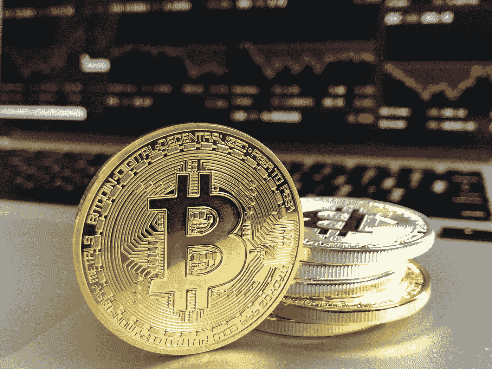
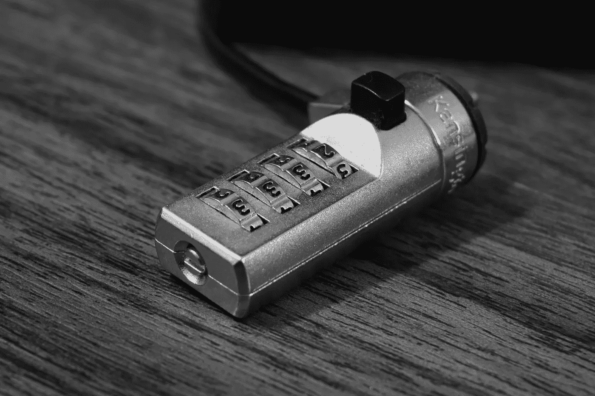

# 加密是“呆在家里”的下一个新的兼职，日交易妈妈

> 原文：<https://medium.datadriveninvestor.com/crypto-will-become-a-new-side-gig-for-stay-at-home-day-trading-moms-99aae90495d7?source=collection_archive---------39----------------------->

我的一个阿姨是超级交易员。她把自己的投资锁了起来，这些投资为她提供了非常舒适的生活方式。孩子们在不同的国家定居，房子也付了钱。所以她每天有几个小时属于自己的时间，而且思维非常活跃。我阿姨也有一种整天都超级投入的需求。她试着加入阅读俱乐部，和邻居一起晨间散步，但是在月底之前就厌倦了。就在那时，她迷上了日内交易。

Day traders temple

在她发现自己能承受的风险水平之前，她度过了几个美好的月份和几个可怕的月份。我的阿姨已经为自己交易股票近十年了，她的日常阅读让她偶然发现了加密货币(这些天你无法避免加密，如果你尝试的话！).她对此感兴趣有一段时间了，但不是作为一名矿工。吸引她的是看似永无止境的上升轨迹，她说交易者会在某个时候改变方向。它以一种引人注目的方式做到了这一点。由于我们家充斥着金融和科技类的人，她从不缺乏意见。

最近扩大这一对话的是我在晚餐时和我必须带我儿子去的生日聚会上遇到的一些人向我提出的一些问题。每次参加社交聚会，我都会收到至少一个关于比特币的问题。不同的是，感兴趣的程度从“呆在家里”的妈妈和想购买比特币的人到“看看情况如何”。因此，这里列出了我得到的一些问题，以及与之配套的一些简单(或许过于简单)的答案。

**比特币是什么？**

Bitcoin

这里的问题和所问的不一样。真正的问题是‘什么是加密货币’？好吧，这不是:

它不是法定货币。加密货币不受政府支持，这意味着它们不是法定货币。

它不受管制。

你不能使用加密货币作为交换媒介(至少一般不会)。

我猜最接近传统货币的加密货币是它们是一种价值储存手段，但这个前提是未经长期检验的。

加密货币是一种通过数学运算生成和保护的数字令牌。这些令牌由运行分类账的计算机生成，这些分类账验证特定加密货币的交易。运行分类账的每台计算机都有曾经发生的所有交易的记录，并且对谁可以下载和运行分类账没有限制。这使得整个系统是分布式的，不会被篡改(是的，我知道你不能用这个词来形容计算机)，因为攻击者必须完全相同地更改每个分类账中的条目。计算机运行这些分类账并执行数学计算的人将获得该加密货币的代币作为补偿。您的计算设置越强大，您可以运行的操作就越多，奖励也就越大。

**那么，比特币是什么？**

比特币是当今最知名的加密货币。第二著名的是以太坊。

H **我如何购买加密货币？**

你可以从比特币基地或 BTC 市场这样的交易所购买。还有很多其他的。

**如何安全存储新购买的加密货币？**

在这里要非常小心，做多份拷贝，存放在不同的地方，你不会忘记。获得一个或多个(最好是一个以上):

硬件钱包

USB 驱动器

纸

不要将其存储在任何有互联网连接的设备上。这也意味着不要将它存储在手机或电脑的应用程序中。

**我可以使用加密货币进行日常购物吗？**

还没有，或者大部分地方还没有。它还不是一种流行的交换媒介。

**那么，我为什么还要购买比特币、以太坊或其他加密货币呢？**

购买加密货币的人有两种:

自由的

投机者

你属于哪一类？每一个都可以是一篇很长的文章或单独的讨论。

回到我姑姑身边。她现在将投资利息的一小部分(个位数)投入比特币和以太坊。她的计划是在两到三年后看看这件事的结果。我没有证据，但我很确定她不是唯一一个她喜欢的类型。