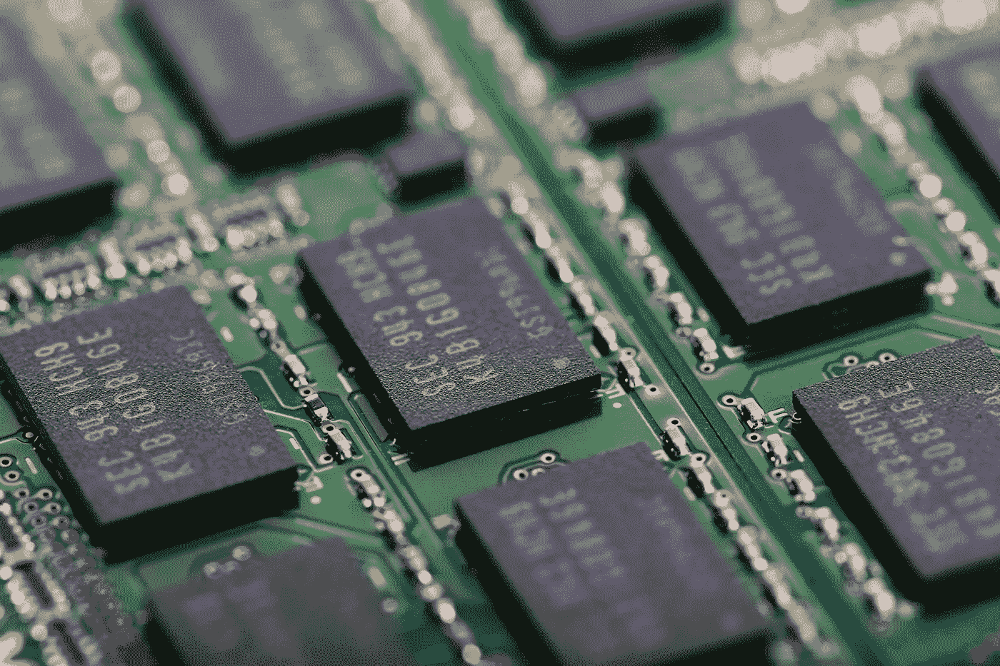
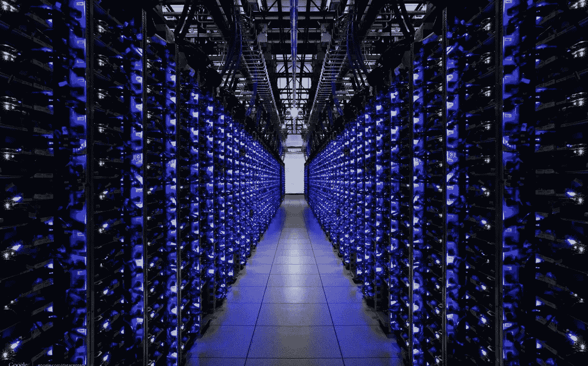
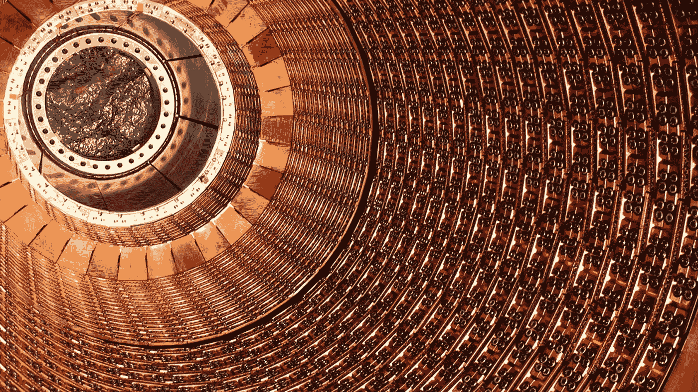
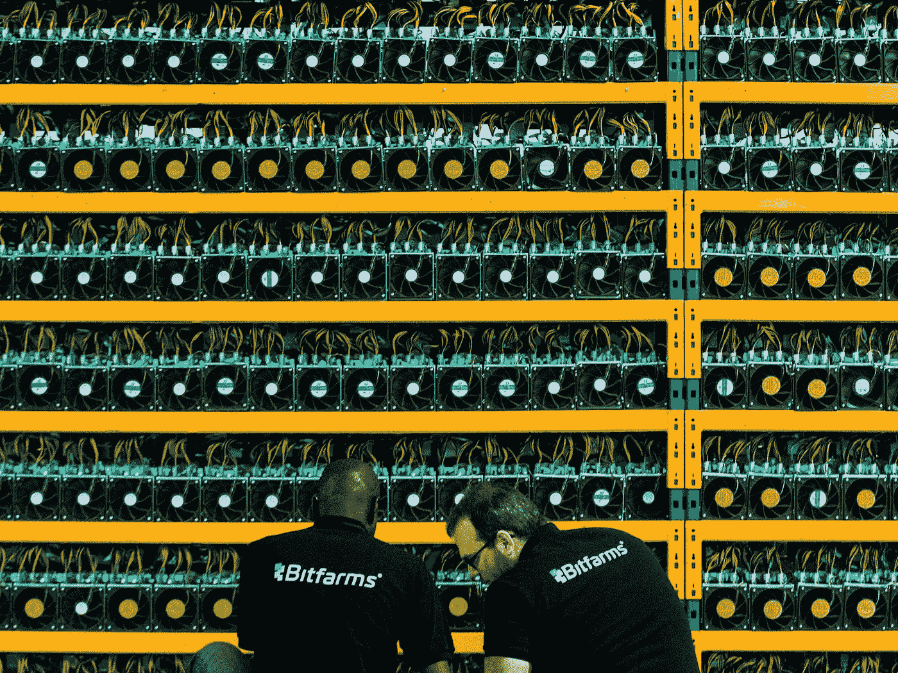

# 加密货币和芯片制造商——两次危机的故事

> 原文：<https://medium.datadriveninvestor.com/cryptocurrencies-chipmakers-a-tale-of-two-crises-982498c9254a?source=collection_archive---------7----------------------->

Valentine’s Day chocolates took a weird turn.

几十年来，一些世界上最大的芯片制造商的高管们享受着公司大款的生活。从商务舱旅行到配有司机的梅赛德斯-奔驰豪华轿车服务，这些半导体世界的后代正乘着乐观主义和全球智能手机消费的浪潮，这是迄今为止前所未有和无与伦比的。但似乎这场派对可能会在半导体领域结束，这不仅是因为中美之间迫在眉睫的贸易战，也是因为物理定律。

几十年来，摩尔定律(这实际上是一种观察，而不是严格意义上的*定律*)表明，每两年，密集集成电路中的晶体管数量就会翻一番。换句话说，芯片(不是土豆类的)在变小的同时被期望做更多的事情。但现实却大相径庭。在芯片发展的最初几十年里，摩尔“定律”实际上更多的是被违背，而不是被遵守。芯片变得更快更小的速度远远超过了摩尔的观察。把晶体管想象成微小的开关，它允许少量的电流通过或不通过。一个芯片可以存储的晶体管越多，它可以进行的计算就越多，并且这些计算可以进行得越快。简单的开/关设计及其组合让现代生活的一切成为可能。从你的智能手机到你的冰箱，几乎所有东西都运行在某种形式的半导体上——甚至是加密货币采矿设备。

## 芯片制造业的逆风

但智能手机需求的下降是芯片需求下降的前兆。以台积电(TSMC)为例，其今年的销售增长预期约为 2018 年初预测的一半。根据世界半导体贸易统计数据，由于美中贸易战即将爆发以及中国经济增长放缓，2019 年半导体增长预测已从 4.4%降至 2.6%。根据另一家研究公司 IC Insights 的数据，半导体制造商的资本支出预计今年也将下降 12%。这一趋势对比特大陆、迦南和 Ebang 等加密货币设备制造商来说也不是好兆头，在加密货币价值下跌的背景下，这些制造商正在寻求将他们的加密货币芯片制造设施用于人工智能等其他用途。市场内部人士已经表示，没有一家加密货币采矿设备制造商可能能够完成即将到来的 IPO，这些公司的估值存在巨大差异。

Hall of mirrors took on an unexpected twist.

And it’s not just demand from smartphone makers that is hitting chip manufacturers. The arrest of smartphone giant Huawei’s CFO Wanzhou Meng by Canada, at the behest of the Trump administration, also suggests that the gloves are coming off in U.S.- China rivalry and threatening to extend the trade war into a technology battle as well. China has long made known its intention to become a leader in manufacturing, from Chinese President Xi Jinping’s push for “Made in China 2025,” but it also has ambitions to become a global leader in other areas as well, judging from the billions of dollars the Chinese government has poured into computing, self-driving vehicles, artificial intelligence, and robotics. And with China as one of the world’s leaders in cryptocurrency mining, the fall in cryptocurrency prices has also hit companies like Taiwan’s TSMC, whose CFO Lora Ho blamed “weakness in cryptocurrency mining demand” for the third cut in its revenue targets for 2018\. But TSMC is hardly alone in facing these headwinds. Basically, any company involved in smartphones or chip manufacturer has had a rough time last year. From Nvidia to AMD, chip makers are licking their wounds at a time when cryptocurrencies are not helping them to diversify their revenue streams.

## The Laws of Physics Trump the Laws of Moore

Magician’s next act would bend the laws of physics — viewer discretion advised.

And then there’s the problem of physics. In September 2017, Nvidia CEO, Jensen Hsung declared that the over five decades old dynamic behind Moore’s law was all but dead. Hsung was denounced as a heretic for questioning the hitherto unassailable law of chip evolution, but there is a growing body of evidence that Hsung was right about chip development. Geometric scaling of chips has indeed slowed down. Chipmakers are having a harder time making better and faster processors to shrink them into ever smaller devices. Plus, unless new materials technologies are developed, heat generation from ever-faster chips means that packaging and cooling costs will increase. But the physical (pardon the pun) limitations of chip development may provide opportunities. Last March, in a *Forbes* op-ed, Radoslav Danilak, CEO of Tachyum, a Silicon Valley-based chip designer wrote,

> “The problem of device physics is a solvable one and that its the silver lining to the death of Moore’s law.”
> 
> “The industry’s performance plateau creates a market space and opportunity for new ways of thinking, new designs and new inventions.”

但丹尼拉克也有充分的动机来谈论这个行业，这个行业正面临贸易战和技术限制的双重阻力。令问题更加严重的是，大多数芯片制造商已经变得严重依赖中国组装商，许多组装商都聚集在中国南方的珠江三角洲——一个特别容易受到美中贸易战影响的地方。虽然可以发现新技术来提高芯片性能，但改造供应链是完全不同的事情。半导体制造业具有地缘政治敏感性，华为(Huawei)董事长孟被捕就证明了这一点。它也是提供有吸引力的高薪工作的民族自豪感的来源。即使技术突破真的发生了，利润也不是必然的结果。例如，TSMC 的 7 纳米芯片立即获得了成功，在 2018 年第三季度为 TSMC 增加了高达 11%的收入，但其背后的利润率大幅下降。设计、生产和引入更先进的芯片是一项昂贵的努力——而这正是拥有数十年经验的研发团队做好这项工作的时候。因此，对于除了加密货币设备之外没有任何芯片制造经验的公司，如比特大陆、亿邦和迦南，如果他们寻求其他收入来源的多样化，挑战就更加艰巨。

## 芯片制造会变得像毒品制造一样吗？

一种可能性是芯片制造商引领制药商的方向。在那里，数十亿美元被投入到研发中，成功的可能性很小，但具有轰动效应的产品可以推动此后几十年的增长。随着芯片进步开始放缓，重磅炸弹芯片可能会比现在拥有更长的优势，芯片制造商可以更快地相互赶上。在这种情况下，很可能只有资金最雄厚的芯片制造商会坚持下去。

Not Satoshi’s dream.

对于加密货币来说，矿业公司退出市场以及芯片制造商(如英伟达和 AMD)在该领域投资减少的趋势意味着，哈希难度预计将在中短期内下降——释放自制加密货币矿商和基于 GPU 的加密货币矿商回归组合的潜力。从纯粹的意识形态角度来看，这将非常符合中本聪的比特币白皮书，该白皮书设想了加密货币生态系统中所有利益相关者的更高程度的参与，而不是加密货币价值前所未有的飙升所导致的加密货币开采利益的集中化。此外，回归自制挖掘也可能会引发新一波加密货币的采用和兴趣——加密货币挖掘(由个人进行)刺激了第一波浪潮，回归个人挖掘也有可能做到这一点。然而，更加分散的采矿可能对加密货币美元价值产生的影响尚不清楚。加密货币矿商通常是加密货币的净卖家，因为加密货币开采的可变成本通常以法定货币计价。然而，随着更多的加密货币持有者，更多商家接受加密货币作为其他商品和服务支付的机会和可能性再次成为人们考虑的范围。