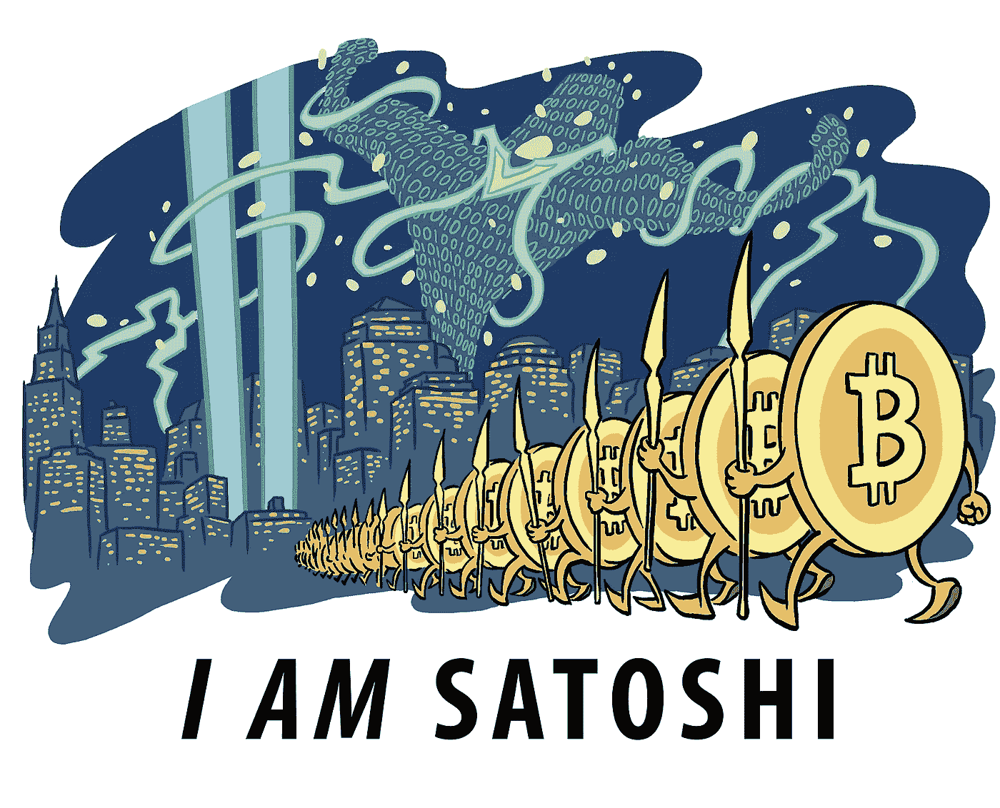
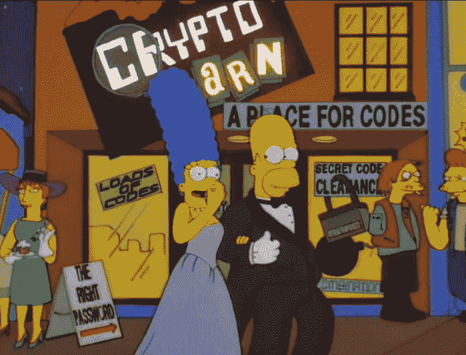

# 电影院中的加密货币

> 原文：<https://medium.datadriveninvestor.com/cryptocurrencies-in-cinema-47a6b45abf1a?source=collection_archive---------22----------------------->

关于比特币的纪录片在普及加密货币方面发挥了重大作用。第一部这样的电影出现在 2012 年——就在中本聪白皮书发表 4 年后。

像《我们所知的货币末日》、《我是 Satoshi》、《比特币的兴衰》和《比特币密码》等电影影响了数百名密码爱好者。他们主要讲述区块链技术和比特币的创造。这些电影如果没有开始，那么普及了中本聪和比特币的传说。

另一组纪录片是关于使用加密货币解决社会问题的可能性。我们正在谈论的电影有《比特币在乌干达》和《比特币在阿根廷》，还有电影《比特币上的生活》，讲述了一对夫妇决定只用数字货币购物 100 天的故事。

## 关于电影《比特币在乌干达》和《比特币在阿根廷》，应该多说一点。

当我们的团队刚刚启动 FairWin 项目时，我注意到 Bounty 项目的大多数活跃成员来自非洲和东亚国家。之前在我看来，既然发达国家的人更了解新技术，他们应该对加密货币更感兴趣。然而，实践表明，在存在大量经济问题、高通胀和生活水平低的国家，人们对加密货币的兴趣要高得多。

> 有一次，在我们完成了在赏金成员中分发代币后，一位来自某个贫穷的南方国家的参与者写信给我们，要求重新计算他的代币。他解释说，他的兄弟也参与了赏金活动，他们窃取了他为我们的项目创作的内容，并获得了更多的令牌。到目前为止，我们甚至不能想象一个完整的家庭可以赚取代币。但是这个人的整个家庭都为费尔温项目工作。

驱使贫穷国家人民购买和使用加密货币的动机在“乌干达的比特币”和“阿根廷的比特币”中得到了极大的展现。

乌干达的生活水平很低，失业率很高。许多年轻人离开了这个国家，但是继续在家乡帮助他们的家人。

这部电影的主角恩苏布加尔说，他的姐姐罗娜搬到了美国，也帮助她的家人。她过去常常通过银行转账汇款。当地银行对通过 WesternUnion 和 MoneyGram 转账收取 10%至 20%的手续费。而区块链则可以让她把钱汇回家，不需要中介和佣金。此外，影片称，在乌干达可以用比特币兑换当地货币。

在阿根廷，人们对加密货币的使用是由非常高的通胀率推动的——这里的情况在许多方面与委内瑞拉相似。唯一的区别是通胀水平和国家对加密货币的监管。

此类电影不仅揭示了改编加密货币及其在日常生活中的使用的可能性，还探讨了社会和经济问题，并讨论了通过区块链技术解决这些问题的可能性。

在关于比特币的纪录片中，应该单独提到一部名为《深网》的电影，这部电影是献给《丝绸之路》及其创作者罗斯·乌布里希特的。

## 对了，比特币不仅在纪录片中被提及，在专题片中也有提及。

比特币在艺术片中的首次亮相发生在 2012 年的美剧《傲骨贤妻》中。在其中一集里，芝加哥检察官的妻子为一名律师辩护，该律师因不披露一名匿名客户的姓名而受到政府逮捕的威胁，这名匿名客户是一名发明了一种数字货币的程序员。

Needless to say that Bitcoin appeared in “The Simpsons”.

以及在电视剧《近乎人类》《机器人先生》《盲区》《iZombie》《一览无余》《黑名单》中。整部电影很少涉及比特币——唯一一次提到比特币是在瑞克·法穆易瓦的电影《Dope》(2015，美国)中。

# 跟随[费尔温](http://fairwin.io/):

推特:【https://twitter.com/FairwinGambling[T4:](https://twitter.com/FairwinGambling)[https://www.facebook.com/fairwin.gambling/](https://www.facebook.com/fairwin.gambling/)insta gram:[https://www.instagram.com/fairwin_team/](https://www.instagram.com/fairwin_team/)

# 与我们聊天:

不和:[https://discord.gg/Hbardp2](https://discord.gg/Hbardp2)
Reddit:[https://www.reddit.com/user/fair-win](https://www.reddit.com/user/fair-win)
电报:[https://t.me/fair_win](https://t.me/fair_win)