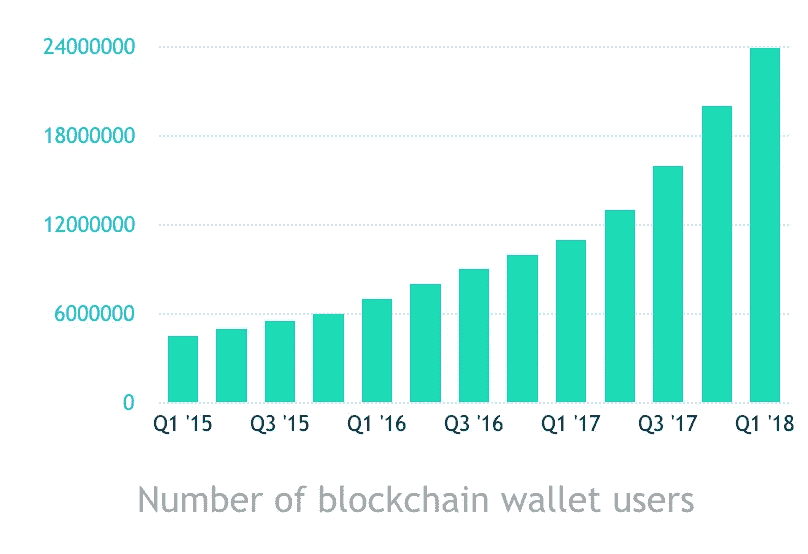
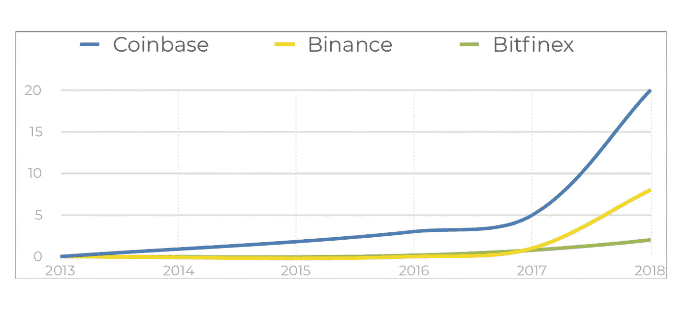
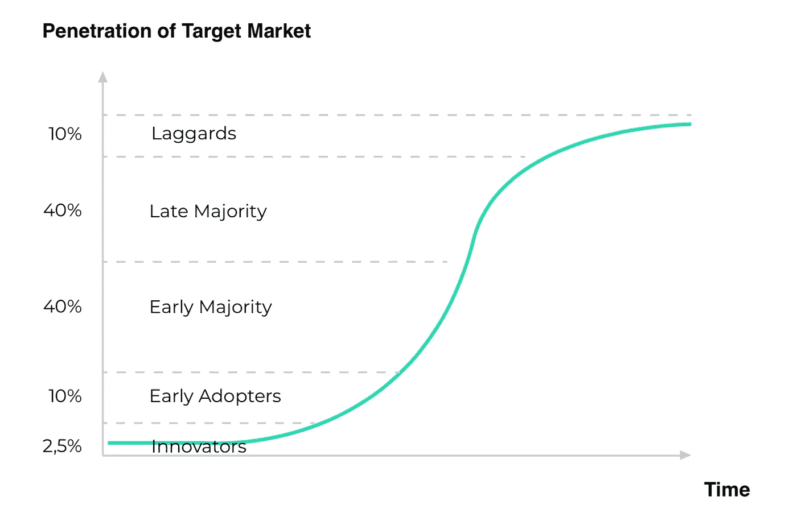

# 加密货币研究第 1 部分:我们在市场周期中处于什么位置？

> 原文：<https://medium.datadriveninvestor.com/cryptocurrencies-study-part-1-where-are-we-in-the-market-cycle-71b35ca1f88b?source=collection_archive---------8----------------------->

这是我正在进行的分析的第一部分。目标是清楚地了解加密货币仍然具有的增长潜力。我希望这对社区也有帮助。欢迎在评论中给我留下任何反馈或问题。

*巨大的市场增长*

自 2009 年中本聪正式发布比特币白皮书以来，加密货币的市场和使用经历了快速增长。为了说明指数增长率，下面显示了一些图表:

在过去的 3 年里，注册的比特币钱包数量增加了 7 倍多。在 2015 年 Q1 奥运会上，大约有 318 万个钱包在区块链注册，而在 2018 年 Q1 奥运会上，这一数字接近 2400 万。这导致平均复合增长率为 96%，意味着比特币钱包用户数量每年几乎翻一番。

另一个增长指标是在交易所注册的用户数量。按用户数量计算，目前最大的交易所是比特币基地、币安和 Bitfinex。最引人注目的增长发生在币安，它是大型交易所中最年轻的。他们成立于 2017 年 6 月，到今天为止已经管理了大约 900 万用户(Q2/2018)。根据他们一天后的声明，1 月 10 日，他们在仅仅一个小时内就搭载了 25 万名客户。2018 年，比特币基地在 Q2 的用户已经超过 2000 万。

*采用:用户特征*

尽管过去的市场增长看起来不错，但只有在过去的增长率能够在未来持续的情况下，它才是有价值的。我们在市场周期中采用情况的一个重要指标是加密货币和代币的普通购买者和用户的特征。
当前市场参与者的典型特征是:
.非常科技化

对区块链和加密货币充满热情
。每天阅读有关市场的新闻和更新
。表现得像一个投机者，并期待市场大幅上涨
。自由主义心态和非宗教
平均年龄在 18-30 岁之间

将描述的特征放入采用周期的更大画面中，可以猜测我们仍然处于早期采用的阶段。这一结论与过去几年的指数增长率相一致。

*渗透率:市场生命周期*

另一种评估技术或产品市场生命周期状态的方法是看一看市场渗透率。根据 2018 年在 Q1 进行的一项调查，只有 8%的美国人购买了加密货币。尽管韩国、日本或新加坡等其他国家的市场渗透还处于进一步发展阶段，但美国在西方世界的采用方面处于领先地位，因为另一项研究显示，随机采访的加密货币购买者中有 53%来自美国。

假设虚拟货币是关于价值或商品交换的潜在关键技术，并且由于其作为流通产品的特性，很可能在未来它们被社会的大多数完全或部分使用。在 8%的人群中使用也表明早期采用阶段。

网址:[https://mintfort.com/](https://mintfort.com/)
推特:[https://twitter.com/mintfort](https://twitter.com/mintfort)领英:[https://www.linkedin.com/company/mintfort/](https://www.linkedin.com/company/mintfort/)脸书:[https://www.facebook.com/mintfortbank/](https://www.facebook.com/mintfortbank/)

在推特上关注我:[https://twitter.com/philipppetzka](https://twitter.com/philipppetzka)
LinkedIn:[https://www.linkedin.com/in/philipp-petzka-817510105/](https://www.linkedin.com/in/philipp-petzka-817510105/)