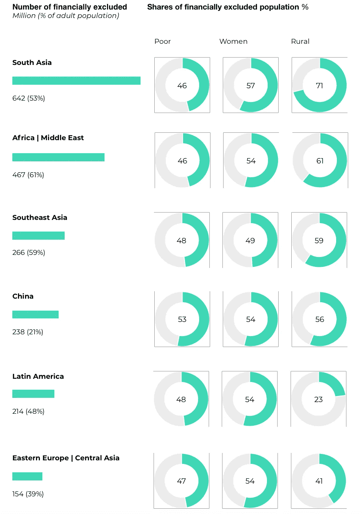

# 加密货币研究第三部分:数字银行的潜力和需求

> 原文：<https://medium.datadriveninvestor.com/cryptocurrencies-study-part-3-the-potential-and-demand-for-digital-banking-4c3bb5e6b625?source=collection_archive---------16----------------------->

*数字银行的总体需求*

由于自 21 世纪初以来互联网在全球的普及，以及智能手机和其他移动设备的广泛采用，客户越来越期待银行和基金管理方面的数字服务。Revolut 或 N26 等银行应用的兴起突显了这一趋势。埃森哲发布的一项研究描述了客户行为和期望的转变。新的特征是

*   *年轻消费者将越来越喜欢脸书或亚马逊等科技公司的银行解决方案，而不是传统的银行服务提供商*
*   *欢迎聊天机器人等自动化支持*
*   *个性化银行体验的需求*
*   *对个人数据的有力保护可以建立信任。*

增长最快的银行用户，即所谓的游牧者定义的需求工具是

*   *点对点交易*
*   *非接触式支付解决方案*
*   *廉价的跨境电汇工具*
*   *虚拟货币直接存取工具*
*   *预算管理工具。*

如今，46%的客户仅使用数字渠道办理银行业务，仅 4 年时间就增加了 19%，而拥有智能手机的千禧一代中有 82%使用移动银行解决方案。这与 APAC 市场的趋势是一致的，这些市场首先是移动市场，大多数人都在使用金融科技解决方案通过手机进行银行业务。

*虚拟货币银行业的总体需求*

加密货币的日益普及以及基于区块链的资产管理的持续技术发展导致了对能够处理新要求的银行应用程序的需求。当前的解决方案是分散的，并且专门用于某些过程，即交换资产(市场)或存储(钱包)。支出往往只有在保持同一种货币的情况下才会起作用。此外，当前大多数解决方案在接口方面实现得很差。从 UX/用户界面的角度来看，还有改善客户体验的空间，这对于广泛采用和频繁使用也是必要的。

根据埃森哲的上述研究，50%的银行业游民如今已经要求使用虚拟货币。这是采用率上升的另一个指标，因为游牧民是一个不断增长的用户群体。

*新兴市场的需求——为没有银行账户的人提供银行服务*

世界银行在 160 个国家进行的研究发现，全球某些地区的银行需求存在 3800 亿美元的机会。在挪威、英国或德国等西方国家，超过 98%的 15 岁以上人口拥有银行账户，而中亚和非洲地区则远远落后。底部是土库曼斯坦，那里只有 1.8%的人有账户。与之相伴的是尼日利亚(3.5%)、马达加斯加(5.7%)和几内亚(6.3%)。

这些数字加起来导致大约 20 亿人在经济上被排除在外。

新兴市场的人们通常不参与正式的银行体系。大多数交易都以现金结算。获得机构信贷的机会非常有限，而且没有办法安全地存钱和投资。总体而言，低收入经济体中只有 17.9%的成年人拥有借记卡。但是会有转变。普华永道(PwC)等主要市场研究机构的研究显示，新兴市场的增长速度将明显快于老牌市场。普华永道预测，未来 30 年内，越南、印度尼西亚和尼日利亚将成为增长最快的经济体。中国和印度有望超过美国，成为地球上最大的两个经济体。新兴市场已经引领着全球银行业收入的增长，这种趋势可能会持续下去。

最大的需求来自中小企业，它们需要信贷来实现增长。根据麦肯锡的分析，总共有大约 2 亿家财务上未得到服务的企业造成了 2.2 万亿的信贷缺口。在这方面，以及在个人银行业务方面，数字银行业务，尤其是移动银行业务发挥着重要作用。原因是易于使用移动设备(其中大多数国家是移动优先市场)、有效的入门和快速处理支付和小额贷款。此外，移动银行提供的这种远程结构降低了银行的风险和工作量。渗透可以以低得多的成本实现，这也给客户带来了好处。

让我们保持联系！

在推特上关注我:[https://twitter.com/philipppetzka](https://twitter.com/philipppetzka)

领英:【https://www.linkedin.com/in/philipp-petzka-817510105/ 

Philipp Petzka 是 Mintfort 的创始人兼首席执行官，mint fort 是一家为加密货币和法定货币提供数字银行解决方案的公司。

**网址:**[**https://mintfort.com/**](https://mintfort.com/) **推特:**[**https://twitter.com/mintfort**](https://twitter.com/mintfort) **领英:**[**https://www.linkedin.com/company/mintfort/**](https://www.linkedin.com/company/mintfort/) **脸书:**[**https://www.facebook.com/mintfortbank/**](https://www.facebook.com/mintfortbank/)

