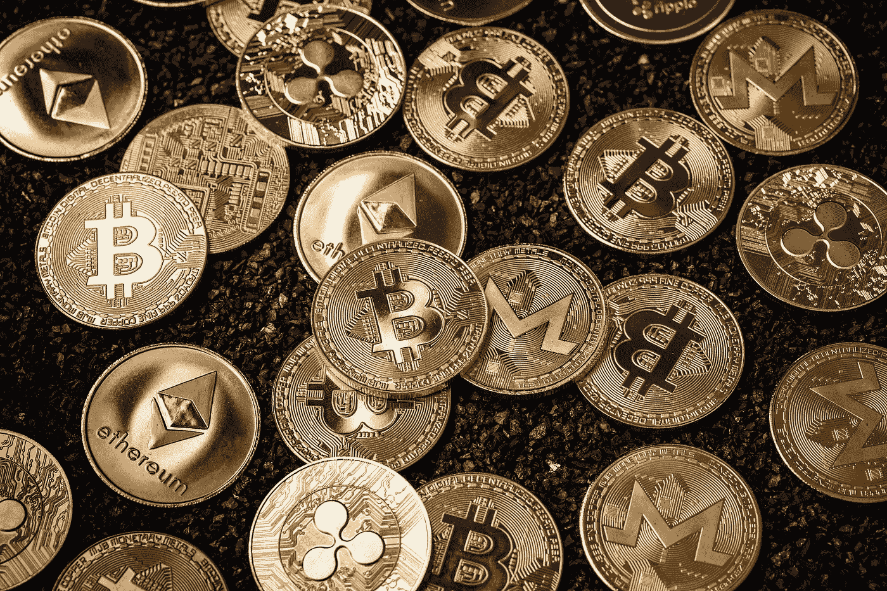
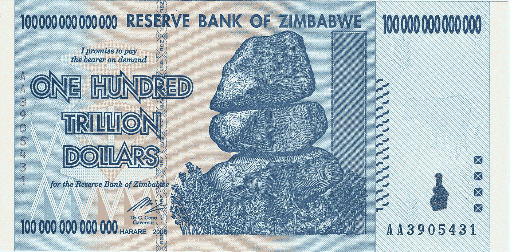
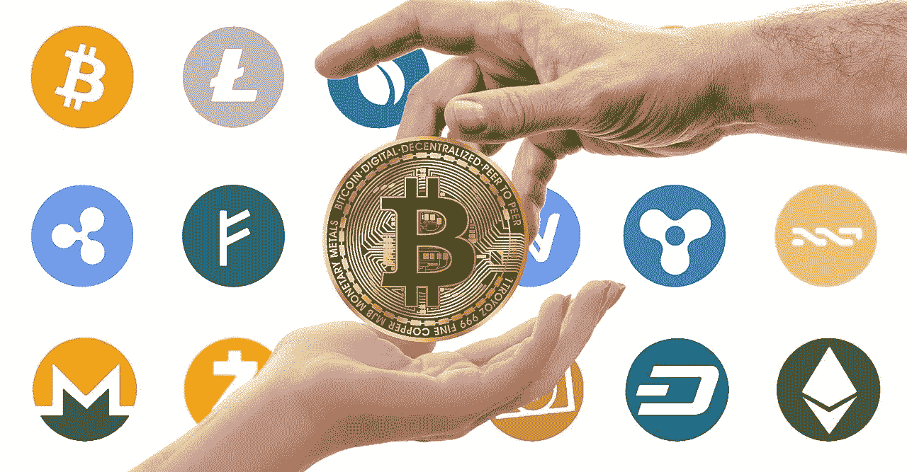
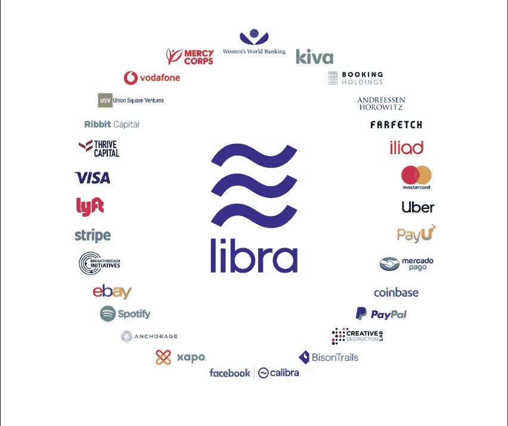

# 加密货币。它们是什么以及它们是如何工作的？

> 原文：<https://medium.datadriveninvestor.com/cryptocurrencies-what-they-are-and-how-they-work-418405949e6c?source=collection_archive---------10----------------------->

在世纪之交，全球金融体系面临着多重破产和崩溃的挑战。2000 年初，网络泡沫破裂。后来在 2001 年 10 月，安然丑闻爆发。但是最大的危机就在眼前。2008 年中后期，成立于 1850 年的雷曼兄弟公司倒闭，带来了自大萧条以来最大的危机。《金融时报》报道了危机的后果…

> 我们正处于世界金融体系全面崩溃的边缘。

美国财经新闻网站“The Street”提到…

> 雷曼兄弟的倒闭将成为历史上最大的金融失败之一。虽然其他因素肯定导致了随后的经济动荡，但该公司的失败似乎是引发大范围衰退的触发因素。据美国广播公司报道，估计有超过 600 万人失业，失业率上升 10%，道琼斯工业平均指数(Dow)惊人地下跌了 5000 点，以及国际连锁反应，摧毁了拉脱维亚、匈牙利和立陶宛等国的经济(更不用说欧盟了)。甚至巴基斯坦也在危机后向国际货币基金组织(IMF)寻求救助，冰岛也面临危机，官员们宣布政府没有资金支持该国的主要银行。

可疑的银行业务、虚假的会计花招和过度杠杆化只是导致这场灾难的几个因素。当这些策略出现在主流媒体上，并被世界上绝大多数人所知时，人们对当前的银行体系失去了信心。在这一点上，世界需要改变。可以信任他们血汗钱的东西。在雷曼兄弟倒闭仅仅两个月后，2008 年 10 月 31 日,“比特币:一个点对点的电子现金系统”被发送到一个加密邮件列表中。作者是中本聪。

# 历史

自 20 世纪 90 年代初以来，一些人梦想着一个更加自由的世界。在这个世界上，没有政府、央行或任何其他权力机构能够控制全球的金融手段。

## 什么叫做‘钱’？

在来自网飞的纪录片《投资比特币》中，有以下评论…

> 货币基本上只是一个会计系统。这是一种记录谁拥有什么，谁拥有什么，谁欠谁什么的方式。这就是金钱的全部。你需要一个可以作为中央发行人的人，一个可以信任的第三方，一个可以保证钱是真实的人。数百年来，政府一直在发行货币。

国际货币基金组织将“货币”描述为…

> 简而言之，货币可以是任何可以作为价值储存手段的东西，这意味着人们可以把它存起来，以后再用——随着时间的推移，他们的购买变得平稳；记账单位，即提供一个共同的价格基础；或者是一种交换媒介，人们可以用它来互相买卖。

## 货币是如何产生的？

对冲基金经理雷伊·达里奥在他的视频《经济机器如何运转》中描述了如下印钞过程…

> …已经将利率降低到接近于零——它被迫印钞。与削减支出、削减债务和财富再分配不同，印钞会导致通胀和刺激。不可避免的是，中央银行凭空印刷新的货币，并用它来购买金融资产和政府债券。这种情况在美国大萧条时期发生过，在 2008 年再次发生，当时美国中央银行——美联储——印刷了超过两万亿美元。世界上其他有能力的中央银行也印了很多钱。通过用这些钱购买金融资产，它有助于推高资产价格，使人们更有信誉。然而，这只帮助那些拥有金融资产的人。你看，央行可以印钱但是只能买金融资产。另一方面，中央政府可以购买商品和服务，把钱交到人民手中，但它不能印钱。因此，为了刺激经济，两者必须合作。通过购买政府债券，央行实质上是借钱给政府，允许政府通过刺激计划和失业救济来维持赤字并增加商品和服务支出。这增加了人们的收入和政府的债务。然而，这将降低经济的总债务负担。这是一个非常危险的时期。政策制定者需要平衡降低债务负担的四种方式…

因此，通过想要分散货币的创造，通过应用货币真正的经济规则，一群人试图用一种电子的、分散的货币来取代美元。因为正如纪录片《寄希望于比特币》中提到的…

> 通过监控和更新分类账，在一个集体的、基于共识的系统中，你不再需要中间的某个人成为所有信息的仓库。这就避免了以这种方式集中信息带来的费用、低效率以及最终潜在的腐败和风险。

The hyper-inflation of Zimbabwe is an example of government corruption that hits its own country citizens.

像 eCash、Digicash、Hashcash、B-Money 以及最著名的 Bit Gold 这样的技术和公司出现了，并试图给出这个问题的解决方案。

中本聪(Shatoshi Nakamoto)是一个身份神秘的人，他在 2008 年提议创建一个名为比特币的点对点电子现金系统。基于区块链技术，比特币注定会成功，但其他所有的都失败了。

## 什么是‘区块链’？

维基百科给出的定义是…

> 区块链，最初是区块链，是一个不断增长的记录列表，称为块，使用加密技术链接。每个块包含前一个块的加密散列、时间戳和事务数据(通常表示为 Merkle 树)。根据设计，区块链可以抵抗数据的修改。它是“一个开放的、分布式的分类账，可以有效地、可验证地、永久地记录双方之间的交易”。为了用作分布式分类帐，区块链通常由对等网络管理，该对等网络共同遵守用于节点间通信和验证新块的协议。一旦被记录，任何给定块中的数据在不改变所有后续块的情况下不能被追溯性地改变，这需要网络多数的一致同意。

它基本上是一个分散的全球计算机网络，任何人都可以参与其中，它以密码块的形式验证和存储每一笔交易。与集中式计算机网络相比，后者的一个优点是，在受到攻击的情况下，黑客可以改变存储的数据。在分散的情况下，黑客需要改变网络中每台计算机的数据。就比特币而言，全世界就算没有数百万台电脑，也有数千台。

## 比特币和矿业。

bitcoinist 网站提到…

> 比特币基于区块链技术。区块链代表一个公共分类账，包含给定系统中曾经执行过的所有交易。分类帐本身存储在整个网络中，更新一个分类帐就是更新所有分类帐。就是这个公共分类账包含了所有过去交易的历史。另一方面，比特币矿工通过将交易分组的方式向网络的其他部分确认交易，因此比特币挖掘非常重要。

## 丝绸之路。

The Silk Road logo.

丝绸之路是罗斯·威廉·乌布里切特于 2011 年 2 月创建的一个黑暗网站。这个网站曾经出售各种毒品、武器和其他非法产品。为了不被追查到，他们过去只接受比特币。由于比特币理论上是匿名的，没人能追踪到这个网站的卖家和买家。该网站创造了加密货币是非法活动工具的概念。罗斯·威廉·乌布里切特现在被判犯有洗钱、电脑黑客和其他非法活动罪，他目前正在监狱服双重无期徒刑。

## 从创世街区以及更远的地方。

2009 年 1 月 3 日，第一枚比特币被开采出来，也被称为“创世纪币”。这第一块奖励了沙陀 50 个比特币。当时一个比特币的价格是 0.001 美元。

2009 年 1 月 12 日，美国开发商 Hal Finney 从 Shatoshi Nakamoto 那里收到了 10 枚比特币。

2010 年 5 月 22 日，美国开发商 Laszlo Hanyecz 首次将比特币用于商业。他用 10.000 比特币(25 英镑)买了披萨。比特币的价值是每比特币 0.0025 美元。

2010 年 6 月 2 日，DwDolllar 成为第一家比特币交易所。

2010 年 7 月 12 日，一个比特币价值 0.080 美元。

2010 年 7 月 17 日，加密货币交易所 MtGox 启动。

2011 年 2 月 9 日，一个比特币价值一美元，丝绸之路网站开始在黑暗网络中运行。一个比特币价值 0.32 美元。

同年 6 月，维基解密和其他网站开始接受比特币。

2011 年 6 月 2 日，一个比特币价值 10 美元。

2012 年 5 月 1 日，大约 50000 个比特币在比特币交易所被盗。这是交易所无助于比特币去中心化的另一个迹象。

2013 年 2 月 28 日，比特币价格突破 31.91 美元。

2013 年 3 月 28 日，比特币的市值达到 10 亿美元。

2013 年 4 月 1 日，一枚比特币的价格是 100 美元。

2013 年 8 月 6 日，德克萨斯州法院定义比特币为实际货币。

2013 年 9 月 8 日，彭博将比特币纳入股票代码。一个比特币售价 93.36 美元。

2013 年 11 月，比特币价格超过 1000 美元。

2014 年 10 月 21 日，Benjamin Lawsky 发布了“虚拟货币监管框架提案”。

2014 年 12 月，微软开始接受比特币用于 Xbox 游戏和 Windows 软件。

2017 年 6 月 12 日，比特币价格超过 3000 美元。

2017 年 11 月 29 日，比特币超过 10000 美元。

2018 年 1 月 2 日，彼得·泰尔基金会购买了数百万美元的比特币。

2018 年 1 月，比特币在 20000 美元左右达到峰值。

2018 年 2 月 5 日，比特币跌破 7000 美元。

2018 年 11 月 24 日，比特币跌破 4000 美元。

2019 年 5 月，比特币再次达到 8721 美元的价格。

# 你需要知道的顶级加密货币。

在比特币取得成功后，更多的加密货币出现，以解决比特币的弱点。

1.  **比特币**
2.  **以太坊**——2015 年 7 月 30 日开发——Coinmarketcap.com 在以太坊上撰文——以太坊(ETH)是一个智能合约平台，使开发者能够构建由 Vitalik Buterin 在 2013 年概念化的去中心化应用(dapps)。ETH 是以太坊平台的本地货币，也是以太坊网络上矿工的交易费。以太坊是基于区块链的智能合约的先驱。在区块链上运行时，智能合约就像一个自我运行的计算机程序，在满足特定条件时自动执行。在区块链，智能合约允许代码完全按照编程运行，没有任何停机、审查、欺诈或第三方干预的可能性。它可以促进金钱、内容、财产、股份或任何有价值的东西的交换。
3.  **Ripple**—2012 年发布——Coinmarketcap.com 在 Ripple 上写道——Ripple(XRP)是一个独立的数字资产，是 Ripple Consensus Ledger 的原生资产。凭借业经验证的治理和同类中最快的交易确认，XRP 被认为是金融机构和流动性提供商寻求银行间资金流动的全球影响力、可访问性和快速结算终结性的最有效的结算选择。
4.  **莱特币**——2011 年 10 月 7 日发布——Coinmarketcap.com 在莱特币上撰文——莱特币是查理·李创造的一种点对点加密货币。它是基于比特币协议创建的，但在使用的哈希算法方面有所不同。Litecoin 使用内存密集型加密工作证明挖掘算法。Scrypt 允许 GPU 等消费级硬件挖掘那些硬币。
5.  **比特币现金**——2009 年 1 月 3 日发布——Coinmarketcap.com 在比特币现金上写道——比特币现金(BCH)是比特币的硬分叉(一个社区激活的协议或代码更新)，于 2017 年 8 月 1 日生效，将块大小增加到 8MB，以帮助扩大比特币底层技术的规模。2018 年 11 月 16 日:BCH 再次被硬分叉，分裂为比特币 SV 和比特币 ABC。比特币 ABC 成为主导链，并接管了 BCH 证券交易所，因为它拥有更多的哈希权力和网络中的大多数节点。
6.  **币安币**——2017 年 7 月 14 日发行——Coinmarketcap.com 在币安币上撰文——币安币(BNB)是币安平台的加密货币。“币安”这个名字是二进制和金融的组合。截至 2019 年，许多企业接受 BNB 作为一种支付形式。
7.  **Tether**——2012 年 1 月发布——Coinmarketcap.com 在 Tether 上写道——Tether(USDT)是一种加密货币，其价值旨在反映美元的价值。这个想法是创造一种稳定的加密货币，可以像数字美元一样使用。作为稳定的美元替代品的硬币被称为“稳定硬币”根据他们的网站，Tether 将现金转换成数字货币，将硬币的价值锚定或“拴”在美元、欧元和日元等国家货币的价格上。
8.  **Neo**——2014 年 2 月发布——Coinmarketcap.com 在 Neo 上撰文——Neo(Neo)，原名 Antshares，旨在通过整合数字资产、数字身份和智能合同来建立“智能经济”。Neo 的双令牌生态系统由 Onchain DNA 开发，可用于创建 dApps 和 ico。据称，其委托拜占庭容错(dBFT)共识算法比以太坊和比特币使用的 PoW 更快。

# 你需要知道的加密货币交易所。

1.  币安于 2017 年在上海成立，目前总部位于马尔他。它拥有 100 多种加密货币，自 2018 年以来，就交易量而言，它是世界上最大的加密货币交易所。
2.  比特币基地成立于 2012 年 6 月，总部位于加利福尼亚州旧金山市。截至 2018 年，他们在全球 32 个国家开展业务。
3.  Bitpanda 成立于 2014 年 12 月，总部位于奥地利。他们提供欧元、美元、瑞士法郎和英镑的加密货币对。

# 你需要知道的加密货币钱包。

当我们需要购买加密货币时，我们需要将它们存储在某个地方。在密码钱包中，我们可以存储我们的加密货币，也可以发送和接收它们，就像我们使用普通钱包一样。为了与某人进行交易，我们需要知道我们的加密钱包的公钥和私钥。我们被允许共享我们的公钥，**，但是我们的私钥**！公钥以文本形式或 QR 码形式出现。我们需要知道的一些加密钱包是…

a)数字钱包——桌面电脑或手机应用程序形式的钱包。

1.  **信任钱包**—Android/iOS/OSX——来自币安的多币加密钱包。
2.  **cito wise**——Android/iOS——来自爱沙尼亚一家专门生产加密钱包的公司。
3.  **Infinito Wallet**—Android/iOS——这是一个加密钱包，支持新加坡一家公司的 2000 多个令牌。
4.  **Exodus** —Android /iOS —一个加密钱包解决方案，支持 100 多种资产、硬件实现和漂亮的用户界面。

b)纸质钱包——安全性最高。基本上就是写在一张纸上的密钥和密码。

c) **硬件钱包**—u 盘和其他种类的存储我们所有钱包信息的设备。

1.  **阿里斯顿钟表** —一款瑞士制造的腕表，用于存储我们所有的加密货币。
2.  **Ledger Nano S5** —需要 PIN 码才能读取所有内容的 u 盘。
3.  **Trezor One** —捷克公司的创造。这个类似汽车钥匙的设备存储了 500 多种加密货币。

# 加密货币的未来

比特币经历了很多压力。仍然在我们的日子里，没有人知道它是否会在未来存在。一个是肯定的，加密货币已经彻底改变了世界。他们创造了一个现实，货币将成为分散的交换手段。没有实体会控制它们。

尽管直到今天许多人还在利用新技术。就像发明比特许可证的律师本·劳斯基一样。一个监管框架，公司需要在其中申请以获得许可证。“比特币银行”纪录片提到…

> 所以本·劳斯基发明了一个叫比特许可证的东西，这是纽约试图规范这个可怕的新技术。现在是法律了。他还宣布，他将离开政府，以建立自己的私人咨询公司，帮助公司应对金融监管，如他创建的 bitlicense。所以我们基本上建立了这个美丽的新生态系统，本·劳斯基过来说，“我是来保护消费者的。”他在周围建了一堵巨大的墙，然后坐在门外，向进来的人收费。这就是裙带资本主义的定义，出于某种原因，本·劳斯基甚至不认为这有什么错。

## 天秤座项目。

美国社交媒体公司脸书认为，在其用户数据库中，有 17 亿没有银行账户的成年人可以使用这种货币进入金融系统。与其他加密货币不同，它们是由相关人员的信仰支持的(也像美元，一种由对美国政府的信仰支持的加密货币)，Libra 将与低波动性资产等一篮子资产挂钩，包括多种货币的银行存款和政府证券。

维基百科提到…

> Libra 是由美国社交媒体公司脸书提出的一种许可的区块链数字货币。该项目、货币和交易将由 Libra Association 进行管理和加密，Libra Association 是一个会员制组织，由脸书的子公司 Calibra 和其他 27 家公司创建，涉及支付、技术、电信、在线市场、风险投资和非营利组织。截至 2019 年 7 月，货币和网络尚不存在，仅发布了初步的实验代码。发射计划在 2020 年。

上述由 28 名成员在瑞士日内瓦创立的天秤座协会。成员包括万事达卡、PayPal、PayU、Stripe、Visa Inc、Booking Holdings、易贝、脸书、Farfetch、Lyft、MercadoPago、Spotify、优步、Iliad SA、沃达丰、安克雷奇、Bison Trails、比特币基地、Xapo、Andreessen Horowitz、Breakthrough Initiatives、Ribbit Capital、Thrive Capital、Union Square Ventures、Creative Destruction Lab、Kiva、Mercy Corps 和妇女世界银行。

虽然未来不确定，但这个部门很有希望。许多比特币早期适应者仅仅因为比特币价格的上涨就成为了千万富翁。许多名人都投资了加密货币，即使出于某种原因，它们在不久的将来不再存在，但就目前而言，它是一种伟大的中期投资工具和投机产品。

**快速注释**:还记得买披萨的 10.000 BTC(25 美元)吗？今天，他们的估计成本是 7，000，000 美元…

*消息来源*

1.  【https://coinmarketcap.com/】T5[T6](https://coinmarketcap.com/)
2.  比特币银行(2016)纪录片-[https://www.imdb.com/title/tt5033790/](https://www.imdb.com/title/tt5033790/)
3.  比特币:一个点对点的电子现金系统，作者 Shatoshi Nakamoto——【https://bitcoin.org/bitcoin.pdf 
4.  【https://en.wikipedia.org/wiki/Bitcoin 
5.  [https://www . IMF . org/external/pubs/ft/fandd/2012/09/basics . htm](https://www.imf.org/external/pubs/ft/fandd/2012/09/basics.htm)
6.  [https://www.youtube.com/watch?v=PHe0bXAIuk0](https://www.youtube.com/watch?v=PHe0bXAIuk0)
7.  [https://en.bitcoinwiki.org/wiki/Bitcoin_history](https://en.bitcoinwiki.org/wiki/Bitcoin_history)
8.  拟议中的虚拟货币监管框架—[https://www . eff . org/files/2014/10/21/bit license-comments-eff-ia-Reddit-hofmann-cover . pdf](https://www.eff.org/files/2014/10/21/bitlicense-comments-eff-ia-reddit-hofmann-cover.pdf)
9.  [https://coinmarketcap.com/currencies/ethereum/](https://coinmarketcap.com/currencies/ethereum/)
10.  [https://coinmarketcap.com/currencies/ripple/](https://coinmarketcap.com/currencies/ripple/)
11.  [https://coinmarketcap.com/currencies/litecoin/](https://coinmarketcap.com/currencies/litecoin/)
12.  [https://coinmarketcap.com/currencies/bitcoin-cash/](https://coinmarketcap.com/currencies/bitcoin-cash/)
13.  [https://coinmarketcap.com/currencies/binance-coin/](https://coinmarketcap.com/currencies/binance-coin/)
14.  [https://coinmarketcap.com/currencies/tether/](https://coinmarketcap.com/currencies/tether/)
15.  [https://coinmarketcap.com/currencies/neo/](https://coinmarketcap.com/currencies/neo/)
16.  [https://www.benzinga.com/money/best-crypto-wallet/](https://www.benzinga.com/money/best-crypto-wallet/)
17.  [https://en . Wikipedia . org/wiki/Libra _(加密货币)](https://en.wikipedia.org/wiki/Libra_(cryptocurrency))
18.  [https://www . the guardian . com/technology/2019/jun/18/what-is-Libra-Facebook-new-cryptocurrency](https://www.theguardian.com/technology/2019/jun/18/what-is-libra-facebook-new-cryptocurrency)