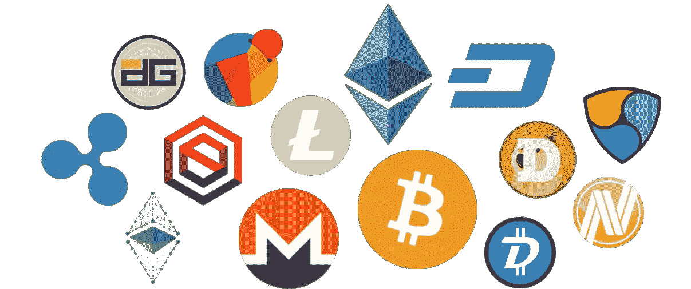

# 加密货币 2018:值得投资吗？

> 原文：<https://medium.datadriveninvestor.com/cryptocurrency-2018-is-it-worth-investing-in-c1e09953d05d?source=collection_archive---------4----------------------->

## 随着我们接近今年的一半，加密货币在第三季度和第四季度将会如何发展？这是我们对未来的展望

随着 2017 年初 177 亿美元的总市值在年底飙升至 6130 亿美元， **2018 年很有可能成为加密货币**的又一个里程碑式的一年。

下面是对 2018 年剩余时间加密货币的快速快照，以及你是否应该考虑加入这场革命。

# **更严厉的措施和法规即将出台**

欧洲政策机构负责人透露，欧洲的犯罪分子正在使用加密货币[清洗大约 40 亿英镑的非法资金](http://uk.businessinsider.com/europol-criminals-using-cryptocurrency-to-launder-55-billion-2018-2)，预计会有更多的法规出台。

为了保持合规，您需要遵循**四大反洗钱支柱**。这包括拥有:

确保持续合规的内部控制系统。

进行独立测试，检查您的合规程序。

管理合规的指定人员或团队。

对所有适用人员进行培训。

您可以在我们的[前一篇博客](https://www.ebacrypto.io/aml-anti-money-laundering-regulations/)中了解更多关于反洗钱法规的信息。

更严厉的措施可以被认为是积极的和消极的。例如，随着监管机构的严厉打击，一些监管程序应会大幅减少反洗钱案件的数量。另一方面，如果你推迟使用加密货币，在你开始交易之前，可能会有很多“障碍”要通过。

# **预期价格波动**

虽然加密货币和比特币每周都在继续抢头条，但它并不总是有利于市场。随着类似[、价值 2000 万美元的加密货币劫案](https://www.independent.co.uk/life-style/gadgets-and-tech/news/cryptocurrency-heist-hackers-bitcoin-gold-attack-a8374016.html)等负面新闻的出现，比特币和加密货币将继续感受到投机的影响。

有鉴于此，**你应该通过制定一个稳健的计划**来为起伏做好准备。这应包含积极的解决方案，以便在市场出现任何轻微下跌时灵活应对。

# **简化的分散平台**

EOS 平台的推出将使开发者能够在公共环境中构建分散的应用程序。

这一进步旨在简化流程并支持数千种不同的商业分散应用。可扩展性成为现实，作为回应，加密货币的使用将会激增。

[EOS 的 2018 年价格预测](https://smartereum.com/3448/eos-price-predictions-2018-the-future-looks-bright-for-cryptocurrency-tue-may-29/)在 2018 年底约为 37 美元，预计在未来五年内将飙升至 137 美元。

因此，如果你对加密货币持观望态度，这种大幅增长绝对值得考虑。

# **最后的想法**

加密货币有可能简化人工流程，并创造一种更安全的支付方式。然而，尽管这种繁荣看起来将持续到 2018 年，但在使用任何数字货币之前评估每个元素是至关重要的。

无论是通过监管机构的眼睛确保你的业务合规，还是就如何最大限度地利用市场机会提供透明的建议，你都不能错过任何机会。

实施广泛的战略不仅能保护你的业务，还能给你一个探索新的盈利机会的平台。

寻求加密货币领域专家的帮助可以为您提供持续的支持，让您在不断发展的世界中茁壮成长。

