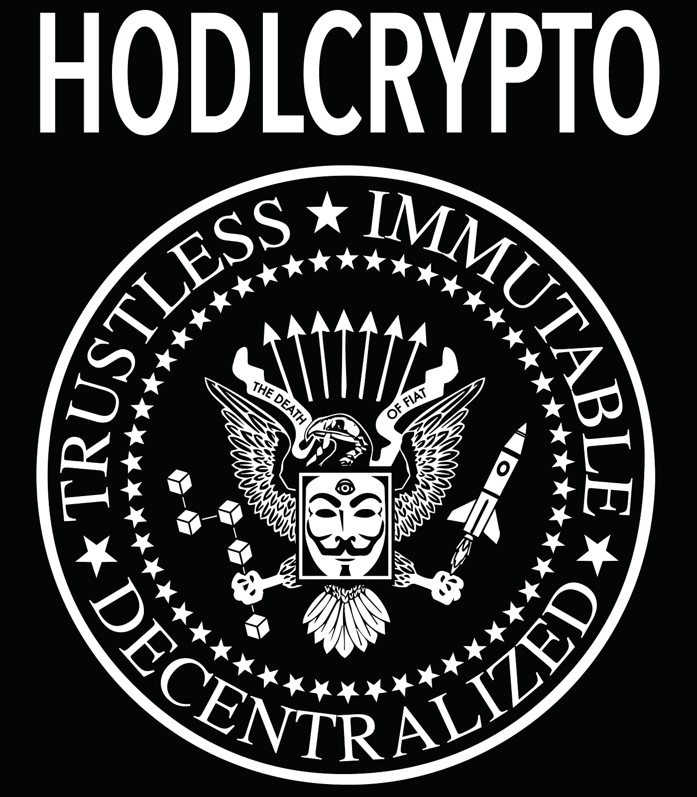
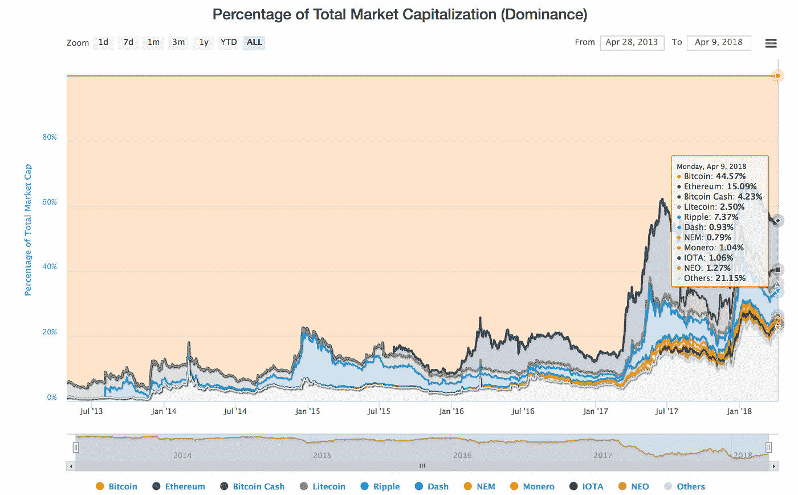

# 加密货币基础知识— 3 个关键特征及其重要性

> 原文：<https://medium.datadriveninvestor.com/cryptocurrency-basics-3-key-characteristics-and-why-they-matter-7348242abe18?source=collection_archive---------0----------------------->

为了相信加密革命，理解加密货币和区块链技术的基本方面是很重要的，这使得它如此具有革命性。

加密货币的 3 个关键特征是**不可信**、**不可变**和**去中心化。**

# 比特币:我们第一个也是最突出的例子

比特币是一种加密的安全货币，被创造出来是为了普遍用于支付，类似于现金。它也是在比特币取代所有形式的法定货币的愿景下创建的。

由于比特币是有史以来创造的第一种加密货币，它首先表现出我们稍后将讨论的 3 个关键特征。

因为比特币代码是开源的，所以在过去的几年里，人们一直在创造自己版本的比特币，也就是所谓的“另类硬币”。

比特币取代所有法定货币的愿景变得越来越不现实，因为比特币目前占加密货币市场总额的 45%(不到一半)。

正如你从趋势中看到的，随着时间的推移，已经出现了一些巨大的 altcoin 反弹，削弱了比特币的统治地位，为市场带来了许多其他强大的项目。

然而，比特币和替代币共享非常相似的区块链技术，3 个关键特征也适用于所有情况(在大多数情况下)。

我们将讨论的这 3 个特征是您可能经常从怀疑者那里听到的问题的答案，例如:**“是什么让加密货币如此特别？”以及“加密货币与法定货币有什么不同？”**

# 1)不可信

比特币是不可信的，因为它被设计成没有人必须信任其他人才能让网络运行。

在比特币出现之前，每种形式的货币都需要一个你必须信任才能使用的中央机构。在所有情况下，**中央权威成为导致货币消亡的核心弱点**。

有了比特币，**生态系统的每一部分都验证了其他部分告诉它的东西，而不需要相信任何人。**如果你广播一个比特币交易，所有节点都会收到并验证签名是否有效。如果签名无效，它们会丢弃事务。

**网络上的每个人都有账本的副本**所以我们不再需要信任单个实体/组织/第三方，因为**当你可以对照这个账本进行验证**时，因为你有它的副本，所以没有必要信任。分散式分类账被称为区块链。

**个体网络参与者的激励**尽管工作证明(PoW)共识算法是现代经济学中**最具突破性的**想法之一。

> *这种激励可能有助于鼓励节点保持诚实。如果一个贪婪的攻击者能够组装比所有诚实节点更多的 CPU 工作证明，* ***他将不得不选择使用它来欺骗人们*** *通过偷回他的付款，或者使用它来产生新的硬币。*
> 
> 他应该发现遵守规则比破坏体系和他自己财富的合法性更有利可图，这些规则使他获得的新硬币比其他人加起来还多。
> 
> *—中本聪*

尽管我们仍在弄清楚如何使用加密货币，以及用于什么目的，但它们会一直存在下去。除了加密货币和区块链技术的其他主要好处之外，**单独解决集中信任问题是一项足够大的创新，可以赋予加密持久的力量。**

# 2)不可变

“不可变的”，从最简单的意义上来说，意味着“不可撤销”

关于区块链和加密货币的不变性应遵循 3 个原则:

*   改写历史的可能性应该很小或者很难。
*   除了私人钥匙的所有者，任何人都不可能转移资金。
*   所有的交易都记录在区块链上。(为保证上述 2 项原则)

当我们想检查我们的银行账户里的钱是怎么花掉的时候，我们就向银行查询我们的交易历史。我们相信我们的银行不会伪造交易或操纵我们的钱，因为我们相信他们会把我们的交易交给收款人。如果有欺诈交易，银行也需要被信任来改变它们并解决问题。

正如我们已经看到的，加密货币中去除了**中心化和信任的元素，**不再有第三方让我们信任去做这些事情。因此，**交易记录是公开的，不可更改的(不可变)。**

**虽然改变交易分类账并非不可能，但密码安全使其变得极其困难。它需要你危及整个加密货币用户网络的安全。**

# 3)分散化

由于**“去中心化”**在加密社区中是一个如此相关的术语，所以很重要的一点是对它进行很好的定义。它可以有不同的含义。

> ***“区块链在政治上是分散的*** *(无人控制)****；在架构上是分散的*** *(没有基础设施中心故障点)* ***但在逻辑上是集中的*** *(有一个共同商定的状态，系统*像单台计算机一样运行*。”—维塔利克·布特林*

*   容错:分散系统不太可能意外失败，因为它们依赖于独立组件的网络。
*   **抗攻击性:**分散式系统因为没有易受攻击的中心点，可以用比周围系统低得多的成本进行攻击，所以攻击和破坏或操纵的成本更高。
*   **抵制共谋:**分散系统的成员更难以牺牲他人利益的方式行事。另一方面，企业和政府总是以有利于自己却伤害他人的方式相互勾结。

有了中央银行和政府，通过造币厂和利率的货币供应和创造只受银行控制。法定货币的使用者受到央行印钞冲动的支配。

> 这个世界的问题是避免权力集中——我们必须分散权力。
> 
> —米尔顿·弗里德曼

如果你还没有对中央银行印钞骗局感到愤怒，那么当他们印刷并摧毁你储存在这些法定货币中的财富时，将它视为一种隐性税收是有帮助的。

然而，对于加密货币，**没有大多数人的同意，任何个人或财团都无法影响货币的供应或对其施加重大影响。**

# 红利特征—通货紧缩

**领先的加密货币具有最大代币供应上限或具有预定义生产参数的无限供应。**

许多顶级加密货币如比特币、莱特币和 Dash 都有最大供应量，这使它们天生具有通缩性。对加密货币的需求或采用的任何增加都将导致价格的相应增加。

大多数其他主要的加密货币**如以太坊、monero 等。，有无限的供应，有预先定义的规则，每年将生产多少硬币。因此它们在本质上是可预测的。如果这些货币长期来看是成功的，那么更多货币的生产率不太可能导致任何形式的通货膨胀。**

**以丢失私钥**的形式出现的硬币**的需求、采用和销毁的增加，很可能会抵消因 PoW/PoS 采矿奖励而导致的供应的适度增加。**

# 结论

这就是让加密货币和区块链技术如此具有革命性的 3 个关键特征。此外，有限的供给还会带来额外的经济特征，即通货紧缩。

下次有人问你那些讨厌的问题，比如“密码有什么特别的？”或者“是什么让他们与众不同”，你可以带他们去学校学习 3 个关键特征:**不信任、不变和分散。**

**H** 老 **O** n 为 **D** 耳 **L** ife

*原载于 2018 年 4 月 9 日 hodlcrypto.co***。**