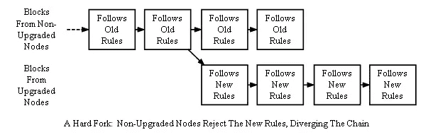
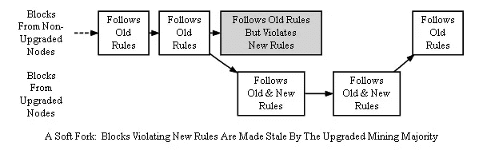
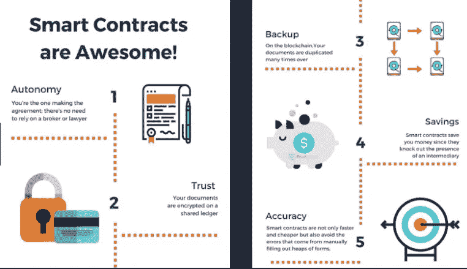
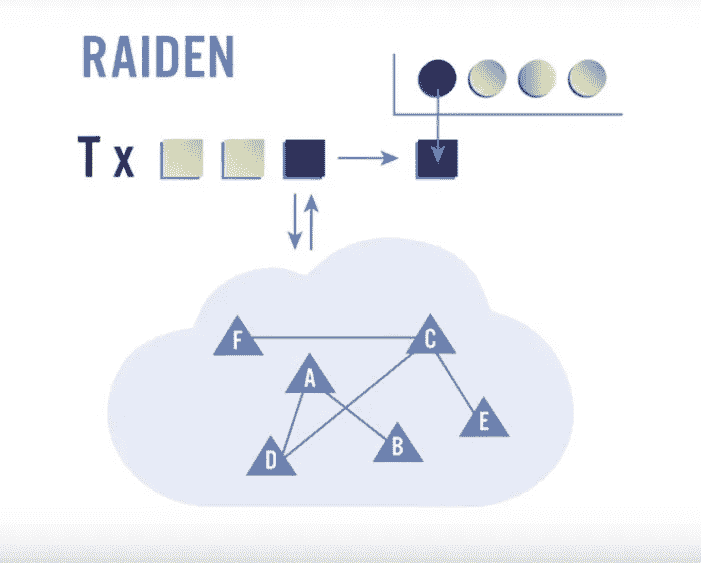
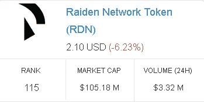
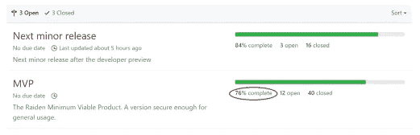
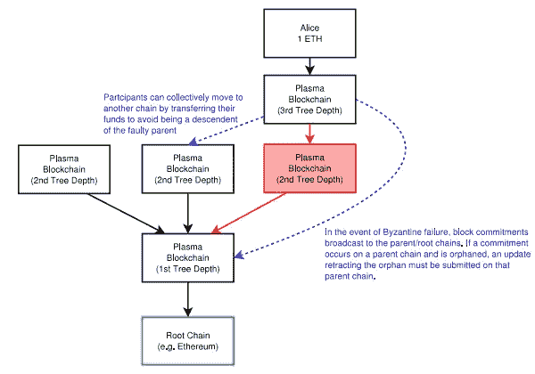

# 加密货币基础:以太网 4 解决方案

> 原文：<https://medium.datadriveninvestor.com/cryptocurrency-basics-ethereums-4-solutions-fb14cabb537b?source=collection_archive---------1----------------------->

## 卡斯珀，等离子，雷电和碎片

## 卡斯帕:

Casper 可以定义为一种部分一致的机制，它结合了利害关系证明和拜占庭容错。这将覆盖在以太网工作网络的证明上，不会使它变得不相关，而是每隔一定数量的块进行一次检查。Casper 借鉴了 NEO 的影响，可能会在今年实现。

## 这是什么意思？

简单地说，这是以太坊首次尝试自我管理。当前版本的硬分叉。什么是硬叉？就当是更新吧！然而，旧的网络不会停止存在，相反，它将“分叉”。有两种类型的**分支:硬分支和软分支**，不要与**软件 4** 相混淆，在后者中，代码被获取并修改以创建一个新项目。比如从比特币诞生的莱特币。一个**节点**是一台连接到网络的计算机，因此有一个区块链的‘副本’。

**硬叉**

[https://bitcoin.org](https://bitcoin.org)

> “这创建了永久分叉的链—一个用于未升级的[节点](https://bitcoin.org/en/glossary/node)，一个用于升级的[节点](https://bitcoin.org/en/glossary/node) —称为[硬分叉](https://bitcoin.org/en/glossary/hard-fork)。”[1]

## 软叉

[https://bitcoin.org](https://bitcoin.org)

> “在第二种情况下，被升级的[节点](https://bitcoin.org/en/glossary/node)拒绝，如果升级的[节点](https://bitcoin.org/en/glossary/node)控制大部分散列率，则有可能防止[区块链](https://bitcoin.org/en/glossary/block-chain)永久发散。这是因为，在这种情况下，未升级的[节点](https://bitcoin.org/en/glossary/node)将接受所有与升级的[节点](https://bitcoin.org/en/glossary/node)相同的[块](https://bitcoin.org/en/glossary/block)为有效，因此升级的[节点](https://bitcoin.org/en/glossary/node)可以建立一个更强的链，未升级的[节点](https://bitcoin.org/en/glossary/node)将接受该链为最佳有效的[区块链](https://bitcoin.org/en/glossary/block-chain)【1】

有些更新需要硬分叉，而有些则可以使用软分叉。

## Casper 摘要

Casper 再次期待今年**实现**以太坊，并且是一个**自治**经由**证明**的系统。这也将实现的主要功绩是将阻塞时间减少到两秒钟。这加快了交易速度。然而**并没有**解决缩放的问题。这就是**分片**可以被视为解决方案的地方。

## 分片:

为了让以太坊上的节点验证一个事务，节点存储所有先前事务的副本。这就产生了一个问题，以太坊唯一需要扩展的地方就是让块变得更大。**分片**是以太坊的扩展解决方案，其工作原理是**分解并行运行的节点和事务，称为分片**。“分片是一种数据库分区类型，它将非常大的数据库分成更小、更快、更容易管理的部分，称为数据分片”[2]

YouTube: [Chico Crypto](https://www.youtube.com/watch?v=FB42OWN3Z0w)

## 分片摘要:

在左边的图表中，数据 E 被分成三个“碎片”,并由单独的节点进行验证。从而使得每个节点只需要区块链事务的一部分，并可能解决以太网的缩放问题。分片计划离实现分叉还有很长一段时间，我们可能要到 2019/2020 年才能看到扩展的解决方案。然而，这目前并不完全是问题。在区块链，结垢是一个众所周知的问题，但据说 50-100 年后才会造成拥堵。

## 雷电:

**智能合约**渠道是由发送方发起给接收方的。雷电使不需要区块链同意的安全的链外传输成为可能。由于只有两方有权使用合同，智能合同可以避免重复支出。双倍支出是对区块链的一种攻击。这些将被企业和银行实际使用。

## 智能合同:

[Steemit](https://steemit.com/ethereum/@ryuzakilost/ethereum-smart-contracts-101-hello-world)

## 雷电总结:

Youtube: [Chico Crypto](https://www.youtube.com/watch?v=FB42OWN3Z0w)

Raiden 目前正在测试中，但如前所述，它只能用于确认一方与另一方之间的智能合约。在未来，左边的图表代表**多跳传输**。F 和 E 之间的智能协定可以由 C 通过间接连接来确认。您可以看到，随着网络的发展，这将加快交易速度，这也是为什么这是一个令人兴奋的发展。

CoinMarketCap

雷电网络 MVP(最小可行产品)预计今年发布。人们可以假设，当这一消息发布时，价格将大幅上涨。然而，我不是财务顾问，我只是告诉你社区的意见。

youtube: [Chico Crypto](https://www.youtube.com/watch?v=FB42OWN3Z0w)

## 血浆:

血浆实际上是一棵树。根是以太网，每一个独立的分支都是其父节点的“孩子”。它促进了明智的契约，使少数人不依赖多数人。创建一个安全的网络，在受到攻击或失败的情况下，可以像保存状态一样解构到以前的分支。

[https://plasma.io/plasma.pdf](https://plasma.io/plasma.pdf)

公司可以通过智能合同创建一个有规则的“儿童区块链”。这是它自己的生态系统，有效地减少了以太坊网络的流量。血浆不需要开采，为了缓解这一点，违反智能合同中的共识会受到处罚。

## 血浆总结:

Plasma 是一个自动防故障系统，其形式为多对一合同中**数据的可扩展母链和子链。如果失败发生在链中，链会崩溃，智能合约不会执行。**

## 结论:

P **lasma** 将促进智能合同，并允许**雷电**处理支付。**分片**将允许主链和等离子体之间的一致性更快，因为节点有更小的组要验证，最后但并非最不重要的是，分片需要 **Casper** 作为主机，然后才能进行任何开发。—奇科加密

**以太坊**是智能合约之父，引领行业创新。ICO 带来的很多东西都是以太坊和类似项目所取得的进步的衍生物。只是针对一个单独的部门进行营销，并开发了一个应用程序。这太棒了，但从长远来看，这四个概念也会有同样的问题。

*   *观看此视频，因为本文中的许多信息都是由作者提供的。我尽最大努力用所有人都能理解的语言来解释，解释一些概念，否则他会认为人们都知道。*

来源:

[1][https://bitcoin.org](https://bitcoin.org)

[2][http://search cloud computing . tech target . com/definition/sharding](http://searchcloudcomputing.techtarget.com/definition/sharding)

[https://www.youtube.com/watch?v=FB42OWN3Z0w](https://www.youtube.com/watch?v=FB42OWN3Z0w)