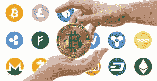

# 向非技术投资者解释加密货币

> 原文：<https://medium.datadriveninvestor.com/cryptocurrency-explained-to-a-non-technical-investor-a9b983cb9a85?source=collection_archive---------27----------------------->

（Photo from wikimedia.org)

作为一名作家/编辑，我一直在写关于加密货币的文章和推特，对于一些刚刚开始研究比特币的人来说，我被视为一个信息来源。向他们中的一些人解释什么是密码被证明是一个挑战。以下是基于我的追随者的一些问答的简要解释。

**什么是加密货币？**

加密货币是一种数字货币。支持它的技术是区块链。第一种加密货币是比特币。它被设计成在交易中没有第三方，如银行。

**如何交易加密货币？**

这就像交易股票，只是波动性更大。所以，要么你花大量时间研究每一枚硬币或代币，要么你让专家为你做。最大的加密货币是比特币、以太坊和 ripple。

你可以用美元在 coinbase 买到这些。一旦你有了比特币或以太坊，你就可以用这些硬币购买其他硬币或代币。币安只接受加密货币；那里不接受美元。

还有一件事我想提一下。要交易加密货币，你需要有一个**钱包**。

无论在哪里交易，你的钱包都是你的。

会有一把私人钥匙分配给你。你把这把钥匙放在钱包里。

你用这把钥匙买卖。

为了安全起见，许多人购买硬钱包(它是一种设备)只是为了存储密钥。否则，您的密钥将被在线存储。

比如 Keepkey 就是这样一款你可以从亚马逊买到的设备。还有其他类似的产品。

早在 2018 年 3 月，我仍能感受到许多读者的紧迫感。现在我们是在 2019 年，比特币在 4000 美元左右。如果出现另一次大幅增长，对加密知识的需求将再次上升。所以我希望这个简短的介绍对那些无法亲自联系到我的人有用。祝大家投资好运。