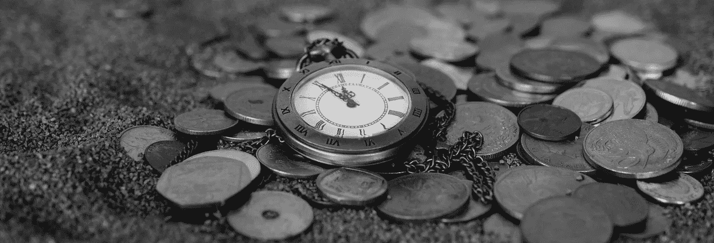

# 加密货币:未来还是幻影

> 原文：<https://medium.datadriveninvestor.com/cryptocurrency-future-or-mirage-71b28921497f?source=collection_archive---------0----------------------->

今天，当你开始看任何新闻频道或上网冲浪时，马上就会出现一些关于“比特币或区块链”的新闻。

目前，加密货币的想法是金融界最有争议的话题之一。一些知名人士，如摩根大通首席执行官杰米·戴蒙(Jamie Dimon)，将其称为“欺诈”，并称从事此类交易的人“愚蠢”。但也有许多其他主要舆论制造者认可加密货币是未来金融世界最具革命性的力量之一。

但是，在这种混乱中，有很多人想知道比特币到底是什么，为什么这种东西的交易价格如此之高？在这篇博客中，我们想揭开这些担忧的神秘面纱。

**加密货币的历史**

加密货币，作为一个实体，现在已经存在很久了。在今天的虚拟货币出现之前，它就已经出现了。然后，它以计算机科学领域的数学算法和原理的形式存在，技术上是用来克服货币缺点的代码和脚本，实际上有时是政治性的。

**什么是加密货币？**

自从比特币早在 2009 年问世以来，已经出现了许多使用相同基本理念的类似项目。这导致了“加密货币”一词的产生，作为这种虚拟货币的统称。

外行人在这个新世界遇到的第一个障碍是理解它的语言。这种加密货币的核心思想是“区块链”的概念。根据 wikipeadia 的说法，区块链是一个不断增长的记录列表，称为块，使用加密技术进行链接和保护。每个块通常包含一个散列指针作为到前一个块的链接、一个时间戳和事务数据。从设计上来说，区块链天生就抵制对数据的修改。它是“一个开放的、分布式的分类账，可以有效地、可验证地、永久地记录双方之间的交易”。

更简单地说，加密货币是一种公共的东西，任何人都可以免费加入并成为其中的一部分。尽管它们在细节、算法、公钥到私钥的密码术、与现实世界相关的应用、交易以及当然还有保持账户的保密性方面彼此有很大不同。

**定义加密货币**

加密货币虚拟世界的实体是使用区块链技术构建的，它只不过是加密语言中的一系列协议，这是一种特性极其复杂的代码，专门用于提供安全且不可解密的数据传输。这背后的思想非常依赖于使用高等数学和复杂的计算机工程理论来缩减和破解几乎不可能的每一部分。它们不仅维护着一个无法打破的障碍，而且能够掩盖用户的身份，这使得每一笔交易都非常私人化，并隐藏了相关个人或群体的属性。此外，加密货币的概念已经通过去中心化控制的机制被塑造成其精细的结构，这仅仅意味着整个创新不是以单个服务器为标志，而是实体的所有网络组件都由各自的用户处理，并且期望以更平滑的功能和保持完美的稳定性来完成其工作。

似乎很普通？但事实并非如此，相反，这才是一种货币的确切定义。比如说；如果你把钱从银行账户里取出来会发生什么？唯一剩下的将是数据库中的条目，并根据具体情况进行更改。你也可以带一些硬币和纸币，它们也是物理存在的数据库中数量有限的条目，并且只有当你拥有硬币或纸币时才能改变。因此，货币只不过是一个经过验证的实体，值得输入到某个数据库中。

**比特币加密货币的现代化身**

中本聪(被认为是一个虚构的人物)向公众公开了比特币的整个概念，并立即聚集了一群热情参与这种虚拟货币交换和交易的支持者。

作为同类产品中的第一种，比特币成为公开用于交换和交易的最常用和创新的加密货币，结合了分散控制，使每个用户都有权隐藏或展示自己，通过区块链保持交易记录，最终实现系统内置的稀缺性。

但很快到了 2010 年底，出现了数十种用于各种目的的其他加密货币，如莱特币、以太币、Ripple 等。

**比特币和其他加密货币的未来**

当讨论加密货币的未来时，许多人认为这些硬币可以解决当今世界面临的许多问题。这种货币的一个人道主义用途是解决无国籍人士的问题，可以说是克服公民身份问题的一种方法。

> 在证明了其卓越地位和先发优势后，比特币作为加密货币在市场上有了持久的生命力。但是未来会怎样呢？它最大的风险是对其他加密货币的平行处理，这有可能随时取代它并质疑它的突出地位。但正如比特币的铁杆用户所声称的那样，由于它在市场上占据了大约 80%的巨大份额，这场争论变得毫无意义。

无论如何，当人们从比特币出现的背景来看，它只是 21 世纪的黄金，但没有与存储相关的问题！在不久的将来也有很大的潜力发展成更好的东西，但它仍然具有非常不稳定的性质，需要小心处理。

**围绕比特币的炒作和泡沫**

尽管比特币本身可能是一个泡沫，但世界对区块链和加密货币的关注程度表明，一个新的世界即将到来。

这个市场究竟会如何成熟还不得而知。当第一封电子邮件在 1971 年发出时，没有人能预料到接下来会发生什么。同样，当 SnapChat 或 Twitter 等新网站首次推出时，人们嘲笑它们不切实际。所有这些新技术的创造者都笑着走向了银行。

2017 年刚刚结束，但对比特币创造者来说，这是一个伟大的时刻！出乎意料的是，比特币的市值高达 3700 亿美元，而 2017 年 1 月的市值为 170 亿美元。

看到这种巨大的上涨，几个人和加密货币爱好者分享了他们的预言，下面提到；

> 1.到 2018 年底，加密市场市值可能达到 1 万亿美元。
> 
> 2.首次公开募股或 ico 可能会通过 IPO 和风投的融资选择来接管。
> 
> 3.市场将接受新形式代币。
> 
> 4.比特币和其他流行的加密货币有可能在许多国家被禁止。
> 
> 5.加密货币的价格将变得稳定，人们可能会回到有形交易。

**结论**

上面的一些推论是从流行的数据中统计得出的，但如果凭直觉，加密货币有 50-50%的机会失败或激增。没有人能百分百肯定地支持他们的观点，但是这种创新确实给当今社会带来了巨大的变化。如果这项技术在未来的时代盛行，它可以从根本上改变我们所知道的金融体系，法定货币可能最终会消失。

> 没错。！