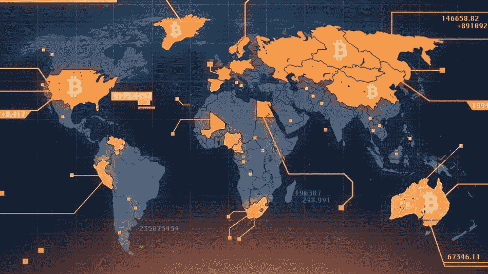
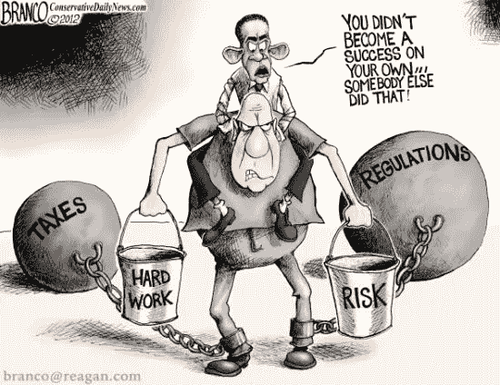

# 加密货币监管——面对全球化世界的挑战

> 原文：<https://medium.datadriveninvestor.com/cryptocurrency-regulation-facing-the-challenge-of-a-globalized-world-42cb27bde916?source=collection_archive---------9----------------------->

**What happens when governments get into cryptocurrency**

加密货币这一伟大的技术实验已经进行了十年，有一个问题比其他任何问题都更加不确定。政府是否应该以及如何监管加密货币的问题一再出现，却没有任何解决的迹象。

这是有原因的。应对加密货币监管意味着要面对一些更深层次的问题。

今年 9 月，美国加密货币和金融行业的知名人士前往华盛顿会见政治领导人。在国会图书馆古老的大厅里，他们呼吁政治家为加密货币建立一个清晰的监管框架。这是一种建立在政治行动基础上的高层会议，是有钱有势的人为了一项事业游说政客的会议。从片段来看，他们赢得了国会议员的支持。

对于一群金融家和密码极客来说，加强监管似乎是一个奇怪的战斗口号。华尔街经常敦促政府干预其业务，而加密货币的产生是为了逃避政府的控制。但是密码市场的现状改变了这一点。

密码学被广泛认为是金融领域的蛮荒之地。货币价值波动剧烈——在顶峰时期，比特币触及近 2 万美元，随后暴跌至 7000 美元以下。用于为加密货币初创公司融资的初始货币发行(ico)一直受到欺诈的困扰，这是出了名的——[彭博的一项研究](https://research.bloomberg.com/pub/res/d28giW28tf6G7T_Wr77aU0gDgFQ)发现，78%的 ico 是骗局，尽管这些只吸引了 11%的加密资金。因此，关于 ico 的集体诉讼，如[起诉 Tezos](http://www.lawandblockchain.eu/tezos-lawsuits/) 、[的案件呈上升趋势](https://www.forbes.com/sites/michaeldelcastillo/2018/07/25/ico-class-action-lawsuits-are-set-to-double-represent-just-a-tiny-fraction-of-historic-rates/#4b3e73bb92c6)。与此同时，世界各地的警方和司法机构都在关注使用加密货币为犯罪活动融资的问题。

有了这些，难怪业内许多人热衷于清除不良玩家，提高加密行业的质量和声誉。监管是一个显而易见的工具。

监管存在风险。最常被引用的一个理由是过度监管可能会扼杀创新，但企业如此频繁地推出这一论点，以至于它正在失去一些力量。大金融领域的反监管团队多次喊狼来了，尽管他们的政治盟友仍在倾听，但他们的反对者指出，去监管化是如何导致 2008 年崩盘的。

事实上，正确的监管可以鼓励创新。目前监管状况的不确定性让企业和投资者感到紧张。这使得在创造产品和进行投资时更难承担风险。清晰的监管会让他们对金融未来更有信心，从而让更多的工作得以进行。

对不良玩家进行监管将有助于释放 ico 的潜力。真正的 ico 在融资中扮演了民主化力量的角色，让小型科技公司获得了原本无法获得的投资。但是，即使只有 11%的加密投资被骗，对投资者来说，这仍然是一个高风险。创建一个剔除欺诈的框架，将恢复人们对这一宝贵筹资工具的信心。

问题在于让监管成为现实。对于那些想引进它的人来说，有许多挑战。

首先，存在监管涵盖哪些内容的问题。您是否专门处理交易所、ico 和采矿以及令牌？监管应该覆盖整个区块链科技吗，包括它在记录保存和合同方面的作用？区块链的财务、编码和管理用途并没有完全分开，所以一个总体框架可能是有意义的。

如何对代币进行分类？一些人希望将它们与股票一起监管。其他人认为它们是一种全新的资产类别。有一个有力的论点是，考虑到不同种类的令牌，它们甚至不是一个单独的类。公用代币不符合美国用于识别证券的豪威测试，而其他代币符合。

这就带来了第三个问题——是修改现有法规还是制定新法规。引入新法律是一个缓慢、耗时、充满争议的过程，可以说密码市场现在就需要监管。但大多数司法管辖区的现有法律已有几十年历史，不适合管理这种新形式的金融。

不同的国家当局采取了不同的方法。中国已经关闭了加密货币交易所。美国正在允许加密货币，但对现有的监管采取严格的方法，[关闭了与交易所相关的基金](https://www.nasdaq.com/article/us-sec-denies-nine-more-bitcoin-etfs-cm1012117)和[发起了数百项对加密的调查](http://www.nasaa.org/45901/nasaa-updates-coordinated-crypto-crackdown/)。瑞士对其现有法律实施了[更自由的解释](https://www.ccn.com/switzerland-settles-as-the-worlds-leading-ico-hub/)，显然是为了让瑞士对加密货币有吸引力，就像它对其他金融形式的传统一样。一些国家将其视为货币，一些国家将其视为商品，一些国家将其视为财产。

不确定性正被不一致所取代，不同的国家当局四处寻找解决方案。

政府的本性就是行动缓慢。这让他们跟不上科技公司的快节奏，包括加密货币背后的公司。他们也因为目的不同而不同步。当企业积累资金和顾客时，它们就会繁荣。政府必须平衡商业利益和消费者保护，而如何做到这一点可能很难。当一项技术变化如此之快，导致其最终形态如此不确定时，这尤其困难。

但是这一切背后还有一个更大的问题——全球化。

几十年来，各国政府的权威一直在下降。跨国企业变得过于强大，政府无法有效控制。通过在司法管辖区之间转移活动，公司可以挑选他们遵循的规则。这导致一些国家围绕商业利益制定法律，以便吸引他们的财富。

你可以在对中国打击加密货币交易所的回应中看到这一点。交易所不需要设在任何特定的地方，所以那些有问题的交易所只是转移了他们的法律基础，像以前一样继续经营。

加密货币很可能会加速国家实力的衰落。许多早期支持它的人是技术无政府主义者或极端自由放任资本主义的倡导者，他们希望看到旧当局崩溃。通过鼓励不受国家控制的货币，他们一直在朝这个目标努力。他们的许多旅伴虽然与这场运动无关，但也不反对支持这项事业。

加密货币是一种分散的金融形式，在全球范围内运作，无法由一个国家的政府控制。可以说，它甚至不能在那个规模上被监管。如果要在保持其益处的同时对其进行适当管理，那么就需要国际解决方案。

现在，任何主题的国际解决方案看起来都比以往更遥远。为了应对全球化的变革之风，许多国家的政府在不合作的利己主义上加倍努力，欺骗他们的公民说所有的问题都来自边界另一边的人，如果他们停止倾听他人的意见并与其合作，他们会做得最好。这表现在美国走向单边主义、英国脱离欧盟以及俄罗斯愿意无视其他国家对其行动的反应。合作应对新的挑战是他们最不想做的事情。

政府必须决定加密货币如何融入其监管体系，是使用新规则还是旧规则。但他们可能没有权力或协调来建立有效的行业监管，从而带来有利于整个加密社区的稳定和信心。在这种情况下，社区本身可以填补空白。像卡梅隆和泰勒·文克莱沃斯的虚拟商品协会(一个自愿进行行业自我监管的组织)这样的组织最终能在国际范围内带来监管的好处吗？或者，自身利益会不会导致这样一个群体过于温和，从而破坏提振投资者信心的机会？

加密货币是全球化经济最清晰的体现。这使得复杂的监管挑战更加艰巨。但除非各国政府能够逆当前趋势而动，在这个新问题上通力合作，否则可能要靠该行业来实现监管，以及投资者渴望的稳定。

