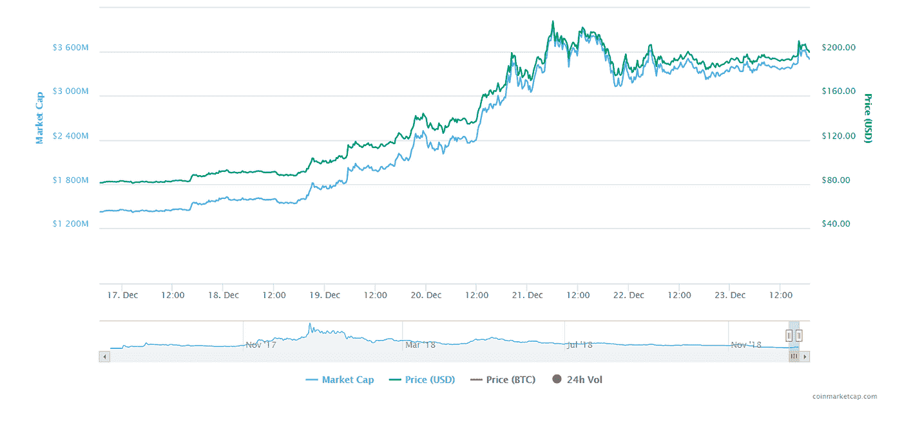
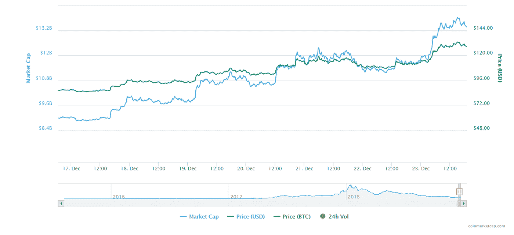
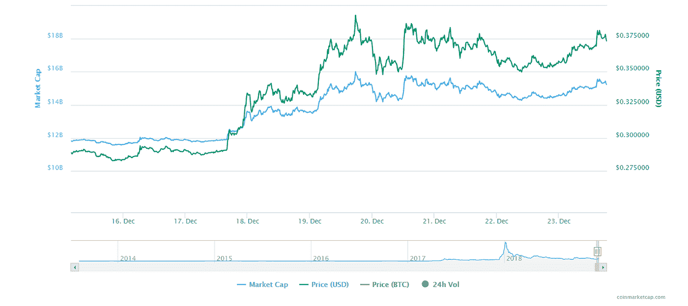

# 加密货币评论:著名硬币每周回顾

> 原文：<https://medium.datadriveninvestor.com/cryptocurrency-review-weekly-recap-of-famous-coins-7368226a31a4?source=collection_archive---------6----------------------->

对于加密市场来说，这是灾难性的一个月，因为我们已经看到了许多重要货币的下跌。一些加密货币在过去一个月达到了最低价格(与全年价格相比)。有些处于高峰期，然而，由于市场崩溃，他们的价格也受到影响。在崩盘之前，Ripple 创造了历史，它的市值最终从第三名升至第二名。EOS 和比特币现金失去了他们的行列。此外，比特币现金处于最低价格。然而，在过去的一周里，加密货币开始复苏。他们中的许多人开始找回他们的价格，有些人甚至赢回了他们的排名。本周的回顾将主要包括著名的和众所周知的硬币，因为本周是过去一个月中唯一表现良好的一周。

比特币现金。
比特币现金是受危机影响最大的货币之一。有几天，我们看到价格下跌了 40%。整整一周前(2018 年 12 月 16 日)，它的上市价格为每枚 81.39 美元，市值为 1，442，020，018 美元。但本周比特币现金表现出色，价格增长率或多或少保持不变，一周内上涨了 146%，截至目前(2018 年 12 月 23 日)，其估值为 202.56 美元(查看 BCH/USDT 的比率)，市值为 3，550，168，952 美元。现在它排在第四位(这是上周之前的排名)。虽然它没有达到本月初的价格，即大约 540 美元，但如果它继续以这种速度发展，它确实会。

以太坊
以太坊市值损失超过 155 亿美元(对比过去三个月的价格)。以太坊没有从瑞波那里得到它的第二等级。然而，它的表现很好，在过去 24 小时内价格上涨了 15.44%，市值和价格都上涨了 50%。一周前，它的价格为 86.58 美元，但现在它的挂牌价格为 129.02 美元，其市值为 13，413，793，735 美元，这为他们挽回了约 40 亿美元的市值。

Ripple 是过去一年中谈论最多的加密货币之一；它每周都有精彩的表演。然而，它受到市场崩溃的影响很差。崩溃前的涟漪价格约为每枚硬币 0.5 至 0.6 美元。我们已经看到价格大幅下跌，2018 年 12 月 15 日，Ripple 的价格为 0.288 美元。虽然它没有失去排名，但由于价格下跌，它损失了相当数量的市值。然而，在这一周，价格明显上涨。截至今天(2018 年 12 月 23 日)，Ripple 的价格为 0.375 美元，比上周的价格上涨了 30%，现在的市值为 15，297，297，829 美元。

***引用:***

> XRP (XRP)价格、图表、市值和其他指标。(未注明)。从[https://coinmarketcap.com/currencies/ripple/#charts](https://coinmarketcap.com/currencies/ripple/#charts)取回
> 
> 比特币现金(BCH)价格、图表、市值和其他指标。(未注明)。从 https://coinmarketcap.com/currencies/bitcoin-cash/[取回](https://coinmarketcap.com/currencies/bitcoin-cash/)
> 
> 以太坊(ETH)价格、图表、市值和其他指标。(未注明)。从 https://coinmarketcap.com/currencies/ethereum/#charts[取回](https://coinmarketcap.com/currencies/ethereum/#charts)

*如果您想了解更多，请访问 BIDITEX 页面并提出您的问题，关注我们的*[*Twitter*](https://twitter.com/biditex_com)*，* [*脸书*](https://www.facebook.com/biditex/) *，*[*Medium*](https://medium.com/@biditex)*，*[*Telegram*](https://t.me/biditex%20%28edited%29)*，*[*LinkedIn*](https://www.linkedin.com/company/biditex)投标变更同**。**