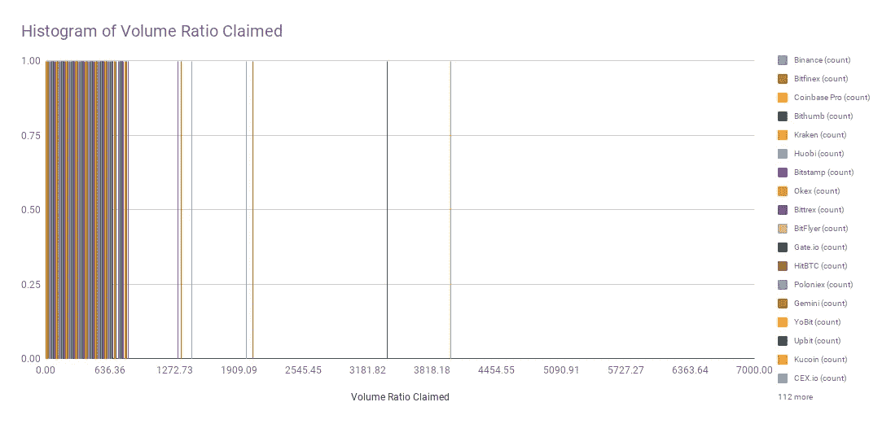

# 加密交易所被发现伪造交易量

> 原文：<https://medium.datadriveninvestor.com/cryptoexchanges-caught-falsifying-their-trading-volumes-f17ca662f77f?source=collection_archive---------32----------------------->

区块链透明研究所(block chain Transparency Institute)的一份报告显示，在他们最新的加密交易所排名中，一群区块链数据研究人员声称要为加密行业带来透明和诚实，他们披露了关于约 100+交易所的交易量、流动性和访客数量的关键发现。

名单中有[币安](https://www.btcwires.com/round-the-block/binance-to-launch-an-institutional-initiative-to-promote-blockchain-education/)以迄今为止最大的每日独立访客数轻松成为新交易所排名榜的第一名，Bitfinex 以较高的每用户交易量排名第二，因为该交易所以其最低 1 万美元的注册费用而成为顶级美元账户的登陆点。

[比特币基地](https://www.btcwires.com/c-buzz/coinbase-acquires-digital-identity-startup-to-create-solutions-over-blockchain/)位居第三，也是美国排名最高的加密交易所。

该报告称，这项研究是在 Similarweb 和谷歌分析等工具的帮助下实现的。

在总共审查的 1700 个网站中，只有月访问量在 10 万到 50 万的网站的平均准确率差异为 23%，即 3，333 到 16，667 个独立访客/天，月访问量超过 100 万的网站的平均准确率差异约为 11%，即 33，333+个独立访客/天。

此外，月访问量低于 100，000 的网站高估了 94%的平均准确率，即每天不到 3，333 个独立访问者。因此，每月有更多独立访问者的交易所可能拥有最多的客户，这意味着更多的每日交易者和更高的交易量。

受到怀疑的交易所比例高达 655，000%以上。最好的例子是 LBANK 和 ZB，这两家银行的日均访问量分别超过 214，000 美元和 74，000 美元。这样的指数是没有说服力的，因为前三大交易所——币安、Bitfinex 和比特币基地具有高流动性的市场——每个游客每天的交易量仅在 5000 美元到 8500 美元之间。

排名前十的其他可疑交易所包括历史悠久的加密交易所，如 [Huobi](https://www.btcwires.com/c-buzz/a-member-of-the-zuckerberg-family-joins-huobi-chain-advisory-committee/) 和 Okex，估计其总交易量的 80-90%是伪造的，使其实际交易总额接近 100，000，000 美元/24 小时。

从交易量来看，估计每天有 60 亿美元的交易，其中高达 67%是 wash 交易，前 100 家交易所中有 70%以上从事 wash 交易，交易量至少是其实际申报量的三倍。

[**点击此处查看完整报告。**](https://docs.google.com/spreadsheets/d/e/2PACX-1vThRMMVVn4Acq0fXgw8CHEI0TtpN8fCs-46smnnPGamlKBGPy40s7HOGIjgbpX-CXnMGoN6kvjaQMvG/pubhtml)